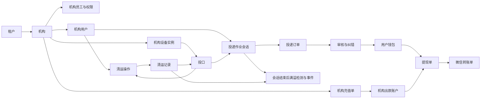

# EcoBin P0 业务模型基线

> [!IMPORTANT]
> 2026-08-08 已按 D-048 重新冻结普通用户模型：渠道级微信身份不是跨租户业务用户；每个租户/机构仍拥有独立机构账号和钱包，一次会话只选择一个机构账号。冲突内容以 [`../architecture/shared-miniapp-multi-organization-identity-v39.md`](../architecture/shared-miniapp-multi-organization-identity-v39.md) 为准。

> [!IMPORTANT]
> 2026-08-07 已按 D-047 重新冻结设备业务模型：设备资产是唯一归属根，租户和机构各只允许永久写入一次；部署实例、回收、调拨、重新部署、现场人工验收和人工经营开关不再是业务概念。冲突内容以 [`../architecture/permanent-device-ownership-v36.md`](../architecture/permanent-device-ownership-v36.md) 为准。

> 状态：**业务模型已冻结，作为数据库、接口、详细设计和正式任务的上游输入**
> 整理日期：2026-07-21
> 最近同步：2026-08-06；提现收款方式已改为“先完成一次微信授权，之后新提现自动收款”，历史逐笔确认提现继续按原快照收敛
> 最终独立读者测试：2026-07-21 通过，无阻断问题
> 上游需求：[`requirements-baseline.md`](requirements-baseline.md)
> 已冻结范围：[`p0-scope-baseline.md`](p0-scope-baseline.md)
> 系统架构：[`system-architecture-draft.md`](system-architecture-draft.md)
> 目的：用统一业务语言描述 P0 的主体、业务事实、生命周期和不变量；本文不是数据库、接口、类或消息协议设计。

> [!IMPORTANT]
> 2026-08-02：满溢准入已改为设备被动上报，只有与投口当前袋一致的明确 `FULL` 阻止下一次投递；默认/无上报/失败不阻断。本文中“后端检测 gate、检测中或检测失败阻断、人工重检恢复”的旧模型由 [`../architecture/fullness-reporting-v25.md`](../architecture/fullness-reporting-v25.md) 覆盖。

## 1. 建模原则

1. 先描述真实业务事实，再决定系统如何存储和实现。
2. 历史事实的租户、机构、用户、设备实例和金额归属一经确定不得随当前配置变化。
3. 设备动作、订单事实、审核认定、钱包资金和微信渠道结果分别建模，不能压缩成一个宽泛状态。
4. 原始事实不可覆盖；人工认定和后续纠错通过新记录表达。
5. 当前余额、处理中金额、待审核金额和统计值必须能够追溯到业务事实，不允许无来源修改。
6. 本文中的对象名称是业务概念名称，后续可以映射为一个或多个模块、接口或数据结构，不要求与当前代码名称一致。

## 2. P0 领域全景



核心业务链是：

```text
机构充值形成机构出款能力
                    ↓
用户投递 → 投递订单 → 审核认定 → 用户可提现余额
                    ↓                    ↓
              清运维持设备可用       提现申请
                                         ↓
                              冻结用户余额和机构额度
                                         ↓
                                  微信真实转账
```

### 2.1 业务能力边界

下表只表示业务事实由谁负责解释，不预先决定代码模块如何拆分：

| 业务域 | 负责的事实 | 主要依赖 |
|---|---|---|
| 组织与权限 | 租户、机构、工作人员、能力授予和作用域 | 无 |
| 用户与身份 | 机构 AppID 下的机构用户、手机号和账号状态 | 组织与权限 |
| 设备经营 | 物理设备、机构设备实例、投口、配置和当前可用状态 | 组织与权限 |
| 设备作业 | 投递会话、边缘本地轮次、唯一完成结果和业务确认 | 用户与身份、设备经营 |
| 回收交易 | 投递订单、审核认定、异常和纠错历史 | 设备作业 |
| 用户钱包 | 正式钱包资金变动和当前余额 | 用户与身份、回收交易 |
| 清运与容量 | 清运操作、清运记录、袋码绑定、重量基准和满溢事件 | 设备经营、用户与身份 |
| 机构资金 | 充值单、机构出款账户和机构资金明细 | 组织与权限、微信支付 |
| 提现与渠道 | 免确认收款授权、提现单、双侧冻结和微信转账结果 | 用户钱包、机构资金、微信支付 |
| 审计与对账 | 敏感操作、业务修订和跨系统不一致 | 读取所有相关业务域的事实 |

### 2.2 跨域一致性结果

下列组合从业务上必须表现为一个完整结果；后续架构可以选择具体事务和消息方案，但不能让用户看到长期的半完成状态：

| 业务动作 | 必须共同成立的结果 |
|---|---|
| 投递订单通过或纠错 | 保存认定/修订历史，并且钱包只产生一次对应差额变动 |
| 清运完成 | 创建一笔清运记录，同时完成取走袋/换入袋历史、投口当前袋和新重量基准更新 |
| 充值完成入账 | 微信支付成功事实已经保存，同时只增加一次机构净出款额度和资金明细 |
| 提现创建 | 创建提现单，同时冻结用户金额和机构额度；任一失败则都不成立 |
| 微信转账达到终态 | 保存渠道终态，同时只完成一次成功消耗或一次双侧冻结释放 |

外部微信调用不可能与本地业务事实形成一个跨系统原子事务；渠道未知态必须保留在处理中，并通过原单查单、回调和对账收敛。

## 3. 统一业务语言

| 术语 | 业务含义 | 明确不表示什么 |
|---|---|---|
| 租户 | 一个经营回收业务的企业 | 不是机构、门店或平台用户组 |
| 机构 | 租户下按区域或经营责任划分的一级部门 | 不形成多级组织树 |
| 机构用户 | 在某个机构小程序注册、可以投递和持有该机构钱包的微信用户 | 不是跨机构统一会员 |
| 清运员 | 具有本机构清运能力的机构用户 | 不是独立于普通用户的另一种自然人 |
| 物理设备资产 | 一台真实机器及其不可变硬件身份 | 不直接表达当前机构归属 |
| 机构设备实例 | 物理设备在某机构、某地点的一次部署历史 | 不是可随意改机构的物理设备记录 |
| 投口 | 机构设备实例上的一个可操作入口，持有价格、袋码、重量基准和满溢配置 | 不是固定回收品分类 |
| 投递作业会话 | 一名用户扫码后对整台设备的独占使用及整场回收交易上下文 | 不是每次开关门各一个云端周期 |
| 本地投递轮次 | 同一会话内一次开门—投递—关门的边缘动作 | 不是云端业务对象，不产生订单或中间上报 |
| 投递订单 | 一个已完成有效扫码会话最多形成的一笔回收交易事实 | 不是每次开关门或每袋一单 |
| 原始结果 | 唯一完成载荷中的可空首末重量及可靠性/故障码、会话锁定金额依据、四个照片槽位、`negativeWeightAnomaly` 和现场信息 | 不含中间轮次明细，也不因审核或纠错而改变；失败不能用 0 冒充 |
| 最终认定结果 | 当前有效的业务重量和返现金额 | 不覆盖原始结果或历史修订 |
| 待审核返现 | 尚未形成钱包资金、预计在订单通过后入账的正金额 | 不是可提现资金 |
| 用户钱包 | 某机构对某机构用户的应付资金账户 | 不跨机构共享，也不等于微信余额 |
| 负余额停投阈值 | 用户可提现余额达到或低于该值后禁止继续开门的机构配置 | 不是截断真实钱包债务的余额钳位值 |
| 机构出款账户 | 机构在 EcoBin 本地账本中的可出款额度 | 不等于微信运营账户真实余额，也不是全部用户钱包之和 |
| 充值单 | 机构向 EcoBin 支付资金并申请增加本地出款额度的业务单据 | 不是基本账户到运营账户的内部划转 |
| 提现单 | 用户申请把机构钱包资金转到微信零钱的业务单据 | 不等于微信渠道转账单 |
| 微信免确认收款授权 | 某机构用户在固定系统商户号、机构 AppID、OpenID 和转账场景下允许后续提现自动收款的微信渠道事实 | 不是提现单、永久不变的用户属性或工作人员代授权；微信关闭或身份变化后必须重新授权 |
| 微信转账单 | 微信商家转账渠道对一次真实出款的记录 | 不决定本地审核规则或机构资金归属 |
| 清运操作 | 开门前建立、可恢复的一次换袋作业上下文 | 不是已经完成的清运事实 |
| 清运记录 | 清运完成事件形成的换袋及称重过程记录，保存当前有效业务值 | 可由有权限人员直接修改并留痕，但不进入审核、认定、通过、驳回或奖励流程 |
| 回收袋标识 | 可重复使用实体袋的二维码身份 | 不具有待清空、已取走等生命周期状态 |
| 满溢检测快照 | 最近一次实际检测得到的重量、红外和判断结果 | 不是持续实时数据 |
| 满溢事件 | 一次从确认满溢到恢复的持续业务事件 | 不是每次检测各建一条告警 |

## 4. 业务主体与作用域

### 4.1 平台侧主体

- **平台管理员**：管理租户和平台运行，必要时在受审计条件下协助处理业务问题。
- 平台管理员可以跨租户查看和处置，但不因此成为任一租户或机构成员。
- 平台管理员不能绕过资金事实直接修改机构额度、提现金额或微信终态。

### 4.2 租户与机构主体

- **租户主体账号**：租户范围内的最高业务主体，天然拥有全部机构管理能力。
- **总部员工账号**：租户下的独立工作人员，根据授权管理一个或多个机构。
- **机构负责人**：天然拥有本机构全部业务管理能力，一个机构可以有多名负责人。
- **机构员工**：具有可组合业务能力的独立账号；客服、审核等是能力，不是互斥身份。

### 4.3 小程序主体

- **机构用户**：由机构 AppID 下的 OpenID 与机构共同确定；首次 `wx.login` 创建记录即完成注册并写入注册时间，即使尚未绑定手机号也计入注册统计。手机号仍是投递或提现的前置条件；可选保留创建用户时所通过的机构设备实例，供地推成果统计。
- **清运员**：机构用户被授予本机构清运能力后的状态；其普通用户身份和钱包仍然保留。
- 同一自然人在不同机构小程序中形成不同机构用户、不同钱包和不同业务历史。

## 5. 组织与设备经营域

### 5.1 核心对象

| 对象 | 负责保存的业务事实 | 关键关系 |
|---|---|---|
| 租户 | 企业主体、启停状态 | 拥有多个机构 |
| 机构 | 区域经营主体及机构级配置 | 属于一个租户 |
| 物理设备资产 | 硬件 SN、型号、OneNet 身份 | 历史上对应多个机构设备实例 |
| 机构设备实例 | 某次部署的机构、地点、二维码及生命周期 | 同一时刻只允许一个有效实例 |
| 投口 | 展示名称、价格、当前袋码、重量基准、满溢配置及当前可用状态 | 属于一个机构设备实例 |
| 配置版本 | 一组已经发布给设备的业务配置快照 | 设备确认应用后影响新作业 |

### 5.2 核心不变量

- 租户与机构固定为两级；所有机构业务事实同时具有不可变租户和机构归属。
- 一个物理设备同一时刻最多有一个有效机构设备实例。
- 调拨、迁址或整机替换通过结束旧实例和创建新实例表达，不能改变旧业务事实归属。
- 投口单价、袋码和重量基准属于当前实例的当前状态；投递和清运记录必须保存发生时的快照。
- 必要配置没有被设备确认应用时，不允许开始新作业。

## 6. 投递与回收交易域

### 6.1 投递作业会话

投递作业会话同时表达“当前哪名用户独占整台设备”和“一次扫码对应的整场回收交易”：

- 会话在用户通过开门前置校验后建立。
- 同一设备同一时刻最多存在一个有效作业会话。
- 后来的用户不能覆盖当前会话。
- 会话建立时一次性冻结用户、机构设备实例、投口、单价、当前袋码、负重量异常阈值和配置版本。
- 一个会话可以包含多个设备本地投递轮次，但全部沿用上述冻结快照；更换投口或使用新价格必须结束会话后重新扫码。
- 首次开门前稳定重量或明确失败状态和前两张标准照片属于整场起点；用户结束或选择窗口超时后的最终稳定重量或明确失败状态和后两张标准照片属于整场终点。
- 一次有效会话最多形成一笔投递订单，订单净重量只按整场最终重量减首次重量计算。
- 会话超时只结束用户独占，不代表门或设备已经安全恢复。

### 6.2 本地投递轮次

每次开门—关门是同一会话内的设备本地轮次：

- 本地轮次身份只用于香橙派/MCU 的命令幂等、物理恢复、重量比较和诊断，不进入中心业务模型。
- 中间轮次不上传重量、照片或过程状态，不创建云端 cycle、订单或业务确认。
- 用户在选择窗口点击继续时，设备不请求云端再授权，不等待前一轮次建单，也不执行普通满溢判断；门控、称重过载、烟雾、伸缩机构、MCU 和本地存储等硬件安全故障仍可阻断。
- 香橙派比较每轮开关门前后的稳定重量。任一轮减少达到会话冻结阈值（默认 500 克）时，把 `negativeWeightAnomaly` 锁存为 `true`，本会话内不再清除。
- 中间减少的具体重量和轮次明细不上云；锁存布尔值只随整场唯一 `DELIVERY_COMPLETE` 进入订单原始事实。
- 普通满溢检测只在会话最终结束后进行，并只决定下一次会话是否可以开始。

投递会话建议的业务状态为：

```text
已准备 → 本地执行中/等待继续 → 整场本地结果已保存 → 业务已确认
   └→ 首次开门前结束             └→ 上报超时/结果待恢复
```

“本地执行中”的多次开门、关门、称重等细节在设备设计阶段展开，不在云端压成周期或订单状态。完全没有可信整场终态结果时只保留异常会话，不伪造投递订单；迟到完成结果只能使用原会话和冻结快照，不能借用到达时的当前会话。

### 6.3 投递订单、审核与纠错

投递订单包含三层事实：

1. **不可变现场事实**：可空的首次/最终稳定重量及可靠性/故障码、可空整场原始净重量/金额、会话价格和袋码快照、四个标准照片槽位及 `negativeWeightAnomaly`；不保存中间轮次重量，也不用 0 冒充失败。
2. **当前业务认定**：人工认定的最终重量、由该重量和订单锁定单价确定性计算的最终金额，以及当前审核结果；最终金额不是独立人工输入。
3. **不可变修订历史**：每次审核或纠错的操作人、时间、前后值和备注。

订单主生命周期为：

```text
待审核 → 已通过
           └─ 后续纠错：仍为已通过，但形成新修订版本并调整钱包差额
```

- 不存在“驳回投递订单”终态；无法认定时通过修改最终值为 0 处理。
- `negativeWeightAnomaly=true` 和系统处理异常必须人工审核；该标记不等同于整场净重量必然为负。
- 订单已经返现或提现后仍可纠错；纠错只调整用户钱包，不反向伪造或撤销已经成功的微信转账。

### 6.4 待审核返现的业务归属

- 待审核返现属于尚未通过的正金额投递订单，不是用户钱包已经持有的资金。
- 钱包页面展示的“待审核返现”是这些订单预计正金额的汇总视图。首次审核前没有独立的最终认定版本，因此按“已归属用户、仍待审核、原始金额可靠且大于 0”的订单原始金额汇总；无法可靠计算原始金额的系统异常订单暂按 0 计入。
- 负金额订单审核前不计入该汇总，也不提前影响钱包。
- 只有订单通过时才形成正式钱包资金变动。

## 7. 用户钱包域

### 7.1 核心对象

| 对象 | 业务含义 |
|---|---|
| 用户钱包 | 一个机构用户在一个机构下唯一的资金账户 |
| 钱包资金明细 | 每次正式增加、扣减、冻结、释放或人工调整的不可变资金事实 |
| 余额调整记录 | 有权限人员输入的有符号调整差额，以及系统在钱包锁内计算的前后金额、操作者和备注 |

### 7.2 三项展示金额

| 展示项 | 业务来源 | 是否可提现 |
|---|---|---|
| 待审核返现 | 尚未通过的正金额投递订单汇总 | 否 |
| 可提现余额 | 已经正式入账、扣减和释放后的钱包当前余额 | 是；负数时禁止提现 |
| 提现处理中金额 | 进行中提现单已经冻结的用户金额汇总 | 否 |

是否在后续设计中保存汇总缓存不改变业务来源：待审核返现以订单为依据，处理中金额以进行中提现单为依据，钱包资金变化以不可变资金明细为依据。

### 7.3 钱包不变量

- 一个机构用户在一个机构下只有一个钱包；不同机构钱包完全独立。
- 钱包可以因已审核负金额或后续纠错变为负数；应完整记录最终认定的债务，不能为了守住配置值而截断负金额。
- 机构配置的是严格小于 0 的负余额停投阈值：任何会降低钱包余额的可信业务命令都以该资金变动事务锁定的当前机构阈值判断，余额达到或低于阈值后禁止开始新的扫码投递会话，并锁存“需要人工恢复”的投递闸和触发阈值快照；投递会话开始时冻结的阈值只用于解释当次首次开门资格，不能让旧订单的后来审核/纠错绕过新阈值。一笔负金额或纠错可以使余额一次性低于该阈值。之后普通正返现、正向纠错或阈值变化即使让当前余额重新高于阈值也不自动清闸，只有有权限人员执行一笔真实非零人工余额调整且调整后余额严格高于锁存阈值快照，才能在同一事务恢复；下一次新会话仍按当前配置复核，不能借旧快照绕过后来更严格的阈值。
- 钱包为负时禁止提现；尚未达到停投阈值时允许继续投递，后续正返现优先抵扣负余额。
- 钱包金额只能由已确认业务事件驱动，不能无来源覆盖当前余额。
- 已成功提现后发生订单负向纠错时，保留原微信成功事实，通过钱包新扣减表达新的机构债权。

## 8. 清运与设备容量恢复域

### 8.1 清运操作与清运记录分离

- **清运操作**在开门前建立，负责独占、旧袋与旧皮重锁定、新袋预留、设备执行和失败恢复。
- **清运记录**只在设备完成换袋并上报 `cleanComplete` 后形成，代表已经发生的物理换袋事实。
- 清运门是通电解锁并自动弹开的电磁阀门，门扇由清运员手动关闭；首期没有门磁，
  电磁阀通断不能推定物理门位，门位保持 `UNKNOWN`，关门完成由清运员独立确认。
- 第一次解锁命令进入“可能已经成功通电”之前取消只结束清运操作；越过该边界后的失败、超时或重启保留未完成操作，等待原清运员现场恢复，不得伪造完成记录。
- `SAFE_CLOSE` 不能关闭清运门；电磁阀断电也不能证明门扇真实关闭。清运完成必须由清运员在最终稳定重量或明确终态称重故障可靠保存后明确确认。
- 清运员最终确认后直接形成已完成清运记录；有 `clean.edit` 权限的后台人员可以直接修改记录的当前有效净重量并留痕，保存后立即生效。袋绑定、重量基准和设备原始证据仍只随真实物理事实或对应原子业务操作推进。

建议的清运操作状态为：

```text
已准备 → 可能已解锁/执行中 → 清运员确认完成 → 已完成
  └→ 首次可能解锁前取消
              └→ 未完成/待原清运员现场恢复
```

### 8.2 袋码与绑定历史

- 新实体标签使用平台签发的 EB1 防伪袋码；标签批次只是可删除的打印/补打历史，不是袋库存，也不具有租户或机构归属。
- 厂家初始袋和每次清运换入袋必须由后端验真。一个从未使用过的有效码在当前机构第一次真实使用时才创建袋身份；其他机构已使用的码不能抢占。
- 回收袋标识本身没有生命周期状态。
- 投口只保存当前袋码；每次投递订单保存当时袋码快照，每次清运记录保存取走袋和换入袋。
- “同一袋不能同时出现在两个投口”通过当前绑定和进行中清运预留关系保证，不通过袋状态机保证。
- 同一个袋码以后再次使用会形成新的绑定历史，不覆盖旧记录。
- 升级前已安装的旧格式袋继续保留当前关系和历史，但取下后不能作为新袋重新装入。完整边界见 [`../architecture/authenticated-bag-labels-v43.md`](../architecture/authenticated-bag-labels-v43.md)。

### 8.3 满溢快照与事件

- 投口保存最近一次真实检测快照和当前可用状态。
- 第一次检测为满只形成疑似状态；复检仍满时创建或延续满溢事件。
- 一次持续满溢只对应一个满溢事件；反复检测只更新快照和检测历史。
- 投递会话内的中间本地轮次不触发普通满溢检测；整场最终结束后才建立检测 gate，结果只影响下一次会话。
- 清运完成会建立清运后真实检测 gate；只有该检测或后续人工真实重检可靠判定不满时才可以解除满溢。工作人员确认告警不能代替传感器恢复结果。
- 传感器失败形成设备故障事实，不伪装成“不满”。

## 9. 机构资金与充值域

### 9.1 机构出款账户

机构出款账户是 EcoBin 为每个机构维护的本地额度账户：

```text
当前资金总额 = 可用出款额度 + 提现冻结额度
```

- 充值完成本地入账后增加可用额度。
- 创建提现冻结等额机构额度。
- 提现失败、驳回或撤销完成释放冻结额度。
- 微信转账成功把冻结额度转为实际消耗。
- 机构出款账户不能为负，也不能由后台直接修改。
- 机构出款额度与用户钱包是两个独立业务账户：前者表示机构当前出款能力，后者表示机构对具体用户的应付金额。

### 9.2 充值单

充值单同时区分微信支付事实和本地额度入账结果，主生命周期为：

```text
待支付 → 已支付待入账 → 已入账
   ├→ 已关闭
   └→ 已过期
```

- 创建时确定机构、充值金额、费率、手续费和净入账金额。
- 微信支付成功是不可逆渠道事实；若本地入账事务暂时失败，充值单保持“已支付待入账”，不能退回待支付、关闭或过期。
- “已入账”表示支付成功事实、净入账资金明细和机构可用额度已经共同成立，只能幂等完成一次。
- 基本账户到运营账户的内部资金移动不属于机构充值单生命周期。

### 9.3 机构资金明细

每次充值入账、提现冻结、冻结释放和成功消耗都形成不可修改的机构资金明细。当前额度必须能够由这些业务事实核对，任何角色都不能通过编辑历史明细纠正余额。

## 10. 提现与微信出款域

### 10.1 先授权、后提现

- 用户先在所属机构小程序发起授权申请，并在微信官方授权页确认；前端返回不代表授权已经生效。
- 系统通过可信回调或按原 `out_authorization_no` 主动查单，确认微信状态为 `TAKING_EFFECT` 后才把授权记为当前有效。
- 同一系统商户号、AppID、OpenID 和转账场景同一时刻最多有一个未关闭授权。授权成功后长期有效，直到微信明确返回 `CLOSED`；授权未知或身份快照变化时禁止创建新提现。
- 新提现创建时固化授权记录、商户授权单号和微信授权单号；审核提交前再次复核授权仍有效。授权后来关闭不改写已经越过微信渠道边界的转账事实。

### 10.2 提现单与微信转账单分离

- 提现单负责用户申请、机构审核、双侧资金冻结、严格渠道前终止边界和最终业务结算。
- 微信转账单负责 `out_bill_no`、`transfer_bill_no`、授权快照、渠道状态、失败原因及回调查单结果；历史逐笔确认单继续保留其收款确认参数。
- P0 中一笔提现单只允许对应一笔微信转账单；同单查单和原单续办不是新转账单。
- 微信转账明确失败或撤销后，用户再次提现会创建新的提现单。

### 10.3 提现主生命周期

```text
待审核 → 已驳回
   ↓通过
待提交微信 → 微信处理中 → 成功
                  ├→ 失败
                  └→ 已撤销
```

新授权提现的“微信处理中”映射 `ACCEPTED`、`PROCESSING`、`TRANSFERING` 和 `CANCELING`；`WAIT_USER_CONFIRM` 只用于历史逐笔确认提现。它们都不是本地资金终态。

- 提现单创建时同时冻结用户余额和机构额度。
- “已取消（本地）”仅是历史兼容状态，当前流程不再产生；“已撤销”只表示既有微信转账最终到达渠道 `CANCELLED`，不代表 EcoBin 提供主动撤销入口。
- 驳回、严格渠道前终止、微信 `FAIL` 或 `CANCELLED` 同时释放两侧冻结。
- 微信 `SUCCESS` 才确认用户微信零钱到账并消耗机构冻结额度。
- 前端调起授权页、历史确认页或用户页面返回不能决定授权或资金终态。
- `NOT_ENOUGH` 只暂停新出款并保留原单冻结；补资后仍使用原单续办。

### 10.4 同一用户的并发约束

- 同一机构用户同时最多存在一笔进行中提现。
- 进行中包括已经冻结资金但尚未达到 `SUCCESS`、`FAIL` 或 `CANCELLED` 的全部状态。
- 超过 30 分钟只增加“长时间未结算”标记，不改变提现生命周期或释放资金。

## 11. 操作日志、异常与对账域

### 11.1 三种不同记录

| 记录 | 回答的问题 | 是否可修改 |
|---|---|---|
| 业务修订记录 | 某笔订单或余额为什么从旧认定变成新认定 | 不可修改 |
| 操作日志 | 谁在什么作用域执行了什么敏感操作 | 不可修改 |
| 对账异常 | 本地业务事实与外部渠道结果为什么暂时无法一致 | 只能追加处理备注和结果，不篡改原事实 |

### 11.2 异常处理原则

- 用户投递异常、系统处理异常、设备健康故障和渠道异常分别记录，不能混为一个通用异常状态。
- 能明确确定正确业务结果时幂等补账；结果不确定或相互矛盾时停止自动资金修改并创建对账异常。
- 人工处理可以触发被允许的业务动作，但不能编辑资金明细、替换收款人或伪造设备、微信终态。

## 12. 跨域业务事件

以下事件表达已经发生的业务事实，供后续架构阶段决定同步事务或异步处理方式：

| 业务事件 | 主要产生方 | 主要影响 |
|---|---|---|
| 机构用户已注册 | 用户与身份 | 首次 `wx.login` 建立机构用户和钱包、写入注册时间；若入口带有效设备二维码则同时固化机构设备实例 |
| 投递会话已完成（`DELIVERY_COMPLETE`） | 设备作业 | 最多创建一笔投递订单；首末重量可靠时计算整场净重，明确失败时保存系统异常和空原始金额；载荷内保存 `negativeWeightAnomaly`，并在会话结束后触发只影响下一会话的满溢检测 |
| 投递订单已通过 | 投递审核 | 产生钱包正式入账或扣减 |
| 投递订单已纠错 | 投递审核 | 按差额调整钱包 |
| 清运已完成 | 清运 | 创建清运记录、换袋、更新重量基准并重新检测满溢 |
| 充值已支付 | 机构充值 | 保存不可逆支付成功事实并进入待入账 |
| 充值已入账 | 机构充值 | 增加机构可用出款额度并形成资金明细 |
| 微信收款授权已生效 | 渠道授权 | 允许同一机构用户在固定商户号、AppID、OpenID 和场景下创建新提现 |
| 微信收款授权已关闭/失效 | 渠道授权 | 阻止后续新提现；尚无微信转账单的活动提现渠道前终止并双侧释放，已越过渠道边界的微信转账不改写 |
| 提现已创建 | 提现 | 冻结用户余额和机构额度 |
| 提现已驳回/渠道前终止 | 提现 | 同时释放两侧冻结 |
| 微信转账已成功 | 渠道出款 | 完成用户提现并消耗机构冻结额度 |
| 微信转账已失败/撤销 | 渠道出款 | 释放用户和机构冻结额度 |
| 平台资金不足 | 渠道出款 | 暂停全平台新出款并产生聚合告警 |
| 满溢已确认/恢复 | 设备容量 | 改变投口可用状态并维护满溢事件 |

## 13. P0 与后续模型边界

P0 业务模型必须完整支持：

- 一个租户、多个隔离机构的结构；
- 机构用户、钱包和设备作业的机构归属；
- 人工投递审核与纠错、可信工作人员清运、机构充值和手动提现；
- 一次微信免确认收款授权、授权后自动收款、微信渠道状态及资金幂等；
- 以后开启自动审核、自动提现和更多机构时不需要推翻核心业务对象。

M1 才展开：

- 自动审核调度与投递后自动提现触发；
- 完整设备生命周期、维修、调拨与告警运营；
- 完整员工权限配置、经营统计与公司自用上线运营。

## 14. 已确认建模结论（第一批）

> 确认状态：**2026-07-21，五项全部确认并同意。**

第一批业务建模确认了五个会直接影响后续架构和数据库的事实来源：

1. **待审核返现不属于钱包资金**：它来源于待审核正金额投递订单；订单通过后才创建钱包资金变动。
2. **钱包以不可变资金明细解释余额，负余额配置是停投阈值而非金额钳位**：可提现余额完整记录债权债务，处理中金额来源于进行中提现单；单笔负向认定可以低于阈值，但达到或低于阈值后锁存停投闸，只有满足条件的真实人工余额调整才能恢复。
3. **投递订单保存当前认定并追加修订历史**：原始结果永不覆盖，每次审核或纠错形成不可修改的修订记录。
4. **提现单与微信转账单是两个业务对象且 P0 一一对应**：前者管理用户和机构资金，后者管理微信渠道生命周期。
5. **袋码没有生命周期，绑定关系有历史**：袋码只是可重复使用身份；当前绑定、投递袋码快照和清运换袋历史承担并发约束与溯源。

以上结论作为后续状态机、架构和数据库设计的固定输入；若以后需要改变，必须在文档中追加变更原因和影响，不得直接覆盖。

## 15. 已确认的核心状态转换方案（第二批）

> 确认状态：**2026-07-21，五项全部确认并同意。**

本节先闭合投递、清运和提现三个主流程。它描述业务状态及其转换事实，不决定枚举名、表字段、接口或消息实现。

### 15.1 状态建模规则

同一个对象的不同问题不合并成一个不断膨胀的“万能状态”：

| 状态维度 | 回答的问题 | 示例 |
|---|---|---|
| 主生命周期 | 业务对象当前走到哪里、是否已经结束 | 投递会话本地执行中、清运操作已完成、提现已失败 |
| 审核状态 | 是否需要以及是否完成业务认定 | 待审核、已通过 |
| 渠道状态 | 外部系统是否受理以及是否达到终态 | `WAIT_USER_CONFIRM`、`SUCCESS` |
| 异常与风险标记 | 主流程之外还需要关注什么 | `negativeWeightAnomaly`、长时间未结算、照片不完整 |
| 设备安全状态 | 当前是否允许继续进行物理作业 | 门状态未知、整机停用、投口停用 |

异常标记默认不替代主生命周期。例如，照片不完整的订单仍可正常通过；“长时间未结算”提现仍是渠道处理中；清运重量异常不否定已经发生的换袋事实。

### 15.2 投递作业会话与本地轮次

投递作业会话同时是整机独占根、冻结快照根和订单幂等根：

```text
已准备并冻结快照
  → 首次开门前重量/前两图已保存
  → 本地执行中 ↔ 等待继续/结束
  → 最终重量/后两图与唯一 DELIVERY_COMPLETE 已保存
  → 后端已确认并最多创建一笔订单
```

- **已准备并冻结快照**：首次开门条件已经通过，用户、设备实例、投口、单价、袋码、异常阈值和配置版本在会话内不再变化。
- **本地执行中**：一次或多次开门—关门只在香橙派/MCU 内形成轮次，云端没有对应 cycle、重量、照片或过程事件。
- **等待继续/结束**：用户点击继续时直接沿用冻结快照在本地再次开门；普通满溢、订单是否已创建或云端是否再次授权都不是继续条件，硬件安全故障仍可阻断。
- **整场本地结果已保存**：用户结束或选择窗口超时后，最终门关闭，设备可靠保存可空首末重量及其可靠性/故障码、四个标准照片槽位、锁存的 `negativeWeightAnomaly` 和唯一完成事件；照片二进制允许后补。
- **后端已确认**：后端幂等接收 `DELIVERY_COMPLETE` 并最多创建一笔订单；首末重量可靠时只按整场首末重量和会话单价结算，明确失败时原始金额为空并等待人工认定。
- **首次开门前结束**：设备拒绝、授权失效或首次实际开门前失败，没有发生投递，不创建订单。
- **结果待恢复**：整场完成事件暂时没有获得中心业务确认，设备继续用原会话和原事件重试；不得拆出中间轮次补报。

结束用户等待、释放整机占位和允许原投口开始下一会话是三个事实。最终投递门安全、旧开门动作不会再执行且唯一完成结果已可靠保存后即可结束本次会话；随后只有设备已经为当前袋可靠上报 `FULL` 才阻止下一会话。满溢判断不参与本会话内继续投递，也不反向否定已经形成的订单。

15 分钟上报超时不会伪造订单或投递周期。迟到 `DELIVERY_COMPLETE` 能验证原会话、原用户和冻结快照时仍归属原用户；不能验证原会话或必要快照时只保存技术核查记录，不创建订单，也不得把结果归给后来用户。

### 15.3 投递订单审核与纠错

投递订单的归属、审核和异常是三个独立维度：

| 维度 | 取值与转换 |
|---|---|
| 用户归属 | 订单只能固定归属开始授权时的原会话用户；创建后不可换人 |
| 审核状态 | 需要人工认定时为“待审核”；无需人工审核时直接完成“已通过” |
| 异常标记 | `negativeWeightAnomaly`、系统处理异常、照片问题等各自保存，不因审核完成而删除 |

审核与纠错的生命周期为：

```text
待审核 ──按原数据/修改后通过──→ 已通过
                                  │
                                  └─ 后续纠错：仍为已通过，追加修订并按差额调整钱包
```

- 首次通过产生第一个有效认定版本；最终金额非 0 时只产生一次相应钱包资金变动，等于 0 时不制造资金事实。
- 通过是订单认定已经生效的事实，后续纠错不把订单重新改回“待审核”。
- 每次纠错都追加新认定版本；差额非 0 时再追加一笔钱包明细，差额为 0 时不制造资金事实。旧认定、旧资金明细和原始设备数据都不修改。
- 无法验证原会话及用户的结果只形成技术隔离记录，不创建订单，也不允许人工补指定受益用户。

### 15.4 清运操作与清运记录

清运操作的不可逆分界点是“第一次解锁命令是否已经进入可能成功通电的边界”：

```text
已准备 → 设备已受理 → 可能已解锁/执行中 → 清运员确认 → 已完成
   └──────────────→ 可能解锁前结束
                         执行中 → 未完成待人工恢复 → 执行中
```

- 首期清运门没有门磁：电磁阀通电解锁且门自动弹开，门扇由清运员手动关闭；系统只能
  保存阀通断与清运员确认，物理门位保持 `UNKNOWN`。
- 第一次可能成功通电前，用户取消、设备未受理或安全校验失败均可结束操作，释放新袋预留，不创建清运记录；一旦可能成功解锁就不再允许普通取消。
- 解锁后的超时、中断或香橙派/MCU 重启进入“未完成待人工恢复”，保留旧袋快照、新袋预留和原清运员归属；阀断电不能使其自动完成。
- 原清运员恢复时继续原清运操作；“重新开门”只是再次给电磁阀通电，不创建新操作或新记录。`SAFE_CLOSE` 不能关闭清运门。
- 清运员手动关门、阀断电、最终稳定重量或明确终态称重故障可靠保存并明确确认后，才允许形成完成事件。
- 清运员最终确认后，即使旧皮重缺失、净重量为负或照片缺失，也按原操作上报完成并创建一笔清运记录；系统异常作为独立标记。
- 完成事务立即反映真实换袋、当前袋码和新重量基准状态；只有可靠合法重量才建立有效基准，明确称重故障则置为无效并保持阻断。清运记录随事务建立，初始统计使用可靠的后端复算净重量；之后有权限人员直接设置或清空当前有效净重量时，统计按已提交当前值重算。该修改不是审核或人工认定，也不改变重量基准。

### 15.5 提现单与微信转账单

提现单的主生命周期为：

```text
创建并完成双侧冻结
  ├─ 需要审核 → 待审核 ─→ 已驳回
  │                    └→ 已取消（本地）
  │                    └→ 待提交微信
  └─ 免审核 ───────────→ 待提交微信
                           ├→ 渠道前终止（仅尚无微信转账单）
                           └→ 渠道处理中 ─→ 成功
                                           ├→ 失败
                                           └→ 已撤销
```

- 只有创建提现单、冻结用户金额和冻结机构额度全部成功，提现才成立。
- 新建手动或自动提现都不可由用户取消；待审核手动提现只能由有权限人员驳回。
- 审核通过后若内部任务卡住，只有提现仍为待提交且尚未创建微信转账单时，有权限客服才能形成“渠道前终止”并原子释放双侧冻结；一旦转账单存在就按可能已调用处理，禁止本地终止。
- 一旦开始调用微信，即使请求超时或响应不明确，也进入渠道处理中，不得退回“待提交微信”或创建新商户单号。
- `SUCCESS`、`FAIL`、`CANCELLED` 是唯一渠道终态；只有它们能够驱动双侧资金最终消耗或释放。
- `NOT_ENOUGH`、长时间未结算和系统错误是渠道处理中附带的状态或标记，不是失败终态；等待用户确认只属于授权申请和历史逐笔确认提现。

微信提现渠道状态单独属于微信转账单：

```text
待发起 → 结果待确认/微信处理中 → SUCCESS
                              ├→ FAIL
                              └→ CANCELLED
```

提现单根据唯一微信转账单的渠道事实收敛，但两者不合并为一个对象。

任何可信钱包资金变动发生时：

- **触发条件**是本次钱包明细生效后，用户可提现余额实际小于 0；不是任意负差额或任意负金额订单都暂停提现。
- 提现尚未越过微信渠道提交边界：保留两侧冻结，并增加“负余额暂停”标记，禁止提交微信；后续已确认的钱包资金变动使可提现余额恢复为大于或等于 0 时，系统解除该标记，原提现按原审核进度继续。处于待审核的提现仍可按原规则驳回，用户不能自行取消。
- 提现已经越过微信渠道提交边界：不能暂停或伪造微信流程，只增加风险标记并等待真实渠道终态；如果最终成功，本次钱包变动造成的负余额继续保留。

### 15.6 充值和资金明细的支撑状态

充值单区分支付事实与本地入账：

```text
待支付 → 已支付待入账 → 已入账
   ├→ 已关闭
   └→ 已过期
```

只有微信明确支付成功才能进入“已支付待入账”；成功保存净入账资金明细并增加机构额度后才进入“已入账”。提现创建、驳回/本地取消、微信成功和微信失败/撤销分别产生双侧冻结、释放或消耗事实；资金明细本身没有“修改”状态，只能由新的业务事实追加冲正或后续变动。

## 16. 已确认建模结论（第二批）

第二批确认了以下五项会影响后续架构和数据模型的状态边界：

1. **状态按维度分离**：主生命周期、审核、渠道、异常和设备安全状态不压成一个万能状态。
2. **一次扫码会话最多一单，中间轮次只在边缘**：会话首次开门前冻结用户、投口、单价、袋码和配置；继续投递不建立云端周期或再次授权；整场可靠完成后才建单，迟到结果只使用原会话快照，无法验证原会话及必要快照时不建单。
3. **订单通过后不重新打开审核状态**：后续纠错追加认定版本，并只按差额追加钱包资金变动。
4. **清运第一次可能解锁是不可逆分界点**：电磁阀可能成功通电前可以结束并释放预留；其后只能由原清运员继续或确认完成，阀断电不能证明门扇关闭，`SAFE_CLOSE` 不适用。最终完成直接形成换袋记录；后台可修改记录当前有效业务值，但不能借此改写已经发生的物理换袋、设备证据或安全状态。
5. **提现与渠道分别收敛**：任何可信钱包变动只暂停尚未越过微信提交边界的提现并保留冻结；已经越过边界的只能等待真实终态；只有微信三个明确终态结算资金。

以上状态边界作为后续转换契约、架构和数据库设计的固定输入。

## 17. 核心流程转换契约

本节把已经确认的状态机展开为“触发—前置条件—成功结果—失败结果”。“同一业务结果”表示相关本地事实必须共同成立，后续架构阶段再决定具体事务和消息实现。

### 17.1 通用转换规则

1. 请求或命令只表达意图；只有满足前置条件并形成持久业务事实后，才能宣称转换成功。
2. 由一个动作产生的多个本地结果必须全部成立或全部不成立，不能留下可长期观察的部分完成状态。
3. 每个可重试动作都使用原业务身份；重复请求、设备事件、微信回调或任务执行不得重复产生订单、修订或资金变动。
4. 对外部渠道结果不确定时保持处理中并主动收敛，不能把超时或调用异常伪造成业务失败。
5. 已确认的历史终态不能被迟到或乱序事件回退；相互矛盾且无法判定正确结果时进入对账异常，不自动改资金。

### 17.2 投递主链

| 转换 | 必要前置条件 | 成功形成的同一业务结果 | 未满足或失败时 |
|---|---|---|---|
| 建立投递会话与首次开门意图 | 小程序主体、用户、机构、设备、投口、满溢、独占、价格、当前配置和负余额规则全部通过 | 建立唯一会话和整机 DELIVERY 占位；冻结用户、实例、投口、袋码、单价、负重量阈值和配置；建立有期限的首次开门准备意图 | 全部不成立；不开门、不建订单、不产生钱包事实；返回明确原因 |
| 设备受理投递会话 | 原会话仍有效；香橙派已可靠保存完整冻结上下文；投递门和核心组件安全 | 取得并保存首次开门前稳定重量及前两张照片槽位，允许首次开门 | 上下文或初始重量不可靠时不开门；首次实际开门前可以安全结束且不建订单 |
| 完成本地轮次并进入选择窗口 | 本轮投递门已安全关闭；轮次前后重量和安全状态已在边缘可靠保存 | 比较轮次重量并按阈值锁存异常；原会话继续独占；以单调时钟开启继续/结束选择窗口；不上报轮次 | 物理状态或本地存储不安全时不得再次开门，按安全故障收敛 |
| 本地继续投递 | 用户在选择窗口内点击继续；原会话冻结上下文完整；不存在硬件安全故障 | 复用原会话和全部冻结快照再次开门；不创建云端周期、订单、事件或再授权请求 | 硬件安全条件不满足时阻断；普通满溢、前一轮订单/上报状态和网络再授权不参与判断 |
| 结束会话并形成唯一完成结果 | 用户选择结束或选择窗口届满；最终投递门关闭；最终稳定重量或明确终态称重故障和后两张照片槽位已保存 | 可靠保存唯一 `DELIVERY_COMPLETE`，包含可空首末重量及状态、四个照片槽位和锁存布尔值；不包含中间轮次明细 | 暂时不完整时先恢复；确认终态失败后保存明确系统异常，不能伪造零重量或拆分中间事件 |
| 后端接收完成结果 | 原会话、原用户和冻结快照可验证；同一会话尚未创建订单 | 幂等创建最多一笔订单；首末可靠时按净重和会话单价保存原始金额，明确失败时金额为空；保存 `negativeWeightAnomaly`；向设备确认业务已接收 | 本地整体失败则不确认，设备继续用原会话和原事件重试 |
| 完成结果上报超时 | 会话已形成本地终态但超过结果期限仍无后端业务确认 | 原会话进入结果待恢复并产生运营告警；设备继续重试唯一事件；不创建周期或伪订单 | 不把以后结果归给新用户，也不补报中间轮次 |
| 迟到结果收敛 | `DELIVERY_COMPLETE` 携带可校验的原会话身份和必要冻结快照 | 能恢复原用户时仍归属原用户并幂等建单 | 会话或必要快照不可信时只保存技术核查记录；不允许人工猜测或改挂受益用户 |
| 首次审核通过 | 订单待审核；操作者有本机构权限；最终重量合法；系统按锁定单价计算的最终金额一致 | 追加首个认定版本；订单变为已通过；最终金额非 0 时追加一次钱包明细，等于 0 时由认定版本记录无资金变化 | 整体不成立，不得只改订单或只改钱包；不接受独立人工金额 |
| 已通过订单纠错 | 订单已通过；操作者有权限；新认定值合法 | 追加认定版本；新旧金额差额非 0 时追加钱包明细，差额为 0 时不制造资金事实；保留订单已通过 | 失败不改变当前有效认定或钱包 |

订单通过、纠错、人工调账或其他可信钱包变动后出现负余额时，投递资格、提现资格以及进行中提现的暂停规则分别按钱包和提现域处理，不能通过撤销原业务事实或删除原资金明细处理。

### 17.3 清运主链

| 转换 | 必要前置条件 | 成功形成的同一业务结果 | 未满足或失败时 |
|---|---|---|---|
| 准备清运 | 清运员权限、机构归属、整机独占、安全状态和袋码并发检查全部通过 | 创建唯一清运操作；锁定旧袋/旧皮重；预留新袋；独占整机并建立有期限设备意图 | 不开门、不预留袋、不创建清运记录 |
| 设备受理清运 | 清运操作仍有效；香橙派已可靠保存完整上下文，并在首次可能解锁前取得和保存本次稳定总重量 | 允许发送电磁阀通电解锁命令；同一操作可在设备重启后恢复 | 上下文或开门前重量不可靠时不解锁，可以安全结束操作并释放预留 |
| 第一次可能成功解锁 | 电磁阀命令已进入可能成功通电的边界 | 清运进入不可普通取消阶段；门自动弹开属于硬件效果，不等待门磁证明 | 此边界之前的确定失败仍按解锁前失败处理；边界不明时按已经越过处理 |
| 人工关门后再次解锁 | 原操作未最终确认；电磁阀已断电或需重新调整；MCU 正常；仍为原清运员 | 使用新命令序号再次通电解锁，但继续原操作、旧袋快照和新袋预留 | 不新建操作或清运记录；失败按安全故障处理 |
| 解锁后超时、中断或重启 | 已经可能成功解锁但未最终确认 | 保留未完成操作与新袋关联；停用对应范围；等待原清运员现场恢复 | 不允许普通取消、释放预留、执行 `SAFE_CLOSE` 或因阀断电伪造门扇关闭/完成 |
| 清运员最终确认 | 清运员已手动关门；电磁阀断电；最后一次新袋称重或明确称重故障已可靠保存 | 以清运员明确确认作为完成依据，设备保存完整结果并可用原操作 ID 重试上报 | 没有人工确认或结果未可靠保存时不得上报完成 |
| 后端接收清运完成 | 清运员最终确认、锁断电、操作身份与换袋事实可信，且最终重量或明确称重故障已可靠保存 | 幂等保存唯一已完成清运记录、系统异常、换袋历史、当前袋、有效重量基准和检测 gate；不产生钱包、积分或奖励 | 任一必要事实不成立则不确认设备，使用原事件重试或保持原操作待恢复 |
| 无效新基准真实重测 | 当前袋已由工作人员现场确认为空；无作业且门安全；设备称重健康 | 设备真实稳定重量建立新基准，并建立后续人工满溢检测 gate | 失败或代际变化不建立基准，不允许人工直接填写或沿用旧袋皮重 |
| 投递结果待处理人工恢复 | 原会话无法形成可信结果；当前袋、投递门、传感器和容量已经现场核查 | 先建立当前代际人工满溢检测 gate，再清除精确匹配的旧指针 | 不创建/删除投递订单；可信结果已存在时优先恢复原入站任务 |

新袋重量基准无效时仍保存实际换袋。使用重量参与满溢判断的投口保持不可用；`INFRARED_ONLY` 只有在核心称重硬件仍健康、可靠红外检测适用于当前袋且结论不阻断时才可继续投递，此时重量和满溢度仍为未知。恢复重量基准不能通过后台直接填写一个“正常皮重”绕过真实称重。

原投口存在“投递结果待处理”不阻止真实清运。清运完成只有在新袋绑定和清运后检测 gate 已共同建立后才能条件接管该指针；清运未完成、开门前结束或只扫描袋都不能清除。若待处理指针与重量模式所需基准同时无效，不能把当前内容物重量当空袋皮重，应先完成真实换袋，再对新空袋重测。

### 17.4 充值与机构资金主链

| 转换 | 必要前置条件 | 成功形成的同一业务结果 | 未满足或失败时 |
|---|---|---|---|
| 创建充值单 | 操作者有机构充值权限；金额在 1 元至 20 万元内 | 固化机构、金额、费率、手续费、净额和有效期；形成待支付单 | 不生成支付二维码或资金事实 |
| 微信支付成功待入账 | 微信明确证明本单支付成功；尚未入账 | 充值单进入已支付待入账并永久保留渠道成功事实 | 不得再关闭或过期；本地入账继续使用原支付事实重试 |
| 完成充值入账 | 充值单已支付待入账；同一支付事实尚未生成资金明细 | 追加一次净入账机构资金明细；可用额度增加净额；充值单进入已入账 | 本地整体失败则保持已支付待入账，由原支付事实重试 |
| 未支付关闭或过期 | 微信没有成功支付事实，并已按渠道规则停止继续支付 | 充值单结束且不增加机构额度 | 单纯本地计时不能覆盖已经发生的微信成功事实 |
| 重复通知、查单或对账补账 | 能定位同一充值单和微信支付事实 | 返回既有入账结果或补齐一次遗漏结果 | 不重复增加额度，不创建冲抵式重复明细 |

充值支付成功是不可逆事实；EcoBin 不退款、不调拨，也不通过修改历史充值单纠正机构额度。

### 17.5 提现与真实微信转账主链

| 转换 | 必要前置条件 | 成功形成的同一业务结果 | 未满足或失败时 |
|---|---|---|---|
| 创建手动提现 | 金额和配置合法；钱包非负且可用余额足够；没有其他进行中提现；机构可用额度足够；平台未暂停新出款 | 创建提现单并固化配置快照；用户可用转处理中；机构可用转冻结 | 机构额度不足或其他前置条件失败时不建提现单、不改变任何余额 |
| 审核通过 | 提现待审核；操作者有权限；没有负余额暂停 | 提现进入待提交微信，冻结保持不变 | 审核失败不改变资金；负余额暂停时禁止提交 |
| 审核驳回 | 提现仍待审核且操作者有权限 | 提现终止；用户和机构冻结同时释放且各追加一次明细 | 任一释放失败则整体不成立；用户不能自行取消 |
| 客服渠道前终止 | 提现已经审核通过但仍待提交；不存在微信转账单；操作者有权限 | 形成渠道前终止事实；用户和机构冻结同时释放；活动占位释放；记录完整审计 | 只要转账单存在即禁止本地终止，改走原单查单或原参数续办，不主动请求微信撤销 |
| 开始调用微信 | 提现待提交；AppID、OpenID、场景和请求快照完整；平台未暂停 | 创建唯一微信转账单和全局唯一 `out_bill_no`；提现进入渠道处理中 | 调用结果不明确仍保持处理中，禁止换新单号 |
| 微信返回非终态或结果不明 | 原转账单身份与请求快照一致 | 更新渠道观察事实；冻结不变；按原单查单或幂等续办 | 不释放资金、不创建新转账单 |
| 微信 `SUCCESS` | 可信回调、查单或对账证明原单成功；尚未结算 | 提现成功；用户处理中金额完成；机构冻结转为成功消耗 | 重复或乱序结果返回既有终态，不重复结算 |
| 微信 `FAIL`/`CANCELLED` | 可信渠道结果证明原单达到明确终态；尚未结算 | 提现失败/已撤销；用户和机构冻结同时释放；保存失败或撤销事实 | 非终态不得提前释放 |
| 可信钱包变动使可提现余额小于 0 | 用户存在进行中提现；本次钱包明细已生效 | 未越过微信提交边界时增加暂停标记并保留冻结；已经越界时只增加风险标记 | 不修改提现金额，不伪造渠道状态 |
| 可提现余额恢复为非负 | 原提现具有负余额暂停标记；余额变化已经形成可信钱包明细 | 解除暂停标记，原提现按原审核进度继续 | 不创建新提现单，不重复冻结资金 |
| 微信 `NOT_ENOUGH` | 原单提交得到该明确响应 | 当前单保持冻结和处理中；全平台暂停新提交；产生一个聚合告警 | 不否定各机构本地额度，不批量制造失败单 |
| 平台补资后恢复 | 平台管理员依据公司公户补资完成事实人工确认；当前暂停事件尚未恢复 | 记录恢复人和时间；幂等解除新提交暂停；原资金不足单使用原单号续办 | 不换单号，不直接把原单改成成功或失败 |

### 17.6 双侧资金变化矩阵

所有金额精确到分。下表中的 `X` 是大于 0 的本次业务金额绝对值，`Δ = 新认定金额 - 旧认定金额`，是允许为正、为零或为负的有符号纠错差额：

| 业务事实 | 用户可提现余额 | 用户提现处理中 | 机构可用额度 | 机构提现冻结 | 机构资金总额 |
|---|---:|---:|---:|---:|---:|
| 正返现通过 | `+X` | 不变 | 不变 | 不变 | 不变 |
| 负返现通过 | `-X` | 不变 | 不变 | 不变 | 不变 |
| 投递纠错 | `+Δ` 或 `-Δ` | 不变 | 不变 | 不变 | 不变 |
| 充值已入账 | 不变 | 不变 | `+净入账` | 不变 | `+净入账` |
| 提现创建 | `-X` | `+X` | `-X` | `+X` | 不变 |
| 提现驳回/取消/失败/撤销 | `+X` | `-X` | `+X` | `-X` | 不变 |
| 提现成功 | 不变 | `-X` | 不变 | `-X` | `-X` |
| 人工调整用户余额 | `+Δ` 或 `-Δ` | 不变 | 不变 | 不变 | 不变 |

用户钱包和机构出款账户是两个独立账本：用户返现不会自动增加机构额度，机构充值也不会直接改变任何用户钱包。

## 18. 业务事件与幂等根

业务事件只表达“已经发生的事实”，不能使用“尝试”“准备”伪装完成。每个会引起订单、修订、资金或当前绑定变化的事件都必须有稳定的幂等根：

| 业务事件 | 稳定身份 | 产生的主要事实 | 重复到达时 |
|---|---|---|---|
| 投递会话已建立 | 投递会话 ID | 会话冻结快照、整机占位和首次开门资格 | 返回原会话结果，不重复建立占位或首次开门意图 |
| `DELIVERY_COMPLETE` 已接收 | 投递会话 ID 是唯一业务根；稳定完成事件 ID 只负责事件去重与冲突检测 | 最多一笔投递订单、整场首末原始数据和 `negativeWeightAnomaly` | 返回原订单，不重复建单；中间轮次没有对应业务事件，不能只对“会话+事件”组合建唯一键而允许同一会话第二单 |
| 投递订单已认定 | 订单 ID + 认定版本 | 当前认定、审核记录，以及非零金额时的唯一钱包明细 | 返回原版本，不重复入账 |
| 投递订单已纠错 | 订单 ID + 修订 ID | 新认定版本，以及非零差额时的唯一钱包明细 | 返回原修订，不重复调账 |
| 清运操作已准备 | 清运操作 ID | 旧袋快照、新袋预留和整机独占 | 返回原操作，不重复预留 |
| 清运开门前已结束 | 清运操作 ID | 结束原因、整机独占释放和新袋预留释放 | 返回原结束结果，不重复释放 |
| 清运结果已接收 | 清运操作 ID | 唯一已完成清运记录、换袋历史、可靠初始净重量或明确异常 | 返回原记录，不重复换袋；已有直接修改的当前有效值不被重复设备事件覆盖 |
| 充值已支付 | 充值单 ID + 微信支付身份 | 不可逆渠道成功事实和待入账状态 | 返回原支付事实 |
| 充值已入账 | 充值单 ID | 净入账资金明细和机构可用额度 | 返回原入账结果 |
| 提现已创建 | 提现单 ID | 用户与机构双侧冻结 | 返回原提现，不重复冻结 |
| 提现审核已完成 | 提现单 ID + 审核动作 ID | 审核决定及其流程/资金结果 | 返回原审核结果 |
| 提现已本地取消 | 提现单 ID + 取消动作 ID | 本地取消终态和双侧冻结释放 | 返回原取消结果 |
| 微信转账已提交 | 全局唯一 `out_bill_no` | 微信请求快照和渠道处理中事实 | 原参数续办或查单，不另建转账 |
| 微信转账已达到终态 | `out_bill_no` + 渠道终态 | 提现终态和一次双侧资金结算 | 返回既有终态，不重复消耗或释放 |
| 用户余额已人工调整 | 余额调整 ID | 一笔调整记录和对应钱包明细 | 返回原调整结果，不重复调账 |
| 平台出款已暂停/恢复 | 一次平台资金不足事件 ID | 全局提交开关、告警和恢复审计 | 更新同一事件，不重复开关 |

幂等只消除同一事实的重复处理，不得把内容冲突但身份相同的事件静默当作成功；这种情况应停止自动变更并形成对账或设备异常。

认定版本、修订 ID、审核动作 ID、取消动作 ID 和余额调整 ID 等幂等身份必须在动作产生业务效果前稳定生成；同一动作重试必须复用原身份，不能为每次重试重新生成身份。

## 19. 业务模型闭环检查

| 检查问题 | 结论 |
|---|---|
| 每笔用户返现能否找到来源？ | 能，来源是已通过投递订单的某个认定版本 |
| 每次钱包变化能否解释？ | 能，来源是返现、纠错、提现冻结/释放/成功或人工调整 |
| 每笔机构额度能否解释？ | 能，来源是充值净入账以及提现冻结、释放和成功消耗 |
| 重复设备事件会不会重复创建业务记录？ | 不会，投递会话 ID 单独约束投递结果与订单最多一个，完成事件 ID 只做去重/冲突检测；清运操作 ID 单独约束清运结果 |
| 延迟投递会不会错归后来用户？ | 不会，归属依赖原会话冻结快照，不依赖到达时的当前会话 |
| 清运记录是否需要审核，能否人工修改？ | 不需要审核；可信清运员确认后直接形成记录。有 `clean.edit` 权限的后台人员可以直接修改当前有效业务数据并留痕，保存后立即生效；设备原始证据和设备安全状态不被普通编辑覆盖 |
| 微信超时会不会提前退款或换单？ | 不会，原 `out_bill_no` 保持处理中并查单收敛 |
| 钱包负数会不会被阈值截断？ | 不会，完整记录债务；阈值只控制后续开门资格 |
| 跨机构能否共享用户、钱包、设备或额度？ | 不能，所有业务事实固化机构归属并分别隔离 |
| 尚未讨论的 M1 能力是否阻断 P0？ | 不阻断；默认值、统计、客服工单、长期归档等继续列为后续需求 |

当前转换矩阵没有新增角色、资金来源或跨机构关系，也没有把 P0 延期能力提前纳入一周承诺范围。

原清运员永久无法继续时，清运操作允许长期保持“未完成待恢复”，对应投口保持不可用；人员接管和强制结束已经明确延期，不是 P0 可以自行补出的终态。

用户钱包与机构出款账户之间不设置金额相等或实时足额覆盖的不变量。机构是否能创建提现只检查当时的机构可用额度；人工钱包调整不会伪造一笔机构充值。

## 20. 独立读者测试与已确认结论（第三批）

2026-07-21 的首次独立读者测试结论为“不通过进入架构设计”，主要原因不是四条主链算术错误，而是部分异常分支缺少精确定义。本文已经补齐本地取消与渠道撤销、充值已支付待入账、人工调账幂等身份和明确延期的清运接管边界。

> 确认状态：**2026-07-21，三项全部确认并同意。**

第三批确认了独立读者测试提出的三项业务语义：

1. **会话归属的最低可信条件**：只有原投递会话、原机构用户、机构设备实例、投口、价格和
   袋码等冻结快照全部可以验证时，才创建订单；缺少会话或用户归属时只保存技术核查记录，
   不创建无主订单。这是 2026-07-24 服务端 session 成为唯一订单根后的收口。
2. **待审核返现的计算来源**：按已归属用户、仍待审核且原始金额可靠的正金额订单汇总原始金额；系统无法可靠计算原始金额时暂按 0 展示。首次审核完成后，该订单退出待审核汇总，并按最终认定金额正式调整钱包。
3. **负余额暂停的精确触发与恢复**：任何可信钱包变动生效后，只有可提现余额实际小于 0 才暂停尚未越过微信提交边界的提现；后续已确认资金变动使余额恢复到大于或等于 0 时自动解除暂停并继续原提现，不创建新提现单。

以上三项已经写入投递、钱包、提现转换契约，并通过最终独立读者复测。

## 21. 最终读者测试与基线效力

2026-07-21，使用不包含作者会话背景的独立读者重新检查需求基线、P0 范围和本文，结论为：**通过，可进入系统架构设计；阻断问题为零。**

复测覆盖当时的投递会话/周期/订单、待审核返现、钱包与负余额、清运换袋与异常恢复、充值待入账、提现本地与微信状态、双侧资金矩阵、业务幂等根及 P0/M1 边界。投递周期和清运真实门位两项结论后来已由 2026-07-24 的新冻结语义替换。

本文自此冻结。后续系统架构、数据库、接口和详细设计必须能够实现本文不变量；如果业务规则发生变化，应先修改需求和业务模型并记录影响，不能在下游设计中静默改写。

2026-07-22，数据库设计 D-021～D-025 经项目负责人确认后回写三项已冻结补充：人工调账采用有符号差额并统一适用负余额联动；机构 Native 充值使用已绑定 AppID，支付成功事实与净额入账分为两个可恢复事务；审核通过但尚无微信转账单的卡单允许受审计的渠道前客服终止。这些补充没有引入新的资金来源、微信终态或跨机构关系。

2026-07-23，接口设计 I-024/I-025 经项目负责人确认后明确：认定版本始终保存，但最终金额或纠错差额为 0 时不制造零增量钱包明细；钱包流水只展示实际改变可用/冻结投影的资金事实。该补充不改变订单审核结果、钱包余额或资金来源，只消除无资金效果的伪流水。

2026-07-23，接口设计 I-021～I-025 当时把投递落实为“准备会话—授权周期—物理执行—业务确认—投递后容量接管”。其中逐周期云端对象、继续投递再授权/解析和逐轮容量判断已由 2026-07-24 的“会话一单、边缘本地多轮、结束后检测”语义替换；可靠会话归属、唯一完成事件和业务确认原则继续保留。

2026-07-23，项目负责人确认接口 I-026～I-030 的可恢复清运、单一完成事件、袋追溯和
真实称重原则；其中“实际门扇打开/关闭可被设备证明”的隐含前提先在 2026-07-24 以
电磁阀通断、人工关门与清运员最终确认边界修正，并在 2026-07-27 进一步明确为物理门位
始终 `UNKNOWN`、锁断电不能推定关门。

2026-07-23，项目负责人确认接口 I-031～I-035：钱包人工调整、充值、提现、微信支付单和微信转账单继续是分离事实；充值先固定本地单和 Native 下单意图，微信成功与机构净额入账分段收敛；提现先双侧冻结，审核通过后才建立固定微信原单；客服只能在明确渠道边界内处置，只有微信终态结算。平台资金不足只暂停系统商户闸门，不反向怀疑机构账本。

2026-07-23，项目负责人确认接口 I-036～I-040：技术任务、操作审计、聚合告警、对账问题和最小统计都只能解释或汇总权威业务事实，不能成为修改订单、设备、账本或微信终态的旁路。人工确认仅表示已查看或已处理；任务恢复复用原稳定身份；对账只有在完整前置事实可证明时自动补齐；统计按查询时当前认定重算并显式携带截止时间。

2026-07-23，项目负责人确认接口 I-041～I-045：OneNet 传输消息、设备命令受理、物理完成事实和后端业务完成是四类不同事实。可靠设备事实以稳定事件 ID、原作业身份、规范摘要和部署内全局持久序号重试；后端只有在权威业务事务及确认意图共同提交后才返回业务确认，设备可靠保存确认并回执后双方收敛。照片上传和关联继续与订单/清运完成解耦，不形成第二笔业务事实。

2026-07-23，项目负责人确认接口 I-046～I-050：UART 传输序号、MCU 命令身份、MCU 启动代际/事件序号与投递会话、清运操作等业务身份分层；ACK 只证明相应接收方已经可靠受理，稳定重量和后端业务完成仍是独立事实。重启不能重放旧投递开门；清运门因无门磁不能证明真实门位，解锁后的恢复必须等待原清运员。

2026-07-24，项目负责人重新冻结投递与清运边界：一次有效扫码会话最多一单，session 单独作为订单业务唯一根；可空首末重量及状态、四个标准照片槽位和阈值锁存的 `negativeWeightAnomaly` 只随唯一 `DELIVERY_COMPLETE` 上云，event 只负责去重/冲突，负重量标志不由后端按整场净重补判。中间继续投递完全留在边缘，不建云端周期、不上传过程、不做普通满溢判断或云端再授权，后置满溢采样不进入完成载荷且只影响下一会话；明确终态称重失败仍形成系统异常订单。清运门明确为通电解锁、人工关门且无门磁，第一次可能解锁即不可逆，`SAFE_CLOSE` 不适用；人工确认和锁断电后，最终稳定重量或明确终态称重故障均可完成，故障时基准无效且投口阻断。恢复中未经现场确认保持整机占位，断电且原清运员现场确认门扇关闭后可释放整机占位但继续锁原投口/操作/袋。该变更不改变模块事实所有权、投递审核、钱包/资金不变量或清运袋追溯。

2026-08-01，项目负责人确认清运员属于可信工作人员。清运完成记录不再拥有审核模式、待审状态、审核决定、审核权限、审核队列或审核统计；清运本身也不产生钱包、积分、返现或其他奖励。清运记录允许具有 `clean.edit` 权限的后台人员直接修改当前有效业务数据，保存即生效并追加独立变更留痕；设备原始证据继续不可覆盖，系统异常和设备安全阻断仍由各自事实处理。

2026-08-06，项目负责人确认提现改为“先强制开通一次授权，之后所有新提现自动收款”。微信免确认收款授权成为独立渠道对象：用户在机构小程序发起并确认，系统以可信回调或查单确认 `TAKING_EFFECT`；新提现创建和渠道提交分别核对授权并固化授权身份。授权关闭后，尚无微信转账单的活动提现渠道前终止并双侧释放，用户重新授权后创建新提现；已经越过渠道边界的转账不回退。历史逐笔确认提现继续按原收款模式收敛。该调整不引入投递后自动提现或提现免审。
