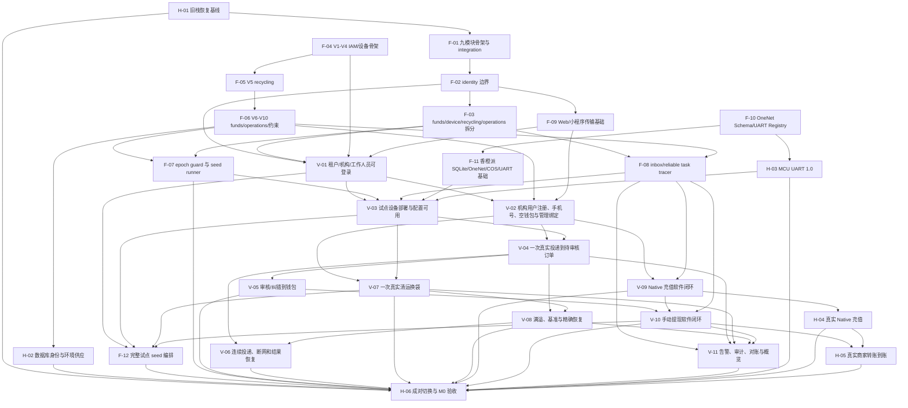

# 08｜实施任务依赖图、领取规则与目标窗口

> 上级索引：[EcoBin P0 详细设计与任务拆分](../detailed-design-draft.md)
>
> 状态：**29 项任务已批准并发布；H-01、H-02、F-01、F-02、F-03、F-04、F-05、F-06、F-07、F-08、F-09、V-01 已完成，F-11 实施中，V-02 已 ready 但仍须单独授权，F-10 软件已完成并等待 MCU/联调验收**
>
> 草案日期：2026-07-24
>
> 目标窗口：2026-07-30 仅用于风险排序；任务已补初始角色 owner 与 effort range，但实际负责人、可用并发和真实微信就绪时间仍未确定，不构成 G1、G2 或 M0 承诺

## 1. 拆分原则

1. `F-*` 是目标纵向切片不可绕过的施工基础，允许按模块/数据库/契约拆分。
2. `V-*` 必须是可演示的端到端业务切片，包含本切片需要的 schema、后端、可靠任务、客户端和测试，不再建立独立的“只写 Controller/只写页面/只写 Mapper”任务。
3. `H-*` 是主要由项目负责人、MCU 负责人、真实云环境、微信或现场操作完成的 HITL 任务；含真实小程序/真机验收的 `V-*` 标为 `mixed`，软件 agent 不得自行标记整个任务完成。
4. 任务生命周期 `status` 与执行主体 `executor` 分开；只有阻塞项完成、冻结文档无冲突且验收可独立执行时，任务才进入 `ready`。
5. 微信软件适配与真实渠道验收分开；Fake 通过不能自动关闭 HITL 任务。
6. 正式任务文件已保存到 [`docs/planning/tasks/p0-controlled-loop/`](../tasks/p0-controlled-loop/00-index.md)；发布不等于实施授权。
7. 依赖图箭头表示“后继任务能够整体标记 `done`”的完成门，不等于 Mixed 任务的所有软件工作都必须等待；正式任务已经为 software/integration/acceptance 分别填写 `earliest_start` 和完成证据要求。

## 2. 依赖总图



依赖图只包含已批准的 29 项可发布任务。DD-004 与 PDD-001 已转化为任务验收约束，不再作为裁决节点或任务前置条件出现在图中。

## 3. 基础任务

### 1. F-01｜九模块骨架与 integration 提取

- **类型**：AFK
- **Blocked by**：H-01
- **覆盖**：全部后续场景的构建边界
- **结果**：建立 9 个 POM、显式模块配置和 `.api`；OneNet/COS/微信移入 integration；当前旧行为和测试保持。
- **验收**：
  - 全量 `install/test` 通过；
  - framework 不含外部平台实现；
  - bootstrap 不再通配 Mapper；
  - 旧 Controller 的可观察行为未改变。

### 2. F-02｜identity 更名、可信上下文与公开端口

- **类型**：AFK
- **Blocked by**：F-01
- **覆盖**：场景 1
- **结果**：旧 system 迁为 identity；建立会话/作用域/组织用户公开边界及同步注册参与端口。
- **验收**：
  - 其他模块不引用 identity Mapper/Entity；
  - 公开命令只使用稳定 UID；
  - identity 定义、funds 实现的同步注册参与端口只在首次注册事务使用，钱包初始化失败时用户和会话整体回滚；
  - 跨模块内部 FK 只使用按主体强类型、服务端不可序列化的 opaque persistence ref，不存在裸主键、跨模块查表或对外泄漏。

### 3. F-03｜funds/device/recycling/operations 边界搬迁

- **类型**：AFK
- **Blocked by**：F-02
- **覆盖**：全部业务场景的模块前置
- **结果**：删除旧 business；钱包/提现、设备作业、回收业务和 operations 归目标模块；common/framework 收紧。
- **验收**：
  - 跨模块只导入 `.api`；
  - `UserMapper/DeviceMapper` 等跨域直连为 0；
  - 旧行为测试仍通过；
  - 不在本任务开发目标新业务。

### 4. F-04｜目标数据库 V1～V4

- **类型**：AFK
- **Blocked by**：合入新应用前需 F-01
- **覆盖**：场景 1、3、6、7、11
- **结果**：IAM、设备资产/配置、机构用户/会话、设备作业/证据 30 表及当时可建立的约束；云端不建立 `dev_delivery_cycle`。
- **验收**：
  - 新 MySQL 8.4 空库严格安装；
  - 无 `IF NOT EXISTS`/baseline/关闭外键；
  - 表、UQ/CHECK/FK/索引矩阵与 D-006～D-015 及对应约束章一致。

### 5. F-05｜目标数据库 V5 recycling

- **类型**：AFK
- **Blocked by**：F-04
- **覆盖**：场景 3～7、11
- **结果**：投递、清运、袋、基准、容量和满溢 24 表。
- **验收**：
  - 订单/revision/袋位置/检测代际约束齐全；
  - 两个机构复合外键不能串联；
  - 负重量、照片槽和袋无生命周期模型落实。

### 6. F-06｜目标数据库 V6～V10

- **类型**：AFK
- **Blocked by**：F-05
- **覆盖**：场景 2、5、8～12
- **结果**：资金 20 表、operations 9 表、跨模块 FK、不可变触发器和权限目录。
- **验收**：
  - 83 表完整；
  - V8 只补循环/跨模块关系；
  - V9 只有两类已冻结触发器；
  - V10 不含环境业务数据/秘密；
  - 两个空库安装结构一致。

### 7. F-07｜epoch guard 与空目标库 Fake bootstrap

- **类型**：AFK
- **Blocked by**：F-03、F-06
- **覆盖**：场景 1 和全部试点前置
- **结果**：应用关闭自动迁移；错误纪元拒绝；空目标库可在禁用所有真实外联的 Fake 环境启动。完整试点 seed 不在基础任务直接写表，而由后续纵向切片逐步提供正式用例，最终由 bootstrap 编排。
- **验收**：
  - 空/旧/低版本库均拒绝；
  - 正确 V10 空库能启动且不自动制造租户、设备、袋、账户或配置；
  - Fake 环境硬阻断真实外联。

### 8. F-08｜inbox 与可靠任务 tracer

- **类型**：AFK
- **Blocked by**：F-03、F-06
- **覆盖**：场景 2～12
- **结果**：完成一条 Fake 入站消息从可信收件、任务领取、业务提交到稳定确认的最薄路径。
- **验收**：
  - 收件/任务同事务；
  - ACK 前后崩溃可重投；
  - 租约过期接管；
  - 同 ID 异摘要隔离；
  - 业务回滚不误标处理完成。

### 9. F-09｜HTTP OpenAPI 3.1 与客户端传输基础

- **类型**：AFK
- **Blocked by**：F-02
- **覆盖**：场景 1～10
- **结果**：建立 `contracts/http/openapi.yaml` 及安全方案/公共 Schema/示例，并完成 Web Cookie/CSRF API client、小程序单 Token 路由、幂等键、版本冲突、十进制金额和 202 轮询基础；各 V 切片负责同步增加自己的 paths/schema/examples。
- **验收**：
  - OpenAPI 3.1 是 HTTP 唯一机器来源，覆盖 Web Cookie+CSRF、小程序 Bearer 和外部签名入口；
  - 无 localStorage Web Token；
  - 页面不各自计算金额/终态；
  - 401、409、202、ProblemDetail 行为一致；
  - 当前页面功能可以继续以 Stub 契约开发。

### 10. F-10｜OneNet Schema 与 UART Registry 冻结

- **类型**：Mixed（AFK + MCU 负责人 HITL 检查点）
- **Blocked by**：无
- **覆盖**：场景 3、4、6、7、11、12
- **结果**：先由 agent 形成机器可读 OneNet 命令/事件/确认及 UART 草案；投递只使用 session 级开始/最终完成，清运区分电磁阀解锁与人工关门确认；MCU 负责人确认消息号、字段偏移、能力位、非易失能力和状态机边界后，再冻结 Registry、错误码和黄金向量。
- **验收**：
  - Java 21/Python 3.11/C 可使用同一数值与样本；
  - 包含 STATE_SNAPSHOT 应用级分段；
  - 旧 D1/AA/BB/CC/DD 不在正式注册表；
  - 投递中间轮次不进入 OneNet，清运电磁阀状态不冒充门磁。

### 11. F-11｜香橙派 SQLite、OneNet/COS 与 UART 基础

- **类型**：AFK
- **Blocked by**：F-10
- **覆盖**：场景 3、4、6、7、11、12
- **结果**：EdgeStore、command inbox、work slot、event/photo outbox、业务确认、UART 严格链和启动恢复。
- **验收**：
  - 强杀进程不丢命令/序号/事件/照片/确认；
  - MQTT QoS 1 但仍等待业务确认；
  - COS 临时凭证不落盘/日志；
  - 以 MCU Stub 验证重启先完整 QUERY_STATE、不自动开门；
  - 与真实 MCU 的通过条件留在 H-03/V-03，不用 Stub 冒充联调。

### 12. F-12｜完整试点 seed 编排

- **类型**：Mixed（AFK + 项目负责人输入）
- **Blocked by**：V-01、V-03、V-07、V-10
- **覆盖**：H-06 新栈验收准备
- **结果**：bootstrap 通过已经完成的正式应用用例编排一个试点租户、两个机构、必要工作人员/小程序、设备/投口、袋、投递/清运/提现配置及零余额机构账户；不直接写业务表。
- **验收**：
  - 同一输入可重跑，同键同值 no-op，同键异值明确失败；
  - 不重置密码，不写秘密，不批量创建机构用户/用户钱包；
  - 不伪造 0 皮重、设备健康、余额历史或渠道成功；
  - 新空环境运行后满足 H-06 的可重复验收前置。

## 4. 纵向业务任务

### 13. V-01｜租户、机构和工作人员可以安全登录管理

- **类型**：AFK
- **Blocked by**：F-02、F-03、F-04、F-09
- **用户故事**：平台创建/禁用租户；租户主体、总部和机构工作人员登录 Web 并只管理授权机构。
- **覆盖场景**：1
- **结果**：从数据库、Web API 到页面完成租户/机构/员工/任职/权限和会话闭环。
- **验收**：
  - 登录只需登录名+密码；
  - 两机构越权统一不可见；
  - 负责人/主体天然权限与普通授权正确；
  - 禁用、改密、授权变化立即撤销会话。

### 14. V-02｜机构用户首次注册并获得独立零余额钱包

- **类型**：Mixed（AFK + 真实小程序 HITL）
- **Blocked by**：V-01、F-06、F-09
- **用户故事**：用户通过机构小程序首次登录、绑定手机号；工作人员绑定后自动进入管理页。
- **覆盖场景**：1、5、8
- **结果**：`wx.login`、注册归因、空钱包、动态码手机号和工作人员绑定贯穿后端/小程序/Web。
- **验收**：
  - 并发首次登录只一个机构用户/钱包；
  - 直接进入与设备扫码注册归因正确且不可改；
  - 未绑手机号不能投递/提现；
  - 绑定后入口 `MANAGEMENT/CLEANING/USER` 正确。
  - 真实 `wx.login/getPhoneNumber` 的小程序证据由指定测试用户提供，Stub 只能关闭软件部分。

### 15. V-03｜试点设备从库存到配置可用

- **类型**：Mixed（AFK + OneNet/真机 HITL）
- **Blocked by**：V-01、F-07、F-08、F-11、H-03
- **阶段**：software 可在 V-01/F-07/F-08/F-11 后使用 Stub 和真实 OneNet 非动作链推进；H-03 是 integration/acceptance 完成门。
- **用户故事**：平台把真实资产建立为试点机构部署，机构发布完整配置并看到设备精确应用。
- **覆盖场景**：3、7、11
- **结果**：资产/部署/投口、配置版本、OneNet、边缘/MCU 双证明、Web 状态贯通。
- **验收**：
  - 部署/投口/UNKNOWN 投影同事务；
  - 最高版本精确 `APPLIED` 才可激活/经营；
  - 仅 OneNet/UART ACK 不会伪造应用；
  - 设备/MCU 故障形成可见 blocker。

### 16. V-04｜一次真实投递形成待审核订单

- **类型**：Mixed（AFK + 真机开关门 HITL）
- **Blocked by**：V-02、V-03
- **用户故事**：用户扫码选投口，完成一次不使用继续按钮的正常投递 session，后台出现一笔待审核订单。
- **覆盖场景**：3、5、6、11
- **结果**：session、一次正常开关门、整场四图、唯一 OneNet 完成事件、物理结果、订单、结束后满溢 gate、业务确认和小程序时间线贯通。
- **验收**：
  - recycling 发起开始复合事务并按 D-037 先取得身份、配置和钱包锁，device 通过公开端口加入并继续拥有 session 事实；
  - recycling 不读取或写入 device Mapper、Entity 和私表；
  - 同设备其他用户不能覆盖；
  - 完成事件重复只一订单；
  - 首末重量和开始单价结算；负重量阈值布尔标志保留，零重量/缺图不误标；
  - 订单确认后边缘才能清理原事件。

### 17. V-05｜投递审核/纠错形成真实钱包差额

- **类型**：AFK
- **Blocked by**：V-04
- **用户故事**：审核员按原数据或修改重量通过；以后纠错，用户看到钱包正确变化。
- **覆盖场景**：3、5、8、12
- **结果**：Web 审核、revision、钱包明细、三项视图、负余额/提现联动完整。
- **验收**：
  - 不存在投递驳回/人工金额；
  - 负金额审核前钱包不变；
  - revision 与钱包同事务；
  - 重复/并发只一次差额；
  - 纠错不改既有微信提现终态。

### 18. V-06｜连续投递、断网与迟到结果恢复

- **类型**：Mixed（AFK + 断网/重启真机 HITL）
- **Blocked by**：V-04、V-08
- **用户故事**：同一用户无需重新扫码即可在本地继续多轮；断网/重启后整场只上报一次、不重单、不串人。
- **覆盖场景**：4、6、12
- **结果**：30 秒本地选择、整场结果期限、最终满溢 gate、投口待处理和恢复贯通。
- **验收**：
  - 继续按钮只在已授权 session 内驱动本地投递门，不请求云端；
  - 中间轮次不上报重量、照片或事件，一次 session 只一订单；
  - 迟到结果只回原 session；
  - 证据不足不造订单；
  - 原投口不会按旧容量提前开放。

### 19. V-07｜一次真实清运完成换袋

- **类型**：Mixed（AFK + 清运真机 HITL）
- **Blocked by**：V-02、V-03
- **用户故事**：清运员选投口、扫新袋，需要时在原操作内再次解锁，手动关门确认后完成换袋，后台可追溯。
- **覆盖场景**：7、11、12
- **结果**：操作、预留、首次可能解锁边界、再次解锁、人工关门确认、照片、清运记录、袋交换、基准、检测 gate 和确认贯通。
- **验收**：
  - 旧袋缺失不阻断且不伪造；
  - 再次解锁仍为原操作；
  - 超时只允许原人恢复；
  - 清运审核只影响统计；
  - 实体袋可重复使用且无生命周期状态。
  - 电磁阀通断只推定门状态，不能冒充门磁；`SAFE_CLOSE` 不作用于清运门。

### 20. V-08｜满溢、基准和精确安全恢复

- **类型**：Mixed（AFK + 传感器/恢复真机 HITL）
- **Blocked by**：V-04、V-07
- **用户故事**：机构查看上次满溢值，必要时发起真实重检/基准测量，并安全恢复精确故障。
- **覆盖场景**：3、6、7、11、12
- **结果**：三模式采样、确认复检、基准重测、投递结果/设备故障恢复和 Web/管理小程序只读贯通。
- **验收**：
  - 满溢在整场投递结束后应用；一个来源失败、另一不满时阻止下一 session；
  - 满溢度可 >100%，负净重显示 0 但保留原值；
  - 人工命令不能直接写未满/皮重/正常；
  - 只恢复精确 fault/gate，其他阻断保持。

### 21. V-09｜Native 充值软件闭环

- **类型**：AFK
- **Blocked by**：V-02、F-08
- **用户故事**：机构在 Web 输入金额、扫码（Fake）、看到手续费/净额和机构账户入账。
- **覆盖场景**：2、9、12（软件部分）
- **结果**：充值创建、二维码状态、回调/查单 inbox、`PAID_PENDING_POST` 和净额入账贯通。
- **验收**：
  - 1～20 万；
  - 0.6% 向上取整到分；
  - 支付成功与净额入账两事务；
  - 重复/乱序最多一次入账；
  - 生产缺渠道时明确不可用，不本地成功。

### 22. V-10｜手动提现软件闭环

- **类型**：AFK
- **Blocked by**：V-05、V-09、F-08
- **用户故事**：用户手动提现，审核员处理，Fake 微信状态正确结算；平台处理 NOT_ENOUGH。
- **覆盖场景**：8～10、12（软件部分）
- **结果**：配置、双冻结、审核/取消/渠道前终止、固定原单、确认页状态、三终态、闸门和客户端贯通。
- **验收**：
  - 同钱包单活动提现；
  - 审核通过不等于成功；
  - 超时/未知/NOT_ENOUGH 不释放；
  - `SUCCESS/FAIL/CANCELLED` 双侧只结算一次；
  - 恢复后复用原 `outBillNo`。

### 23. V-11｜告警、审计、对账与一致概览

- **类型**：AFK
- **Blocked by**：F-08、V-04、V-07、V-08、V-10
- **用户故事**：平台和机构看到可处置异常、审计和经营摘要，不直接篡改业务终态。
- **覆盖场景**：6、9～12
- **结果**：任务恢复、隔离确认、审计、聚合告警、内部资金对账、RR 概览和 Web/管理小程序贯通。
- **验收**：
  - 恢复原任务而非重建；
  - 确认告警不等于解决；
  - 对账只有系统验证可解决；
  - 统计无第二套真相；
  - 平台/租户/机构作用域和脱敏正确。

## 5. HITL 任务

### 24. H-01｜旧栈恢复单元和所有权清单

- **类型**：HITL
- **Blocked by**：无
- **负责人**：项目负责人/部署操作者
- **覆盖场景**：12、切换
- **输入**：旧 commit、旧数据库、部署配置位置
- **输出**：旧制品、V1～V14、dump/checksum/history/行数、实例/卷/入口清单和隔离恢复证据。

### 25. H-02｜目标数据库身份与环境供应

- **类型**：HITL
- **Blocked by**：F-06
- **负责人**：项目负责人/部署操作者
- **输出**：独立 MySQL 8.4、五类身份、脱敏 grants、应用权限正/负测；owner 凭证不进入运行容器。

### 26. H-03｜MCU UART 1.0 固件与真机基础验收

- **类型**：HITL
- **Blocked by**：F-10
- **负责人**：MCU 固件负责人
- **覆盖场景**：3、4、6、7、11、12
- **输出**：
  - 协议/固件版本和能力位；
  - CRC/ACK/幂等/关键事件持久化；
  - 投递 session/本地继续、清运解锁/人工确认、检测、投递门 SAFE_CLOSE/快照状态机；
  - 重复命令、ACK 丢失、掉电、再次解锁、负重量标志和安全故障真机证据。

### 27. H-04｜真实 Native 充值

- **类型**：HITL
- **Blocked by**：V-09、微信支付条件
- **负责人**：项目负责人/微信商户配置操作者
- **覆盖场景**：2、12
- **输出**：真实二维码、支付、可信回调和查单；净额/手续费/机构流水一致，凭证脱敏。

### 28. H-05｜真实商家转账与零钱到账

- **类型**：HITL
- **Blocked by**：V-10、H-04、微信商家转账条件
- **负责人**：项目负责人/指定测试用户
- **覆盖场景**：8、12
- **输出**：真实转账受理、用户确认页、微信零钱到账、原 `outBillNo` 和双账本一致。

### 29. H-06｜成对切换、回退演练与 M0 签署

- **类型**：HITL
- **Blocked by**：H-01～H-05、F-07、F-12、V-05～V-11
- **负责人**：项目负责人
- **覆盖场景**：1～12
- **输出**：
  - 一次非真实渠道 `PREPARED → QUIESCING → QUIESCED` 的完整静默过程，以及越过真实入口闩锁前的整对回退演练；
  - 单独完成 `ACTIVATED` 所有权切换证据，并证明越过闩锁后只允许停止入口、保护新库和前向修复，不把直接回旧栈当作回退方案；
  - 12 场景证据包；
  - 所有强制真实依赖通过；
  - 明确的 M0/非 M0 结论。

## 6. 推荐领取通道

实施期最多四个并发角色：

| 通道 | 负责内容 | 文件冲突约束 |
|---|---|---|
| 主审 | 决策、接口/事务审查、合并顺序、跨域测试 | 不与实现 agent 同时改同一文件 |
| 后端/数据库 | F-01～F-08、F-12、V-01～V-11 后端 | 根 POM、bootstrap 迁移和公共契约同一时刻只一个 owner |
| 边缘/设备 | F-10/F-11、V-03/V-04/V-06/V-07/V-08 设备侧 | 与 MCU 通过 Registry 协作，不直接改固件 |
| 客户端 | F-09 与各 V 切片的 Web/小程序部分 | 只依据冻结接口，不自行改后端语义 |

业务任务仍由一个负责人端到端领取；“客户端通道”是在同一任务内被明确委派的协作子任务，不单独把页面标记完成。

正式任务文件必须分别保存：

```text
status: needs-triage | needs-info | ready | in-progress | in-review | blocked | done | wontfix
executor: agent | human | mixed
owner:
effort_range:
earliest_start:
phase_progress: software | integration | acceptance
blocked_by:
```

`executor` 不随生命周期变化；`phase_progress` 对纯 agent/human 任务可以省略。Mixed 任务的软件阶段可以先推进，但只有 integration/acceptance 的人工证据齐全后整个任务才为 `done`。例如 MCU 协议确认可以是 `executor: mixed, status: blocked, phase_progress: integration`，不能用一个 `ready-for-human` 标签同时表达这些维度。

## 7. 目标窗口审查

### 7.1 审查结论

截至 2026-07-26：

- 目标 9 模块 reactor 已由 F-03 收口，旧 system/business 均已迁移退出，跨模块边界门禁已建立；
- 目标 V1～V10 的 83 张表已实施并通过 MySQL 8.4 双空库验证；F-07 已完成
  epoch/readiness guard、最小运行身份空业务库启动和 Fake 外联硬阻断并通过复审；
- F-08 中心 Fake 可信收件与可靠任务 tracer 已实施、复审并完成，具体纵向处理器仍待后续任务；
- F-10 OneNet/UART 机器契约的软件生成物已完成；F-11 已完成香橙派配置命令软件纵切，其他 SQLite/COS/UART 可靠链仍在实施；
- MCU UART 1.0 需要另一负责人并行；
- 微信支付/商家转账不能联调。

因此，“2026-07-30 前完整通过 12 个 M0 场景”不是当前条件下可信的承诺。1～2 天弹性也不能替代微信外部就绪或高风险并发/断电/真机验收。

此外，后端/数据库关键链仍需串行穿过 H-02 正式身份供应、可靠任务和纵向业务；
模块边界、目标纪元、DD-004 和复合投递事务所有权已经确认，剩余设计外检查点是
UART HITL、实际人员容量和微信外部就绪。正式任务虽然已经补充角色 owner 与初始
effort range，但实际负责人尚未全部指派，估算也尚未用完整纵向吞吐校准，因此 G1
仍不能作为可承诺日期。

### 7.2 初始工作量审查

29 项任务的初始粗估为：

| executor | 任务数 | 工作量 |
|---|---:|---:|
| agent | 15 | 67～112 person-days |
| mixed | 8 | 49～82 person-days |
| human | 6 | 10～20 person-days |
| **合计** | **29** | **126～214 person-days** |

在允许无依赖任务并行、但严格遵守当前依赖的情况下：

- G1 基础关键链约为 14～24 person-days；
- 到 H-06 的最长内部依赖链约为 54～90 person-days；
- 上述数字不包含微信能力开通、人员排队、环境等待或失败返工。

这些是任务拆分阶段的量级估算，不是日历承诺；领取首批任务后应使用实际吞吐重新估算。即使忽略真实微信阻塞，2026-07-30 也不足以完成完整 M0。

### 7.3 可用作管理目标的门槛

| 门槛 | 内容 | 最乐观目标 |
|---|---|---|
| G0 | 已批准详细设计和任务拆分，发布正式任务并登记 HITL 输入 | **2026-07-23 已完成；不是编码里程碑** |
| G1 | 九模块、新库 V1～V10、可靠任务和空库 Fake 新栈共同可运行 | 初始关键链约 14～24 person-days；待实际负责人和首批吞吐校准，不承诺 7 月 30 日 |
| G2 | 单设备、单投口真实 OneNet/COS 的一次投递和一次清运 | G1、UART 固件及真实小程序通过后；当前不承诺日期 |
| G3 | 连续投递、恢复、满溢、资金 Fake、operations 和 12 场景非微信部分 | G2 之后 |
| G4 | 真实充值、真实零钱到账和完整 M0 | 微信就绪且 H-04/H-05 通过之后 |

上述日期是风险管理线，不是以删减安全条件换取的交付承诺。

### 7.4 7 月 30 日状态命名

只能按证据使用：

```text
FOUNDATION_READY
DEVICE_CONTROLLED_SLICE_COMPLETE
SOFTWARE_SIMULATION_COMPLETE
M0_COMPLETE
```

`M0_COMPLETE` 只在 H-06 签署后使用。

## 8. 已确认决策与发布结果

项目负责人已经确认：

1. DD-004 采用“同事务 FK 构造引用 + 首次注册同步参与扩展”两个极窄例外，保留内部 `BIGINT` 复合外键和冻结 Maven DAG；引用必须按主体强类型、服务端不可序列化，并限制在指定同事务参与点。
2. PDD-001 由 recycling 发起“开始投递”的复合事务，device 继续拥有并通过公开端口写 session 等设备事实；继续投递属于已授权 session 内的设备本地动作，不再建立云端 cycle 或复合授权。
3. 当前 29 项粒度和依赖已经批准；F-12 专门负责最终试点 seed 编排。领域章节的小编号只作 trace，第 08 章和已发布的独立任务文件是唯一正式编号。
4. `status` 与 `executor` 两维模型已经批准，V-02/V-03/V-04/V-06/V-07/V-08 保持 `mixed`。
5. 2026-07-30 只作为风险排序目标；正式任务已经补充角色 owner、effort range 和 earliest start，实际负责人及首批吞吐确定后仍需重排，完整 M0 不作该日期承诺。
6. 2026-07-24 的会话级结算和清运电子锁事实已写回任务验收；任务数量和依赖图不变。
7. 项目负责人已授权并完成 H-01、F-01、F-02、F-03、F-04、F-05、F-06；F-10 软件已完成但必须等待 MCU、真实三语言
   工具链和联调验收，不能标记 `done`。后续任务不继承这次授权。
8. 2026-07-26，F-03、F-06 均已完成，项目负责人明确授权 Codex 接取并实施 F-08；
   F-08 转为 `in-progress`，该授权不扩展到 F-08 排除范围或其他任务。
9. 2026-07-26，F-08 完成 Fake 可靠任务 tracer、稳定完成/唤醒端口和 MySQL 8.4
   真实并发/故障验收，转为 `in-review`，等待主审确认。
10. 2026-07-26，F-08 根据复审修复精确 JSON 数字摘要和租约前置领取两个 P1，
    Java 21 全仓 91 项及 MySQL 8.4.10 专项 5 项通过；项目负责人确认完成并将
    `ed5341b` 合入 `database-refactor`，任务转为 `done`。
11. 2026-07-26，V-01 的 F-02、F-03、F-04、F-09 前置均已完成；项目负责人授权
    Codex 在独立 worktree 接取并实施 V-01，任务转为 `in-progress`。
12. 2026-07-26，V-01 完成目标 Web 会话、identity 目录/审计、管理页面、OpenAPI、
    全仓回归和真实 MySQL 验收，转为 `in-review`，等待项目负责人复审确认。
13. 2026-07-27，V-01 完成六项 P1 复审修复并通过真实 MySQL 八项专项、全仓、
    HTTP 契约和 Web 回归；项目负责人要求提交并合入，任务转为 `done`。V-02 的软件
    前置全部解除，转为 `ready`，但仍须单独授权。

29 个独立任务和一个索引已经发布到
[`docs/planning/tasks/p0-controlled-loop/`](../tasks/p0-controlled-loop/00-index.md)。
当前 H-01、H-02、F-01、F-02、F-03、F-04、F-05、F-06、F-07、F-08、F-09、V-01
为 `done`；F-11 为 `in-progress`；H-02 已通过本地演练及服务器整改阶段 0～3 验收，
当前试验期 `.ecobin` 凭证保管例外已由项目负责人接受；
V-02 为 `ready` 但仍须单独授权；F-10 因软件完成后仍等待 MCU/联调验收而为
`blocked`，其余任务保持 `blocked`。当前共 `done` 12、`ready` 1、
`in-progress` 1、`blocked` 15。
