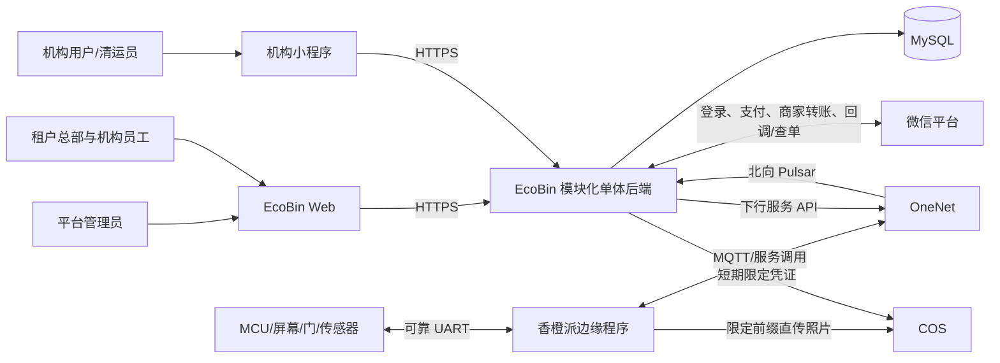
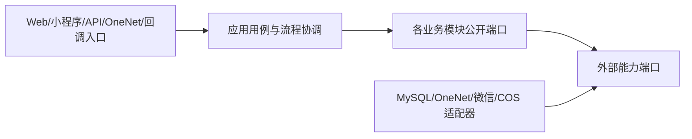
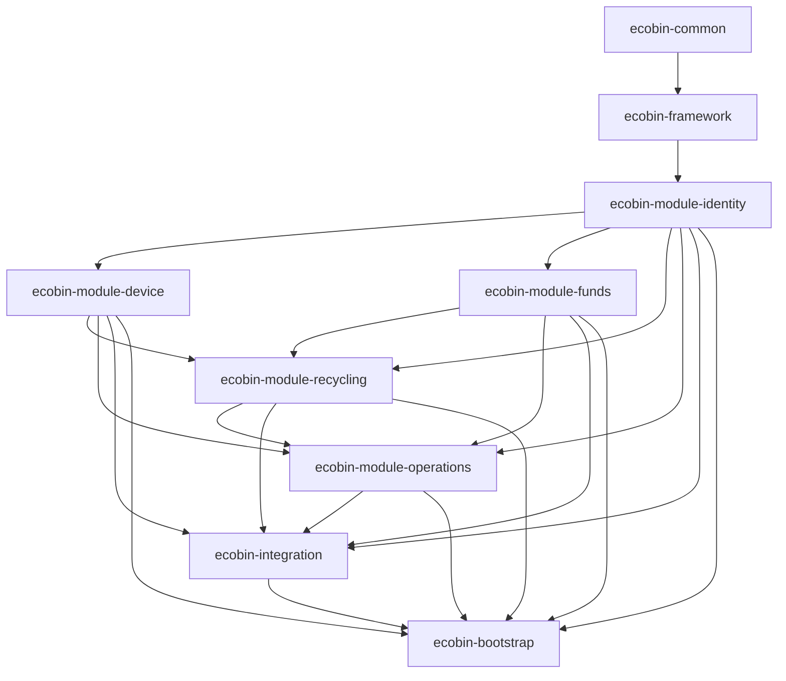
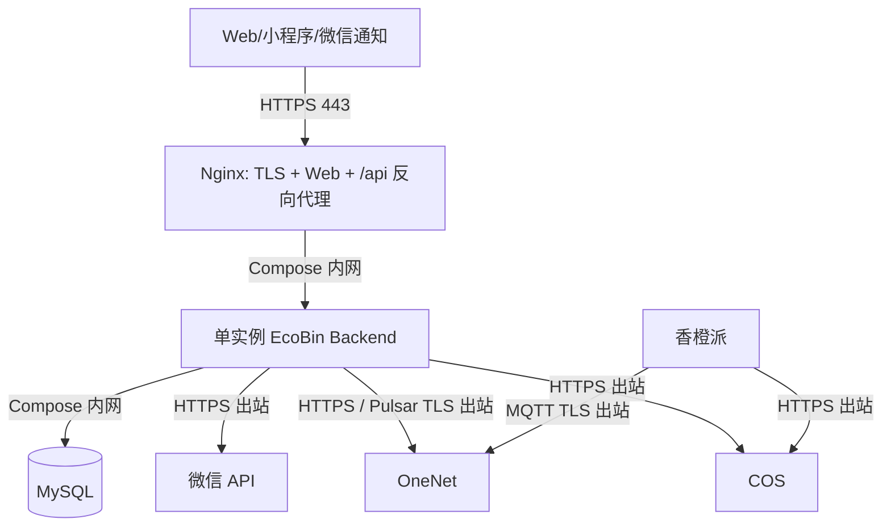

# EcoBin P0 系统架构设计基线

> 状态：**系统架构基线已冻结；DD-004 保留，PDD-001 已按 2026-07-24 决策收窄为首次投递会话协调**
> 整理日期：2026-07-22
> 最近确认：2026-07-24，项目负责人确认会话一单、边缘本地多轮和无门磁清运门边界；A-001～A-020 的模块/部署职责仍全部确认
> 最终独立读者测试：2026-07-22 通过，无阻断或重大歧义
> 当前阶段：详细设计和 29 项正式任务已发布；H-01、F-01、F-02、F-03、F-04、F-05、F-06、F-07、F-08、F-09 已完成，F-11 实施中，H-02 已 ready 但真实环境操作仍须授权，F-10 软件已完成并等待 MCU/联调验收
> 上游输入：[`requirements-baseline.md`](requirements-baseline.md)、[`p0-scope-baseline.md`](p0-scope-baseline.md)、[`business-model-baseline.md`](business-model-baseline.md)
> 现状参考：[`project-context.md`](../architecture/project-context.md)、当前代码、测试与 Flyway 迁移
> 目的：确定 P0 的系统边界、部署形态、模块职责、依赖方向和一致性机制；本文不设计数据库字段、接口 URL、消息字段或类结构。

## 1. 文档效力与设计边界

1. 冻结的需求、P0 范围和业务模型决定系统必须实现什么；本文只决定这些业务结果如何由系统结构共同保证。
2. 当前代码是“现状事实”，不是目标行为。当前实现与冻结业务模型冲突时，以冻结基线为目标，以本文规划迁移边界。
3. 系统架构冻结后，下一阶段依次进入数据库设计、接口设计、详细设计和任务拆分；后续阶段不得暗中改变本文已经确认的职责和一致性边界。
4. 一周 P0 是受控真实闭环，架构应优先保证资金正确、设备安全、数据归属和失败可恢复，不为尚未发生的外部商用提前建设微服务平台。
5. 本文中的“模块”首先表示有明确所有权和依赖规则的逻辑模块，不等同于必须立即新增一个 Maven 工程或独立部署服务。
6. 本文沿用范围基线的里程碑术语：**P0** 是一周内承诺实现的业务范围，**M0** 是 P0 全部切片及 12 个端到端场景通过受控真实验收后达到的里程碑，**M1** 是公司自用正式上线准备；P0 与 M0 不是两套功能范围。

## 2. 架构驱动因素

### 2.1 优先级

架构取舍按以下顺序进行：

1. **物理安全**：投递门状态未知、无法关门或关键本地数据无法保存时必须停止相关作业；清运门无门磁且人工关闭，解锁后的未知状态必须等待清运员现场恢复，不能由阀断电或 `SAFE_CLOSE` 猜测安全。
2. **资金正确**：订单、钱包、机构额度和微信渠道结果不能重复、丢失或被不明确状态提前结算。
3. **归属与隔离**：租户、机构、用户、设备实例及历史快照不能因客户端参数或当前配置变化而串改。
4. **可恢复与可追溯**：进程重启、断网、重复事件和乱序回调后仍能使用原业务身份收敛，并能解释每次资金变化。
5. **交付简单性**：当前由一人开发，P0 只覆盖少量真实设备与用户；优先采用可测试的简单结构。
6. **扩展性**：目标容量约为 10 个租户、每租户 2 个机构、50 台设备和 8,000 名机构用户总量；设计必须能扩展到该规模，但 P0 不为更大规模预先引入分布式复杂度。

### 2.2 一致性原则

- 同一 MySQL 内能够原子完成的强业务结果，必须使用一个本地事务共同完成。
- OneNet、设备、COS 和微信不参与本地数据库事务；外部调用采用持久意图、稳定业务身份、幂等执行、回调/查单和对账收敛。
- “消息已收到”“设备命令已受理”“物理动作已完成”“本地业务已提交”是不同事实，不能压缩成一个成功状态。
- 安全和资金状态不明确时宁可保持处理中或停用，也不能猜测成功或失败。

## 3. 架构冻结时的实现快照与主要差距

### 3.1 架构冻结时的部署与模块

当前后端是一个 Spring Boot 进程和一个 MySQL 数据库，并非微服务：

```text
ecobin-bootstrap
├─ ecobin-framework → ecobin-common
├─ ecobin-module-system → ecobin-framework
├─ ecobin-module-device → ecobin-framework
└─ ecobin-module-business → ecobin-framework + device + system
```

配套组件包括 React Web、原生微信小程序、香橙派 Python 程序、MCU、OneNet、COS 和微信小程序登录。该总体形态可以继续使用，问题主要位于模块职责、可靠性和业务模型内部。

2026-07-26 实施进展：当前 reactor 已由 F-03 收口为最终九个目标模块；system 已由
F-02 迁入 identity 并退出，business 也已迁入 funds、recycling、operations 并退出。
独立目标 V1～V10 的 83 张表已由 F-04～F-06 验证；F-07 新运行制品已物理移除
Flyway 运行库和迁移脚本，
以只读 epoch guard 在目标空业务库完成 Fake bootstrap 验收，但旧部署栈尚未成对切换。

### 3.2 当前实现不能满足 P0 的关键点

| 范围 | 当前事实 | P0 架构差距 |
|---|---|---|
| 组织 | `sys_tenant` 同时承担企业、经营机构、主体账号和小程序配置 | 缺少一级机构、总部/机构员工、能力和机构作用域 |
| 用户与钱包 | 微信身份和余额直接放在用户记录上，钱包没有不可变明细 | 无法可靠表达待审核、负余额、纠错差额和提现冻结 |
| 投递 | 后端按事件到达时的当前会话和当前价格建单；会话可被后来用户覆盖 | 缺稳定扫码会话、独占保护、整场首末结果及用户/价格/袋码/配置快照 |
| 设备上行 | OneNet 业务处理异常会被吞掉，北向消息最终仍被 ACK | 业务事实可能永久丢失，设备也没有可靠的业务确认 |
| 设备下行 | 下行调用失败主要依赖日志，命令受理和物理执行没有独立账本 | 无法可靠重试、判断门安全或在重启后恢复原作业 |
| 香橙派 | 作业状态主要在内存，照片使用临时目录，MQTT 可靠级别不足 | 断网或断电后可能丢上下文、照片或完成结果 |
| 清运 | 仍是开门时建单、`cleanGross`/`cleanTare` 分段更新的旧流程 | 与已冻结的可恢复清运操作及单一 `cleanComplete` 不一致 |
| 提现 | 只有本地审核状态，审核通过后即结束；没有真实微信渠道单 | 缺充值、机构账本、双侧冻结、渠道未知态、查单和对账 |
| 安全 | `/api/iot/**` 匿名，部分入口只信任设备 SN；STS 范围过宽 | 可伪造设备事实或获得越界对象存储写权限 |
| 运维 | 缺持久任务、关联 ID、资金/设备告警和恢复视图 | 故障只能从零散日志发现，无法证明最终收敛 |

以上差距是后续实现差距清单，不在本阶段直接修改代码。

## 4. 目标总体架构

### 4.1 架构风格

P0 和 M1 采用：

> **模块化单体后端 + 单一关系数据库 + 香橙派边缘作业协调器 + 外部系统适配器**

- 后端继续构建和部署为一个 Spring Boot 应用。
- 业务模块先完成 Maven 物理边界拆分，再在同一进程内通过明确的应用端口协作并共享本地事务；禁止互相访问 Mapper、持久化实体或内部 Service。
- MySQL 保存中心业务事实、账本、可靠收件箱、可靠发件箱和任务状态。
- 香橙派是独立边缘运行单元，必须在断网和重启后保存并恢复当前设备作业；MCU 保留独立关门与硬件安全能力。
- OneNet、COS 和微信均视为系统外部依赖，通过适配器接入，不让第三方字段和 SDK 类型渗入业务模块。
- P0 不拆微服务，不增加内部 Kafka/RabbitMQ，也不以 Redis 锁代替数据库业务约束。

这样既保留同库事务带来的资金正确性，也通过模块边界、端口和可靠任务获得以后拆分的可能性。

### 4.2 系统上下文



### 4.3 P0 运行单元

| 运行单元 | P0 形态 | 主要职责 |
|---|---|---|
| Web 管理端 | 静态资源，由 HTTPS 入口提供 | 平台、租户总部和机构人员操作界面；不保存业务真相 |
| 微信小程序 | 各试点机构 AppID 下的客户端 | 机构用户登录、投递、钱包、提现及清运入口；不决定机构或资金终态 |
| EcoBin 后端 | 单实例 Spring Boot；API、OneNet 消费和后台任务同一部署单元 | 身份授权、业务状态机、本地事务、可靠任务、外部适配和审计 |
| MySQL | 单主库 | 中心业务事实、不可变明细、状态投影、inbox/outbox、审计与对账 |
| 香橙派 | 每台物理设备一个边缘协调器 | 持久化作业、照片队列、皮重、业务编排、OneNet/COS 重试 |
| MCU | 每台设备的实时控制器 | 屏幕状态机、投递门门控与独立安全关门、清运门电磁阀通断、传感器采样、稳定判断和命令去重 |

P0 先使用单后端实例降低部署复杂度，但业务唯一约束、幂等和任务租约仍按可重启设计，不能依赖“当前只有一个进程”维持正确性。多实例和 Redis 是否有必要由 M1 的容量与运行数据决定。

## 5. 目标逻辑模块

### 5.1 模块所有权

| 逻辑模块 | 独占负责的业务事实 | 允许提供给其他模块的能力 |
|---|---|---|
| 组织、身份与授权 | 平台主体、租户、机构、员工账号、机构用户身份、能力授予和作用域 | 可信主体解析、能力校验、机构/AppID 映射 |
| 设备经营 | 物理设备资产、机构设备实例、投口、配置版本、当前健康和可用状态 | 查询有效部署与投口快照、变更设备可用状态 |
| 设备作业 | 整机独占、投递作业会话、边缘本地轮次摘要、设备命令与唯一物理完成/业务确认 | 创建/恢复投递作业、为清运提供独占与设备执行能力、接收设备结果 |
| 回收交易 | 投递订单、由设备物理结果导出的原始业务快照、审核认定版本、纠错和业务异常 | 审核/纠错用例、订单查询、发布已认定事实；原始设备事实仍由设备作业模块拥有 |
| 用户钱包 | 机构用户钱包、不可变钱包明细、三项余额投影和达到负余额阈值后必须人工调整才能清除的投递闸 | 入账、扣减、冻结、释放、成功消耗，以及以有符号差额执行的人工调整和受控恢复投递资格 |
| 清运与容量 | 完整清运操作状态机、清运记录、袋码预留/绑定历史、重量基准、满溢检测流程、快照和事件 | 准备/恢复/完成清运、审核净重量、处理满溢检测并更新投口阻断状态 |
| 机构结算 | 充值单、机构出款账户、机构资金明细、提现单、微信转账单和全平台出款闸门 | 充值入账、双侧冻结编排、渠道状态收敛和资金不足恢复 |
| 审计、对账与运营 | 敏感操作日志、技术处理异常、对账异常、告警和补偿任务 | 审计记录、异常查询、受控重试/查单/补账入口 |
| 外部适配 | OneNet、微信登录、微信支付、商家转账和 COS 的协议实现 | 实现业务模块定义的端口；不拥有业务状态机 |

这些职责必须先映射为明确的 Maven 物理模块，再开发 P0 主链。物理模块不必机械地与九类逻辑职责一一对应：可以在不混淆事实所有权的前提下把强相关能力放进同一 Maven 模块，以控制模块数量。确认后的模块名称、依赖 DAG 和迁移顺序见第 16 节。

### 5.2 依赖规则



1. Controller、MQ 消费者、回调入口只做认证、校验、协议转换和调用应用用例，不编排资金或设备状态。
2. 跨模块强一致动作由一个明确的应用用例协调，并在同一数据库事务中调用各模块公开能力。
3. 模块只能公开应用命令、查询接口、稳定业务 ID 和必要值对象；不得公开 Mapper、数据库实体或内部可变对象。
4. 业务模块不得直接依赖 OneNet、微信、COS SDK 或第三方响应类型；外部适配器实现由业务侧定义的端口。
5. 公共模块只保留真正稳定的技术基础，例如错误契约、金额/时间等基础值类型和安全上下文；不能继续成为所有跨域代码的堆放处。
6. 查询页面可以使用专用只读查询模型组合多个模块的数据，但查询模型不得绕过业务命令修改事实。

清运是一个完整业务域：清运应用用例负责清运操作从准备到恢复/完成的状态机，并在需要时调用设备作业模块提供的“整机独占、下发命令、接收物理结果”能力。设备作业模块不拥有清运操作、袋码或清运记录，避免把一个清运聚合拆成两个事实所有者。

## 6. 事务、一致性与可靠消息

### 6.1 必须原子完成的本地结果

| 应用用例 | 同一 MySQL 事务内必须共同成立的结果 |
|---|---|
| 建立投递会话与首次开门资格 | 后端生成的会话 ID、整机独占、用户/部署/投口/单价/袋码/负重量阈值/配置快照及待下发首次开门准备意图 |
| 接收唯一投递完成 | inbox 处理结果、原会话首末重量和四个照片槽位、`negativeWeightAnomaly`、最多一笔订单、会话结束后满溢检测 gate 及其可靠任务、待发设备业务确认 |
| 投递整机占位安全释放 | 用户结束或选择窗口超时后，最终投递门安全、旧开门动作不可再执行、唯一完成结果已在边缘可靠保存，且会话结束后容量 gate 已建立；不要求中间轮次或订单先上云 |
| 接收释放后的迟到投递完成 | 原会话完成结果、最多一笔订单及匹配的会话结束后检测 gate 幂等收敛；不得按后来会话状态改挂归属 |
| 审核或纠错订单 | 认定版本和订单当前认定始终共同成立；金额差额非 0 时再共同形成唯一钱包明细和余额投影，差额为 0 时不制造资金明细 |
| 可信钱包变动形成实际负余额 | 本次钱包明细和余额投影生效；尚未越过渠道提交边界的原进行中提现增加负余额暂停并保持双侧冻结，已经进入渠道提交的只增加风险标记 |
| 可信钱包变动恢复非负 | 钱包明细和余额投影生效；原提现的负余额暂停解除并按原进度继续，不创建新提现单或重复冻结 |
| 人工钱包差额调整 | 当前投递阈值快照、唯一调整事实、钱包明细、余额/停投闸投影及活动提现负余额联动共同成立 |
| 发布提现配置 | 新不可变版本与机构当前配置 head 原子切换；旧提现快照不变 |
| 创建 Native 充值 | 充值单、固定金额/费率/到期快照、唯一微信支付请求和可靠下单任务；此时尚无二维码或机构额度变化 |
| 准备清运 | 唯一清运操作、整机独占、清运员/旧袋/旧皮重/配置快照、新袋预留及待下发设备意图；开门前重量随后由设备在首次可能解锁前可靠采集，不在本事务伪造 |
| 清运首次可能解锁前结束 | 在首次电磁阀命令尚未进入可能成功通电边界、且不存在在途解锁动作时，清运操作结束、整机独占释放、新袋预留释放及关联待下发意图失效 |
| 接收清运完成 | inbox 处理结果、清运操作完成、整机独占结束、清运记录及机构可见序号、袋绑定历史、当前袋、新重量基准或明确无效状态、满溢待检测 gate、可空旧投递待处理指针接管、待发业务确认 |
| 接收满溢检测结果 | inbox 处理结果、检测快照、投口检测/可用状态以及同一持续满溢事件的创建、延续或恢复 |
| 空袋基准真实重测成功 | 基准重测结果、新有效基准、容量投影和后续人工满溢检测 gate；失败或过期不建立基准 |
| 投递结果待处理人工恢复 | 当前代际人工满溢检测 gate 先成立，再清除精确匹配的旧会话指针；不创建或删除订单 |
| 严重安全故障人工恢复 | 新鲜设备正常证据、现场确认、精确故障恢复和对应安全锁条件解除；其他故障及业务事实不变 |
| 接受微信充值成功 | 已验证微信支付成功事实、充值状态 `PAID_PENDING_POST` 及唯一净额入账可靠任务；此时尚不改变机构额度 |
| 充值净额入账 | 原成功事实仍有效且充值处于待入账、唯一机构资金明细、额度投影和充值状态 `POSTED` |
| 创建提现 | 提现单、配置快照、用户资金冻结、机构额度冻结及双方明细 |
| 驳回/本地取消 | 提现状态、用户冻结释放、机构冻结释放及双方明细 |
| 客服渠道前终止 | 提现仍待提交且不存在微信转账单、渠道前终止状态、用户及机构冻结释放、活动占位释放和操作审计 |
| 微信达到明确终态 | 渠道终态、提现终态以及一次双侧成功消耗或冻结释放 |
| 平台资金不足/恢复 | 全平台出款闸门、同一聚合告警和操作审计 |

调用 OneNet、微信或 COS 不放进上述事务。事务内只保存“需要执行的外部动作”，提交后再执行。

### 6.2 入站 inbox

OneNet 事件和微信回调统一采用持久收件箱：

1. 唯一正常链路是 `integration 传输入口 → inbox 可靠落库 → 传输层 ACK → 可靠处理器 → 业务公开用例`；传输回调不得在 inbox 之前直接修改投递、清运或资金事实。
2. 先完成来源认证、签名/解密、基本格式校验，并得到稳定外部身份和内容摘要。
3. 以“来源 + 稳定身份”幂等写入 inbox；相同身份但内容冲突时进入技术核查，不能静默当作重复成功。
4. **只有 inbox 已可靠落库后才确认传输层消息**：OneNet 此时 ACK 北向 MQ，微信此时返回通知接收成功。
5. 可靠处理器在后续本地事务中调用业务公开用例；业务状态转换与 inbox 标记已处理共同提交，失败则保持可重试，不丢原始证据。
6. 设备收到的“业务已接收”必须等投递/清运业务事务成功后，通过可靠下行发回；它与北向 MQ ACK 不是同一个确认。

I-041～I-045 进一步冻结：每个可靠边缘事实先在 SQLite 生成稳定 `eventUid`，并在同一部署内从一个全局持久分配器取得 `edgeEventSequence`；所有事件类型共享该序号空间。后端规范事件头负责跨类型冲突检测，OneNet/Pulsar 消息 ID 只保留为传输证据。权威领域事务与唯一 `CONFIRM_EDGE_EVENT:<eventUid>` 意图共同提交；香橙派持久化确认并返回不再递归确认的回执后，确认任务才结束。

永久无效消息与暂时失败分开处理：数据库不可用、密钥/证书服务暂时异常等可恢复失败不 ACK，等待原消息重试；已认证但格式永久错误、冲突或无法形成业务身份的消息，以传输消息 ID 和内容摘要持久化为脱敏隔离记录后 ACK，避免毒消息无限阻塞。签名/身份校验失败的 HTTP 请求按渠道协议返回失败并形成聚合安全记录，不能写成可信业务 inbox 或返回业务成功。

### 6.3 出站 outbox 与持久任务

- 每个外部动作只能有一份权威可执行记录。`outbox` 表示随业务事务持久化的外部动作意图、稳定业务 ID 和请求快照；“持久任务”表示这份意图的领取租约、执行、退避、查单和完成机制，outbox 不是再复制到另一条可独立执行的队列。
- 定时状态转换、对账和不对应外部动作的后台工作也使用同一持久任务机制，但以任务类型和稳定业务键区分；同一业务动作只能存在一个有效任务。物理上使用一张表还是关联表由数据库设计决定，语义上不得形成两套执行真相。
- 下发设备命令、返回设备业务确认、创建/查询微信订单、发起/续办微信转账等外部动作，先与业务状态一起写入唯一 outbox 执行记录；纯计时、对账和内部恢复工作直接建立唯一持久任务记录。
- 后台执行器在事务提交后调用外部系统；超时或结果不明确时保留原业务 ID 和原请求快照重试或查单。
- 成功发送不代表业务终态；外部受理、处理中和终态分别保存。
- 同一聚合的外部动作需要保持必要顺序，例如未确认设备可靠保存投递会话冻结上下文和首次重量前不能把首次开门视为已执行。
- P0 可以在提交后立即唤醒执行器降低延迟，但不能只有内存队列或一次性线程回调。
- 提现执行器只有在短本地事务中确认“待提交、未因负余额暂停且平台出款闸门开放”，并把原提现原子推进到不可本地取消的渠道提交阶段后，才允许在事务外调用微信；任何会改变钱包的可信资金事务与这一步必须按同一钱包及活动提现串行化，不能发生余额已经要求暂停而旧任务仍继续出款的竞争。

### 6.4 长流程协调器

以下流程跨越数据库事务和外部系统，分别由持久状态机协调：

- 投递会话协调器：首次在线准备与快照冻结、设备可靠受理、边缘本地多轮、唯一整场完成、后端接收、业务确认和超时恢复。中间轮次不进入云端协调器；订单结果与会话结束后满溢结果可以分别可靠接收，互不伪造对方成功。
- 清运操作协调器：准备、短期开始授权、首次可能解锁前结束、执行、再次解锁、未完成原人现场恢复和清运员完成确认。
- 容量协调器：投递会话结束/清运后初检、疑似满溢等待复检、确认满溢、确认不满、检测失败、人工重新检测和当前空袋基准真实重测；由清运与容量模块拥有，设备作业模块只承载检测/称重命令与物理结果。
- 充值协调器：待支付、微信成功待入账、幂等入账和未支付关闭/过期。
- 提现协调器：双侧冻结、审核、微信提交、用户确认、查单、明确终态和双侧结算。

超时只是状态机的触发条件，不直接伪造外部终态。所有计时任务必须持久化，并在后端重启后继续执行。

### 6.5 并发控制根

具体索引和锁语句留到数据库/详细设计，但架构要求数据库最终强制以下约束：

- 一台物理设备同时最多一个有效投递会话或清运操作；后来用户不能覆盖当前作业。
- 一个有效扫码投递会话最多生成一笔订单，一个清运操作只生成一笔清运记录。
- 同一个袋码不能同时绑定或预留给两个投口。
- 同一机构用户同时最多一笔进行中提现。
- 同一审核、纠错、充值入账、资金冻结/释放和渠道终态只能产生一次对应明细。
- 钱包和机构账户变更按账户串行化；机构可用额度及冻结额度不能因并发变成负数。
- 终态不能被迟到事件回退；相同幂等身份但内容冲突时停止自动变更。

P0 使用数据库唯一约束、条件状态更新和必要的行级锁保证这些结果，不引入 Redis 分布式锁。

普通满溢检测不参与当前投递会话内的继续投递，也不阻塞该会话订单创建和返现审核。香橙派只在用户选择结束或选择窗口超时、最终投递门关闭并可靠保存唯一完成结果后，按会话冻结配置启动初检和必要复检；结果只决定对应投口能否开始下一次扫码会话。中间关门、重量增长或红外状态不创建检测 gate、不请求云端授权，也不阻断本会话继续；门控、称重过载、烟雾、伸缩机构、MCU 和边缘持久化等硬件安全故障仍立即阻断。会话结束后检测结果尚未可靠形成、确认满溢或检测来源失败时，原投口不得开始下一会话。清运完成和人工重新检测复用同一检测状态机，无效新皮重只允许通过独立真实重测建立新基准。

## 7. 身份、租户与机构作用域

### 7.1 统一可信执行上下文

每个业务用例都必须收到服务端构造的执行上下文，概念上至少包含：

```text
主体类型 + 主体 ID + tenant_id + 授权机构范围 + 能力集合 + 接入渠道 + 关联 ID
```

具体 Token 字段和接口表达留到接口设计。业务代码不能仅依赖客户端传入的 `tenant_id`/机构 ID，也不能只依赖无法跨线程传播的 ThreadLocal。

### 7.2 不同入口的可信归属

| 入口 | 可信归属来源 | 必须再次校验的关系 |
|---|---|---|
| 平台 Web | 平台账号与显式平台用例 | 跨租户处置能力、目标作用域及操作日志 |
| 租户总部 Web | 员工账号、租户成员关系和能力 | 目标机构必须属于该租户，能力覆盖本次操作 |
| 机构员工 Web | 员工账号、机构成员关系和能力 | 只能访问已授权机构；负责人拥有本机构全部能力 |
| 机构小程序 | 请求 AppID 对应机构 + 微信登录结果 | OpenID/手机号属于该机构用户，设备也属于同一机构 |
| 清运操作 | 机构小程序用户 + 本机构清运能力 | 目标设备实例、投口和作业用户同机构 |
| OneNet 设备事件 | P0 先校验消息产品 ID 等于当前系统配置，再以 `deviceName=hardwareSn` 确定性映射物理设备；周期/清运操作 ID 再定位其冻结的历史部署实例 | 物理设备必须与原作业一致；迟到事件仍归原部署和原机构，不能信任自报租户/机构或改挂当前部署 |
| 微信回调 | 微信签名、证书/公钥、商户单号 | 商户单号只能定位既有充值或转账，回调不能改挂机构或用户 |

租户拦截器继续作为数据库访问的纵深防御；机构作用域必须由授权层和仓储查询共同保证。平台管理员不成为任一租户成员，跨租户操作通过显式特权用例执行并完整审计，不能依靠普通请求中的“跳过租户过滤”顺带实现。

平台特权不是通用改表权限。机构可用/冻结额度、提现金额和微信渠道终态属于任何账号都不可授予的直接修改禁区；平台管理员、租户主体和机构负责人都不能绕过。机构额度只能由已确认的充值和提现资金事实驱动；平台管理员只能执行需求明确允许且继续受领域不变量约束的查单、渠道允许的撤销/重试、平台补资恢复等业务用例，不能伪造资金事实。

P0 只使用部署环境配置的一项 OneNet 产品 ID；资产保存不可变硬件 SN，但不重复保存产品 ID 或由 SN 可推导的 OneNet 设备名。该产品配置在 P0 部署纪元内不可热切换，未来迁移必须显式保留旧来源身份与迟到消息映射。设备 Key 只存在于对应香橙派的设备连接配置，后端下行只使用产品级 AccessKey。两类凭证的持有者、用途和轮换边界不同，不能互相替代。

P0 可以预置试点账号和能力，不要求完成全部自助配置界面；后端能力模型和作用域校验必须从一开始成立。

### 7.3 后台任务的可信上下文

- inbox、outbox 和持久任务至少保存不可变的租户/机构作用域、目标聚合与部署身份、来源主体或外部来源、发起人审计引用、动作类型及关联/因果 ID；不能只保存一个可脱离作用域解释的业务主键。
- 后台线程不继承请求 ThreadLocal，也不使用无范围的平台绕过。处理器从持久记录重建受目标租户/机构和动作类型限制的系统执行上下文，同时保留原发起人用于审计。
- 重试执行的是已经授权并持久化的业务意图，因此重新校验当前聚合状态、幂等身份和安全闸门，而不是把发起人的旧权限快照当作当前权限；任何新的人工动作仍须按操作者当前能力重新授权。

## 8. 云端、香橙派与 MCU 的职责

### 8.1 固定边界

| 层级 | 应当负责 | 不应负责 |
|---|---|---|
| 后端 | 在线授权、用户/机构归属、配置快照、作业状态、订单、审核、资金和业务确认 | 直接控制 GPIO、根据到达时状态猜测历史用户、替设备伪造物理结果 |
| OneNet | 认证设备、承载上下行和传输状态 | 决定订单是否成立、钱包是否入账或门是否真的完成动作 |
| 香橙派 | 持久化投递会话/清运操作、投递本地轮次协调、首末净重与负重量异常锁存、会话结束后满溢判断、标准照片、COS/OneNet 队列和恢复 | 上传投递中间轮次数据、决定用户归属/审核金额/微信资金结果 |
| MCU | 投递门门控与独立超时关门、清运门电磁阀通断、屏幕和按钮状态机、传感器采样/稳定判断、命令序号去重及看门狗 | 保存云端用户/钱包业务、把阀断电冒充清运门真实关闭、直接调用后端或第三方平台 |

### 8.2 安全与恢复原则

1. 新扫码投递会话和新的清运操作必须取得在线授权；断网时不创建这些新作业。已在线授权并可靠保存的投递会话可以在边缘按冻结快照继续本地开关门，不请求云端再授权；已经可靠保存的同一清运操作可以在本地再次给电磁阀通电解锁，这些都不是创建新作业。
2. 投递作业会话 ID 由后端创建。小程序启动建立会话、整机占位并一次性固化用户、机构设备实例、投口、价格、袋码、负重量阈值和配置快照；香橙派可靠保存完整上下文、首次开门前稳定重量和前两张照片槽位后才允许首次开门。云端不为后续本地轮次生成 cycle 或再次校验普通经营条件。
3. 云端授权和设备命令必须携带可关联的会话、授权/命令和快照身份；设备不能只凭“开几号门”执行无身份动作。
4. 香橙派在确认投递会话或清运操作完整上下文已可靠保存后才报告命令受理；MQTT 回调线程不能同步阻塞完整物理流程。
5. 香橙派必须持久化进行中作业、命令结果、待上报完成事件和照片队列；重启后先核实投递门真实状态及清运阀推定状态，再按各自边界恢复原作业。
6. MCU 必须能在香橙派或网络异常时自行超时关闭投递门，并为命令返回可关联的受理、执行和错误结果；清运门由人工关闭，不能复用自动关门或 `SAFE_CLOSE`。
7. UART 正式协议固定为 I-046～I-050 的 1.0 二进制契约：最大 256 字节、`0xEC42` magic、big-endian、CRC-16/CCITT-FALSE、启动 HELLO、严格分帧、方向内序号、ACK/NACK、稳定硬件命令身份和 MCU 启动代际事件身份；I-054 已确认逐消息数值、偏移、能力位和错误码由单一机器注册表生成或校验。
8. 投递只生成一个 `DELIVERY_COMPLETE`，使用原会话 ID/稳定事件 ID 重试；清运完成使用原操作 ID 重试，直到收到后端业务确认。不能使用临时时间戳替代稳定业务身份，也不能把投递中间轮次拆成上云事件。
9. 设备结果与照片二进制上传解耦。投递完成事件只引用首次开门前和最终关门后的四个固定照片槽位；照片缺失记录原因并允许后续按原会话补传，中间轮次照片/数据不上云，不阻断订单和返现。
10. 物理设备重新部署前必须确认所有投递门安全关闭、清运阀已断电且不存在解锁后待人工恢复操作、没有其他进行中作业，并对本地未确认事件完成上报或显式隔离；新部署实例不能覆盖历史实例。重新部署后收到的迟到结果仍按原投递会话/清运操作关联原部署，缺少可信原作业身份的事件不得挂到新机构。
11. 配置发布必须携带单调版本和规范内容摘要。OneNet 受理只说明传输层接受下行；只有香橙派可靠落盘相同版本/摘要并证明必要 MCU 配置同步后，才能分别形成 `EDGE_SAVED` 和 `APPLIED`。I-041～I-050 已冻结目标证明，但当前临时 OneNet/UART 代码与固件仍不能给出这些证明，因此机器 Schema、实现和真机测试落地前不得绕过配置证明激活部署。
12. 发布更高配置只改变当前期望版本并停止旧下发任务，不把旧应用伪造成失败；旧版本迟到证明仍补入其真实历史，但只有最高期望版本精确 `APPLIED` 才能开放新作业。
13. 可靠边缘事件共享部署内全局单调且不可复用的持久序号；同一事件 ID 或序号出现不同内容必须隔离并锁存协议一致性故障，不能按到达顺序覆盖。遥测快照可以合并，但影响订单、换袋、配置、容量或安全恢复的事实不得降级为遥测。
14. 后端业务确认也采用稳定身份和可靠任务。设备只有在 SQLite 原子保存确认并建立回执后才可清理原事件；OneNet 下行成功、设备 ACK 或物理完成都不能提前触发清理。
15. UART `txSequence` 只确认一次方向内传输，`mcuCommandUid` 保证 MCU 幂等动作，`mcuBootId + mcuEventSequence` 证明 MCU 观察；香橙派以 SQLite 中的原 `sessionUid/operationUid` 归并，并只为整场投递完成或其他允许上云的事实生成独立 OneNet `eventUid`。本地轮次身份、这些序号和业务身份不得相互推导或替代。
16. 投递首次开门和清运首次解锁前，MCU 先交付本作业稳定总重量；香橙派将该事实提交 SQLite 后才 ACK。投递门在 ACK 且授权有效前保持关闭；清运电磁阀在相同条件成立前不得通电。该安全闸保证首重量不是旧心跳或开门后补猜。
17. 任一端重启都先 HELLO、QUERY_STATE 并补收关键事件。投递门必须查询真实门控状态，MCU 启动代际改变时不得重放旧 START/OPEN，状态不一致时执行投递门安全关门并锁存恢复。清运门只能查询电磁阀通断，没有门磁；首次可能解锁后的重启不得执行 `SAFE_CLOSE`、自动声称门已关闭或完成，只能保留原操作等待清运员现场确认。
18. 正式切换整体禁用旧 D1、临时 AA/BB/CC/DD 和旧 gross/tare 清运路径；生产不运行失败后回退旧协议的双解析器。
19. 清运门电磁阀通电视为“开/已解锁”、断电视为“关/已上锁”只是一项业务推定。第一次解锁命令可能成功即越过不可逆边界；再次解锁沿用原操作；只有清运员手动关门、最终稳定重量或明确终态称重故障可靠保存并明确确认后才能上报 `cleanComplete`。恢复中仅断电不能释放整机占位；断电且原清运员现场确认门扇关闭后可释放整机占位，但原投口、操作和袋预留继续锁定。

## 9. 微信、COS 与其他外部适配边界

### 9.1 微信适配器分离

微信能力至少按业务目的分成三个适配器：

- 小程序身份适配器：`code2session` 等登录能力，只返回内部可理解的身份结果。
- 充值支付适配器：创建支付、验证并解密通知、原单查单和交易对账。
- 商家转账适配器：提交/续办原 `out_bill_no`、查单、回调状态、用户确认收款参数和渠道错误分类。

充值和转账共享证书、签名、回调安全等基础能力，但不共享业务状态机。回调、主动查单、人工查单和每日对账必须进入同一幂等结算用例，不能各自修改资金。

P0 所有机构共用公司的系统微信商户号；机构不是独立微信商户。机构归属来自 EcoBin 充值单/提现单的不可变快照，用户确认收款使用该机构已绑定到系统商户号的 AppID 和对应 OpenID，不能根据回调临时改挂机构。

微信超时、频率限制、等待用户确认和 `NOT_ENOUGH` 都不是系统可以自造的失败终态。`NOT_ENOUGH` 更新同一个全平台出款闸门和聚合告警，不否定各机构本地账本。

### 9.2 COS 边界

- 设备直传照片，后端只签发短期、最小权限且限定设备/作业对象前缀的凭证。
- 对象 key 由设备按后端授权的作业范围生成，完成事件回传 URL/对象标识；后端不暴露桶级通配写权限。
- COS 上传失败不回滚已经安全完成的物理作业；本地照片队列负责重试，最终缺失作为设备健康事实被发现。
- 投递作业只有“首次开门前箱内/箱外、整场最终关门后箱内/箱外”四个标准槽位；中间本地轮次不创建或上传业务照片。清运仍使用首次解锁前和清运员最终确认关门后的四个标准槽位。每个槽位使用“原作业 ID + 拍摄位置”形成稳定照片身份。
- 完成事件可以携带当时已经上传的对象标识和缺失原因；未完成上传的照片随后通过独立、可幂等的照片关联事实补入原订单/清运记录，并取得后端关联确认，不能创建第二笔业务单据。
- 已上传照片只有在后端确认关联后才删除本地副本；连续失败达到 72 小时时，设备先在 SQLite 永久记录该照片身份、失败原因和“永久缺失”待上报事实，再删除照片二进制，后续仍需把缺失事实可靠上报。具体消息字段和对象命名规则进入 IoT/接口设计。
- I-044 已将对象身份冻结为 `ecobin/{deploymentCode}/{workType}/{workUid}/{slot}/{photoUid}.jpg`。后端只签发原作业精确前缀的短期 `PutObject` 权限，临时凭证不入稳定命令摘要或数据库；补授权复用原作业身份，照片状态通过独立可靠事件补入四个固定槽位。

## 10. 数据、缓存与消息选择

### 10.1 P0 中心侧

- MySQL 是中心业务事实的唯一来源；订单、状态机、不可变资金明细和当前余额投影放在同一数据库中。
- OneNet 北向 Pulsar 是既有外部传输通道，不作为 EcoBin 内部业务事件总线。
- P0 不新增内部消息中间件。模块间强一致协作使用同进程调用和本地事务，外部副作用使用数据库 outbox/持久任务。
- P0 不依赖 Redis 保存会话、锁、余额或作业真相。以后只有在明确的多实例协调、热点缓存或吞吐证据出现时再引入。
- 照片二进制保存在 COS，数据库只保存业务关联、对象标识、上传状态和必要元数据。

### 10.2 边缘侧

香橙派必须使用断电可恢复的嵌入式持久存储保存作业、事件和照片队列。A-012 已确认使用 Python 3.11 稳定支持的 SQLite（启用适当事务和 WAL），不使用多个无事务 JSON 文件承载作业真相。

## 11. 安全与隐私基线

1. 外部入口默认拒绝，只精确开放登录、微信回调和必要健康检查；禁止用 `/api/iot/**` 通配匿名规则暴露业务入口。
2. 正式设备事实只接受 OneNet 可信链路；保留的直连接口必须有独立设备认证、重放防护和明确的测试/维护环境边界。
3. OneNet MQTT、北向 Pulsar、HTTPS 和微信调用必须验证 TLS；不得保留“不安全连接”作为生产默认值。
4. 微信商户私钥、APIv3 密钥、OneNet 产品级 AccessKey 和 COS 平台凭证只从后端部署环境或秘密管理设施注入；OneNet 设备 Key 只配置在对应香橙派，后端不接收、保存或回显。平台级必需配置缺失时生产启动失败。机构 AppSecret 由具有小程序配置权限的 Web 用例以 `operationUid` 幂等写入外部秘密设施的不可变版本，再由短数据库事务切换 `secret_ref`；未被数据库引用的版本没有业务效果并可清理。某机构尚未配置时只阻止该机构小程序激活和登录，不导致整个服务启动失败。
5. 生产关闭 SQL 明文打印和敏感 DEBUG；登录 code、完整 OpenID、手机号、Token、完整密钥和回调明文不得进入普通日志。I-012 允许机构 AppSecret 在有配置权限人员使用的配置详情响应中回显；配置更新响应仅含脱敏摘要，日志也只能记录统一脱敏值。
6. Web 和小程序只获得完成当前动作所需的数据；资金终态、机构作用域和设备身份始终由后端验证。
7. 数据库使用非 root 的最小权限账号，不公开数据库端口；后端应用端口通过 HTTPS 入口暴露，不直接公网开放。
8. 操作日志、业务修订和资金明细只追加，不提供普通删除或覆盖入口。

## 12. 可观测性与运营恢复

P0 至少建立以下可发现性，不要求一次引入完整监控平台：

- 端到端关联标识：请求 ID、设备命令 ID、投递会话 ID、`DELIVERY_COMPLETE` 事件 ID、清运操作 ID、充值单号、提现单号和 `out_bill_no`。
- 结构化日志：记录状态转换、重试次数和错误分类，默认脱敏，不能只记录第三方原始响应。
- 最小指标/管理视图：inbox 待处理和失败数、outbox/任务积压、设备业务确认超时、门安全故障、充值已支付待入账、提现长时间未结算、渠道状态不一致和全平台出款暂停。
- 健康检查：应用、数据库、OneNet 消费者和后台任务执行器；外部渠道短暂不可用不应伪装成应用健康，也不一定要求整个进程退出。
- 每日交易级核对：使用同一幂等结算用例发现并补齐充值成功未入账、微信终态未结算等遗漏。
- 受控人工动作：重新查单、重试可靠任务、确认平台补资恢复和允许的微信撤销都走业务用例并记录操作者，不能直接改表。
- 数据库定期备份、正式恢复演练和灾备指标在 M1 上线治理中确定；P0 不新增通用备份产品能力或 M0 产品验收场景，但 D-045 要求的本次新迁移纪元切换备份与整对恢复验证是首次激活的一次性操作门槛。

## 13. 故障与降级策略

| 故障 | P0 行为 |
|---|---|
| MySQL 不可用 | 后端停止产生新授权和资金动作；不以缓存继续写业务 |
| 后端或 OneNet 不可用 | 不创建新扫码投递会话或新清运操作；已经可靠保存的投递会话可在边缘继续本地轮次并保存唯一完成结果，已经可靠保存的清运只允许恢复同一操作；新业务结果待网络恢复后重试 |
| 香橙派重启 | 先恢复本地作业；查询投递门真实状态和清运阀通断。不得把旧结果归给新用户，也不得把清运阀断电当作门扇关闭/操作完成 |
| 任一投递门打开、关闭失败或状态未知；清运阀通电/未知且没有原清运员现场恢复；MCU 失联；称重模块不可用；边缘业务数据无法可靠写入 | 立即停用整台设备并拒绝新投递/清运授权。MCU 只对投递门执行安全关门；清运门不使用 `SAFE_CLOSE`，首次可能解锁后的状态等待原清运员。恢复必须满足相应设备证据和现场确认，不得因超时、阀断电或后来一次正常上报自动恢复 |
| 单个投口已满或非门控的投口级传感器故障 | 只停用对应投口；其他投口仅在整机不存在上述严重故障时可继续使用 |
| COS/相机失败 | 订单仍可成立；记录照片缺失及健康问题，本地队列继续补传 |
| 微信响应不明或回调丢失 | 原单保持处理中，使用原商户单号查单/续办，不释放资金、不换单号 |
| 微信明确 `NOT_ENOUGH` | 原提现保持冻结；暂停全平台新出款并聚合告警，补资确认后原单续办 |
| 重复或乱序事件 | 按稳定身份返回既有结果；终态不回退，内容冲突进入核查 |

## 14. P0、M1 与迁移原则

### 14.1 P0 必须落地的架构能力

- 模块化单体和可信租户/机构作用域，而不是微服务。
- 稳定投递会话、唯一 `DELIVERY_COMPLETE`、清运操作、微信商户单号及业务快照。
- 中心 inbox/outbox、持久任务和本地强一致事务。
- 香橙派持久作业/事件/照片队列，MCU 投递门安全关门、清运阀控制和可靠 UART 最小协议。
- 不可变钱包与机构资金明细、充值/提现/微信转账分离以及统一结算器。
- 生产入口收敛、最小凭证治理、日志脱敏、健康检查、告警与每日核对。

### 14.2 M1 再补齐

- 完整权限自助配置界面，以及小程序中超出当前机构精简统计/告警范围的完整经营看板。
- 自动审核和投递后自动提现。
- 完整设备生命周期、远程维护、升级回滚和告警升级。
- 多实例部署、Redis 或内部消息中间件；只有容量和可用性目标证明必要时引入。
- 完整经营统计、资金导出、长期归档、监控平台和正式灾备指标。

### 14.3 从当前实现迁移

1. 第一项实施工作是完成 Maven 物理模块拆分、依赖收敛和全量构建验证；该步骤只改变代码归属和依赖，不顺带改写业务语义。
2. 模块骨架稳定后再建立目标业务身份、事务边界和外部适配端口，随后进入数据库及接口改造；不能继续让旧表结构反向决定目标模型。
3. 新 P0 主链只写目标事实，避免同一资金或设备结果同时写旧模型和新模型形成无法对账的双写。
4. 旧接口如需过渡，由入口适配到新应用用例；旧 Mapper、Entity 和状态值不向新模块泄漏。
5. 试点数据的迁移、清理或重新初始化在数据库设计阶段单独决定，并保留现有用户改动和历史证据。
6. 每条纵向主链按“稳定身份 → 本地事务 → 外部可靠执行 → 重启/重复验证”验收，不能只验证正常页面流程。

## 15. 第一批已确认架构决策

> 确认状态：**2026-07-22，A-001、A-003～A-005 按原方案确认；A-002 按项目负责人意见调整后确认原则。**

1. **A-001 架构风格（已确认）**：P0/M1 采用模块化单体，一个 Spring Boot 部署单元和一个 MySQL 主库；不拆微服务。
2. **A-002 模块边界（调整后确认）**：采用第 5 节的逻辑职责和公开端口规则，并且在 P0 主链开发前先完成 Maven 物理模块拆分；具体物理模块数量、名称和依赖 DAG 进入第二批确认。
3. **A-003 一致性机制（已确认）**：同库关键结果使用本地事务；OneNet/微信入站使用 inbox，外部下行使用 outbox/持久任务，长流程由持久状态机协调；不使用分布式事务。
4. **A-004 身份与隔离（已确认）**：所有入口先形成可信执行上下文，租户拦截器作为纵深防御，机构作用域由授权和数据访问共同执行；平台跨租户操作必须走显式特权用例并审计。
5. **A-005 云边职责（2026-07-24 修订）**：会话 ID 由后端创建并一次性冻结业务快照；香橙派在首次开门前可靠保存上下文，协调不上云的本地轮次并只生成唯一整场完成事件；MCU 决定实时投递门控、清运阀通断和传感器稳定结果。断网不创建新作业，但已开始投递会话可以沿用冻结快照继续本地轮次并使用原会话恢复上报；清运解锁后必须等待原清运员恢复。

## 16. 第二批：Maven 物理模块方案

> 确认状态：**2026-07-22，A-006～A-010 全部确认并同意。本文只决定物理代码边界，不实施搬迁。**

### 16.1 确认的九模块布局

从设计冻结时的 6 个模块一次调整到以下 9 个模块，不保留临时的第二套拆分结构：

| Maven 模块 | 物理职责 | 当前代码的主要来源 |
|---|---|---|
| `ecobin-common` | 极小纯 Java 共享内核：稳定基础值类型、错误契约、通用响应 | 保留当前真正通用内容；业务枚举和 MyBatis 基类移出 |
| `ecobin-framework` | Spring/Web/Security 技术骨架、可信执行上下文、租户/机构数据防线、MyBatis 与事务配置 | 当前 framework 中与具体外部平台无关的部分 |
| `ecobin-module-identity` | 平台、租户、机构、员工、机构用户、认证和能力授权 | 当前 `ecobin-module-system`，并按冻结模型重组 |
| `ecobin-module-device` | 物理设备、部署实例、投口、配置/健康、整机独占、投递会话、设备命令与物理结果 | 当前 device，加上现 business 中属于设备作业的协调部分 |
| `ecobin-module-funds` | 用户钱包、机构出款账户、充值、提现、微信转账业务状态及不可变资金明细 | 当前 Wallet/Withdraw；后续新增充值和机构资金模型 |
| `ecobin-module-recycling` | 投递订单、审核纠错、完整清运状态机、袋码、重量基准、满溢和 P0 回收查询 | 当前 Delivery/Clean/Statistics 中的 P0 部分 |
| `ecobin-module-operations` | 操作审计、技术异常、可靠 inbox/outbox 记录、对账异常、运营告警、只读投影和受控恢复用例 | 当前零散统计/日志能力及后续 P0 运营闭环 |
| `ecobin-integration` | OneNet/Pulsar、COS、微信登录/支付/转账适配，入站回调/MQ 和可靠任务的协议执行器 | 当前 framework 的 OneNet/COS/WeChat、业务分发器和 IoT 入口 |
| `ecobin-bootstrap` | 应用组装、环境配置、全局 Flyway 顺序和跨模块集成测试 | 保留当前 bootstrap，禁止放业务逻辑 |

原 `ecobin-module-business` 在搬迁完成后删除；原 `ecobin-module-system` 改为语义明确的 `ecobin-module-identity`。不保留名为 `business` 或 `system` 的宽泛业务容器。

### 16.2 允许的依赖 DAG



图中箭头表示“右侧 Maven 模块允许依赖左侧模块”。换成依赖清单为：

- `common` 不依赖项目内其他模块。
- `framework` 只依赖 `common`。
- `identity` 依赖 `framework`。
- `device` 依赖 `framework + identity`。
- `funds` 依赖 `framework + identity`。
- `recycling` 依赖 `framework + identity + device + funds`。
- `operations` 依赖各业务模块的公开 API，用于运营查询和受控协调。
- `integration` 位于最外层，依赖业务公开 API 并实现业务模块定义的 OneNet、COS 和微信端口。
- `bootstrap` 依赖并组装全部模块，不允许任何模块反向依赖 bootstrap。

新扫码投递会话的建立是跨 identity、recycling 投递配置、funds 钱包和 device 作业事实的复合用例，由依赖侧最外层的 recycling 应用用例开启并协调事务。协调权只决定事务入口，不转移事实或表的所有权：device 仍唯一拥有并通过自身公开参与端口写入 session、occupancy、device command 和 physical fact；recycling 不访问 device 的 Mapper/Entity，device 也不增加对 funds 或 recycling 的 Maven 依赖。具体逐节点锁序以 D-037 为准，不能把它简化为按模块一次性取得全部锁。同一会话内“继续投递”完全由边缘执行，不进入该复合事务，也不存在云端 cycle 创建或再次授权。

首次机构用户创建采用另一条已点名的依赖反转：identity 定义单一同步注册参与端口，funds 依赖 identity 并提供实现；identity 在自己的创建事务中只依赖该自有接口，bootstrap 负责装配。该结构仍是 `funds → identity`，不构成 identity 对 funds 的反向 Maven 依赖，也不建立通用创建后事件总线。

业务模块需要写操作审计或 outbox 时，不反向依赖 `operations`/`integration`：它们只依赖放在 framework 中的稳定技术端口，运行时由外层模块提供实现，并继续参加调用方开启的同一数据库事务。这样既能保存同事务审计和外部意图，又不形成 Maven 循环。

`operations` 保存与第三方无关的可靠收件、发件和异常记录；`integration` 负责把 OneNet/微信/COS 协议消息转换为这些记录并执行具体外部调用。协议原文和第三方 SDK 类型不得进入 operations 或业务模块。

### 16.3 模块内部和公开边界

每个业务模块使用统一结构，但不新增成对的 `*-api`/`*-impl` Maven 工程：

```text
org.enveloping.ecobin.<module>
├─ api/              # 其他模块唯一允许导入的命令、查询、结果、端口和稳定 ID
├─ application/      # 用例、事务边界和跨聚合协调
├─ domain/           # 本模块业务规则和值对象
├─ infrastructure/   # 本模块 Entity、Mapper、XML 和仓储实现
└─ web/              # 本模块 Web/小程序 HTTP 入口（如有）
```

- `internal`、`domain`、`infrastructure` 和 `web` 均不得被其他业务模块导入。
- 跨模块只能访问 `.api`，禁止 Mapper/Entity 跨模块引用和反向依赖。目标仍使用 ArchUnit 自动检查；按后确认的 I-055，首个共同可运行版本形成前先以 Maven 依赖、包约定和代码审查执行，自动 CI 门禁在后续升级中引入。
- 普通跨模块命令、查询、结果、授权、幂等和业务关联仍只使用公开 UID/业务号。DD-004 只允许在同进程、同线程、同一已开启数据库事务内，经 I-051/I-053 点名的同步参与端口传递关系专用、不可序列化的强类型 FK 构造引用；它只用于接收模块写自己表中的目标复合 FK，不得进入传输、任务、缓存、会话、日志、审计、异步调用或下一事务，也不得成为通用主键解析能力。
- 首次机构用户注册是当前唯一的源聚合原子创建参与扩展：identity 写入用户后同步调用一个 funds 实现的必需参与者创建零余额钱包，任一步失败则用户、钱包和会话整体回滚；重复登录不再调用该参与者。该例外不允许裸 `Long`、参与者列表、注册表或通用 after-create hook。
- P0 不使用 JPMS `module-info.java`，也不为每个业务域再拆 API/impl 两个 Jar；两者都会显著增加 Spring/MyBatis 反射配置和模块数量。
- HTTP Controller 留在所属业务模块；不建立集中式 `ecobin-api`，否则它会重新成为大杂烩。
- OneNet、微信和 COS 的入口统一在 `integration`，但按 `iot`、`wechat`、`cos` 内部包隔离；P0 不再拆三个适配器 Jar。
- integration 中的入站适配器与出站客户端必须是不同的 Spring Bean：例如 OneNet 消费者只验证并持久化 inbox，ACK 后由可靠处理器调用 recycling/device 入站用例；OneNet 下行客户端只实现业务端口且不反向注入业务服务。微信回调入口和微信 API 客户端同样分离，避免绕过 inbox 或形成运行时 Bean 循环依赖。

### 16.4 事务、MyBatis 与 Flyway 的物理约定

1. 所有业务模块在同一 JVM 中使用同一个 DataSource 和 `PlatformTransactionManager`；主流程所有者的 public 应用服务开启事务，可覆盖被调用模块的 Mapper。
2. 禁止在强一致主链中使用异步调用、随意的 `REQUIRES_NEW` 或 Spring self-invocation 切断事务。
3. 每个业务模块私有拥有自己的 Entity、Mapper、Mapper XML 和仓储实现，并提供模块配置类进行显式 `@MapperScan`。
4. bootstrap 显式导入各模块配置，避免依靠宽泛的全项目 Mapper 扫描掩盖错误依赖。
5. 因 P0 是单库且迁移版本必须全局有序，Flyway 脚本继续集中在 bootstrap；表的业务所有权仍由对应模块决定，不建立统一 persistence 模块。
6. 单元/模块测试跟随所属模块，跨模块事务、Spring 装配和端到端契约测试放在 bootstrap。

### 16.5 只搬边界的拆分顺序

模块拆分与新业务开发分开进行，每一步都要求全量编译通过：

1. 记录当前构建/测试基线，建立九个目标 POM、模块配置和可审查的 `.api` 依赖规则；ArchUnit 自动门禁按 I-055 在共同首版形成后补入。
2. 建立 `integration`，先把 OneNet、COS、微信及 IoT 分发从 framework/business 移出，以端口接回现有行为。
3. 将 `system` 迁为 `identity`，建立公开身份/组织/作用域 API；不在该步骤顺带开发完整新权限功能。
4. 从 business 提取 `funds`，迁移当前钱包和提现；消除对 `UserMapper` 的跨模块直接引用。
5. 将投递、清运和 P0 查询迁入 `recycling`；设备作业部分归入 `device`，两者只通过公开端口协作。
6. 建立 `operations`，收拢操作审计、异常、对账、告警和受控恢复入口。
7. 收紧 common/framework，迁回业务枚举，删除旧 business，显式完成 bootstrap 组装。
8. 执行 `./mvnw install -DskipTests` 后运行全量测试和 bootstrap 集成测试，确认模块拆分没有改变现有可观察行为。

新机构、钱包账本、充值、真实微信转账等目标能力仍在模块拆分完成后按数据库、接口和详细设计实施，不能混入“搬文件”步骤导致重构和新功能无法分别验证。

当前 `sys_user` 等旧表把多个目标领域的数据混在一起。纯模块拆分期间，由当前表的所有者保留唯一 Mapper，并通过标记为 legacy 的窄兼容端口提供现有原子操作；例如 funds 不得继续直接导入 `UserMapper`。这些兼容端口只为保持拆分阶段行为不变，在下一阶段数据库重构时删除，不能成为目标模块长期共享表的理由。

### 16.6 第二批已确认决策

1. **A-006 模块数量（已确认）**：采用上述 9 个 Maven 模块，删除宽泛的 `business`，并把 `system` 更名为 `identity`。
2. **A-007 业务归组（2026-07-24 修订）**：`device` 拥有设备资产和物理作业；`recycling` 拥有投递订单及完整清运/满溢业务；`funds` 拥有全部用户和机构资金事实；`operations` 独立拥有审计、异常和对账运营能力。只有新扫码会话建立由 recycling 协调复合事务，device 仍唯一拥有并写入 session、occupancy、device command 和 physical fact；边缘本地轮次不成为中心模块事实。
3. **A-008 外部适配（已确认）**：OneNet、COS 和微信先统一放入一个 `integration` Maven 模块，以内部包隔离；P0 不拆成三个适配器模块。
4. **A-009 公开 API（已确认，执行时点由 I-055 补充）**：不增加 API/impl 成对 Jar 或 JPMS；每个模块通过 `.api` 包公开端口。边界本身从首版起执行，ArchUnit/CI 自动强制按 I-055 延后到共同首版形成后的升级阶段。
5. **A-010 持久化与组装（已确认）**：Entity/Mapper/XML 归所属业务模块，Flyway 维持 bootstrap 中的单库全局顺序，bootstrap 只负责显式组装和跨模块测试；按 16.5 的顺序先完成纯模块拆分。

## 17. 第三批：存储、运行与部署方案

> 确认状态：**2026-07-22，A-011～A-015 全部确认并同意。本节定义 P0 受控真实闭环的运行形态，不把 M1 上线治理扩大为 M0 验收条件。**

### 17.1 中心侧存储选择

P0 中心侧继续使用现有 MySQL 8.x/InnoDB，作为唯一业务真相：

- 业务事实、当前状态投影、钱包/机构资金明细、操作审计、对账异常、inbox、outbox 和持久任务都存入同一个 MySQL 实例。
- P0 不引入 Redis；用户会话、设备独占、资金锁和任务状态不能只存在缓存中。
- P0 不新增 Kafka、RabbitMQ 等内部消息中间件。OneNet Pulsar 只是外部设备入站传输，不能替代 EcoBin 自己的可靠收件箱。
- 模块间强一致协作继续使用同进程调用与本地事务；事务提交后的外部动作由数据库持久任务驱动。
- 照片二进制不进入 MySQL；中心数据库只保存 COS 对象标识、业务关联、上传/缺失状态和必要元数据。

该选择适合当前规模和单人开发，也避免把本来可以用一个数据库事务解决的问题转化成分布式一致性问题。

### 17.2 香橙派本地持久化

香橙派使用 Python 3.11 自带的 SQLite 作为结构化本地存储，并使用独立持久目录保存照片：

```text
持久数据目录
├─ ecobin-edge.db       # 作业会话、本地轮次、命令、允许上云事件、皮重、配置版本和照片清单
├─ photos/
│  └─ <作业身份>/...    # 未完成上传/关联的照片文件
└─ recovery/            # 必要的恢复诊断文件，不保存密钥
```

- SQLite 启用 WAL、外键、忙等待和适合安全关键写入的同步策略；由一个存储组件管理短事务，避免多个模块随意写文件或各自创建连接状态。
- 首次投递开门/清运解锁前必须同步提交投递会话/清运操作上下文、命令身份和执行快照；写入失败或磁盘空间已经不能保证可靠落盘时，停止接受新作业。
- 设备命令去重、执行结果、待上报事件、后端业务确认、皮重和配置版本都必须以数据库事实恢复，不能只保存在 Python 内存。
- 投递中间轮次重量和动作只写本地诊断/状态表，用于异常锁存和恢复，不进入上云事件发件箱；只有整场首末结果、四个标准照片槽位和 `negativeWeightAnomaly` 组成唯一 `DELIVERY_COMPLETE`。
- 本地所有可靠事件共享一个部署级序号分配器；命令收件、作业上下文、物理结果、事件发件箱和确认回执分别建模，并在不可逆动作前后按 I-043 的事务边界提交。SQLite 丢失后不得在同一部署自动重置事件序号或从当前云端状态猜造旧作业。
- 照片不存为 SQLite BLOB，也不放在 `/tmp`。拍摄采用同一持久文件系统中的临时文件写入、同步和原子重命名，再登记照片清单。
- 照片清单记录作业身份、拍摄阶段、本地路径、文件大小/摘要、COS 上传状态和后端关联状态；启动时检查记录缺文件和孤儿文件。
- 后端已确认关联的照片才可清理；上传失败持续重试 72 小时，之后按冻结需求标记永久缺失并删除本地文件。
- 边缘持久目录必须预留完成当前作业和写入安全结果所需的应急空间，具体预留量按照片上限和 SQLite 最坏写入量在设备详细设计中计算。
- 磁盘使用率达到 80%产生告警，达到 90%停止新投递。清运只有在开门前存储预检确认仍能可靠保存完整操作、结果和照片清单时才可开始；一旦存储层不能保证关键业务数据落盘，整机停止接受包括清运在内的新作业并等待维护。清理至 80%以下且没有其他阻断故障时恢复允许自动恢复的磁盘告警。

具体 SQLite 表、事务语句、文件命名和 `fsync` 时点进入设备详细设计，不在系统架构阶段展开。

### 17.3 单 JVM 与后台任务模型

P0 的 HTTP API、OneNet 北向消费者和后台执行器运行在同一个 Spring Boot 部署单元中，但运行资源必须隔离：

- HTTP 请求线程只完成同步用例或提交持久任务，不长时间等待完整设备物理流程。
- OneNet 消费回调完成验证、解密和 inbox 落库后即可确认传输层消息，业务处理由本地可靠执行通道继续。
- 至少隔离“设备/OneNet”和“资金/微信”两个有界执行通道，避免设备事件拥堵占满微信转账、查单和结算资源。
- 每类外部调用设置独立超时、并发上限和有界队列；线程数和队列长度在详细设计及联调中确定。
- 任务通过数据库时间和原子领取建立租约，保存执行者、租约截止、尝试次数和下次执行时间；不能用 JVM 内存队列或一个永久 `RUNNING` 状态代表可靠执行。
- 执行器启动和周期扫描时回收过期租约，始终使用原稳定业务 ID 幂等执行。P0 不引入 Quartz、Camunda 或通用工作流平台。
- 外部调用不占用本地数据库事务；调用结果不明时保存观察结果并使用原单查单/续办。

后端优雅停机顺序为：先退出流量就绪状态、停止领取新任务和新 MQ 消息，再限时等待当前本地事务与外部调用；未完成任务通过租约过期由重启后的执行器恢复。停机期间中断的微信调用必须先按原商户单号查单，不能直接重新创建请求。

香橙派重启时先打开并校验 SQLite、恢复进行中作业并查询 MCU 状态。投递门按真实门控状态决定安全关门或恢复，重启后绝不自动重新开门；清运门只能取得电磁阀通断，首次可能解锁后的操作不得自动执行 `SAFE_CLOSE` 或完成，必须等待原清运员现场恢复。

### 17.4 P0 部署和网络拓扑

M0 受控真实闭环使用一台具有固定公网 IP 的 Linux 主机，通过 Docker Compose 运行：



- 业务公网只提供 HTTPS `443`；`80` 仅用于跳转 HTTPS。SSH 管理端口只允许固定来源、VPN 或其他受控运维入口。
- `8080` 和 `3306` 不映射到公网或宿主机公共网卡，只在 Compose 私有网络中访问。
- Nginx 同时托管 Web 静态资源和反向代理 API；使用合法域名证书、TLS 1.2 以上及可监测的自动续期。
- 微信回调只开放精确路径并进入 integration 的验签/解密入口；普通 `/api/iot/**` 不再整体匿名。
- 后端主动访问微信 API、OneNet HTTPS、COS，并主动订阅 OneNet Pulsar TLS；香橙派只出站访问 OneNet MQTT TLS 和 COS HTTPS。
- OneNet 不需要任何公网 HTTP 入站端口，香橙派也不直接暴露公网管理端口或绕过 OneNet 直连中心后端。
- 固定公网出口 IP 用于微信接口安全 IP；微信回调域名与小程序合法域名配置指向同一 HTTPS 入口。

单机故障会使新业务暂时不可用，这是 M0 受监督环境接受的限制；已开始的物理作业仍由香橙派/MCU 安全完成并等待中心恢复。

### 17.5 生产配置、健康和阶段边界

- 新增严格的 production 配置档。数据库、JWT/加密、OneNet、COS、微信支付和商家转账的必需配置缺失时，真实环境启动失败，禁止以占位日志返回业务成功。
- 密钥由宿主机只读文件、容器 Secret 或等效秘密设施注入；不得把 `.env` 整体打进镜像或提交版本库。微信商户私钥优先使用只读文件挂载。
- 数据库使用独立的最小权限业务账号，禁止生产应用使用 root；开发默认密码不得进入生产配置。
- 生产关闭 SQL 明文输出和业务 DEBUG；日志以结构化 stdout 输出并由容器/宿主机轮转，保留关联 ID、状态转换和脱敏错误分类。
- MySQL 和 backend 配置健康检查与自动重启。存活检查只判断本进程能否工作；就绪检查至少判断数据库和必要内部组件。微信/OneNet/COS 短暂不可用需要告警和任务重试，不能因此触发进程重启风暴。
- M0 不承诺高可用、正式 RPO/RTO 或周期性灾备演练；临时备份不增加通用 M0 产品完成条件，但 D-045 的新迁移纪元切换备份与整对恢复验证必须在首次激活前完成。
- M1 公司自用上线前确定正式 RPO/RTO、定期备份/PITR、恢复演练、证书/密钥轮换和监控告警；优先考虑把 MySQL 迁至独立或托管实例。是否增加后端多实例由实际可用性目标决定。

M0 的可恢复保证覆盖进程/容器重启、短暂断网、外部超时以及消息重复和乱序，前提是 MySQL 与边缘持久介质仍可读取；单机磁盘或整台主机不可恢复损毁属于 M0 明确接受的残余风险，不能据此宣称已达到生产灾备能力。真实小额资金验收前应制作一次可恢复的临时备份并保留微信渠道单号等外部证据；其中 D-045 的首次切换备份与恢复验证是一次性激活门槛，但不等于通用 M0 产品能力，也不替代 M1 的正式备份、PITR 和周期性恢复演练。

### 17.6 第三批已确认决策

1. **A-011 中心存储（已确认）**：P0 使用一个 MySQL 作为唯一业务真相和 inbox/outbox/持久任务存储；不引入 Redis、内部 MQ 或通用工作流引擎。
2. **A-012 边缘存储（已确认）**：香橙派采用 SQLite WAL 保存结构化作业状态，照片放持久目录并以清单管理；不再使用 `/tmp`、纯内存状态或 SQLite BLOB 保存待处理照片。
3. **A-013 运行模型（已确认）**：API、OneNet 消费和后台任务运行在同一 Spring Boot 实例，但使用有界且相互隔离的设备/资金执行通道；任务以数据库租约恢复，外部调用不占用数据库事务。
4. **A-014 P0 拓扑（已确认）**：M0 使用单台固定公网 IP 的 Linux 主机和 Docker Compose；Nginx 提供 HTTPS，后端与 MySQL 只在私网；微信通知是精确入站，OneNet/COS/微信 API 及香橙派链路均按上述方向出站。
5. **A-015 生产边界（已确认）**：production 必需配置缺失即启动失败，密钥外部注入、最小数据库权限、日志脱敏和健康检查必须成立；高可用、正式备份/PITR、RPO/RTO 和恢复演练属于 M1，不扩大 M0。

## 18. 第四批：客户端安全、可观测性与验证方案

> 确认状态：**2026-07-22，A-016～A-020 全部确认并同意。本文只冻结架构级安全、可观测性和验证边界，不进入接口字段或具体测试用例设计。**

### 18.1 客户端和入口拓扑

P0 不增加 API Gateway 或独立 BFF，Web、小程序和外部入口继续由同一个模块化单体提供服务，但按接入主体分离安全链：

| 接入方 | 通道 | 认证和信任来源 |
|---|---|---|
| Web 管理端 | 与 API 同源的 HTTPS/JSON | Web 安全会话、工作人员状态和服务端能力/机构作用域 |
| 机构小程序普通用户/清运入口 | HTTPS/JSON | 微信登录结果、AppID 对应机构、机构用户 Bearer 会话及清运能力 |
| 机构小程序工作人员管理入口 | HTTPS/JSON | AppID 对应当前机构、工作人员 Bearer 会话，以及租户主体/租户级授权/机构任职授权中的一条有效访问路径；首期只返回当前机构精简统计与告警 |
| 香橙派设备 | OneNet MQTT/服务调用 | OneNet 设备身份、有效设备部署实例和原作业身份 |
| 微信通知 | 精确 HTTPS 回调入口 | 微信签名、公钥/证书、解密结果和既有商户单号 |
| OneNet 北向消息 | Pulsar TLS 消费 | OneNet 订阅凭证、消息身份及设备映射 |

- Web 静态资源和 API 同源，避免为管理端开放宽泛跨域；客户端路由或隐藏按钮不构成权限控制。
- 小程序普通用户入口、小程序工作人员管理入口与 Web 可以复用应用用例，但入口 DTO、会话受众和返回视图分别定义。普通用户会话不能提交后台工作人员作用域；工作人员小程序会话的当前机构由 AppID 和服务端会话共同固化，不能由请求参数任意切换。
- OneNet 和微信入口只负责协议认证、inbox 和调用公开应用端口，不与普通用户 API 共用匿名通配路径。
- HTTP URL、DTO、认证入口和版本规则已由 I-001～I-040 固定；本节继续只解释客户端拓扑，不重复接口正文。

### 18.2 Web 与小程序会话

当前 Web 把 JWT 保存在 `localStorage`。目标架构改为以下双通道方案：

#### Web 管理端

- 登录成功后不再把 JWT 返回给 JavaScript 持久化，而是使用同源的 `__Host-` 会话 Cookie，设置 `Secure`、`HttpOnly`、`Path=/`，不设置 `Domain`；生产默认 `SameSite=Lax`。
- Cookie 中可以继续承载签名 JWT 以降低当前迁移成本，但 JWT 必须包含唯一 `jti`/会话 ID，并在 MySQL 中存在对应的有效会话记录；它不是完全无状态凭证。
- Web 权限、租户/机构范围和账号状态以服务端当前事实为准，不能长期信任 JWT 内的角色快照。员工禁用、权限变化、密码变化和租户/机构停用在同一事务中使相关会话失效。
- 因浏览器会自动携带 Cookie，Web 的非安全方法必须启用 Spring Security SPA CSRF 防护；JavaScript 只能读取独立 CSRF Token 并放入请求头，不能读取会话 Cookie。
- 登录、登出和权限提升后更新会话身份；敏感响应使用 `Cache-Control: no-store`，登出清除 Cookie 和服务端会话。

OWASP 明确建议不要在 Web Storage 中保存会话标识，并建议使用带 `HttpOnly`、`Secure`、`SameSite` 属性的 Cookie；Spring Security 为 SPA 提供 CSRF 保护模式。参考：[OWASP HTML5 Security](https://cheatsheetseries.owasp.org/cheatsheets/HTML5_Security_Cheat_Sheet.html)、[OWASP Session Management](https://cheatsheetseries.owasp.org/cheatsheets/Session_Management_Cheat_Sheet.html)、[Spring Security SPA CSRF](https://docs.spring.io/spring-security/reference/7.0/servlet/exploits/csrf.html)。

#### 机构小程序普通用户与清运入口

- 小程序继续通过 `Authorization: Bearer` 携带短期访问 JWT；Token 只进入微信小程序 Storage 和运行内存，不进入 URL、日志或业务数据。
- 不在小程序保存长期 Refresh Token。访问 Token 失效或临近过期时复用现有 `wx.login`，携带当前小程序 AppID 重新建立会话。
- 小程序 JWT 同样携带唯一 `jti` 并对应 MySQL 会话记录，并以 `aud=miniapp` 绑定客户端类型及当前机构 AppID/机构身份；后台禁用用户、清运权限变化、机构停用或 AppID 配置失效后，已有 Token 立即失效。
- JWT 只标识主体、客户端类型和会话，不作为钱包、设备或机构权限事实；每次业务请求仍由后端构造可信执行上下文。
- 小程序使用显式 Authorization Header，不依赖浏览器自动 Cookie，因此不套用 Web Cookie 的 CSRF 流程。

#### 机构小程序工作人员管理入口

- 小程序管理端只展示当前 AppID 对应机构的精简统计、设备容量/满溢和告警，总部工作人员需要跨机构管理时仍使用 Web；检测、基准和安全恢复写命令保持 Web-only。
- 管理端使用独立 `aud=miniapp-staff` 的短期 Bearer JWT，并引用工作人员会话；每次请求继续检查工作人员账号、租户及当前实时权限。当前机构访问路径可以是租户主体天然权限、有效租户级权限，或有效机构任职加机构级权限；不能强制租户主体/总部人员逐机构任职，也不能使用普通机构用户或清运能力取得后台权限。
- 工作人员小程序会话必须固化当前 `organization_miniapp_id + organization_id`，且二者必须与工作人员可管理范围一致；请求参数不能改变该机构。Web 会话不固化当前 AppID，可以按服务端授权访问一个或多个机构。
- 工作人员小程序不要求每次输入登录名或密码。完成一次显式安全绑定后，后端通过 `wx.login` 得到当前 AppID/OpenID、定位机构用户并查找有效工作人员绑定，自动建立 `aud=miniapp-staff` 会话并默认进入管理页；绑定只复用机构用户的微信身份，不合并普通用户与工作人员的状态、权限或资金。
- 首次绑定由有权限的机构或租户人员在 Web 中明确选择工作人员账号和对应机构用户完成，关系可撤销并全程审计；手机号只用于查找和人工确认，不能按手机号、昵称或前端缓存自动匹配。P0 不按目标账号权限等级限制代绑，租户主体账号也不例外；系统仍校验操作者的绑定权限和机构作用域。

三类会话使用统一的 `jti` 失效机制但保持强类型主体和不同 `aud`：Web 工作人员会话、工作人员小程序会话都引用工作人员账号，普通用户/清运小程序会话引用机构用户。任一 Token 都不能跨客户端受众使用。具体 Token 有效期和并发会话策略在安全详细设计中确定。

普通用户注册允许直接进入，也允许由设备二维码进入。存在设备二维码上下文时，device 模块先解析不可猜测的部署公开码并校验其与当前 AppID/机构一致，再把可信部署标识传给 identity 注册用例；首次 `wx.login` 成功创建机构用户的事务同时写入后端生成的 `registered_at` 和可空设备来源，并通过 identity 定义、funds 实现的单一同步参与端口创建该机构用户的零余额钱包。任一步失败则用户、钱包和会话整体回滚；重复登录不补建或重建钱包。直接创建时设备来源为空，后续扫码不得回填，重复请求也不能覆盖原值。未绑定手机号的用户同样计入注册统计，但仍不能投递或提现。该字段只服务地推成果归因，不参与权限、钱包、投递资格或设备开门判断，也不直接驱动自动付款结算。

### 18.3 默认拒绝与浏览器安全

- 使用按入口划分的 Spring Security Filter Chain 或等效清晰规则，默认拒绝；匿名入口使用精确方法和路径白名单。
- 匿名范围只包括必要登录前流程、精确微信回调和不泄露依赖详情的健康端点。设备直连接口默认关闭；测试环境确需使用时启用独立配置和设备认证。
- Web Cookie 链启用 CSRF；小程序 Bearer、微信签名回调和 OneNet 消息采用各自认证机制，不通过“全局关闭 CSRF + 全路径匿名”简化配置。
- Nginx/Spring 输出 HSTS、CSP、`X-Content-Type-Options`、合理的 Frame 限制和 Referrer Policy；Web 只加载明确允许的脚本、样式和资源来源。
- CORS 默认同源关闭；若以后确有跨域管理端，按明确 Origin、方法和 Header 白名单开放，不允许带凭证的通配 Origin。
- 密码继续使用自适应哈希算法。P0 对公网登录同时实施 Nginx 的 IP 维度限速和后端的账号/IP 失败退避及审计，阈值进入安全详细设计；单实例阶段不为此引入 Redis。
- P0 不新增 MFA 产品范围；MFA、高级异常登录检测和用户自助会话管理在 M1 上线安全评审中确定。

### 18.4 可观测性分层

以下四类记录不能混为一个日志表：

| 层级 | 目的 | P0 载体 |
|---|---|---|
| 业务事实/资金明细 | 解释订单、钱包、机构资金和渠道终态 | 各业务模块不可变记录 |
| 操作审计 | 解释谁在什么作用域执行了敏感动作 | operations 模块持久审计记录 |
| 技术处理记录 | 解释 inbox/outbox、外部调用和重试发生了什么 | MySQL 可靠任务/异常记录 + 结构化日志 |
| 指标与告警 | 发现系统正在积压、失联或处于风险状态 | 最小健康/指标端点和 Web 运营告警 |

- HTTP、OneNet 入站、微信通知和后台任务接收或生成 `correlation_id`，后端以 MDC 贯穿同步调用、inbox/outbox 和结构化日志；派生处理同时保留 `causation_id`。这些值只用于追踪，不能替代领域身份。投递会话 ID 单独作为订单业务唯一根，完成事件 ID 只作可靠事件去重/冲突身份；清运操作 ID、充值单号、提现单号和 `out_bill_no` 分别继续作为其领域幂等根。
- P0 至少可发现：inbox/outbox 数量与最老年龄异常、任务持续失败或执行器饱和、设备业务确认超时、投递门状态不明、清运阀/解锁后未完成操作异常及称重/磁盘阻断、充值已支付待入账、提现超过 30 分钟未结算或渠道终态冲突、微信 `NOT_ENOUGH` 导致的全平台出款暂停，以及每日账本对账差异。
- 告警按持续业务事件聚合，重复重试更新同一问题，不制造日志或告警风暴。
- P0 暴露仅限私网访问的存活、就绪和基础指标端点；技术日志使用脱敏结构化 stdout 和容器日志轮转，聚合告警持久化到数据库并由 operations Web 页面处置。
- P0 不要求部署完整 Prometheus/Grafana/ELK；上述基础端点、结构化日志、运营查询和必要聚合告警足以支撑 M0 受监督验收。
- M1 上线前再确定指标保留、外部通知、仪表盘、集中日志和告警值班机制。

### 18.5 环境和测试架构

环境分成开发、自动测试、M0 受控联调和生产，凭证与数据彼此隔离：

| 环境 | 数据库/外部依赖 | 目的 |
|---|---|---|
| 开发 | 本地数据库或容器；默认 Fake OneNet/微信/COS | 快速开发，不产生真实资金和设备动作 |
| 自动测试 | 临时 MySQL 8.x；仅使用可控 Fake/Stub 外部适配器并禁止真实外联 | 验证迁移、事务、并发、幂等和失败恢复 |
| M0 受控联调 | 试点数据、真实 OneNet/COS/微信能力和批准的小额资金 | 执行[范围基线第 6 节](p0-scope-baseline.md#6-m0-端到端验收场景)冻结的 12 个验收场景并保留证据 |
| 生产 | 独立生产数据和凭证 | M1 上线治理通过后公司自用 |

- H2 仅保留给不依赖数据库方言的快速 Controller/Security/简单 CRUD 冒烟；不能用关闭 Flyway 的 H2 测试证明 MySQL 行锁、唯一约束、租户拦截和资金事务正确，`schema-h2.sql` 也不能成为第二套权威数据库模型。
- 使用 MySQL Testcontainers 或等效临时真实 MySQL 从空库运行正式 Flyway；镜像大版本、字符集/排序规则、时区和事务隔离级别必须与 M0 一致。测试覆盖全部 Mapper、跨模块事务回滚、金额精度、唯一/外键约束、并发审核/提现、inbox/outbox 租约、幂等以及租户/机构隔离；并发用例必须使用独立连接和真实事务。这是合并和 M0 验收前的必过层，不能因 H2 通过而跳过。Spring Boot 官方提供 Testcontainers 服务连接支持：[Spring Boot Testcontainers](https://docs.spring.io/spring-boot/reference/testing/testcontainers.html)。
- 数据库设计阶段确定半成品历史数据的保留/丢弃边界；如需保留，增加“受支持旧基线 → 目标版本”的 Flyway 迁移演练，不能只验证空库建表。
- OneNet、微信支付/转账和 COS 分别保留适配器契约验证目标；共同首版形成前允许用人工样例和针对性测试分批落实，之后再按 I-055 建立固定协议样本和自动契约门禁。测试环境不得连接生产商户或真实用户资金。
- 香橙派测试使用真实 SQLite 和临时持久目录，模拟 UART、MQTT、COS、断电重启和磁盘阈值；MCU/真实设备的门控、称重、相机及断网测试仍由 M0 硬件在环验收完成。
- Maven/包边界检查、MySQL 集成测试、适配器契约验证和 M0 真实联调分别证明结构、本地原子性、外部协议映射及真实权限/物理结果，四者不能互相替代。I-055 只调整首版前自动契约 CI/HIL 门禁的时点，不取消真实资金、真机和必要人工验证。
- CI 不保存生产密钥。真实渠道验收使用显式 opt-in 的 `acceptance` 套件，由受控环境手动触发，不进入默认 `mvn test`；它限定白名单租户、设备、用户和小额上限，凭证从外部注入并保存脱敏证据。
- M0 真实验收至少覆盖：机构扫码充值及回调/查单、一笔真实通知验签解密、商家转账真实确认到账、OneNet 下行/北向上行/业务确认，以及 COS 四图。超时、重复、乱序、`FAIL`/`CANCELLED` 和 `NOT_ENOUGH` 等破坏性分支由 Fake/Stub 验证。
- 开发和自动测试环境硬性禁止访问真实 OneNet、COS 和微信渠道，避免适配器误配触发真实设备或资金动作。
- M0 `acceptance` 与生产都必须启用缺失配置失败、真实适配器、TLS/验签、外部秘密注入、精确入口授权、日志脱敏，并禁止 Fake/Stub、占位成功、业务 DEBUG 和 MyBatis SQL 明文输出；M0 仅额外使用独立验收数据/凭证、白名单和小额上限。开发、测试、M0 与生产的配置、数据和凭证不得复用。

12 个场景的业务断言和完成条件以范围基线为准；竞争时序、测试数据、证据格式和自动化用例进入详细设计/测试方案，本文只规定各类风险必须由哪一验证层证明。

### 18.6 第四批已确认决策

1. **A-016 客户端拓扑（已确认）**：P0 不增加 API Gateway/BFF；Web、小程序、OneNet 和微信回调使用同一后端的不同受信入口，Web/API 保持同源。
2. **A-017 会话方案（已确认并补充客户端）**：Web JWT 改放生产默认 `SameSite=Lax` 的 `Secure + HttpOnly` Cookie 并启用 SPA CSRF；普通用户/清运小程序使用绑定 AppID 和机构身份的短期 Bearer JWT 与 `wx.login` 重登；工作人员小程序管理端使用独立受众的工作人员 Bearer 会话，由有权限人员在 Web 人工绑定后通过 `wx.login` 免密重登。所有会话都以 MySQL `jti` 记录支持立即失效，Token 中的角色/作用域不是最终权限事实。
3. **A-018 入口安全（已确认）**：安全规则默认拒绝，只精确开放必要匿名入口；Web Cookie、小程序 Bearer、微信签名和 OneNet 设备消息分别认证，生产禁用匿名 IoT 通配入口并启用浏览器安全响应头；公网登录的基础限速和失败审计纳入 P0。
4. **A-019 可观测性（已确认）**：业务事实、操作审计、技术记录和指标告警分层；P0 贯穿关联/因果 ID，提供私网健康指标、可靠任务/资金/设备阻断聚合告警和运营查询，但不强制引入完整监控平台。
5. **A-020 验证架构（已确认）**：H2 只做轻量测试且不是权威数据库模型，关键迁移、持久化和并发以临时真实 MySQL 作为必过层；外部适配器使用协议样本及契约 Fake，香橙派使用真实 SQLite，最终以 M0 真机和真实渠道小额联调作为不可替代的验收层；生产禁止 Fake、DEBUG 和 SQL 明文日志。

## 19. 变更记录

| 日期 | 变更 |
|---|---|
| 2026-07-24 | 项目负责人重新冻结投递与清运硬件语义：一次有效扫码投递会话最多一单，首末重量、四个标准照片槽位和阈值锁存的 `negativeWeightAnomaly` 只通过唯一 `DELIVERY_COMPLETE` 上报；中间继续投递完全留在边缘，不建云端 cycle、不上传过程、不做普通满溢判断或云端再授权，满溢只影响下一会话。PDD-001 因此收窄为新会话建立的跨域复合事务。清运门同步为电磁阀通电解锁、人工关门且无门磁：第一次可能解锁即不可逆，再次解锁沿用原操作，`SAFE_CLOSE` 不适用，完成及超时/重启恢复依赖清运员现场确认。九模块 DAG、事实所有权、资金和可靠消息架构不变。 |
| 2026-07-22 | 基于冻结需求、P0 范围、业务模型及三条现状审计建立系统架构讨论草案；第一批五项决策待确认。 |
| 2026-07-22 | 项目负责人确认 A-001、A-003～A-005；A-002 调整为先完成 Maven 物理模块拆分，再开发 P0 主链。 |
| 2026-07-22 | 增加 9 个目标 Maven 模块、依赖 DAG、公开 API 规则和只搬边界的拆分顺序，A-006～A-010 待确认。 |
| 2026-07-22 | 项目负责人确认并同意 A-006～A-010，九模块物理拆分方案正式冻结。 |
| 2026-07-22 | 增加中心/边缘存储、单 JVM 持久任务、P0 单机网络和 production 配置方案，A-011～A-015 待确认。 |
| 2026-07-22 | 项目负责人确认并同意 A-011～A-015，存储、运行和 P0 部署方案正式冻结。 |
| 2026-07-22 | 增加 Web/小程序会话、默认拒绝入口、可观测性和生产等价测试方案，A-016～A-020 待确认。 |
| 2026-07-22 | 项目负责人确认并同意 A-016～A-020；A-001～A-020 全部冻结，进入整份架构读者测试。 |
| 2026-07-22 | 最终读者测试补齐 P0/M0 术语、严重设备故障整机停用、平台资金禁令、清运准备/结束原子性、负余额提现联动，以及 inbox/outbox、后台作用域、迟到设备事件、照片补传和 M0 安全边界；未改变已确认业务规则。独立复核无 blocker/major，系统架构基线正式冻结。 |
| 2026-07-22 | 根据项目负责人补充，明确机构小程序首期包含工作人员精简管理入口：只查看当前机构统计和告警；机构/租户人员在 Web 中把工作人员账号与对应机构用户人工绑定，之后以 AppID/OpenID 免密建立独立工作人员会话；手机号只用于查找，不能自动授予权限。 |
| 2026-07-22 | D-012 人工绑定方式确认，租户主体账号不增加特殊代绑限制；新增扫码注册机器归因，建议固化不可变机构设备部署实例，直接打开小程序是否允许无设备来源注册待确认。 |
| 2026-07-22 | 项目负责人确认直接进入小程序仍允许注册；注册设备仅作为地推成果结算的可选归因，和独立注册时间在注册完成时固化，空来源不回填且不影响其他业务。 |
| 2026-07-22 | 注册时间定义收口为首次 `wx.login` 成功并创建机构用户记录的后端时间；统计包含尚未绑定手机号的用户，手机号首次绑定时间保持独立。 |
| 2026-07-22 | 数据库资金域复核将充值成功闭环澄清为两个可恢复的本地原子边界：先持久化已验证支付成功事实、`PAID_PENDING_POST` 和唯一入账任务，再以独立事务追加唯一机构明细、更新额度并进入 `POSTED`；修正原事务表把两步误写为一个事务的歧义。 |
| 2026-07-22 | 项目负责人确认 D-021～D-025 后同步架构：所有可信钱包变动统一参与负余额暂停竞争控制；审核通过但尚未创建微信转账单的提现可由有权限客服受审计地渠道前终止并原子释放，转账单存在后仍只能依赖真实渠道收敛。 |
| 2026-07-23 | 根据已确认的数据库 D-045 澄清阶段边界：本次新迁移纪元的临时备份与整对恢复验证是首次激活的一次性操作门槛，不新增通用 M0 产品验收场景，也不替代 M1 的正式备份、PITR、RPO/RTO 与周期性恢复演练。 |
| 2026-07-23 | 接口 I-012 明确机构 AppSecret 是可动态配置的机构秘密：经授权 Web 用例按操作号写入不可变秘密版本、业务库只切换引用，缺失只阻止该机构小程序；同一配置权限可在配置详情中直接回显当前完整值，更新响应不含完整密钥以保持幂等可重放，日志和审计仍仅保存脱敏值。 |
| 2026-07-23 | 接口 I-016～I-020 同步设备边界：P0 OneNet 产品 ID 来自系统部署配置、设备名由硬件 SN 推导且不重复落资产列；设备 Key 仅在香橙派，后端只持有产品级 AccessKey；配置必须以版本/摘要分别证明边缘落盘和 MCU 应用，当前临时协议不能绕过该门槛激活。 |
| 2026-07-23 | 当时按 I-021～I-025 采用准备会话、逐周期授权、继续解析和逐轮容量接力；其中云端 cycle、继续再授权/解析和逐轮满溢部分已由 2026-07-24 的会话一单/边缘本地多轮语义替换，可靠会话归属、完成事件幂等和业务确认继续保留。 |
| 2026-07-23 | 接口 I-026～I-030 同步清运与恢复：旧开门即建单/gross/tare 链路由可恢复操作和单一完成事件整体取代；清运换袋、基准和检测 gate 原子接管容量；工作人员小程序只读容量告警，真实重检/重测和精确安全恢复保持 Web 受控入口。 |
| 2026-07-23 | 接口 I-031～I-035 同步资金闭环：增加提现配置 head 和资金能力边界；人工钱包调整、异步 Native 下单、支付成功待入账、提现双侧冻结、固定商家转账原单、用户确认收款、渠道终态归并和平台出款闸门均通过既有模块化单体事务与唯一可靠任务收敛。 |
| 2026-07-23 | 接口 I-036～I-040 同步运营治理：平台技术处置只唤醒原可靠任务或确认隔离项；审计、告警、对账问题继续与业务事实分层；operations 通过各模块公开查询端口，在仅用于最小概览的只读 `REPEATABLE READ` 事务中建立一致快照，不跨模块导入 Mapper，也不建立第二套统计余额；业务写入仍使用 `READ COMMITTED`。 |
| 2026-07-23 | 接口 I-041～I-045 同步 IoT 闭环：可靠事件使用稳定身份、部署内全局序号和强类型 Schema；OneNet 传输与设备/业务成功分层；SQLite 原子保存命令、作业、发件箱和确认；COS 凭证只允许原作业精确前缀；权威事务与业务确认意图共同提交，并以边缘持久回执结束确认任务。 |
| 2026-07-23 | 接口 I-046～I-050 同步 UART 闭环：冻结 1.0 二进制帧、精确 CRC/版本握手、ACK/NACK 与幂等重试、MCU 高层状态机、带符号整数称重/定点单价、传感器来源及双端重启恢复；旧 D1、临时 AA/BB/CC/DD 与 gross/tare 作为一组退出生产路径。 |
| 2026-07-23 | 接口 I-051～I-055 完成接口阶段收口：九模块只通过 `.api` 不可变契约协作，权威业务用例拥有同库事务，framework 技术端口与 integration 外部适配按依赖反转组装；HTTP/OneNet/UART 机器契约分别使用 OpenAPI、JSON Schema 和单一注册表。I-055 后确认调整的是自动治理时点：首版前不强制契约 CI/完整自动契约门禁/自动 HIL 门禁，人工资金与真机验收不变。 |
| 2026-07-23 | 项目负责人当时确认 PDD-001 覆盖开始/继续投递；2026-07-24 已收窄为仅在建立新扫码投递会话时由 recycling 按 D-037 通过 identity、funds、device 公开参与端口协调。继续投递留在边缘，不进入云端事务；device 的物理作业事实和表所有权、目标 Maven DAG 均不变。 |
| 2026-07-23 | 项目负责人确认 DD-004 并修订 I-051/I-053：保留内部 `BIGINT` 复合外键和目标 Maven DAG，只为同线程同事务、点名参与端口增加关系专用 FK 构造引用，并把首次机构用户与零余额钱包固化为唯一的同步注册参与扩展；普通公开身份、授权和幂等仍只使用公开 UID。 |
| 2026-07-23 | 详细设计与 29 项正式任务完成主审和发布；初始任务量与依赖进一步证明 2026-07-30 只能作风险排序。该阶段推进未改变 A-001～A-020、模块 DAG、事实所有权或部署架构。 |
