# Orange Pi Zero 3用户手册

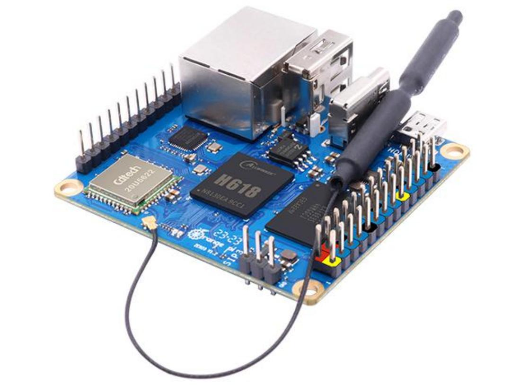

## 目录

- [1. Orange Pi Zero 3 的基本特性](#1-orange-pi-zero-3-的基本特性)
- [1.1. 什么是 Orange Pi Zero 3](#1-1-什么是-orange-pi-zero-3)
- [1.2. Orange Pi Zero 3 的用途](#1-2-orange-pi-zero-3-的用途)
- [1.3. Orange Pi Zero 3 是为谁设计的](#1-3-orange-pi-zero-3-是为谁设计的)
- [1.4. Orange Pi Zero 3 的硬件特性](#1-4-orange-pi-zero-3-的硬件特性)
- [1.5. Orange Pi Zero 3 的顶层视图和底层视图](#1-5-orange-pi-zero-3-的顶层视图和底层视图)
- [1.6. Orange Pi Zero 3 的接口详情图](#1-6-orange-pi-zero-3-的接口详情图)
- [2. 开发板使用介绍](#2-开发板使用介绍)
- [2.1. 准备需要的配件](#2-1-准备需要的配件)
- [2.2. 下载开发板的镜像和相关的资料](#2-2-下载开发板的镜像和相关的资料)
- [2.3. 基于 Windows PC 将 Linux 镜像烧写到 TF 卡的方法](#2-3-基于-windows-pc-将-linux-镜像烧写到-tf-卡的方法)
- [2.3.1. 使用balenaEtcher烧录 Linux 镜像的方法](#2-3-1-使用balenaetcher烧录-linux-镜像的方法)
- [2.3.2. 使用 Win32Diskimager 烧录 Linux 镜像的方法](#2-3-2-使用-win32diskimager-烧录-linux-镜像的方法)
- [2.4. 基于 Ubuntu PC 将 Linux 镜像烧写到 TF 卡的方法](#2-4-基于-ubuntu-pc-将-linux-镜像烧写到-tf-卡的方法)
- [2.5. 烧写 Android 镜像到 TF 卡的方法](#2-5-烧写-android-镜像到-tf-卡的方法)
- [2.6. 板载 SPI F lash 中的微型 linux 系统使用说明](#2-6-板载-spi-f-lash-中的微型-linux-系统使用说明)
- [2.7. 启动香橙派开发板](#2-7-启动香橙派开发板)
- [2.8. 调试串口的使用方法](#2-8-调试串口的使用方法)
- [2.8.1. 调试串口的连接说明](#2-8-1-调试串口的连接说明)
- [2.8.2. Ubuntu平台调试串口的使用方法](#2-8-2-ubuntu平台调试串口的使用方法)
- [2.8.3. Windows平台调试串口的使用方法](#2-8-3-windows平台调试串口的使用方法)
- [2.9. 使用开发板 26pin或 13p in接口中的5v 引脚供电说明](#2-9-使用开发板-26pin或-13p-in接口中的5v-引脚供电说明)
- [2.10. 使用开发板 13pin接口扩展 USB 接口的方法](#2-10-使用开发板-13pin接口扩展-usb-接口的方法)
- [3. Debian/Ubuntu Server和 Xfce 桌面系统使用说明](#3-debian-ubuntu-server和-xfce-桌面系统使用说明)
- [3.1. 已支持的 linux镜像类型和内核版本](#3-1-已支持的-linux镜像类型和内核版本)
- [3.2. linux 内核驱动适配情况](#3-2-linux-内核驱动适配情况)
- [3.3. 本手册 linux命令格式说明](#3-3-本手册-linux命令格式说明)
- [3.4. linux系统登录说明](#3-4-linux系统登录说明)
- [3.4.1. linux 系统默认登录账号和密码](#3-4-1-linux-系统默认登录账号和密码)
- [3.4.2. 设置 linux 系统终端自动登录的方法](#3-4-2-设置-linux-系统终端自动登录的方法)
- [3.4.3. linux 桌面版系统自动登录说明](#3-4-3-linux-桌面版系统自动登录说明)
- [3.4.4. Linux 桌面版系统 root 用户自动登录的设置方法](#3-4-4-linux-桌面版系统-root-用户自动登录的设置方法)
- [3.4.5. Linux 桌面版系统禁用桌面的方法](#3-4-5-linux-桌面版系统禁用桌面的方法)
- [3.5. 板载 LED 灯测试说明](#3-5-板载-led-灯测试说明)
- [3.6. TF 卡中 linux 系统 rootfs 分区容量操作说明](#3-6-tf-卡中-linux-系统-rootfs-分区容量操作说明)
- [3.6.1. 第一次启动会自动扩容 TF 卡中 rootfs 分区的容量](#3-6-1-第一次启动会自动扩容-tf-卡中-rootfs-分区的容量)
- [3.6.2. 禁止自动扩容 TF 卡中 rootfs 分区容量的方法](#3-6-2-禁止自动扩容-tf-卡中-rootfs-分区容量的方法)
- [3.6.3. 手动扩容 TF 卡中 rootfs 分区容量的方法](#3-6-3-手动扩容-tf-卡中-rootfs-分区容量的方法)
- [3.6.4. 缩小 TF 卡中 rootfs 分区容量的方法](#3-6-4-缩小-tf-卡中-rootfs-分区容量的方法)
- [3.7. 网络连接测试](#3-7-网络连接测试)
- [3.7.1. 以太网口测试](#3-7-1-以太网口测试)
- [3.7.2. WIFI 连接测试](#3-7-2-wifi-连接测试)
- [3.7.3. 通过 create_ap 创建 WIFI 热点的方法](#3-7-3-通过-create_ap-创建-wifi-热点的方法)
- [3.7.4. 设置静态 IP 地址的方法](#3-7-4-设置静态-ip-地址的方法)
- [3.7.5. 设置 Linux 系统第一次启动自动连接网络的方法](#3-7-5-设置-linux-系统第一次启动自动连接网络的方法)
- [3.8. SSH 远程登录开发板](#3-8-ssh-远程登录开发板)
- [3.8.1. Ubuntu 下 SSH 远程登录开发板](#3-8-1-ubuntu-下-ssh-远程登录开发板)
- [3.8.2. Windows 下 SSH 远程登录开发板](#3-8-2-windows-下-ssh-远程登录开发板)
- [3.9. HDMI 测试](#3-9-hdmi-测试)
- [3.9.1. HDMI 显示测试](#3-9-1-hdmi-显示测试)
- [3.9.2. HDMI 转 VGA 显示测试](#3-9-2-hdmi-转-vga-显示测试)
- [3.9.3. Linux5.4 系统 HDMI 分辨率设置的方法](#3-9-3-linux5-4-系统-hdmi-分辨率设置的方法)
- [3.9.4. Linux5.4 系统 Framebuffer 宽度和高度的修改方法](#3-9-4-linux5-4-系统-framebuffer-宽度和高度的修改方法)
- [3.9.5. Framebuffer光标设置](#3-9-5-framebuffer光标设置)
- [3.10. 蓝牙使用方法](#3-10-蓝牙使用方法)
- [3.10.1. 桌面版镜像的测试方法](#3-10-1-桌面版镜像的测试方法)
- [3.10.2. 服务器版镜像的使用方法](#3-10-2-服务器版镜像的使用方法)
- [3.11. USB 接口测试](#3-11-usb-接口测试)
- [3.11.1. 连接 USB 鼠标或键盘测试](#3-11-1-连接-usb-鼠标或键盘测试)
- [3.11.2. 连接 USB 存储设备测试](#3-11-2-连接-usb-存储设备测试)
- [3.11.3. USB 以太网卡测试](#3-11-3-usb-以太网卡测试)
- [3.11.4. USB 摄像头测试](#3-11-4-usb-摄像头测试)
- [3.12. 音频测试](#3-12-音频测试)
- [3.12.1. 使用命令行播放音频的方法](#3-12-1-使用命令行播放音频的方法)
- [3.12.2. 在桌面系统中测试音频方法](#3-12-2-在桌面系统中测试音频方法)
- [3.13. 红外接收测试](#3-13-红外接收测试)
- [3.14. 温度传感器](#3-14-温度传感器)
- [3.14.1. linux5.4 系统查看温度的方法](#3-14-1-linux5-4-系统查看温度的方法)
- [3.14.2. linux6.1 系统查看温度的方法](#3-14-2-linux6-1-系统查看温度的方法)
- [3.15. 13 Pin扩展板接口引脚说明](#3-15-13-pin扩展板接口引脚说明)
- [3.16. 26 Pin接口引脚说明](#3-16-26-pin接口引脚说明)
- [3.17. 安装 wiringOP 的方法](#3-17-安装-wiringop-的方法)
- [3.18. 26p in接口 GPIO 、I2C 、UART 、SPI 和 PWM 测试](#3-18-26p-in接口-gpio-i2c-uart-spi-和-pwm-测试)
- [3.18.1. 26pin GPIO 口测试](#3-18-1-26pin-gpio-口测试)
- [3.18.2. 26 pin GPIO 口上下拉电阻的设置方法](#3-18-2-26-pin-gpio-口上下拉电阻的设置方法)
- [3.18.3. 26pin SPI 测试](#3-18-3-26pin-spi-测试)
- [3.18.4. 26pin I2C 测试](#3-18-4-26pin-i2c-测试)
- [3.18.5. 26pin 的 UART 测试](#3-18-5-26pin-的-uart-测试)
- [3.18.6. PWM 的测试方法](#3-18-6-pwm-的测试方法)
- [3.19. wiringOP-Python 的安装使用方法](#3-19-wiringop-python-的安装使用方法)
- [3.19.1. wiringOP-Python 的安装方法](#3-19-1-wiringop-python-的安装方法)
- [3.19.2. 26pin GPIO 口测试](#3-19-2-26pin-gpio-口测试)
- [3.19.3. 26pin SPI 测试](#3-19-3-26pin-spi-测试)
- [3.19.4. 26pin I2C 测试](#3-19-4-26pin-i2c-测试)
- [3.19.5. 26pin 的 UART 测试](#3-19-5-26pin-的-uart-测试)
- [3.20. 硬件看门狗测试](#3-20-硬件看门狗测试)
- [3.21. 查看 H618 芯片的chipid](#3-21-查看-h618-芯片的chipid)
- [3.22. Python相关说明](#3-22-python相关说明)
- [3.22.1. Python源码编译安装的方法](#3-22-1-python源码编译安装的方法)
- [3.22.2. Python更换 pip 源的方法](#3-22-2-python更换-pip-源的方法)
- [3.23. 安装 Docker 的方法](#3-23-安装-docker-的方法)
- [3.24. Home Assistant 的安装方法](#3-24-home-assistant-的安装方法)
- [3.24.1. 通过 docker安装](#3-24-1-通过-docker安装)
- [3.24.2. 通过 python 安装](#3-24-2-通过-python-安装)
- [3.25. OpenCV 的安装方法](#3-25-opencv-的安装方法)
- [3.25.1. 使用 apt 来安装 OpenCV](#3-25-1-使用-apt-来安装-opencv)
- [3.26. 宝塔 Linux面板的安装方法](#3-26-宝塔-linux面板的安装方法)
- [3.27. face_recognition 人脸识别库的安装和测试方法](#3-27-face_recognition-人脸识别库的安装和测试方法)
- [3.27.1. 使用脚本自动安装 face_recognition 的方法](#3-27-1-使用脚本自动安装-face_recognition-的方法)
- [3.27.2. 手动安装 face_recognition 的方法](#3-27-2-手动安装-face_recognition-的方法)
- [3.27.3. face_recognition 的测试方法](#3-27-3-face_recognition-的测试方法)
- [3.28. 设置中文环境以及安装中文输入法](#3-28-设置中文环境以及安装中文输入法)
- [3.28.1. Debian 系统的安装方法](#3-28-1-debian-系统的安装方法)
- [3.28.2. Ubuntu 20.04 系统的安装方法](#3-28-2-ubuntu-20-04-系统的安装方法)
- [3.28.3. Ubuntu 22.04 系统的安装方法](#3-28-3-ubuntu-22-04-系统的安装方法)
- [3.29. 远程登录 Linux 系统桌面的方法](#3-29-远程登录-linux-系统桌面的方法)
- [3.29.1. 使用NoMachine远程登录](#3-29-1-使用nomachine远程登录)
- [3.29.2. 使用VNC 远程登录](#3-29-2-使用vnc-远程登录)
- [3.30. QT 的安装方法](#3-30-qt-的安装方法)
- [3.31. ROS 安装方法](#3-31-ros-安装方法)
- [3.31.1. Ubuntu20.04 安装 ROS 1 Noetic 的方法](#3-31-1-ubuntu20-04-安装-ros-1-noetic-的方法)
- [3.31.2. Ubuntu20.04 安装 ROS 2 Galactic 的方法](#3-31-2-ubuntu20-04-安装-ros-2-galactic-的方法)
- [3.31.3. Ubuntu22.04 安装 ROS 2 Humble 的方法](#3-31-3-ubuntu22-04-安装-ros-2-humble-的方法)
- [3.32. 安装内核头文件的方法](#3-32-安装内核头文件的方法)
- [3.33. Linux 系统支持的部分编程语言测试](#3-33-linux-系统支持的部分编程语言测试)
- [3.33.1. Debian Bullseye 系统](#3-33-1-debian-bullseye-系统)
- [3.33.2. Debian Bookworm 系统](#3-33-2-debian-bookworm-系统)
- [3.33.3. Ubuntu Focal 系统](#3-33-3-ubuntu-focal-系统)
- [3.33.4. Ubuntu Jammy 系统](#3-33-4-ubuntu-jammy-系统)
- [3.34. 上传文件到开发板 Linux 系统中的方法](#3-34-上传文件到开发板-linux-系统中的方法)
- [3.34.1. 在 Ubuntu PC 中上传文件到开发板 Linux 系统中的方法](#3-34-1-在-ubuntu-pc-中上传文件到开发板-linux-系统中的方法)
- [3.34.2. 在 Windows PC 中上传文件到开发板 Linux 系统中的方法](#3-34-2-在-windows-pc-中上传文件到开发板-linux-系统中的方法)
- [3.35. 开关机 logo使用说明](#3-35-开关机-logo使用说明)
- [3.36. 关机和重启开发板的方法](#3-36-关机和重启开发板的方法)
- [4. Linux SDK------orangepi-build 使用说明](#4-linux-sdk-orangepi-build-使用说明)
- [4.1. 编译系统需求](#4-1-编译系统需求)
- [4.2. 获取 linuxsdk 的源码](#4-2-获取-linuxsdk-的源码)
- [4.2.1. 从 github 下载 orangepi-build](#4-2-1-从-github-下载-orangepi-build)
- [4.2.2. 下载交叉编译工具链](#4-2-2-下载交叉编译工具链)
- [4.2.3. orangepi-build 完整目录结构说明](#4-2-3-orangepi-build-完整目录结构说明)
- [4.3. 编译 u-boot](#4-3-编译-u-boot)
- [4.4. 编译 linux 内核](#4-4-编译-linux-内核)
- [4.5. 编译 rootfs](#4-5-编译-rootfs)
- [4.6. 编译 linux镜像](#4-6-编译-linux镜像)
- [5. Android12TV 系统使用说明](#5-android12tv-系统使用说明)
- [5.1. 已支持的 Android 版本](#5-1-已支持的-android-版本)
- [5.2. Android12TV 功能适配情况](#5-2-android12tv-功能适配情况)
- [5.3. 板载 LED 灯显示说明](#5-3-板载-led-灯显示说明)
- [5.4. Android返回上一级界面的方法](#5-4-android返回上一级界面的方法)
- [5.5. ADB 的使用方法](#5-5-adb-的使用方法)
- [5.5.1. 使用网络连接adb 调试](#5-5-1-使用网络连接adb-调试)
- [5.5.2. 使用数据线连接adb 调试](#5-5-2-使用数据线连接adb-调试)
- [5.6. 查看设置 HDMI 显示分辨率的方法](#5-6-查看设置-hdmi-显示分辨率的方法)
- [5.7. HDMI 转 VGA 显示测试](#5-7-hdmi-转-vga-显示测试)
- [5.8. W I-FI 的连接方法](#5-8-w-i-fi-的连接方法)
- [5.9. W I-FI hotspot 的使用方法](#5-9-w-i-fi-hotspot-的使用方法)
- [5.10. 查看以太网口 I P 地址的方法](#5-10-查看以太网口-i-p-地址的方法)
- [5.11. 蓝牙的连接方法](#5-11-蓝牙的连接方法)
- [5.12. USB 摄像头使用方法](#5-12-usb-摄像头使用方法)
- [5.13. Android 系统 ROOT 说明](#5-13-android-系统-root-说明)
- [5.14. 使用 MiracastReceiver将手机屏幕投屏到开发板的方法](#5-14-使用-miracastreceiver将手机屏幕投屏到开发板的方法)
- [5.15. 26p in 接口 GPIO 、UART 、SPI 测试](#5-15-26p-in-接口-gpio-uart-spi-测试)
- [5.15.1. 26pin 的 GPIO 口测试方法](#5-15-1-26pin-的-gpio-口测试方法)
- [5.15.2. 26pin 的 UART 测试方法](#5-15-2-26pin-的-uart-测试方法)
- [5.15.3. 26pin 的 SPI 测试方法](#5-15-3-26pin-的-spi-测试方法)
- [5.15.4. 26pin 的 I2C 测试方法](#5-15-4-26pin-的-i2c-测试方法)
- [6. Android12 源码的编译方法](#6-android12-源码的编译方法)
- [6.1. 下载Android12 的源码](#6-1-下载android12-的源码)
- [6.2. 编译Android12 的源码](#6-2-编译android12-的源码)
- [7. 附录](#7-附录)
- [7.1. 用户手册更新历史](#7-1-用户手册更新历史)
- [7.2. 镜像更新历史](#7-2-镜像更新历史)

## 1. Orange Pi Zero 3 的基本特性

### 1.1. 什么是 Orange Pi Zero 3

香橙派是一款开源的单板卡片电脑，新一代的arm64 开发板，它可以运行Android TV 12、Ubuntu 和 Debian 等操作系统。香橙派开发板（Orange Pi Zero 3）使用全志H618 系统级芯片，同时拥有 1GB 或 1.5GB 或 2GB 或 4GB LPDDR4 内存。

### 1.2. Orange Pi Zero 3 的用途

我们可以用它实现：
- 一台小型的 Linux 桌面计算机
- 一台小型的 Linux 网络服务器
- 安装 Klipper 上位机控制 3D 打印机
- Android TV 电视盒子
当然还有其他更多的功能，依托强大的生态系统以及各式各样的扩展配件，Orange Pi 可以帮助用户轻松实现从创意到原型再到批量生产的交付，是创客、梦想家、业余爱好者的理想创意平台。

### 1.3. Orange Pi Zero 3 是为谁设计的

Orange Pi 开发板不仅仅是一款消费品，同时也是给任何想用技术来进行创作创新的人设计的。它是一款简单、有趣、实用的工具，你可以用它去打造你身边的世界。

### 1.4. Orange Pi Zero 3 的硬件特性

**硬件特性介绍**

| 项目 | 说明 |
| --- | --- |
| CPU | 全志 H618 四核 64 位 1.5GHz 高性能 Cortex-A53 处理器 |
| GPU | Mali G31 MP2 Supports OpenGL ES 1.0/2.0/3.2 、OpenCL 2.0 |
| 内存 | 1GB/1.5GB/2GB/4GB LPDDR4 (与 GPU 共享） |
| 板载存储 | TF 卡插槽、16MB SPI Flash |
| 以太网 | 支持 10/100M/1000M 以太网 |
| WIFI+蓝牙 | • 20U5622 芯片、支持 IEEE 802.11 a/b/g/n/ac 、BT5.0 |
| 视频输出 | • Micro HDMI 2.0a • TV CVBS output, 支持 PAL/NTSC（通过 13pin 扩展板） |
| 音频输出 | • Micro HDMI 输出 • 3.5mm 音频口（通过 13pin 扩展板） |
| 电源 | USB Type C 接口输入 |
| USB 2.0 端口 | 3 个 USB 2.0 HOST（其中两个通过 13pin 扩展板） |
| 26pin 接头 | 带有 I2Cx1 、SPIx1 、UARTx1 以及多个 GPIO 口 |
| 13pin 接头 | 带有 USB 2.0 HOSTx2 、TV-OUT 、LINE OUT 、IR-RX、以及 3 个 GPIO 口 |
| 调试串口 | UART-TX 、UART-RX 以及 GND |
| LED 灯 | 电源指示灯和状态指示灯 |
| 红外接收 | 支持红外遥控器（通过 13pin扩展板） |
| 支持的操作系统 | Android12 TV 、Ubuntu 、Debian 等 |

**外观规格介绍**

| 项目 | 说明 |
| --- | --- |
| PCB 尺寸 | 85mm×56mm |
| 重量 Orange Pi™ 是深圳市迅龙软件有限公司的注册商标 | 30g |

### 1.5. Orange Pi Zero 3 的顶层视图和底层视图

**顶层视图：**

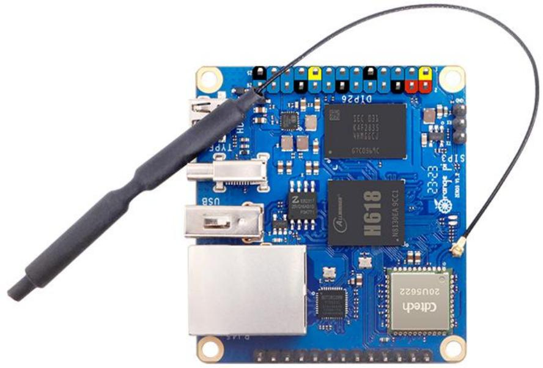
**底层视图：**

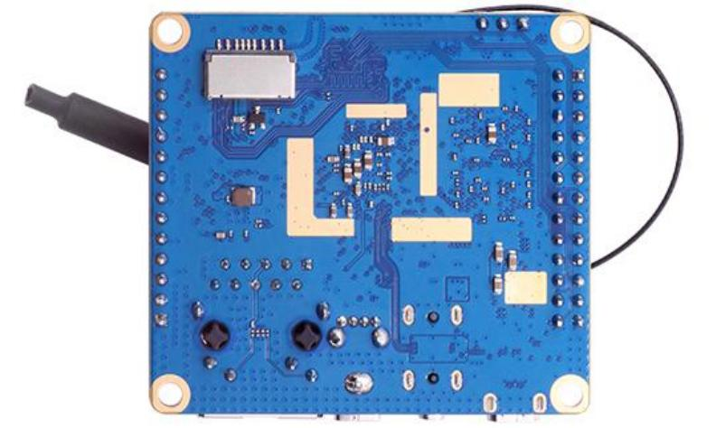

### 1.6. Orange Pi Zero 3 的接口详情图

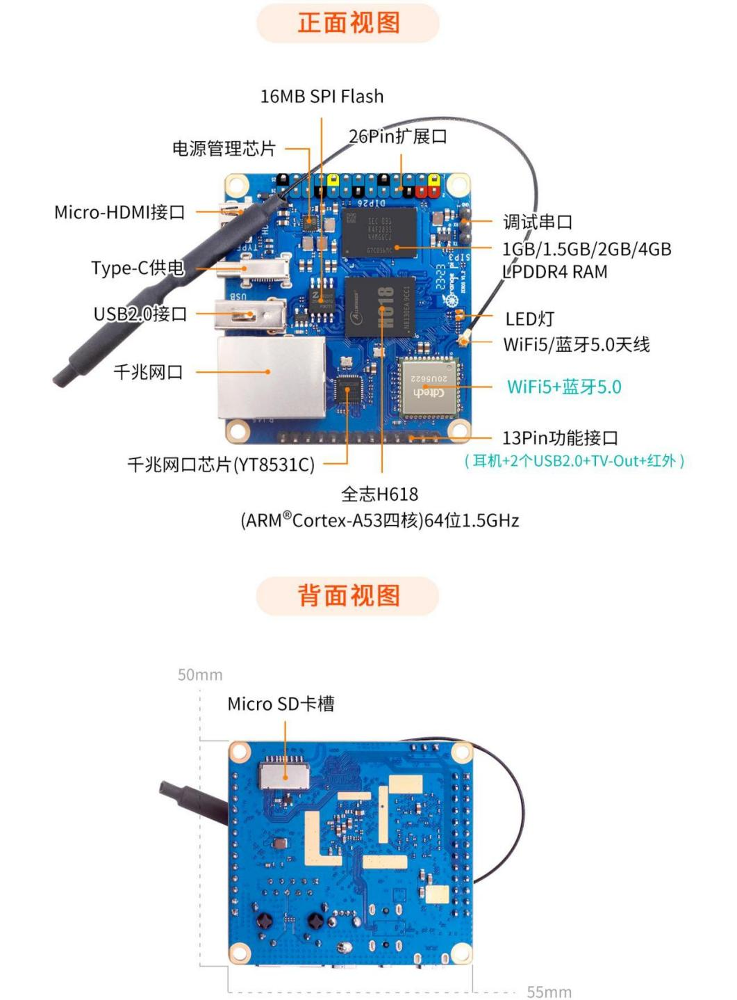

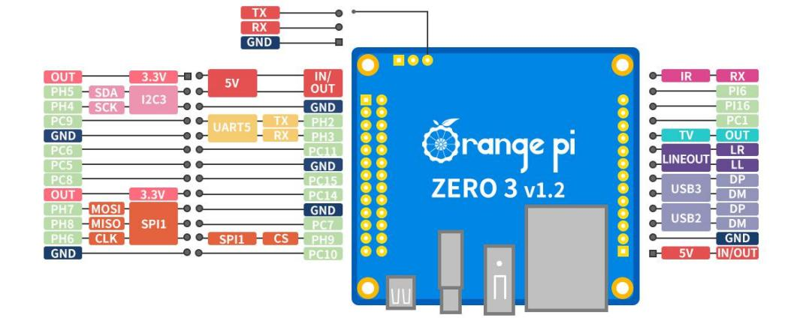
四个定位孔的直径都是 3.0mm。

## 2. 开发板使用介绍

### 2.1. 准备需要的配件

1. TF 卡，最小 8GB 容量的 **class10** 级或以上的高速闪迪卡

使用其他品牌的TF卡（非闪迪的TF卡），如下图所示（包含但不仅限这些卡），已经有朋友反馈系统启动过程中会出现问题，比如系统启动到一半卡住不动，或者reboot命令无法正常使用，最后都是换了闪迪牌的TF卡后才解决的。所以如果您使用的是非闪迪牌的TF卡发现系统启动或者使用过程有问题，请更换闪迪牌的TF卡后再测试。
目前反馈在Orange Pi Zero 3 上启动有问题的部分TF卡
另外，在其他型号的开发板上能正常使用的TF卡并不能保证在Orange Pi Zero 3上也一定能正常启动，这点请特别注意。

2. TF 卡读卡器，用于读写 TF 卡

3. Micro HDMI 转 HDMI 连接线，用于将开发板连接到 HDMI 显示器或者电视进行显示

> 注意，请不要使用下图所示的这种比较宽的Micro HDMI转接头，由于开发板的Micro HDMI接口和Type-C电源接口之间的间距比较小，可能会导致两者无法同时插入到开发板。

4. 电源，如果有 5V/2A 或 5V/3A 的电源头那就只需要准备一根下面左边图片所示的 USB 转 Type C 接口的数据线，另外也可以使用类似下面右边图片所示的线和电源头一体的 5V/2A 或者 5V/3A 的高品质 USB Typc C 接口电源适配器。
5. 13pin 扩展板
a. 扩展板实物如下所示

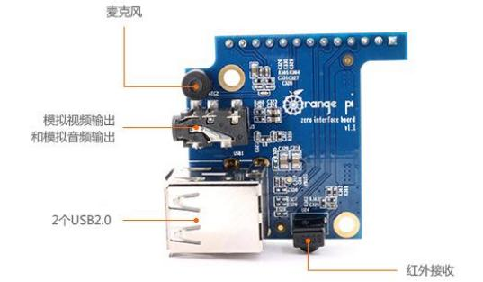
b. 扩展板插入开发板的方式如下所示，切记不要插反了

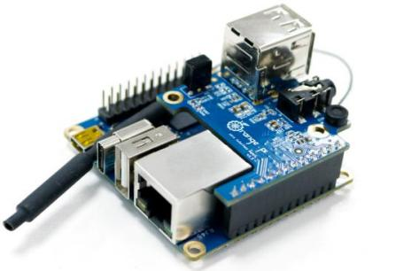
c. Orange Pi Zero 3 开发板上的 13pin 排针可以接上扩展板来扩展开发板上没有的功能，扩展板可以使用的功能有
| 1 | 麦克风（Mic） | 不支持，不支持，不支持！！！ 13pin扩展板是一个通用型号的扩展板，适用于 Orange Pi 多款开发板，但是 Orange Pi Zero3 的 13pin接口是没有 Mic 功能的，所以 13pin 扩展板上虽然有 Mic ，但是在 Orange Pi Zero 3 上是不能用的， 13pin 扩展板在 Orange Pi Zero 3 上主要用来扩展除Mic 以外的其他功能。 |
| --- | --- | --- |
| 2 | 模拟音视频输出接口 | 支持，可用于接耳机播放音乐，或者通过 AV 线接电视输出模拟音视频信号（仅安卓系统）。 |
| 3 | USB 2.0 Host x 2 | 支持，用于接 USB 键盘、鼠标以及 USB 存储设备。 |
| 4 | 红外接收功能 | 支持，通过红外遥控可以控制 Android 系统。 |

d. Orange Pi Zero 3 开发板 13pin 排针的原理图如下所示

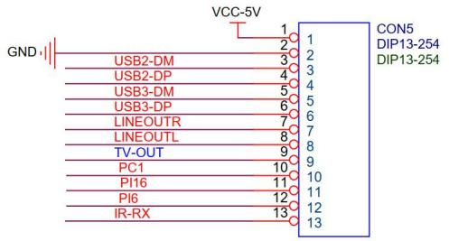
6. USB接口的鼠标和键盘，只要是标准USB接口的鼠标和键盘都可以，鼠标和键盘可以用来控制Orange Pi开发板
7. 红外遥控器，主要用于控制安卓TV系统

> 注意，空调的遥控或者电视机的遥控是无法控制Orange Pi开发板的，默认只有Orange Pi提供的遥控才可以。

8. 百兆或者千兆网线，用于将开发板连接到因特网
9. AV 视频线，如果希望通过 AV 接口而不是 HDMI 接口来显示视频，那么就需要通过 AV 视频线将开发板连接到电视

10) 散热片，如果担心开发板的温度过高，可以加个散热片，散热片贴在 H618 芯片上即可

11. 5V 的散热风扇，如下图所示，开发板的 26pin 和 13pin 接口上都有 5V 和 GND引脚可以接散热风扇，26pin 和 13pin 排针的间距为 **2.54mm** ，散热风扇的电源接口参照这个规格去购买即可。
> 注意，开发板插上电源后5V引脚就可以直接使用，无需其他设置，另外 5V引脚输出的电压是无法通过软件调节和关闭的。

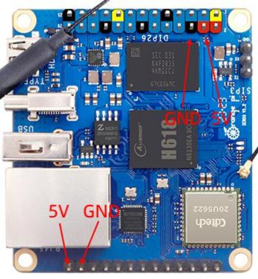
12. 配套外壳**（待添加图片）**
13. USB 转 TTL 模块和杜邦线，使用串口调试功能时，需要 USB 转 TTL 模块和杜邦线来连接开发板和电脑

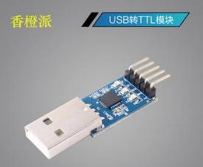

> 注意，开发板使用的TTL电平是 3.3v的，除了上图所示的USB转TTL模块外，其他类似的 3.3v的USB转TTL模块一般也都是可以的。

14. 安装有 Ubuntu 和 Windows 操作系统的 X64 电脑
| 1 | Ubuntu22.04 PC | 可选，用于编译 Android 和 Linux 源码 |
| --- | --- | --- |
| 2 | Windows PC | 用于烧录 Android 和 Linux 镜像 |

### 2.2. 下载开发板的镜像和相关的资料

1. 中文版资料的下载网址为
[http://www.orangepi.cn/html/hardWare/computerAndMicrocontrollers/service-and-](http://www.orangepi.cn/downloadresourcescn/) support/Orange-Pi-Zero-3.html

2. 英文版资料的下载网址为
[http://www.orangepi.org/html/hardWare/computerAndMicrocontrollers/service-and](http://www.orangepi.org/downloadresources/) -support/Orange-Pi-Zero-3.html

3. 资料主要包含
a. **Android 源码**：保存在百度云盘和谷歌网盘上
b. **Linux 源码**：保存在 Github 上
c. **Android 镜像**：保存在百度云盘和谷歌网盘上
d. **Ubuntu 镜像**：保存在百度云盘和谷歌网盘上
e. **Debian 镜像**：保存在百度云盘和谷歌网盘上
f. **用户手册和原理图：**芯片相关的数据手册也会放在这里
g. **官方工具：**主要包括开发板使用过程中需要用到的软件

### 2.3. 基于 Windows PC 将 Linux 镜像烧写到 TF 卡的方法

> 注意，这里说的Linux镜像具体指的是从Orange Pi资料下载页面下载的Debian或者Ubuntu这样的Linux发行版镜像。

#### 2.3.1. 使用 balenaEtcher 烧录 Linux 镜像的方法

1. 首先准备一张 8GB 或更大容量的 TF 卡，TF 卡的传输速度必须为 **class10** 级或**class10** 级以上，建议使用闪迪等品牌的 TF 卡
2. 然后使用读卡器把 TF 卡插入电脑
3. 从 [Orange Pi **的资料下载页面**](http://www.orangepi.cn/html/serviceAndSupport/index.html)下载想要烧录的 Linux 操作系统镜像文件压缩包，然后使用解压软件解压，解压后的文件中，以"**.img** "结尾的文件就是操作系统的镜像文件，大小一般都在 1GB 以上
4. 然后下载 Linux 镜像的烧录软件------**balenaEtcher** ，下载地址为
[https://www.balena.io/etcher/](https://www.balena.io/etcher/)

5. 进入 balenaEtcher 下载页面后，点击绿色的下载按钮会跳到软件下载的地方

6. 然后可以选择下载 balenaEtcher 的 Portable 版本的软件，Portable 版本无需安装，双击打开就可以使用

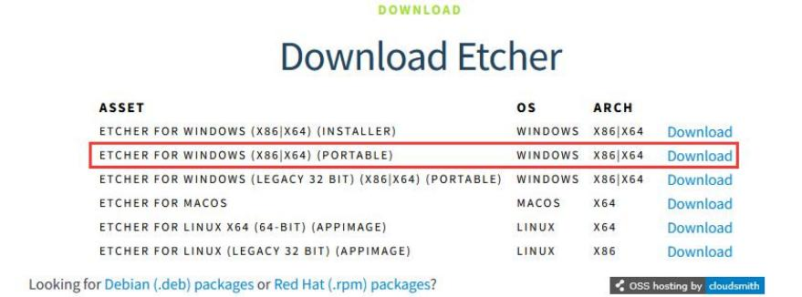
7. 如果下载的是需要安装版本的 balenaEtcher ，请先安装再使用 。如果下载的Portable 版本 balenaEtcher ，直接双击打开即可，打开后的 balenaEtcher 界面如下图所示

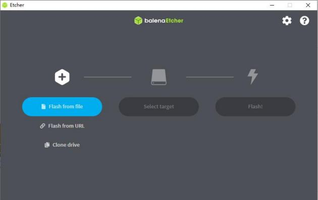

8. 使用balenaEtcher 烧录 Linux 镜像的具体步骤如下所示
a. 首先选择要烧录的 Linux镜像文件的路径
b. 然后选择 TF 卡的盘符
c. 最后点击 Flash 就会开始烧录 Linux 镜像到 TF 卡中

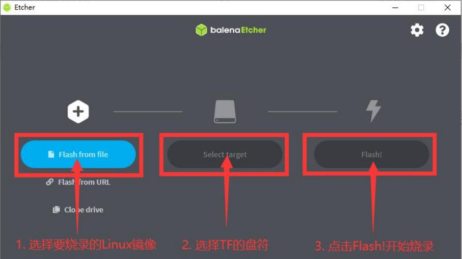
9. balenaEtcher 烧录 Linux 镜像的过程显示的界面如下图所示，另外进度条显示紫色表示正在烧录 Linux镜像到 TF 卡中

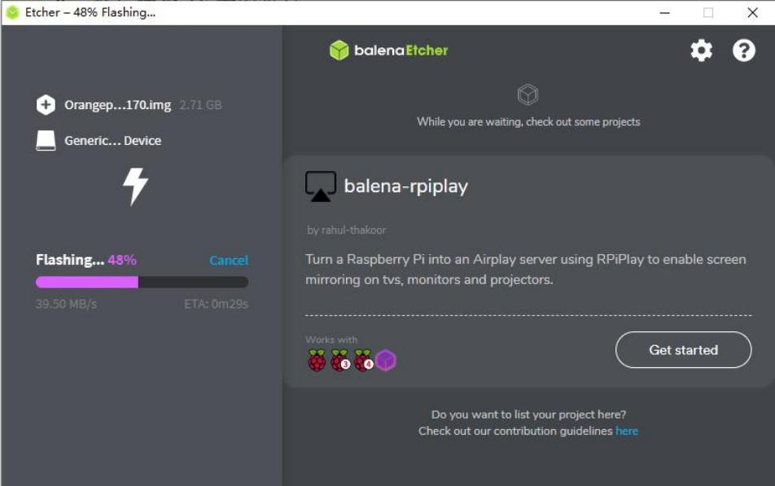
10. Linux 镜像烧录完后，balenaEtcher 默认还会对烧录到 TF 卡中的镜像进行校验，确保烧录过程没有出问题。如下图所示，显示绿色的进度条就表示镜像已经烧录完成，balenaEtcher 正在对烧录完成的镜像进行校验

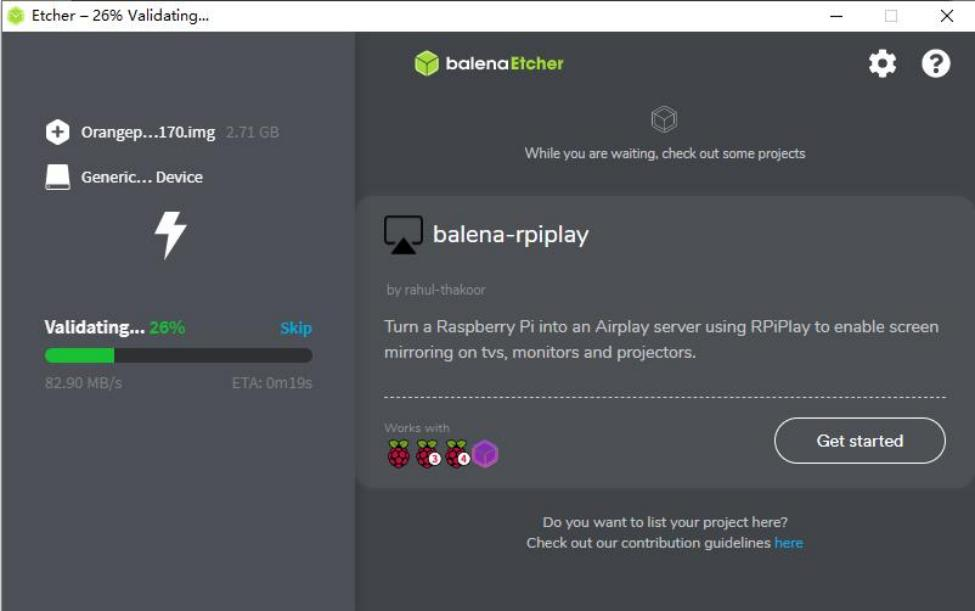
11. 成功烧录完成后balenaEtcher 的显示界面如下图所示，如果显示绿色的指示图标说明镜像烧录成功，此时就可以退出balenaEtcher ，然后拔出TF 卡插入到开发板的TF 卡槽中使用了

#### 2.3.2. 使用 Win32Diskimager 烧录 Linux 镜像的方法

1. 首先准备一张 8GB 或更大容量的 TF 卡，TF 卡的传输速度必须为 **class10** 级或**class10** 级以上，建议使用闪迪等品牌的 TF 卡
2. 然后使用读卡器把 TF 卡插入电脑
3. 接着格式化 TF 卡
a. 可以使用 **SD****Card****Formatter** 这个软件格式化 TF 卡，其下载地址为
[https://www.sdcard.org/downloads/formatter/eula_windows/SDCardFormatterv5_WinEN.zip](https://www.sdcard.org/downloads/formatter/eula_windows/SDCardFormatterv5_WinEN.zip)

b. 下载完后直接解压安装即可，然后打开软件
c. 如果电脑只插入了 TF 卡，则"**Select card** "一栏中会显示 TF 卡的盘符，如果电脑插入了多个 USB 存储设备，可以通过下拉框选择 TF 卡对应的盘符

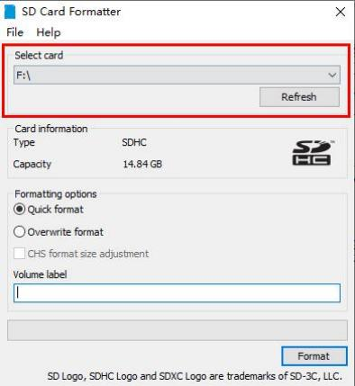
d. 然后点击"**Format** "，格式化前会弹出一个警告框，选择"**是(Y)** "后就会开始格式化

e. 格式化完 TF 卡后会弹出下图所示的信息，点击确定即可

4. 从[Orange Pi的资料下载页面](http://www.orangepi.cn/html/serviceAndSupport/index.html)下载想要烧录的Linux操作系统镜像文件压缩包，然后使用解压软件解压，解压后的文件中，以"**.img** "结尾的文件就是操作系统的镜像文件，大小一般都在 1GB以上
5. 使用 **Win32Diskimager** 烧录 Linux 镜像到 TF 卡
a. Win32Diskimager 的下载页面为
[http://sourceforge.net/projects/win32diskimager/files/Archive/](http://sourceforge.net/projects/win32diskimager/files/Archive/)

b. 下载完后直接安装即可，Win32Diskimager 界面如下所示
a\) 首先选择镜像文件的路径
b\) 然后确认下 TF 卡的盘符和"**设备**"一栏中显示的一致
c\) 最后点击" **写入**" 即可开始烧录

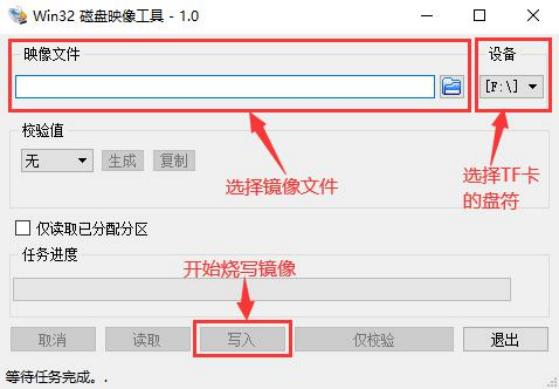
c. 镜像写入完成后，点击"**退出**"按钮退出即可，然后就可以拔出TF 卡插到开发板中启动

### 2.4. 基于 Ubuntu PC 将 Linux 镜像烧写到 TF 卡的方法

> 注意，这里说的Linux镜像具体指的是从Orange Pi资料下载页面下载的Debian或者Ubuntu这样的Linux发行版镜像，Ubuntu PC指的是安装了Ubuntu系统的个人电脑。

1. 首先准备一张 8GB 或更大容量的 TF 卡，TF 卡的传输速度必须为 **class10** 级或**class10** 级以上，建议使用闪迪等品牌的 TF 卡
2. 然后使用读卡器把 TF 卡插入电脑
3. 下载 balenaEtcher 软件，下载地址为
[https://www.balena.io/etcher/](https://www.balena.io/etcher/)

4. 进入 balenaEtcher 下载页面后，点击绿色的下载按钮会跳到软件下载的地方

5. 然后选择下载 Linux版本的软件即可

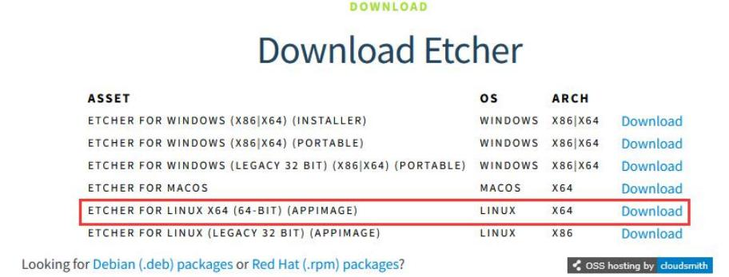
6. 从 [Orange Pi **的资料下载页面**](http://www.orangepi.cn/html/serviceAndSupport/index.html)下载想要烧录的 Linux操作系统镜像文件压缩包，然后使用解压软件解压，解压后的文件中，以"**.img** "结尾的文件就是操作系统的镜像文件，大小一般都在 1GB 以上。7z 结尾的压缩包的解压命令如下所示：
test@test:\~\$ 7z x orangepizero3_1.0.0_ubuntu_focal_desktop_linux6.1.31.7z
test@test:\~\$ ls orangepizero3_1.0.0_ubuntu_focal_desktop_linux6.1.31.\* orangepizero3\_ 1.0.0_ubuntu_focal_desktop_linux6.1.31.7z
orangepizero3_1.0.0_ubuntu_focal_desktop_linux6.1.31.sha #校验和文件orangepizero3_1.0.0_ubuntu_focal_desktop_linux6.1.31.img #镜像文件

7. 解压镜像后可以先用 **sha256sum****-c****\*.sha** 命令计算下校验和是否正确，如果提示**成功**说明下载的镜像没有错，可以放心的烧录到TF 卡，如果提示**校验和不匹配**说明下载的镜像有问题，请尝试重新下载
test@test:\~\$ **sha256sum -c \*.sha**
orangepizero3\_ 1.0.0_ubuntu_focal_desktop_linux6.1.31.img: 成功

8. 然后在 Ubuntu PC 的图形界面双击 **balenaEtcher-1.14.3-x64.AppImage** 即可打开balenaEtcher（**无需安装**），balenaEtcher 打开后的界面显示如下图所示

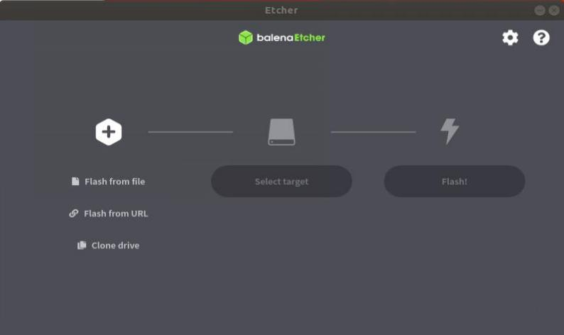
9. 使用balenaEtcher 烧录 Linux 镜像的具体步骤如下所示
a. 首先选择要烧录的 Linux镜像文件的路径
b. 然后选择 TF 卡的盘符
c. 最后点击 Flash 就会开始烧录 Linux 镜像到 TF 卡中

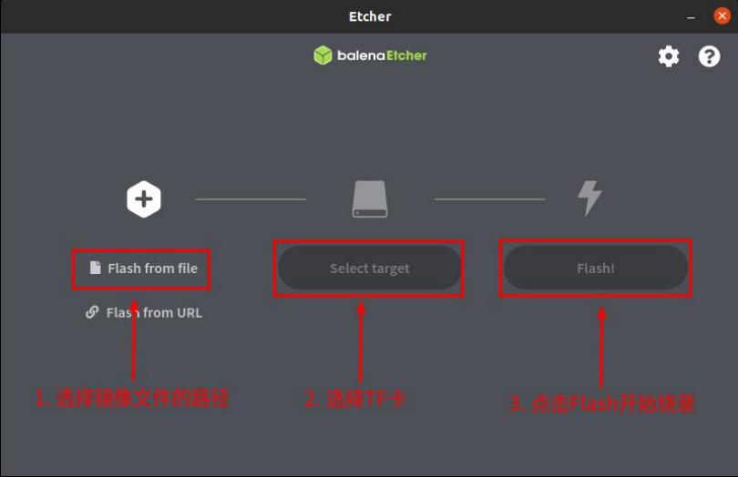
10. balenaEtcher烧录 Linux 镜像的过程显示的界面如下图所示，另外进度条显示紫色表示正在烧录 Linux镜像到 TF 卡中

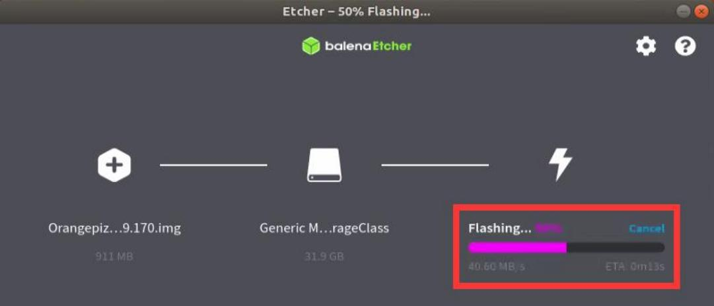
11. Linux 镜像烧录完后，balenaEtcher 默认还会对烧录到 TF 卡中的镜像进行校验，确保烧录过程没有出问题。如下图所示，显示绿色的进度条就表示镜像已经烧录完成，balenaEtcher 正在对烧录完成的镜像进行校验

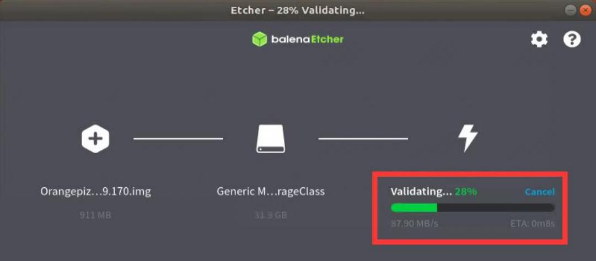
12. 成功烧录完成后balenaEtcher 的显示界面如下图所示，如果显示绿色的指示图标说明镜像烧录成功，此时就可以退出balenaEtcher ，然后拔出TF 卡插入到开发板的 TF 卡槽中使用了

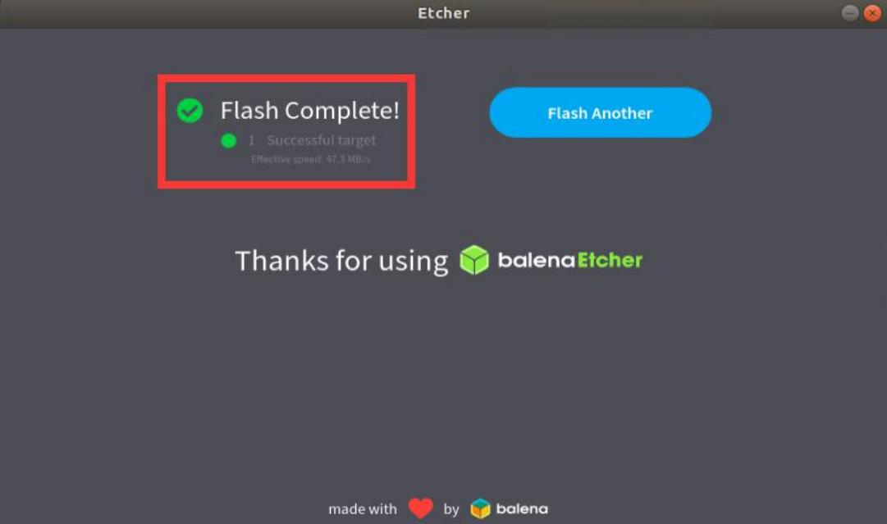

### 2.5. 烧写 Android 镜像到 TF 卡的方法

开发板的 Android 镜像只能在 Windows 平台下使用 PhoenixCard 软件烧录到TF 卡中，PhoenixCard 软件的版本必须为 Phon ixCard-4.2.8。
请不要用烧录 Linux 镜像的软件，如 Win32Diskimager 或者 balenaEtcher 来烧录安卓镜像。
另外 PhoenixCard 这款软件没有 Linux 和 Mac 平台的版本，所以在 Linux 和Mac 平台下是无法烧录安卓镜像到 TF 卡中的。

1. 首先请确保 Windows 系统已经安装了 **Microsoft****Visual C++ 2008 Redistrbutable**
**- x86**

2. 如果没有安装 **Microsoft****Visual****C++****2008****Redistrbutable****-****x86**
, 使用**PhoenixCard** 格式化 TF 卡或者烧录 Android 镜像会提示下面的错误

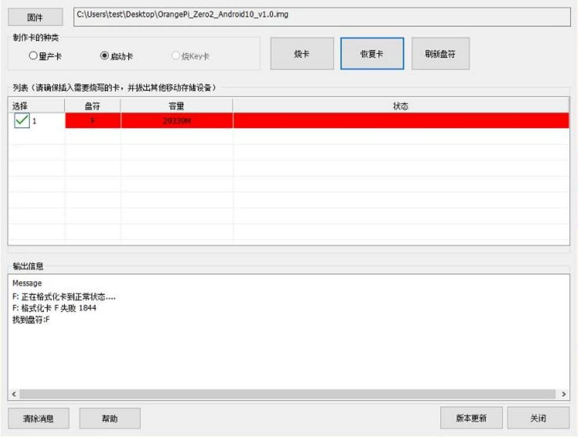
3. **Microsoft****Visual****C++****2008****Redistrbutable****-****x86** 的安装包可以从 Orange Pi Zero 3的[**官方工具**](http://www.orangepi.cn/html/serviceAndSupport/index.html)中下载到，也可以去[**微软官网**](https://www.microsoft.com/zh-cn/download/details.aspx?id=26368)下载
4. 然后准备一张 8GB 或更大容量的 TF 卡，TF 卡的传输速度必须为 **class10** 级或**class10** 级以上，建议使用闪迪等品牌的 TF 卡
5. 然后使用读卡器把 TF 卡插入电脑
6. 从 [Orange Pi **的资料下载页面**](http://www.orangepi.cn/html/serviceAndSupport/index.html)下载 Android 镜像和 PhoenixCard 烧写工具，请确保 PhonenixCrad 工具的版本为 Phon ixCard-4.2.8，请不要用低于 4.2.8 版本的
Phon ixCard 软件来烧录 Android **镜像，**低于这个版本的 Phon ixCard 工具烧写的Android 镜像可能会有问题

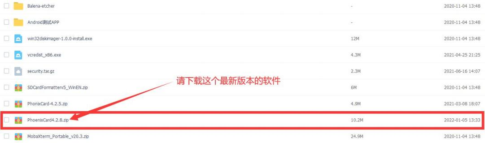
7. 然后使用解压软件解压下载的Android 镜像的压缩包，解压后的文件中，以"**.img** "结尾的文件就是 Android 镜像文件，大小在 1GB 以上。如果不知道怎么解压Android镜像的压缩包，可以安装一个[360 压缩软件](https://yasuo.360.cn/)来解压镜像。

8. 然后使用解压软件解压 [**PhonixCard4.2.8.zip**](PhonixCard4.2.8.zip)，此软件无需安装，在解压后的文件夹中找到 PhoenixCard 打开即可

9. 打开 PhoenixCard 后，如果 TF 卡识别正常，会在中间的列表中显示 TF 卡的盘符和容量，**请务必确认显示的盘符和你想烧录的TF 卡的盘符是一致的**，如果没有显示可以尝试拔插下 TF 卡，或者点击 PhoenixCard 中的"**刷新盘符** "按钮

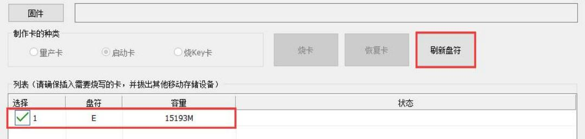
10. 确认完盘符后，先格式化 TF 卡，点击 PhoenixCard 中"**恢复卡** "按钮即可（如果"**恢复卡** "按钮为灰色的无法按下，可以先点击下"**刷新盘符** "按钮）

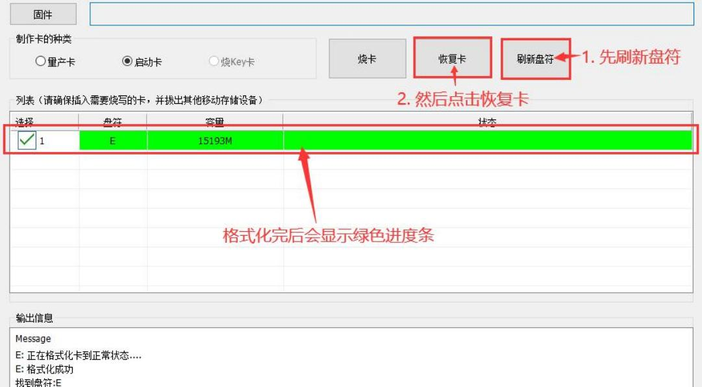
如果格式化有问题，请尝试拔插下 TF 卡后再测试，如果重新拔插 TF 卡后还是有问题，可以重启下Window 电脑或者换一台电脑再试下。

11. 然后开始将 Android 镜像写入 TF 卡
a. 首先在" **固件** "一栏中选择 Android 镜像的路径
b. 在"**制作卡的种类** "中选择"**启动卡** "
c. 然后点击"**烧卡** "按钮就会开始烧录

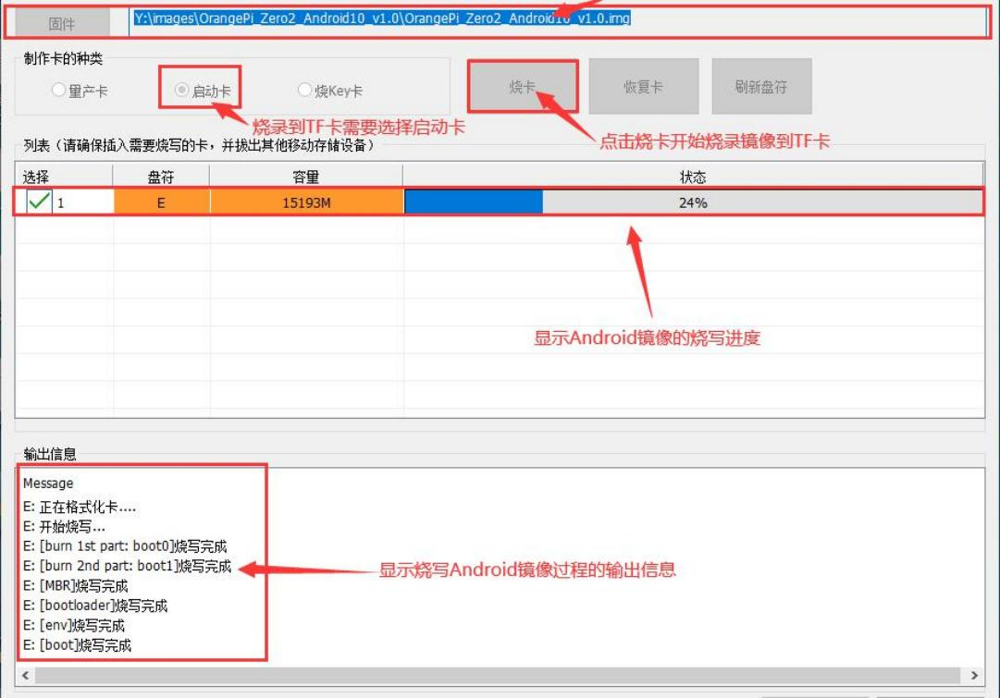
12. 烧录完后 PhoenixCard 的显示如下图所示，此时点击"**关闭** "按钮即可退出PhoenixCard ，然后就可以把 TF 卡从电脑中拔出来插到开发板中启动了

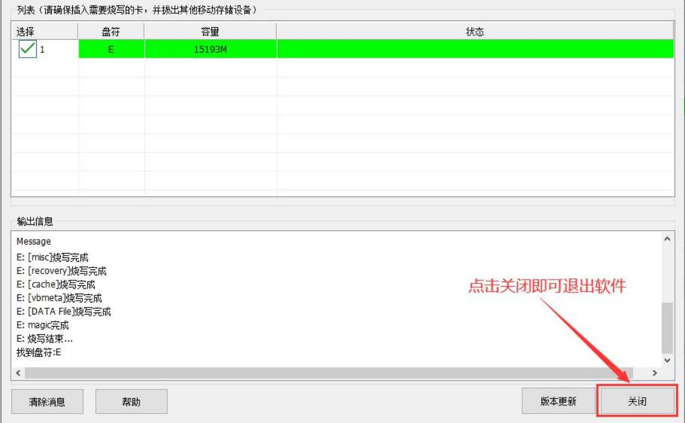
-----------------------------------------------------------------------------------------------------------------------------------------------------

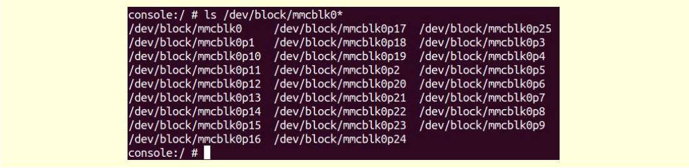
-----------------------------------------------------------------------------------------------------------------------------------------------------

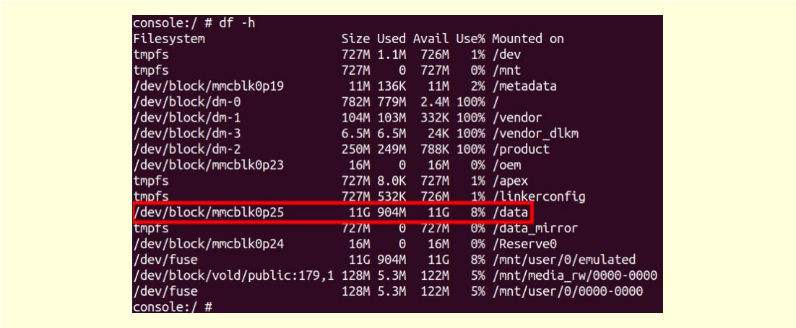

### 2.6. 板载 SPI Flash 中的微型 linux 系统使用说明

开发板上有一个 16MB 大小的 SPI Flash ，其所在位置如下图所示：

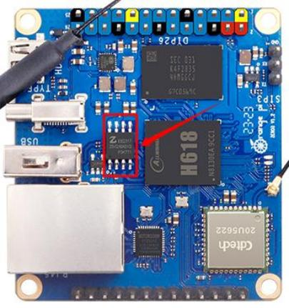
SPI Flash 中默认烧录有一个微型的 linux 系统，此系统主要用于证明开发板是能正常启动的。当拿到开发板后，不用烧录系统到 TF 卡中，只需要给开发板接上Type-C 电源就能启动 SPI Flash 中的微型 linux 系统。此系统的主要功能有：
a\) u-boot 启动阶段会点亮红色的 led 灯，进入内核后，会关闭红色的 led 灯并设置绿色的 led 灯闪烁；
b\) 如果开发板接了HDMI 屏幕，系统启动完成后，在 HDMI 屏幕中能看到微型linux 系统的命令行界面；
c\) 如果开发板接了USB 键盘，在命令行中能运行一些简单的 linux命令，如 ls， cd 等。
由于 SPI Flash 中微型的linux 系统功能有限，所以如果想正常使用开发板的所有功能，请烧录 linux镜像或者安卓镜像烧录到 TF 卡中，然后再使用。

### 2.7. 启动香橙派开发板

1. 将烧录好镜像的 TF 卡插入香橙派开发板的 TF 卡插槽中
2. 开发板有 Micro HDMI 接口，可以通过 Micro HDMI 转 HDMI 连接线把开发板连接到电视或者 HDMI 显示器
3. 如果购买了 13pin 的扩展板，可以将 13pin 的扩展板插到开发板的 13pin 接口中
4. 接上 USB 鼠标和键盘，用于控制香橙派开发板
5. 开发板有以太网口，可以插入网线用来上网
6. 连接一个 5V/2A（5V/3A 的也可以）的 USB Type C 接口的**高品质**的电源适配
切记不要插入电压输出大于 5V 的电源适配器，会烧坏开发板。
系统上电启动过程中很多不稳定的现象基本都是供电有问题导致的，所以一个靠谱的电源适配器很重要。如果启动过程中发现有不断重启的现象，请更换下电源或者 Type C 数据线再试下。

7. 然后打开电源适配器的开关，如果一切正常，此时 HDMI 显示器就能看到系统的启动画面了
8. 如果想通过调试串口查看系统的输出信息，请使用串口线将开发板连接到电脑，串口的连接方法请参看[**调试串口的使用方法**](#调试串口的使用方法)一节

### 2.8. 调试串口的使用方法

#### 2.8.1. 调试串口的连接说明

1. 首先需要准备一个 **3.3v** 的 USB 转 TTL 模块，然后将 USB 转 TTL 模块的 USB接口一端插入到电脑的 USB 接口中

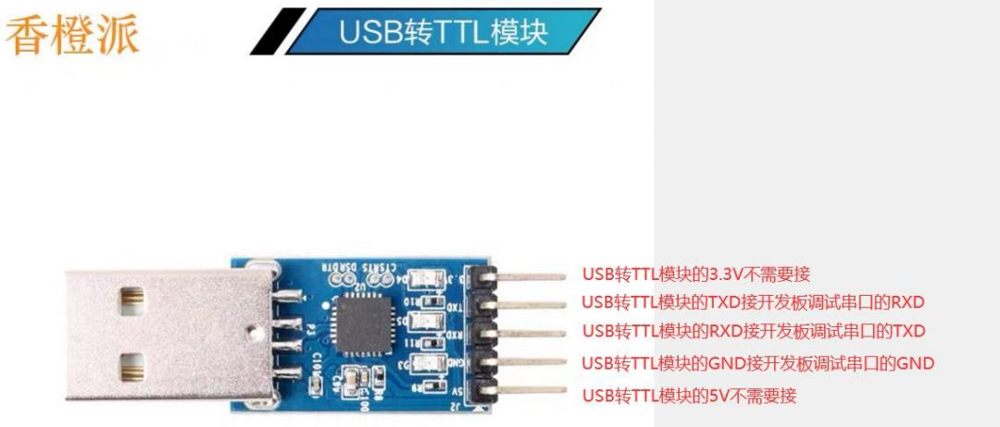
2. 开发板的调试串口 GND 、TX 和 RX 引脚的对应关系如下图所示

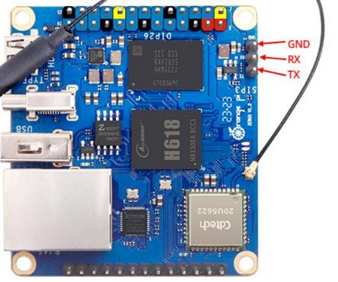
3. USB 转 TTL 模块 GND 、TX 和 RX 引脚需要通过杜邦线连接到开发板的调试串口上
a. USB 转 TTL 模块的 GND 接到开发板的 GND 上
b. USB 转 TTL 模块的 **RX 接到开发板的TX 上**
c. USB 转 TTL 模块的 **TX 接到开发板的RX 上**
4. USB 转 TTL 模块连接电脑和 Orange Pi 开发板的示意图如下所示

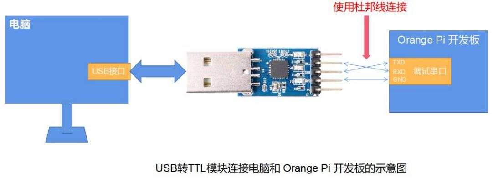
串口的 TX 和 RX 是需要交叉连接的，如果不想仔细区分 TX 和 RX 的顺序，可以把串口的TX 和 RX 先随便接上，如果测试串口没有输出再交换下TX 和 RX 的顺序，这样就总有一种顺序是对的。

#### 2.8.2. Ubuntu 平台调试串口的使用方法

Linux 下可以使用的串口调试软件有很多，如 putty 、minicom 等，下面演示下putty 的使用方法。

1. 首先将 USB 转 TTL 模块插入 Ubuntu 电脑的 USB 接口，如果 USB 转 TTL 模块连接识别正常，在 Ubuntu PC 的**/dev** 下就可以看到对应的设备节点名，记住这个节点名，后面设置串口软件时会用到
test@test:\~\$ **ls /dev/ttyUSB\* /dev/ttyUSB0**

2. 然后使用下面的命令在 Ubuntu PC 上安装下 putty
test@test:\~\$ sudo apt update
test@test:\~\$ sudo apt install -y putty

3. 然后运行 putty ，记得加 sudo 权限
test@test:\~\$ sudo putty

4. 执行 putty 命令后会弹出下面的界面

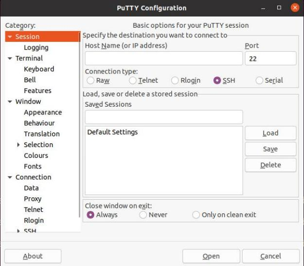
5. 首先选择串口的设置界面

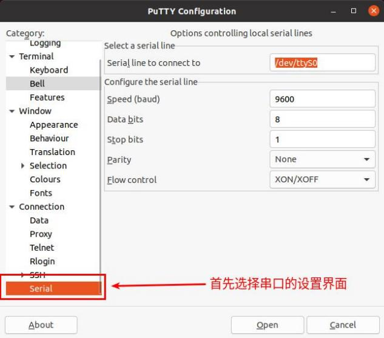
6. 然后设置串口的参数
a. 设置 **Serial line to connect to** 为**/dev/ttyUSB0**（修改为对应的节点名，一般为**/dev/ttyUSB0**）
b. 设置 **Speed(baud)**为 **115200**（串口的波特率）
c. 设置 **Flow****control** 为 **None**

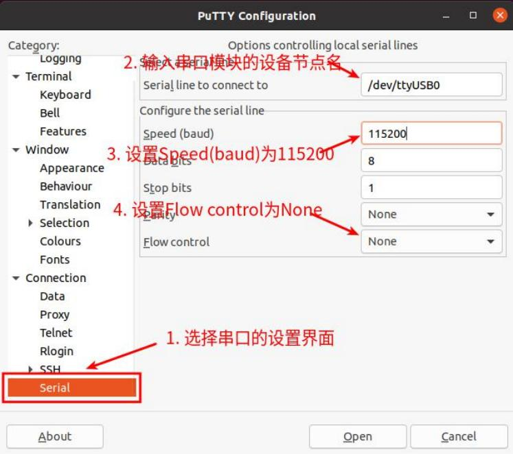
7. 在串口的设置界面设置完后，再回到 Session 界面a. 首先选择 **Connection****type** 为 **Serial**
b. 然后点击 **Open** 按钮连接串口

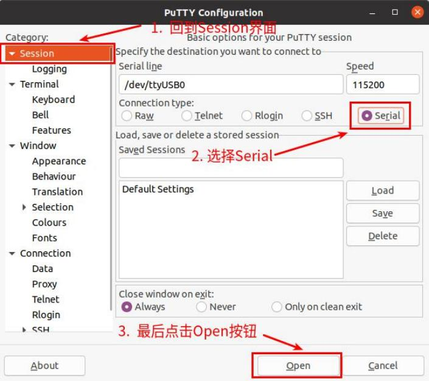
8. 然后启动开发板，就能从打开的串口终端中看到系统输出的 Log 信息了

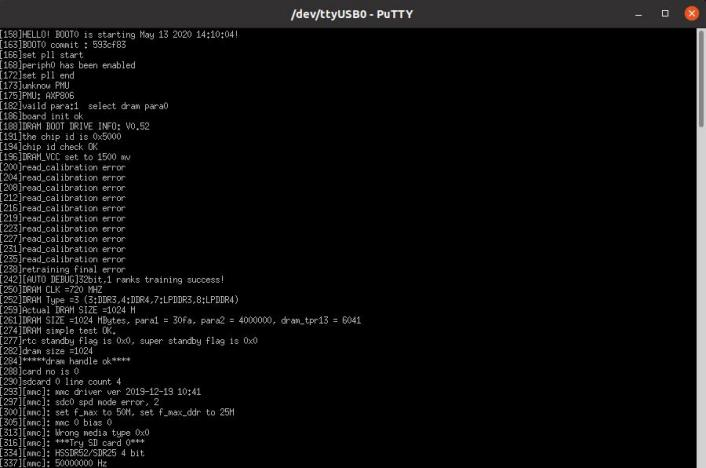

#### 2.8.3. Windows 平台调试串口的使用方法

Windows 下可以使用的串口调试软件有很多，如 SecureCRT、MobaXterm 等，下面演示 MobaXterm 的使用方法，这款软件有免费版本，无需购买序列号即可使用。

1. 下载 MobaXterm
a. 下载 MobaXterm 网址如下
[https://mobaxterm.mobatek.net/](https://mobaxterm.mobatek.net/)

b. 进入 MobaXterm 下载网页后点击 **GET****XOBATERM****NOW!**

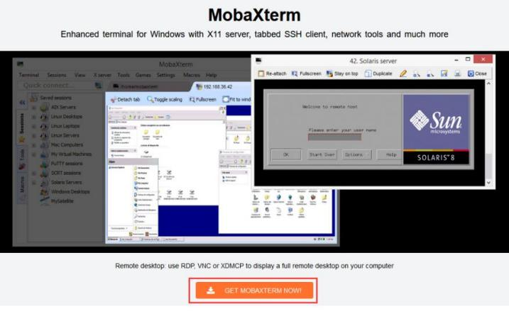
c. 然后选择下载 Home版本

d. 然后选择 Portable便携式版本，下载完后无需安装，直接打开就可以使用

2. 下载完后使用解压缩软件解压下载的压缩包，即可得到MobaXterm 的可执软件，然后双击打开

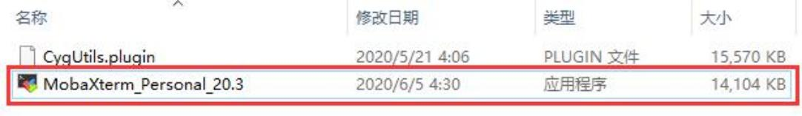
3. 打开软件后，设置串口连接的步骤如下
a. 打开会话的设置界面
b. 选择串口类型
c. 选择串口的端口号（根据实际的情况选择对应的端口号），如果看不到端口号，请使用[**360 驱动大师**](http://weishi.360.cn/qudongdashi/)扫描安装 USB 转 TTL 串口芯片的驱动
d. 选择串口的波特率为 **115200**
e. 最后点击"**OK** "按钮完成设置

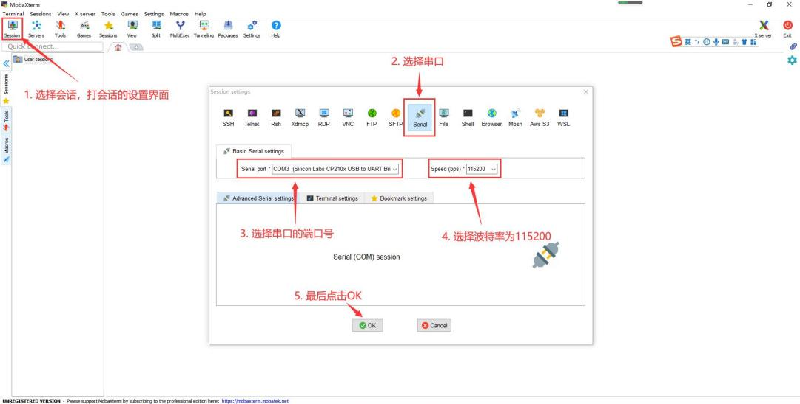
4. 点击"**OK** "按钮后会进入下面的界面，此时启动开发板就能看到串口的输出信息了

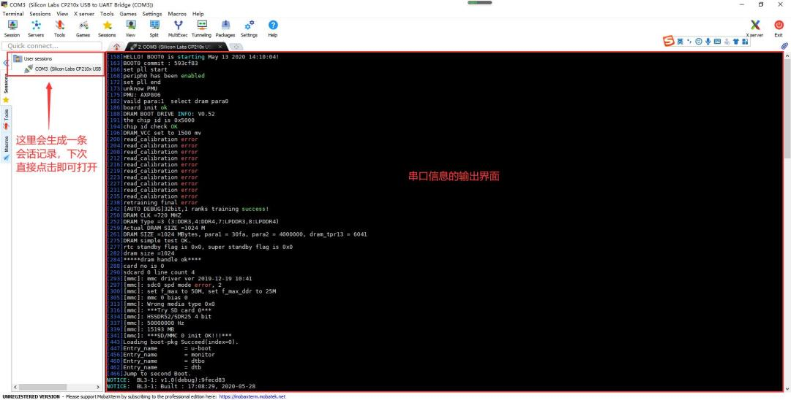

### 2.9. 使用开发板 26pin 或 13pin 接口中的 5v 引脚供电说明

我们推荐的开发板的供电方式是使用5V/2A 或者 5V/3A 的 Type C 接口的电源线插到开发板的 Type C 电源接口来供电的。如果需要使用 26pin 或者 13pin接口中的 5V 引脚来给开发板供电，请确保使用的电源线能满足开发板的供电需求。如果有使用不稳定的情况，请换回 Type C 电源供电。

1. 首先需要准备一根下图所示的电源线

上图所示的电源线在淘宝可以买到，请自行搜索购买。

2. 使用 26pin 或者 13pin 接口中的 5V 引脚来给开发板供电，电源线的接法如下所示
a. 上图所示的电源线 USB A 口需要插到 5V/2A 或者 5V/3A 的电源适配器接头上（不建议插到电脑的 USB 接口来供电，如果开发板接的外设过多，使用会不稳定）
b. 红色的杜邦线需要插到开发板 26pin 或者 13pin 接口的 5V 引脚上
c. 黑色的杜邦线需要插到 26pin 或者 13pin 接口的 GND 引脚上
d. 26pin 和 13pin 接口 5V 引脚和 GND 引脚在开发板中的位置如下图所示，**切记不要接反了**

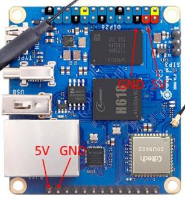

### 2.10. 使用开发板 13pin 接口扩展 USB 接口的方法

1. 如果有购买 Orange Pi 的 13pin 扩展板，将扩展板插入开发板的 13pin 接口中，就可以扩展 2 个 USB 接口

2. 如果没有 13pin 扩展板，可以使用 4pin 2.54mm 杜邦转 USB2.0 母头的线来扩展USB 接口，具体方法如下所示：
a. 首先需要准备一根 4pin 2.54mm 杜邦转 USB2.0 母头的线（这种线在淘宝可以买到，请自行搜索购买），如下图所示：
b. 13pin 接口的原理图如下所示

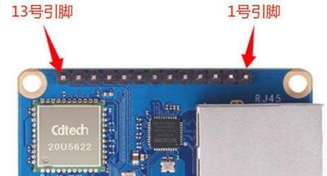
c. USB2 的接线如下所示

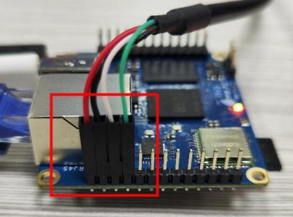
d. USB3 的接线如下所示

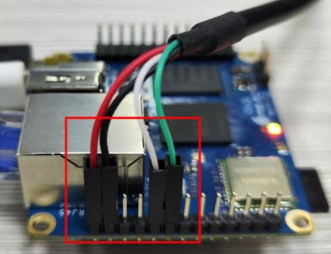
e. 如果需要在 13pin 接口上同时接两个 USB 设备，会发现 13pin 接口上的 5V和 GND 引脚不够用，此时其中一个 USB 设备可以使用 26pin接口中的 5V和 GND 引脚，位置如下图所示：

## 3. Debian/Ubuntu Server 和 Xfce 桌面系统使用说明

### 3.1. 已支持的 linux 镜像类型和内核版本

| Linux 镜像类型 | 内核版本 | 服务器版 | 桌面版 |
| --- | --- | --- | --- |
| Ubuntu 20.04 - Focal | Linux5.4 | 支持 | 支持 |
| Ubuntu 22.04 - Jammy | Linux5.4 | 支持 | 支持 |
| Debian 11 - Bullseye | Linux5.4 | 支持 | 支持 |
| Ubuntu 22.04 - Jammy | Linux6.1 | 支持 | 支持 |
| Debian 11 - Bullseye | Linux6.1 | 支持 | 支持 |
| Debian 12 - Bookworm | Linux6.1 | 支持 | 支持 |

在 [**Orange Pi 的资料下载页面**](http://www.orangepi.cn/html/serviceAndSupport/index.html)进入对应开发板的下载页面后可以看到下面的下载选项，在下文的描述中，Ubuntu 镜像和 Debian 镜像一般统称为 **Linux 镜像**。

Linux 镜像的命名规则为：
开发板型号_版本号_Linux 发行版类型_发行版代号_服务器或桌面\_ 内核版本

a. **开发板的型号**：都是 **orangepizero3**。不同开发板的型号名一般都是不同的，烧录镜像前，请确保所选择镜像的这个型号名和开发板是匹配的。
b. **版本号**：如 **1.x.x** ，这个版本号会随着镜像功能的更新而递增，另外开发板Linux镜像的版本号最后一个数字都是偶数。
c. **Linux 发行版的类型**：目前支持**Ubuntu**和**Debian。**由于Ubuntu源自Debian，所以两个系统在使用上来说总体区别不大。但部分软件的默认配置和命令的使用上还是有些许区别的，另外 Ubuntu和 Debian 都各自有维护所支持的软件仓库，在支持的可安装的软件包上也是有些许差异的。这些需要亲自去使用体验才会有比较深刻的认识。有关更多的细节，可以参考下 Ubuntu 和Debian 官方提供的文档。
d. **发行版代号**：用来区分 Ubuntu 或者 Debian 这样具体的 Linux 发行版的不同版本。其中 **focal** 和 **jammy** 都是 Ubuntu 发行版，focal 表示 Ubuntu20.04，
jammy 表示 Ubuntu22.04 ，不同版本的最大的区别是新版本的 Ubuntu 系统维护的软件仓库的中的软件很多都比旧版本的 Ubuntu 系统中的要新，比如Python 和 GCC 编译工具链等。**bullseye** 是 Debian 的具体版本代号，**bullseye**表示 Debian11 ，**bookworm** 表示 Debian12。
e. **服务器或桌面**：用来表示系统是否带桌面环境，如果为 **server** 就表示系统没有安装桌面环境，镜像占用的存储空间和资源比较小，主要使用命令行来操作控制系统。如果为 **desktop_xfce** 就表示系统默认安装有 XFCE 桌面环境，镜像占用的存储空间和资源比较大，可以接显示器和鼠标键盘通过界面来操作系统。当然 desktop 版本的系统也可以像 server 版本的系统一样通过命令行来操作。
f. **内核版本**：用来表示 linux 内核的版本号， 目前支持 **linux5.4** 和 **linux6.1**。

### 3.2. linux 内核驱动适配情况

| 功能 | Linux5.4 | Linux6.1 |
| --- | --- | --- |
| HDMI 视频 | OK | OK |
| HDMI 音频 | OK | OK |
| USB2.0 x 3 | OK | OK |
| TF 卡启动 | OK | OK |
| 千兆网卡 | OK | OK |
| 红外接收 | OK | OK |
| WIFI | OK | OK |
| 蓝牙 | OK | OK |
| 耳机音频 | OK | OK |
| USB 摄像头 | OK | OK |
| LED 灯 | OK | OK |
| 26pin GPIO | OK | OK |
| 26pin I2C | OK | OK |
| 26pin SPI1 | OK | OK |
| 26pin UART | OK | OK |
| PWM | OK | OK |
| 温度传感器 | OK | OK |
| 硬件看门狗 | OK | OK |
| Mali GPU | NO | NO |

| 项目 | 功能 | 引脚 |
| --- | --- | --- |
| 视频编解码 | NO | NO |
| TV-OUT | NO | NO |

### 3.3. 本手册 linux 命令格式说明

1. 本手册中所有需要在 Linux 系统中输入的命令都会使用下面的方框框起来
如下所示，黄色方框里内容表示需要特别注意的内容，这里面的命令除外。
-----------------------------------------------------------------------
-----------------------------------------------------------------------
2. 命令前面的提示符类型说明
a. 命令前面提示符指的是下面方框内红色部分的内容，这部分内容不是linux命令的一部分，所以在 linux 系统中输入命令时，请不要把红色字体部分的内容也输入进去。
orangepi@orangepi:\~\$ sudo apt update root@orangepi:\~# vim /boot/boot.cmd test@test:\~\$ ssh [root@192.168.1.](mailto:root@192.168.1.36)xxx
root@test:\~# ls

b. **root@orangepi:\~\$** 提示符表示这个命令是在开发板的 linux 系统中输入的，提示符最后的 **\$** 表示系统当前用户为普通用户，当执行特权命令时，需要加上 **sudo**
c. **root@orangepi:\~#** 提示符表示这个命令是在开发板的 linux 系统中输入的，提示符最后的 **\#** 表示系统当前用户为 root 用户，可以执行任何想要执行的命令
d. **test@test:\~\$** 提示符表示这个命令是在 Ubuntu PC 或者 Ubuntu 虚拟机中输入的，而不是开发板的linux 系统中。提示符最后的 **\$** 表示系统当前用户为普通用户，当执行特权命令时，需要加上 **sudo**
e. **root@test:\~#** 提示符表示这个命令是在 Ubuntu PC 或者 Ubuntu 虚拟机中输入的，而不是开发板的linux 系统中。提示符最后的 **\#** 表示系统当前用户为 root 用户，可以执行任何想要执行的命令
3. 哪些是需要输入的命令？
a. 如下所示，**黑色加粗部分**是需要输入的命令，命令下面的是输出的内容（有些命令有输出，有些可能没有输出），这部分内容是不需要输入的
root@orangepi:\~# cat /boot/orangepiEnv.txt verbosity=7
bootlogo=false
console=serial

b. 如下所示，有些命令一行写不下会放到下一行，只要黑色加粗的部分就都是
需要输入的命令。当这些命令输入到一行的时候，每行最后的"**\\** "是需要去掉的，这个不是命令的一部分。另外命令的不同部分都是有空格的，请别
漏了
| orangepi@orangepi:\~\$ echo \\ \"deb \[arch=\$(dpkg \--print-architecture) \\ signed-by=/usr/share/keyrings/docker-archive-keyring.gpg\] \\ <https://download.docker.com/linux/debian \\  |  |
| --- | --- |
| **\$(lsb_release -cs) stable\" \ | sudo tee /etc/apt/sources.list.d/docker.list \ /dev/null** |

### 3.4. linux 系统登录说明

#### 3.4.1. linux 系统默认登录账号和密码

| 账号 | 密码 |
| --- | --- |
| root | orangepi |
| orangepi | orangepi |

> 注意，输入密码的时候，屏幕上是不会显示输入的密码的具体内容的，请不要以为是有什么故障，输入完后直接回车即可。

当输入密码提示错误，或者 ssh 连接有问题，请注意，只要使用的是 Orange Pi提供的 Linux镜像，就请不要怀疑上面的密码不对，而是要找其它的原因。

#### 3.4.2. 设置 linux 系统终端自动登录的方法

1. linux 系统默认就是自动登录终端的，默认登录的用户名是 **orangepi**

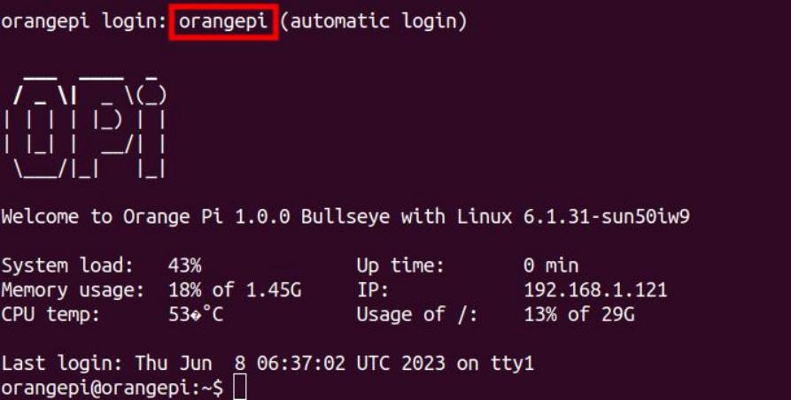
2. 使用下面的命令可以设置 root 用户自动登录终端
orangepi@orangepi:\~\$ sudo auto_login_cli.sh root

3. 使用下面的命令可以禁止自动登录终端
orangepi@orangepi:\~\$ sudo [auto_login_cli.sh -d](auto_login_cli.sh-d)

4. 使用下面的命令可以再次设置 orangepi 用户自动登录终端
orangepi@orangepi:\~\$ sudo auto_login_cli.sh orangepi

#### 3.4.3. linux 桌面版系统自动登录说明

1. 桌面版系统启动后会自动登录进入桌面，无需输入密码

2. 运行下面的命令可以禁止桌面版系统自动登录桌面
orangepi@orangepi:\~\$ [sudo disable_desktop_autologin.sh](sudodisable_desktop_autologin.sh)

3. 然后重启系统就会出现登录对话框，此时需要输入[**密码**](#密码)才能进入系统

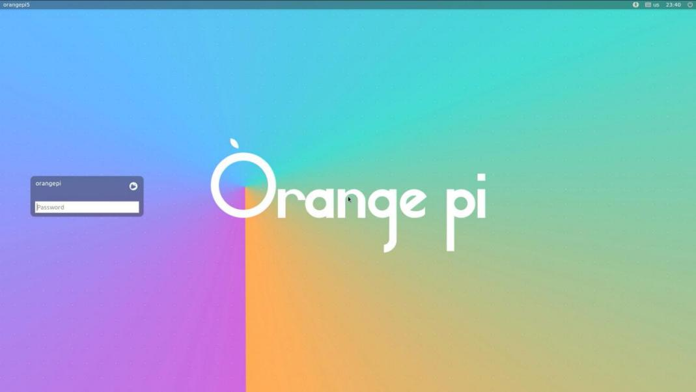

#### 3.4.4. Linux 桌面版系统 root 用户自动登录的设置方法

1. 执行下面的命令可以设置桌面版系统使用 root 用户自动登录
orangepi@orangepi:\~\$ sudo desktop_login.sh root

2. 然后重启系统，就会自动使用 root 用户登录桌面了

> 注意，如果使用root 用户登录桌面系统，是无法使用右上角的 pulseaudio 来管理音频设备的。
另外请注意这并不是一个 bug ，因为 pulseaudio 本来就不允许在 root 用户下运行。

3. 执行下面的命令可以再次设置桌面版系统使用 orangepi 用户自动登录
orangepi@orangepi:\~\$ sudo desktop_login.sh orangepi

#### 3.4.5. Linux 桌面版系统禁用桌面的方法

1. 首先在命令行中输入下面的命令，请记得加 sudo 权限
orangepi@orangepi:\~\$ sudo systemctl disable lightdm.service

2. 然后重启 Linux 系统就会发现不会显示桌面了
orangepi@orangepi:\~\$ sudo reboot

3. 重新打开桌面的命令如下所示，请记得加 sudo 权限
orangepi@orangepi:\~\$ sudo systemctl start lightdm.service
orangepi@orangepi:\~\$ sudo systemctl enable lightdm.service

### 3.5. 板载 LED 灯测试说明

1. 开发板上有两个 LED 灯，一个绿灯，一个红灯，系统启动时 LED 灯默认显示情况如下所示：
|  | 绿灯 | 红灯 |
| --- | --- | --- |

| u-boot 启动阶段 | 灭 | 亮 |
| --- | --- | --- |
| 内核启动到进入系统 | 闪烁 | 灭 |
| GPIO 口 | PC13 | PC12 |

开发板上的两个 LED 灯都是通过软件来控制的。
当拿到开发板后，您可能会发现开发板上就算没有插入烧录有系统的TF 卡，给开发板接上电源后，这两个 LED 灯也会亮，这是因为开发板上的 16MB SPI Flash出厂默认会烧录一个微型的 linux 系统，此系统在 u-boot 启动阶段会点亮红灯，进入内核后会关闭红灯，设置绿灯闪烁。
如果 SPI Flash 中的 linux 系统被清空了，那么不插入烧录有系统的 TF 卡，接通电源后，开发板上的两个 LED 灯就不会亮了。

2. 设置绿灯亮灭和闪烁的方法如下所示：
> 注意，下面的操作请在root 用户下进行。

a. 首先进入绿灯的设置目录
root@orangepi:\~# cd /sys/class/leds/green_led

b. 设置绿灯停止闪烁的命令如下
root@orangepi:/sys/class/leds/green_led# echo none \> trigger

c. 设置绿灯常亮的命令如下
root@orangepi:/sys/class/leds/green_led# echo default-on \> trigger

d. 设置绿灯闪烁的命令如下
root@orangepi:/sys/class/leds/green_led# echo heartbeat \> trigger

3. 设置红灯亮灭和闪烁的方法如下所示：
> 注意，下面的操作请在root 用户下进行。

a. 首先进入红灯的设置目录
root@orangepi:\~# cd /sys/class/leds/red_led

b. 设置红灯常亮的命令如下
root@orangepi:/sys/class/leds/red_led# echo default-on \> trigger

c. 设置红灯闪烁的命令如下
root@orangepi:/sys/class/leds/red_led# echo heartbeat \> trigger

d. 设置红灯停止闪烁的命令如下
root@orangepi:/sys/class/leds/red_led# echo none \> trigger

4. 如果开机后不需要 LED 灯闪烁，可以使用下面的方法来关闭绿灯闪烁a. 首先运行下 **orangepi-config** ，普通用户记得加 **sudo** 权限
orangepi@orangepi:\~\$ sudo orangepi-config

b. 然后选择 **System**

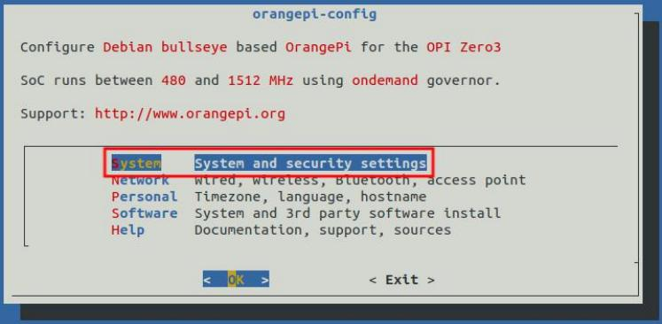
c. 然后选择 **Hardware**

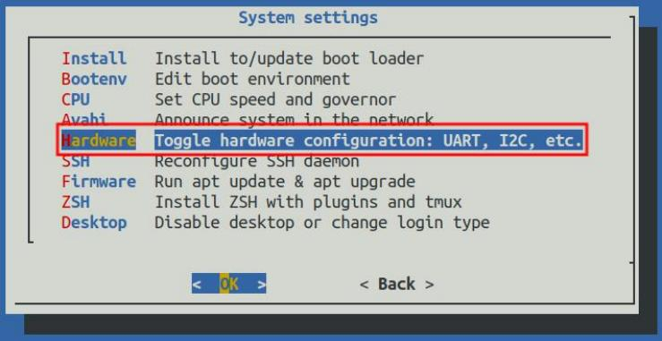
d. 然 后 使 用 键 盘 的 方 向 键 定 位 到 下 图所 示 的 位置 ， 再 使 用 空 格 选 中**disable-leds**

e. 然后选择**\<Save\>**保存

f. 然后选择**\<Back\>**

g. 然后选择**\<Reboot\>**重启系统使配置生效

h. 重启后完全进入系统就可以看到开发板上的两个 LED 灯都不会亮了

### 3.6. TF 卡中 linux 系统 rootfs 分区容量操作说明

#### 3.6.1. 第一次启动会自动扩容 TF 卡中 rootfs 分区的容量

1. 将开发板的 Linux镜像烧录到 TF 卡中后，可以在 **Ubuntu 电脑**中查看下 TF 卡容量的使用情况，步骤如下所示：
> 注意，这一步不操作是不影响开发板的 Linux 系统自动扩容的。这里只是想说明 TF 卡烧录完 Linux 镜像后，怎么查看 TF 卡容量的方法。

a. 首先在 Ubuntu 电脑中安装下 gparted 这个软件
test@test:\~\$ sudo apt install -y gparted

b. 然后打开 gparted
test@test:\~\$ sudo gparted

c. 打开 gparted 后在右上角可以选择 TF 卡，然后就可以看到 TF 卡容量的使用情况

d. 上图显示的是烧录完 Linux 桌面版系统后 TF 卡的情况，可以看到，虽然 TF卡的总容量是 16GB 的（在 GParted 中显示为 14.84GiB），但是 rootfs 分区（/dev/sdc1）实际只分配了 4.05GiB ，还剩下 10.79GiB 未分配
2. 然后可以将烧录好 Linux系统的 TF 卡插入开发板中启动，TF 卡第一次启动linux系统时会通过 **orangepi-resize-filesystem.service** 这个 systemd 服务来调用
**orangepi-resize-filesystem** 脚本自动进行 rootfs 分区的扩容，所以**无需再手动扩容**
3. 登录系统后可以通过 **df****-h** 命令来查看 rootfs 的大小，如果和 TF 卡的实际容量一致，说明自动扩容运行正确
| orangepi@orangepi:\~\$ df -h Filesystem Size Used Avail Use% Mounted on udev 430M 0 430M 0% /dev tmpfs 100M 5.6M 95M 6% /run +--------------------+-----------+----------------+-------------+ +--------------------+-----------+----------------+-------------+ +--------------------+-----------+----------------+-------------+ | /dev/mmcblk0p1 tmpfs | 15G 500M | 915M 14G 0 500M | 7% / 0% /dev/shm |  |
| --- | --- | --- | --- | --- | --- |

4. 第一次启动完 Linux 系统后，我们还可以将 TF 卡从开发板中取下来重新插入**Ubuntu 电脑**，然后再次使用 gparted 查看下 TF 卡的情况，如下图所示，rootfs 分区（/dev/sdc1）的容量已经扩展到了 14.69GiB 了

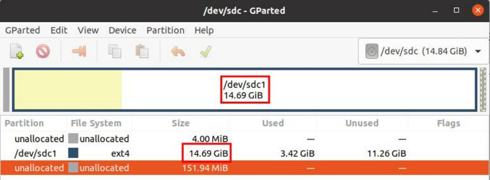
需要注意的是，linux 系统只有一个ext4 格式的分区，没有使用单独的 BOOT分区来存放内核镜像等文件，所以也就不存在 BOOT 分区扩容的问题。

#### 3.6.2. 禁止自动扩容 TF 卡中 rootfs 分区容量的方法

1. 首先在 **Ubuntu 电脑**（Windows 不行）中将开发板的 linux 镜像烧录到 TF 卡中，然后重新拔插下 TF 卡
2. 然后 Ubuntu 电脑一般会自动挂载 TF 卡的分区，如果自动挂载正常，使用ls命令可以看到下面的输出
| +-------------------------+-------------------------+----------------------------------------------+ +-------------------------+-------------------------+----------------------------------------------+ +-------------------------+-------------------------+----------------------------------------------+ +-------------------------+-------------------------+----------------------------------------------+ | test@test:\~\$ ls /media/test/opi_root/ bin sbin | boot dev etc home selinux srv sys tmp | lib lost+found media mnt opt proc root run usr var |  |
| --- | --- | --- | --- | --- |

3. 然后在 Ubuntu 电脑中将当前用户切换成 root 用户
test@test:\~\$ sudo -i \[sudo\] test 的密码： root@test:\~\#

4. 然后进入 TF 卡中的 linux 系统的 root 目录下新建一个名为**.no_rootfs_resize** 的文件
root@test:\~# cd /media/test/opi_root/
root@test:/media/test/opi_root/# cd root
[root@test:/media/test/opi_root/root# touch .no_rootfs_resize](root@test:/media/test/opi_root/root#touch.no_rootfs_resize) [root@test:/media/test/opi_root/root# ls .no_rootfs](root@test:/media/test/opi_root/root#ls.no_rootfs)\*
.no_rootfs_resize

5. 然后就可以卸载 TF 卡，再拔出TF 卡插到开发板中启动，linux 系统启动时，当检测到**/root** 目录下有**.no_rootfs_resize** 这个文件就不会再自动扩容 rootfs 了
6. 禁止rootfs 自动扩容后进入Linux系统可以看到rootfs分区的总容量只有4GB（这里测试的是桌面版本的镜像），远小于 TF 卡的实际容量，说明禁止 rootfs 自动扩容成功
| orangepi@orangepi:\~\$ df -h Filesystem Size Used Avail Use% Mounted on +--------------------+------------+------------+------------+------------:+ +--------------------+------------+------------+------------+-------------+ +--------------------+------------+------------+------------+-------------+ +--------------------+------------+------------+------------+-------------+ | udev tmpfs /dev/mmcblk0p1 | 925M 199M 4.0G | 0 3.2M 3.2G | 925M 196M 686M | 0% /dev 2% /run 83% / |  |
| --- | --- | --- | --- | --- | --- | --- |

7. 如果需要重新扩容 TF 卡中 rootfs 分区的容量，只需要执行下面的命令，然后重新启动开发板的 Linux 系统即可
| 注意，请在root 用户下执行下面的命令。 root@orangepi:\~# [rm /root/.no_rootfs_resize](rm/root/.no_rootfs_resize) root@orangepi:\~# systemctl enable orangepi-resize-filesystem.service root@orangepi:\~# sudo reboot |  |
| --- | --- |

重启后再次进入开发板的 Linux系统就可以看到 rootfs分区已经扩展为 TF 卡的实际容量了
root@orangepi:\~# df -h
Filesystem Size Used Avail Use% Mounted on
udev 925M 0 925M 0% /dev
tmpfs 199M 3.2M 196M 2% /run
/dev/mmcblk0p1 15G 3.2G 12G 23% /

#### 3.6.3. 手动扩容 TF 卡中 rootfs 分区容量的方法

如果 TF 卡的总容量很大，比如为 128GB，不想 Linux 系统 rootfs 分区使用 TF卡所有的容量，只想分配一部分容量，比如 16GB ，给 Linux 系统使用，然后 TF卡的剩余容量就可以用作其他用途。那么可以使用此小节介绍的内容来手动扩容TF 中 rootfs 分区的容量。

1. 首先在 **Ubuntu 电脑**（Windows 不行）中将开发板的 linux 镜像烧录到 TF 卡中，
然后重新拔插下 TF 卡
2. 然后 Ubuntu 电脑一般会自动挂载 TF 卡的分区，如果自动挂载正常，使用 **ls** 命令可以看到下面的输出
| +-------------------------+-------------------------+----------------------------------------------+ +-------------------------+-------------------------+----------------------------------------------+ +-------------------------+-------------------------+----------------------------------------------+ +-------------------------+-------------------------+----------------------------------------------+ | test@test:\~\$ ls /media/test/opi_root/ bin sbin | boot dev etc home selinux srv sys tmp | lib lost+found media mnt opt proc root run usr var |  |
| --- | --- | --- | --- | --- |

3. 然后在 Ubuntu 电脑中将当前用户切换成 root 用户
test@test:\~\$ sudo -i \[sudo\] test 的密码： root@test:\~\#

4. 然后进入 TF 卡中的 linux 系统的 root 目录下新建一个名为**.no_rootfs_resize** 的文件
root@test:\~# cd /media/test/opi_root/
root@test:/media/test/opi_root/# cd root
[root@test:/media/test/opi_root/root# touch .no_rootfs_resize](root@test:/media/test/opi_root/root#touch.no_rootfs_resize) [root@test:/media/test/opi_root/root# ls .no_rootfs](root@test:/media/test/opi_root/root#ls.no_rootfs)\*
.no_rootfs_resize

5. 然后在 Ubuntu 电脑中安装下 gparted 这个软件
test@test:\~\$ sudo apt install -y gparted

6. 然后打开 gparted
test@test:\~\$ sudo gparted

7. 打开 gparted 后在右上角可以选择 TF 卡，然后就可以看到 TF 卡容量的使用情况。下图显示的是烧录完 Linux 桌面版系统后 TF 卡的情况，可以看到，虽然 TF 卡的总容量是 16GB 的（在 GParted 中显示为 14.84GiB），但是 rootfs 分区（/dev/sdc1）实际只分配了 4.05GiB ，还剩下 10.79GiB 未分配

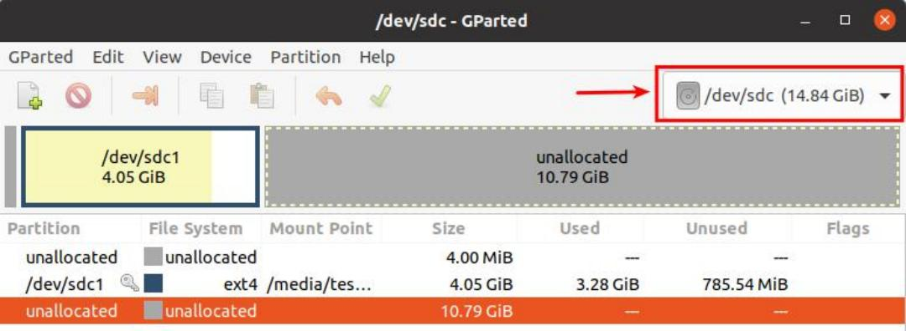
8. 然后选中 rootfs 分区（/dev/sdc1）

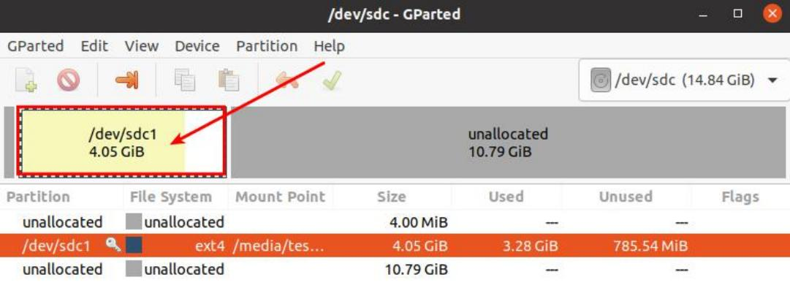
9. 再点击鼠标右键就可以看到下图所示的操作选项，如果 TF 卡已经挂载了，首先需要 Umount 掉 TF 卡的 rootfs 分区

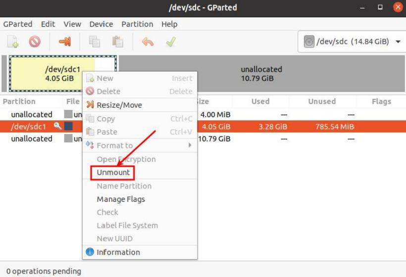
10. 然后再次选中 rootfs 分区，再点击鼠标右键，然后选择 **Resize/Move** 开始扩容rootfs 分区的大小

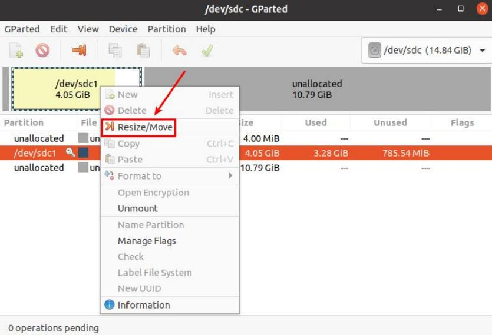
11. **Resize/Move** 选项打开后会弹出下面的设置界面

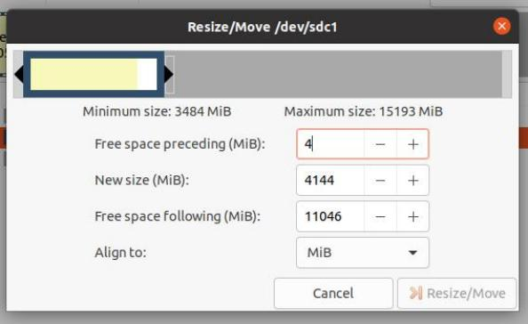
12. 然后可以直接拖动下图所示的位置来设置容量的大小，也可以通过设置 **New sieze(MiB)**中的数字来设置 rootfs 分区的大小

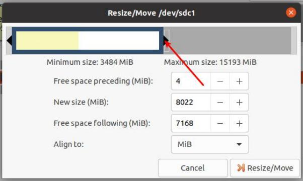
13. 设置好容量后，再点击右下角的 **Resize/Move** 即可

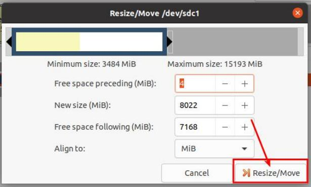
14. 最后确认无误后，再点击下图所示的**绿色√**

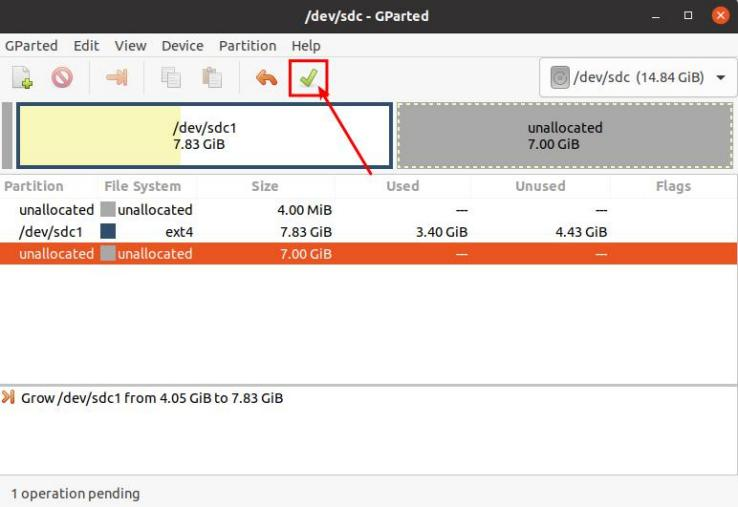
15. 然后选择**Apply** ，就会正式开始扩容 rootfs 分区的容量

16. 扩容完成后点击 **Close** 关闭即可

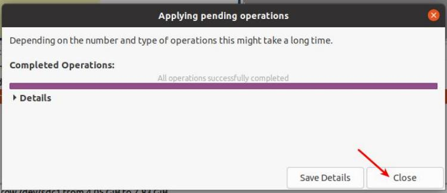
17. 然后就可以把 TF 卡拔下来，再插到开发板中启动，进入开发板的 Linux 系统中后如果使用**df -h** 命令可以看到rootfs分区的大小和前面设置的大小一致的话就说明手动扩容成功

#### 3.6.4. 缩小 TF 卡中 rootfs 分区容量的方法

在 TF 卡的 Linux 系统中配置好应用程序或者其他的开发环境后，如果想备份下 TF 卡中的 Linux 系统，可以使用此小节的方法先缩小下 rootfs 分区的大小，然后再开始备份。

1. 首先在 **Ubuntu 电脑**（Windows 不行）中插入想要操作的 TF 卡
2. 然后在 Ubuntu 电脑中安装下 gparted 这个软件
test@test:\~\$ sudo apt install -y gparted

3. 然后打开 gparted
test@test:\~\$ sudo gparted

4. 打开 gparted 后在右上角可以选择 TF 卡，然后就可以看到 TF 卡容量的使用情况

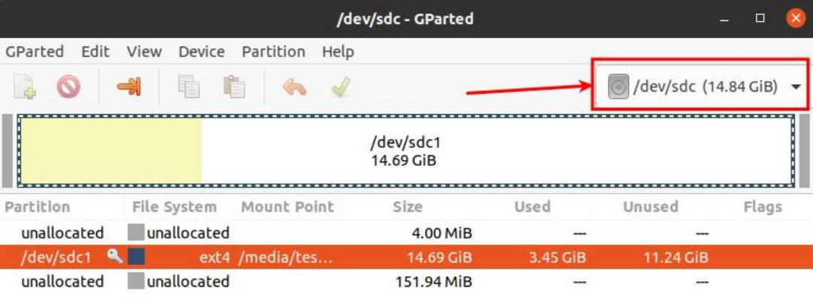
5. 然后选中 rootfs 分区（/dev/sdc1）

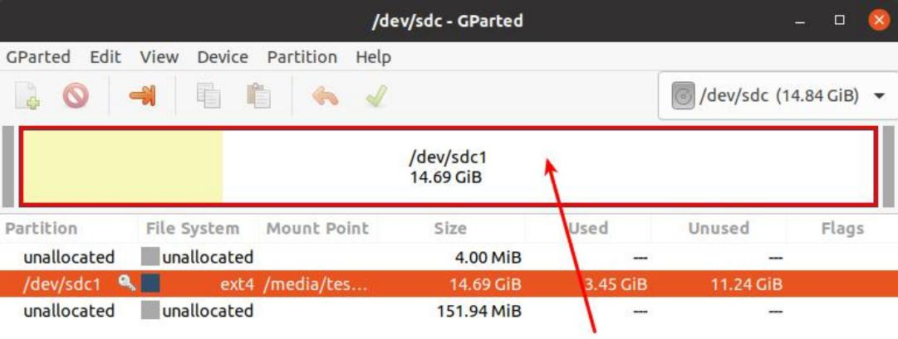
6. 再点击鼠标右键就可以看到下图所示的操作选项，如果 TF 卡已经挂载了，首先需要 Umount 掉 TF 卡的 rootfs 分区

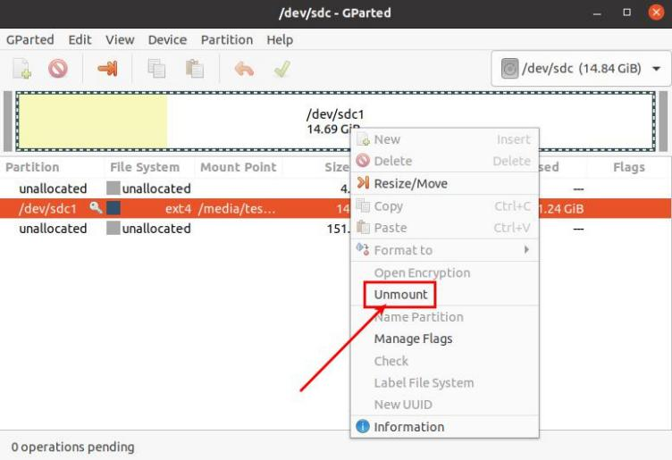
7. 然后再次选中rootfs分区，再点击鼠标右键，然后选择**Resize/Move**开始设置rootfs分区的大小

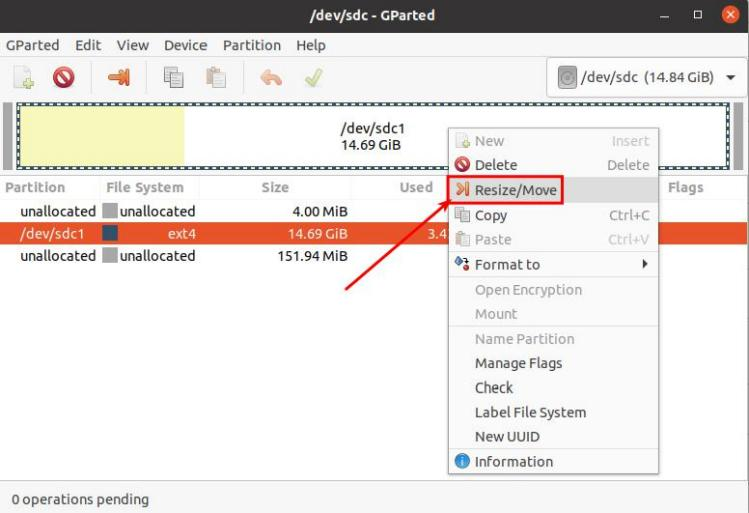
8. **Resize/Move** 选项打开后会弹出下面的设置界面

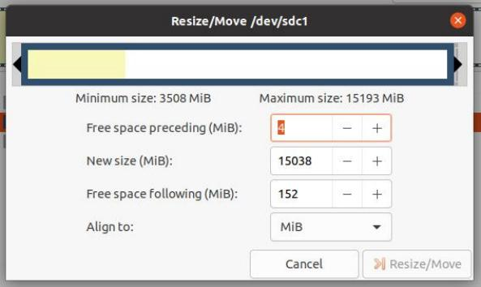
9. 然后可以直接拖动下图所示的位置来设置容量的大小，也可以通过设置 **New sieze(MiB)**中的数字来设置 rootfs 分区的大小

10. 设置好容量后，再点击右下角的 **Resize/Move** 即可

11. 最后确认无误后，再点击下图所示的**绿色√**

12. 然后选择**Apply** ，就会正式开始扩容 rootfs 分区的容量

13. 扩容完成后点击 **Close** 关闭即可

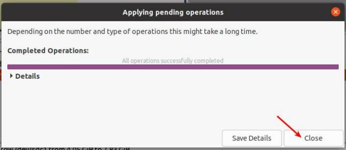
14. 然后就可以把 TF 卡拔下来，再插到开发板中启动，进入开发板的 Linux 系统中后如果使用**df -h** 命令可以看到rootfs分区的大小和前面设置的大小一致的话就说明缩小容量成功
root@orangepi:\~# df -h
Filesystem Size Used Avail Use% Mounted on
udev 925M 0 925M 0% /dev
tmpfs 199M 3.2M 196M 2% /run

/dev/mmcblk0p1 7.7G 3.2G 4.4G 42% /

### 3.7. 网络连接测试

#### 3.7.1. 以太网口测试

1. 首先将网线的一端插入开发板的以太网接口，网线的另一端接入路由器，并确保网络是畅通的
2. 系统启动后会通过 **DHCP** 自动给以太网卡分配 IP 地址，**不需要其他任何配置**
3. 在开发板的 Linux 系统中查看 IP 地址的命令如下所示：
| 下面的命令请不要照抄，比如 debian12 中的网络节点名为 end0 ，下面的命令就需要修改为 ip a s end0。 orangepi@orangepi:\~\$ ip a s eth0 3: eth0: \<BROADCAST,MULTICAST,UP,LOWER_UP\ mtu 1500 qdisc pfifo_fast state UP group default qlen 1000 link/ether 5e:ac:14:a5:93:b3 brd ff:ff:ff:ff:ff:ff inet 192.168.1.16/24 brd 192.168.1.255 scope global dynamic noprefixroute eth0 valid_lft 259174sec preferred_lft 259174sec inet6 240e:3b7:3240:c3a0:e269:8305:dc08: 135e/64 scope global dynamic noprefixroute valid_lft 259176sec preferred_lft 172776sec inet6 fe80::957d:bbbd:4928:3604/64 scope link noprefixroute valid_lft forever preferred_lft forever |  |
| --- | --- |

开发板启动后查看 IP 地址有三种方法：
1. 接 HDMI 显示器，然后登录系统使用 ipaseth0 命令查看 IP 地址
2. 在调试串口终端输入 ipaseth0 命令来查看 IP 地址
3. 如果没有调试串口，也没有 HDMI 显示器，还可以通过路由器的管理界面来查看开发板网口的 IP 地址。不过这种方法经常有人会无法正常看到开发板的 IP 地址。如果看不到，调试方法如下所示：
A）首先检查 Linux 系统是否已经正常启动，如果开发板的绿灯闪烁了，一般是正常启动了，如果只亮红灯，或者红灯绿灯都没亮，说明系统都没正常启动；
B）检查网线有没有插紧，或者换根网线试下；

C）换个路由器试下（路由器的问题有遇到过很多，比如路由器无法正常分配IP 地址，或者已正常分配 IP 地址但在路由器中看不到）；
D）如果没有路由器可换就只能连接 HDMI 显示器或者使用调试串口来查看 IP地址。
另外需要注意的是开发板 DHCP 自动分配 IP 地址是不需要任何设置的。

4. 测试网络连通性的命令如下，**ping** 命令可以通过 **Ctrl+C** 快捷键来中断运行
| 下面的命令请不要照抄，比如 debian12 中的网络节点名为 end0 ，下面的命令就需要修改为 [ping www.baidu.com -I](pingwww.baidu.com-I) end0。 orangepi@orangepi:\~\$ [ping www.baidu.com -I](pingwww.baidu.com-I) eth0 [PING www.a.shifen.com](PINGwww.a.shifen.com) ( [14.215.177.38](14.215.177.38)) from [192.168.1.12](192.168.1.12) eth0: 56(84) bytes of data. 64 bytes from 14.215.177.38 (14.215.177.38): icmp_seq=1 ttl=56 time=6.74 ms 64 bytes from 14.215.177.38 (14.215.177.38): icmp_seq=2 ttl=56 time=6.80 ms 64 bytes from 14.215.177.38 (14.215.177.38): icmp_seq=3 ttl=56 time=6.26 ms 64 bytes from 14.215.177.38 (14.215.177.38): icmp_seq=4 ttl=56 time=7.27 ms \^C \-\-- [www.a.shifen.com ping statistics \-\--](https://www.a.shifen.compingstatistics---) 4 packets transmitted, 4 received, 0% packet loss, time 3002ms rtt min/avg/max/mdev = 6.260/6.770/7.275/0.373 ms |  |
| --- | --- |

#### 3.7.2. WIFI 连接测试

请不要通过修改/etc/network/interfaces 配置文件的方式来连接 WIFI，通过这种方式连接 WIFI 网络使用会有问题。

##### 3.7.2.1. 服务器版镜像通过命令连接 WIFI

当开发板没有连接以太网，没有连接 HDMI 显示器，只连接了串口时，推荐使用此小节演示的命令来连接 WIFI 网络。因为nmtui 在某些串口软件（如 minicom）中只能显示字符，无法正常显示图形界面。当然，如果开发板连接了以太网或者HDMI 显示屏，也可以使用此小节演示的命令来连接 WIFI 网络的。

1. 先登录 linux 系统，有下面三种方式
a. 如果开发板连接了网线，可以通过[ssh 远程登录 linux 系统](#ssh-远程登录-linux-系统)
a. 如果开发板连接好了调试串口，可以使用串口终端登录 linux 系统
b. 如果连接了开发板到HDMI 显示器，可以通过HDMI 显示的终端登录到linux系统
2. 首先使用 **nmcli****dev****wifi** 命令扫描周围的 WIFI 热点
orangepi@orangepi:\~\$ nmcli dev wifi

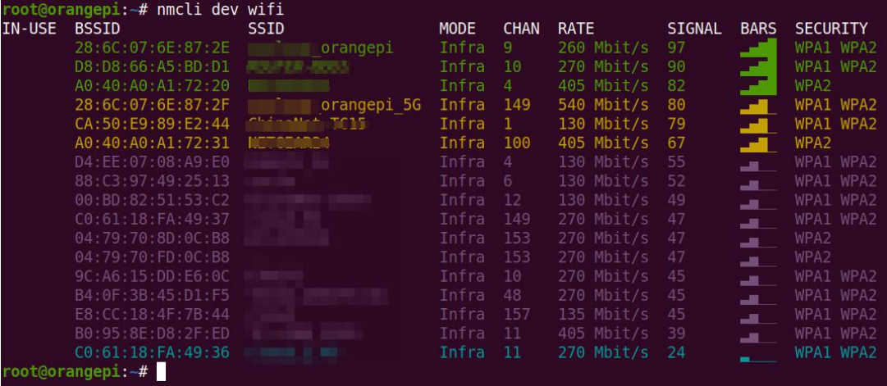
3. 然后使用 **nmcli** 命令连接扫描到的 WIFI 热点，其中： a. **wifi_name** 需要换成想连接的 WIFI 热点的名字
b. **wifi_passwd** 需要换成想连接的 WIFI 热点的密码
orangepi@orangepi:\~\$ sudo nmcli dev wifi connect wifi_name password wifi_passwd Device \'wlan0\' successfully activated with \'cf937f88-ca1e-4411-bb50-61f402eef293\'.

4. 通过 **ip addr show wlan0** 命令可以查看 wifi 的 IP 地址
orangepi@orangepi:\~\$ ip a s wlan0
11: wlan0: \<BROADCAST,MULTICAST,UP,LOWER_UP\> mtu 1500 qdisc pfifo_fast state UP group default qlen 1000
link/ether 23:8c:d6:ae:76:bb brd ff:ff:ff:ff:ff:ff
inet 192.168.1.11/24 brd 192.168.1.255 scope global dynamic noprefixroute wlan0 valid_lft 259192sec preferred_lft 259192sec
inet6 240e:3b7:3240:c3a0:c401:a445:5002:ccdd/64 scope global dynamic noprefixroute
valid_lft 259192sec preferred_lft 172792sec
inet6 fe80::42f1:6019:a80e:4c31/64 scope link noprefixroute

valid_lft forever preferred_lft forever

5. 使用 **ping** 命令可以测试 wifi 网络的连通性，**ping** 命令可以通过 **Ctrl+C** 快捷键来中断运行
orangepi@orangepi:\~\$ [ping www.orangepi.org -I wlan0](pingwww.orangepi.org-Iwlan0)
[PING www.orangepi.org](PINGwww.orangepi.org) ( [182.92.236.130](182.92.236.130)) from [192.168.1.49](192.168.1.49) wlan0: 56(84) bytes of data.
64 bytes from 182.92.236.130 (182.92.236. 130): icmp_seq=1 ttl=52 time=43.5 ms
64 bytes from 182.92.236.130 (182.92.236. 130): icmp_seq=2 ttl=52 time=41.3 ms
64 bytes from 182.92.236.130 (182.92.236. 130): icmp_seq=3 ttl=52 time=44.9 ms
64 bytes from 182.92.236.130 (182.92.236. 130): icmp_seq=4 ttl=52 time=45.6 ms
64 bytes from 182.92.236.130 (182.92.236. 130): icmp_seq=5 ttl=52 time=48.8 ms \^C
\-\-- [www.orangepi.org ping statistics \-\--](https://www.orangepi.orgpingstatistics---)
5 packets transmitted, 5 received, 0% packet loss, time 4006ms rtt min/avg/max/mdev = 41.321/44.864/48.834/2.484 ms

##### 3.7.2.2. 服务器版镜像通过图形化方式连接 WIFI

1. 先登录 linux 系统，有下面三种方式
a. 如果开发板连接了网线，可以通过[ssh 远程登录 linux 系统](#ssh-远程登录-linux-系统)
b. 如果开发板连接好了调试串口，可以使用串口终端登录 linux 系统（串口软件请使用MobaXterm ，使用 minicom 无法显示图形界面）
c. 如果连接了开发板到HDMI 显示器，可以通过HDMI 显示的终端登录到linux系统
2. 然后在命令行中输入nmtui 命令打开 wifi 连接的界面
orangepi@orangepi:\~\$ sudo nmtui

3. 输入nmtui 命令打开的界面如下所示

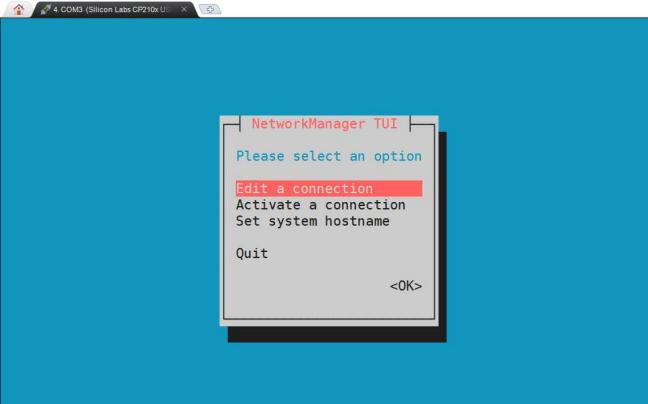
4. 选择 **Activate****a****connect** 后回车

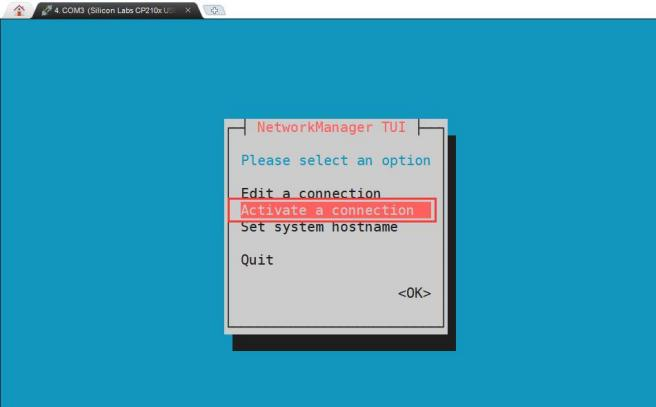
5. 然后就能看到所有搜索到的 WIFI 热点

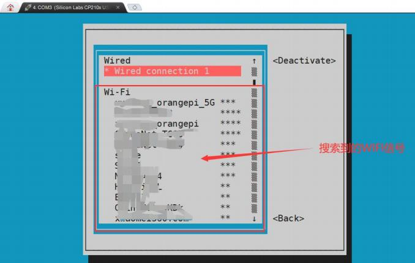
6. 选择想要连接的 WIFI 热点后再使用Tab 键将光标定位到 **Activate** 后回车

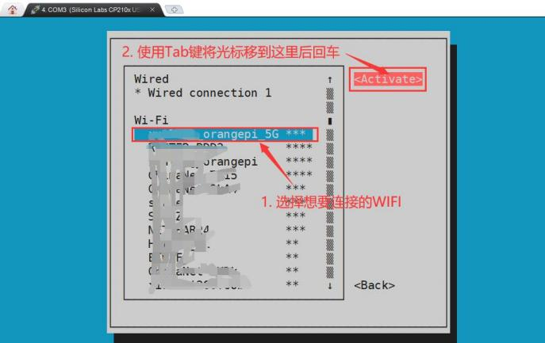
7. 然后会弹出输入密码的对话框，在 **Pssword** 内输入对应的密码然后回车就会开始连接 WIFI

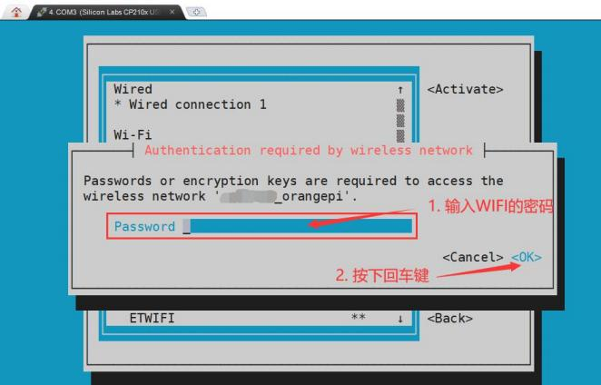
8. WIFI 连接成功后会在已连接的 WIFI 名称前显示一个"\* "

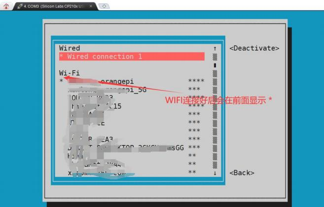
9. 通过 **ip****a****s****wlan0** 命令可以查看 wifi 的 IP 地址
orangepi@orangepi:\~\$ ip a s wlan0
11: wlan0: \<BROADCAST,MULTICAST,UP,LOWER_UP\> mtu 1500 qdisc pfifo_fast state UP group default qlen 1000
link/ether 24:8c:d3:aa:76:bb brd ff:ff:ff:ff:ff:ff
inet 192.168.1.11/24 brd 192.168.1.255 scope global dynamic noprefixroute wlan0 valid_lft 259069sec preferred_lft 259069sec
inet6 240e:3b7:3240:c4a0:c401:a445:5002:ccdd/64 scope global dynamic noprefixroute
valid_lft 259071sec preferred_lft 172671sec
inet6 fe80::42f1:6019:a80e:4c31/64 scope link noprefixroute valid_lft forever preferred_lft forever

10. 使用 **ping** 命令可以测试 wifi 网络的连通性，**ping** 命令可以通过 **Ctrl+C** 快捷键来中断运行
orangepi@orangepi:\~\$ [ping www.orangepi.org -I wlan0](pingwww.orangepi.org-Iwlan0)
[PING www.orangepi.org](PINGwww.orangepi.org) ( [182.92.236.130](182.92.236.130)) from [192.168.1.49](192.168.1.49) wlan0: 56(84) bytes of data.
64 bytes from 182.92.236.130 (182.92.236. 130): icmp_seq=1 ttl=52 time=43.5 ms
64 bytes from 182.92.236.130 (182.92.236. 130): icmp_seq=2 ttl=52 time=41.3 ms
64 bytes from 182.92.236.130 (182.92.236. 130): icmp_seq=3 ttl=52 time=44.9 ms
64 bytes from 182.92.236.130 (182.92.236. 130): icmp_seq=4 ttl=52 time=45.6 ms
64 bytes from 182.92.236.130 (182.92.236. 130): icmp_seq=5 ttl=52 time=48.8 ms \^C
\-\-- [www.orangepi.org ping statistics \-\--](https://www.orangepi.orgpingstatistics---)
5 packets transmitted, 5 received, 0% packet loss, time 4006ms rtt min/avg/max/mdev = 41.321/44.864/48.834/2.484 ms

##### 3.7.2.3. 桌面版镜像的测试方法

1. 点击桌面右上角的网络配置图标（测试 WIFI 时请不要连接网线）

2. 在弹出的下拉框中点击 **More****networks** 可以看到所有扫描到的 WIFI 热点，然后选择想要连接的 WIFI 热点

3. 然后输入 WIFI 热点的密码，再点击 **Connect** 就会开始连接 WIFI

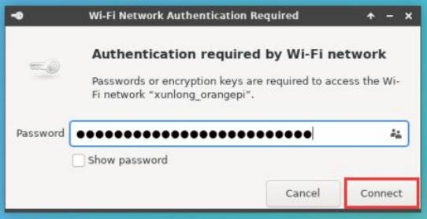
4. 连接好 WIFI 后，可以打开浏览器查看是否能上网，浏览器的入口如下图所示

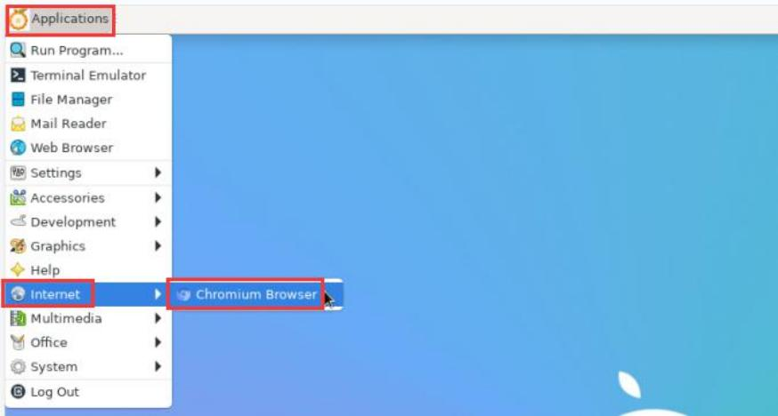
5. 打开浏览器后如果能打开其他网页说明WIFI 连接正常

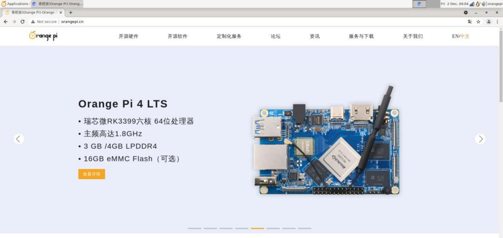

#### 3.7.3. 通过 create_ap 创建 WIFI 热点的方法

create_ap是一个帮助快速创建Linux上的WIFI热点的脚本，并且支持bridge和NAT模式，能够自动结合hostapd, dnsmasq和iptables完成WIFI热点的设置，避免了用户进行复杂的配置，github地址如下：
[https://github.com/oblique/create_ap](https://github.com/oblique/create_ap)

OPi发布的Linux镜像已经预装了create_ap脚本，可以通过create_ap命令来创建WIFI热点，create_ap的基本命令格式如下所示：

create_ap \[options\] \<wifi-interface\> \[\<interface-with-internet\>\]
\[\<access-point-name\> \[\<passphrase\>\]\]
**\* options：可以通过该参数指定加密方式、WIFI热点的频段、频宽模式、网络共享方式等，具体可以通过create_ap -h获取到有哪些option**
**\* wifi-interface：无线网卡的名称**
**\* interface-with-internet：可以联网的网卡名称，一般是eth0**
**\* access-point-name：热点名称**
**\* passphrase：热点的密码**

##### 3.7.3.1. create_ap 以 NAT 模式创建 WIFI 热点的方法

1）输入下面的命令以 NAT 模式创建名称为 **orangepi** 、密码为 **orangepi** 的 WIFI 热点
| 注意，下面的命令中，Debian12 需要修改 eth0 为 end0。 orangepi@orangepi:\~\$ sudo create_ap -m nat wlan0 eth0 orangepi orangepi \--no-virt |  |
| --- | --- |

2）如果有下面的信息输出，说明WIFI 热点创建成功
orangepi@orangepi:\~\$ sudo create_ap -m nat wlan0 eth0 orangepi orangepi \--no-virt Config dir: /tmp/create_ap.wlan0.conf.TQkJtsz1
PID: 26139
Network Manager found, set wlan0 as unmanaged device\... DONE Sharing Internet using method: nat
hostapd command-line interface: hostapd_cli -p
/tmp/create_ap.wlan0.conf.TQkJtsz1/hostapd_ctrl
wlan0: interface state UNINITIALIZED-\>ENABLED
wlan0: AP-ENABLED
wlan0: STA ce:bd:9a:dd:a5:86 IEEE 802.11: associated
wlan0: AP-STA-CONNECTED ce:bd:9a:dd:a5:86
wlan0: STA ce:bd:9a:dd:a5:86 RADIUS: starting accounting session D4FBF7E5C604F 169
wlan0: STA ce:bd:9a:dd:a5:86 WPA: pairwise key handshake completed (RSN)
wlan0: EAPOL-4WAY-HS-COMPLETED ce:bd:9a:dd:a5:86

3）此时拿出手机，在搜索到的 WIFI 列表中就能找到开发板创建的名为 **orangepi**的 WIFI 热点，然后可以点击 **orangepi** 连接热点，密码就是上面设置的 **orangepi**

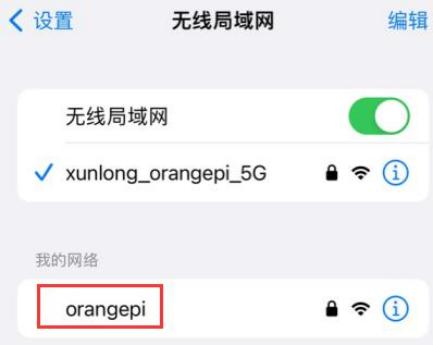
4）连接成功后的显示如下图所示

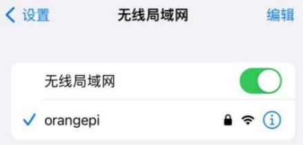
5）在 NAT 模式下，连接到开发板热点的无线设备是向开发板的 DHCP 服务请求 IP地址的，所以会有两个不同的网段，如这里开发板的IP 是 192.168.1.X
| 注意，下面的命令中，Debian12 需要修改 eth0 为 end0。 | orangepi@orangepi:\~\$ sudo ifconfig eth0 eth0: flags=4163\<UP,BROADCAST,RUNNING,MULTICAST\ mtu 1500 inet 192.168.1.150 netmask 255.255.255.0 broadcast 192.168.1.255 inet6 fe80::938f:8776:5783:afa2 prefixlen 64 scopeid 0x20\<link\  ether 4a:a0:c8:25:42:82 txqueuelen 1000 (Ethernet) RX packets 25370 bytes 2709590 (2.7 MB) RX errors 0 dropped 50 overruns 0 frame 0 TX packets 3798 bytes 1519493 (1.5 MB) TX errors 0 dropped 0 overruns 0 carrier 0 collisions 0 device interrupt 83 |  |
| --- | --- | --- |

而开发板的 DHCP 服务默认会给接入热点的设备分配 **192.168.12.0/24** 的 IP 地址，这时点击已经连接的 WIFI 热点 **orangepi** ，然后就可以看到手机的 IP 地址是 **192.168.12.X**。

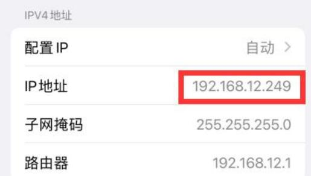
6）如果想要为接入的设备指定不同的网段，可以通过-g 参数指定，如通过-g 参数指定接入点 AP 的网段为 192.168.2.1
| 注意，下面的命令中，Debian12 需要修改 eth0 为 end0。 | orangepi@orangepi:\~\$ sudo create_ap -m nat wlan0 eth0 orangepi orangepi -g 192.168.2.1 \--no-virt |  |
| --- | --- | --- |

此时通过手机连接到热点后，点击已经连接的 WIFI 热点 **orangepi**，然后可以看到手机的 IP 地址是 **192.168.2.X**。

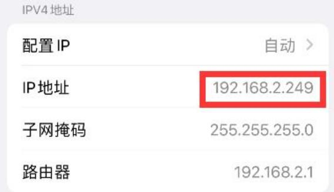
7）在不指定**\--freq-band** 参数的情况下，默认创建的热点是 2.4G 频段的，如果想要创建 5G 频段的热点可以通过**\--freq-band****5** 参数指定，具体命令如下
> 注意，下面的命令中，Debian12 需要修改 eth0 为 end0。

orangepi@orangepi:\~\$ sudo create_ap -m nat wlan0 eth0 orangepi orangepi \--freq-band 5 \--no-virt

8）如果需要隐藏 SSID ，可以指定**\--hidden** 参数，具体命令如下
| 注意，下面的命令中，Debian12 需要修改 eth0 为 end0。 | orangepi@orangepi:\~\$ sudo create_ap -m nat wlan0 eth0 orangepi orangepi \--hidden \--no-virt |  |
| --- | --- | --- |

此时手机是搜索不到 WIFI 热点的，需要手动指定 WIFI 热点名称，并输入密码来连接 WIFI 热点

##### 3.7.3.2. create_ap 以 bridge 模式创建 WIFI 热点的方法

1）输入下面的命令以 bridge 模式创建名称为 **orangepi** 、密码为 **orangepi** 的 WIFI热点
> 注意，下面的命令中，Debian12 需要修改 eth0 为 end0。
orangepi@orangepi:\~\$ sudo create_ap -m bridge wlan0 eth0 orangepi orangepi \--no-virt

2）如果有下面的信息输出，说明WIFI 热点创建成功
orangepi@orangepi:\~\$ sudo create_ap -m bridge wlan0 eth0 orangepi orangepi \--no-virt Config dir: /tmp/create_ap.wlan0.conf.zAcFlYTx
PID: 27707
Network Manager found, set wlan0 as unmanaged device\... DONE

Sharing Internet using method: bridge
Create a bridge interface\... br0 created.
hostapd command-line interface: hostapd_cli -p
/tmp/create_ap.wlan0.conf.zAcFlYTx/hostapd_ctrl
wlan0: interface state UNINITIALIZED-\>ENABLED
wlan0: AP-ENABLED
wlan0: STA ce:bd:9a:dd:a5:86 IEEE 802.11: associated
wlan0: AP-STA-CONNECTED ce:bd:9a:dd:a5:86
wlan0: STA ce:bd:9a:dd:a5:86 RADIUS: starting accounting session 937BF40E51897A7B
wlan0: STA ce:bd:9a:dd:a5:86 WPA: pairwise key handshake completed (RSN)
wlan0: EAPOL-4WAY-HS-COMPLETED ce:bd:9a:dd:a5:86

3）此时拿出手机，在搜索到的 WIFI 列表中就能找到开发板创建的名为 **orangepi**的 WIFI 热点，然后可以点击 **orangepi** 连接热点，密码就是上面设置的 **orangepi**

4）连接成功后的显示如下图所示

5）在 bridge 模式下，连接到开发板热点的无线设备也是向主路由（开发板连接的路由器）的 DHCP 服务请求 IP 地址的，如这里开发板的 IP 是 **192.168.1.X**
orangepi@orangepi:\~\$ sudo ifconfig eth0

eth0: flags=4163\<UP,BROADCAST,RUNNING,MULTICAST\> mtu 1500
inet 192.168.1.150 netmask 255.255.255.0 broadcast 192.168.1.255 inet6 fe80::938f:8776:5783:afa2 prefixlen 64 scopeid 0x20\<link\>
ether 4a:a0:c8:25:42:82 txqueuelen 1000 (Ethernet)
RX packets 25370 bytes 2709590 (2.7 MB)
RX errors 0 dropped 50 overruns 0 frame 0
TX packets 3798 bytes 1519493 (1.5 MB)
TX errors 0 dropped 0 overruns 0 carrier 0 collisions 0 device interrupt 83

而接入 WIFI 热点的设备的 IP 也是由主路由分配的，所以连接 WIFI 热点的手机和开发板处于相同的网段，这时点击已经连接的 WIFI 热点 **orangepi** ，然后就可以看到手机的 IP 地址也是 **192.168.1.X**。

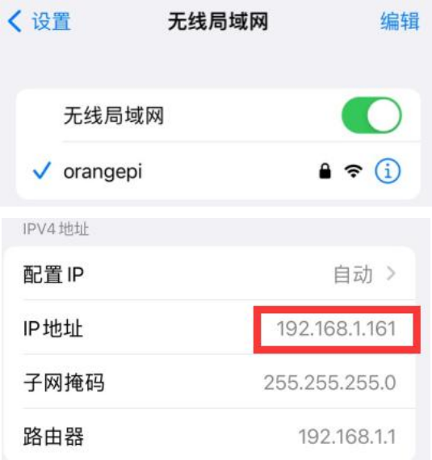
6）在不指定**\--freq-band** 参数的情况下，默认创建的热点是 2.4G 频段的，如果想要创建 5G 频段的热点可以通过**\--freq-band****5** 参数指定，具体命令如下
> 注意，下面的命令中，Debian12 需要修改 eth0 为 end0。

orangepi@orangepi:\~\$ sudo create_ap -m bridge wlan0 eth0 orangepi orangepi \--freq-band 5 \--no-virt

7）如果需要隐藏 SSID ，可以指定**\--hidden** 参数，具体命令如下
> 注意，下面的命令中，Debian12 需要修改 eth0 为 end0。

orangepi@orangepi:\~\$ sudo create_ap -m bridge wlan0 eth0 orangepi orangepi \--hidden \--no-virt

此时手机是搜索不到 WIFI 热点的，需要手动指定 WIFI 热点名称，并输入密码来连接 WIFI 热点

#### 3.7.4. 设置静态 IP 地址的方法

请不要通过修改/etc/network/interfaces 配置文件的方式来设置静态 IP 地址。

##### 3.7.4.1. 使用 nmtui 命令来设置静态 IP 地址

1. 首先运行 **nmtui** 命令
orangepi@orangepi:\~\$ sudo nmtui

2. 然后选择 **Edit****a****connection** 并按下回车键

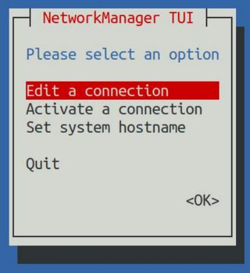
3. 然后选择需要设置静态 IP 地址的网络接口，比如设置 **Ethernet** 接口的静态 IP 地址选择 **Wired****connection****1** 就可以了

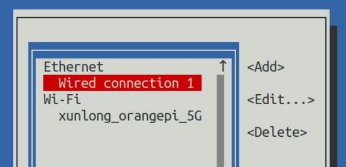
4. 然后通过 **Tab** 键选择 **Edit** 并按下回车键

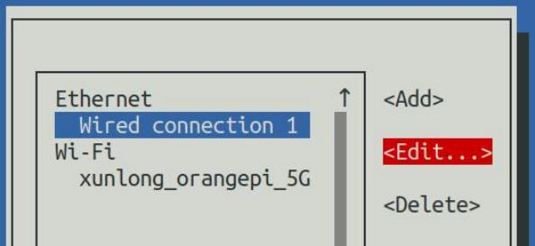
5. 然后通过 Tab 键将光标移动到下图所示的**\<Automatic\>**位置进行IPv4 的配置

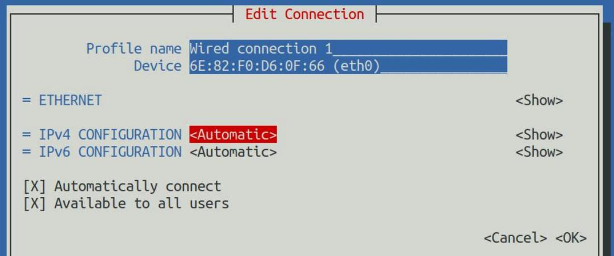
6. 然后回车，通过上下方向键选择 **Manual** ，然后回车确定

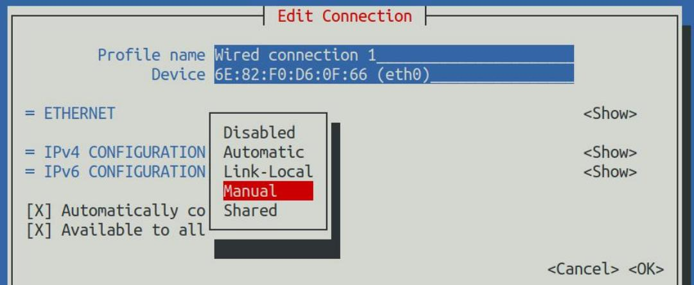
7. 选择完后的显示如下图所示

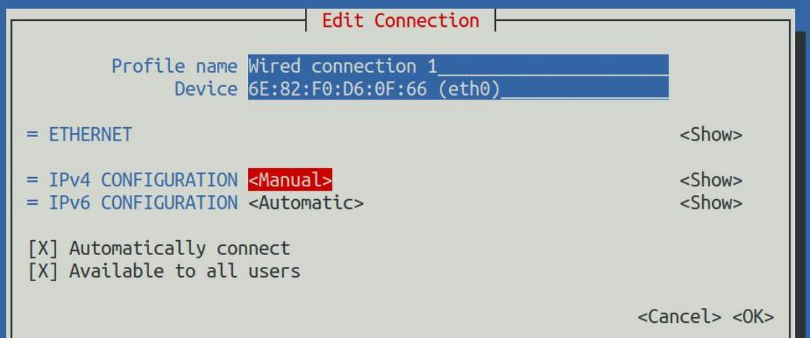
8. 然后通过 Tab 键将光标移动到**\<Show\>**

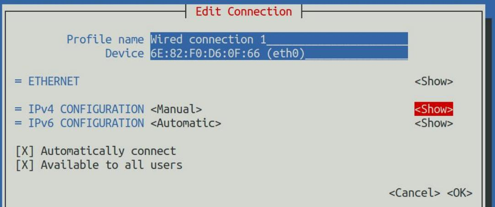
9. 然后回车，回车后会弹出下面的设置界面

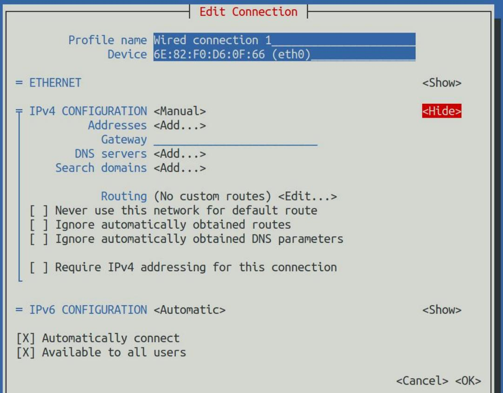
10. 然后就可以在下图所示的位置设置 IP 地址(Addresses) 、网关(Gateway)和 DNS服务器的地址（里面还有很多其他设置选项，请自行探索），**请根据自己的具体需求来设置，下图中设置的值只是一个示例**

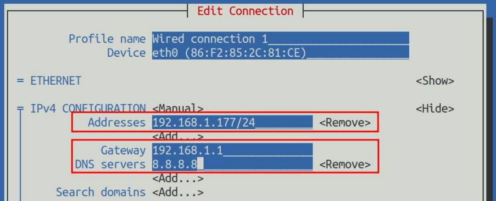
11. 设置完后将光标移动到右下角的**\<OK\>** ，然后回车确认

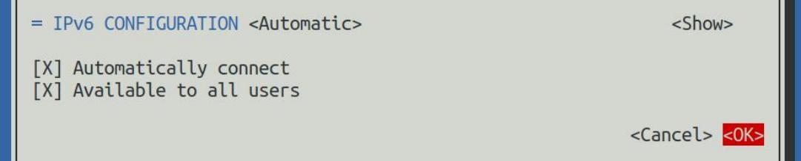
12. 然后点击**\<Back\>**回退到上一级选择界面

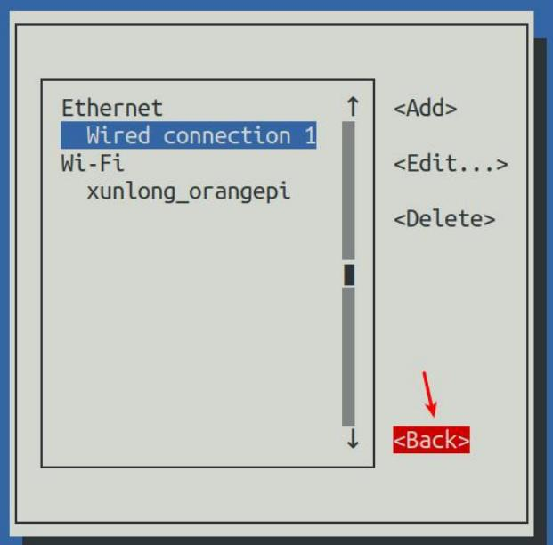
13. 然后选择 **Activate****a****connection** ，再将光标移动到**\<OK\>** ，最后点击回车

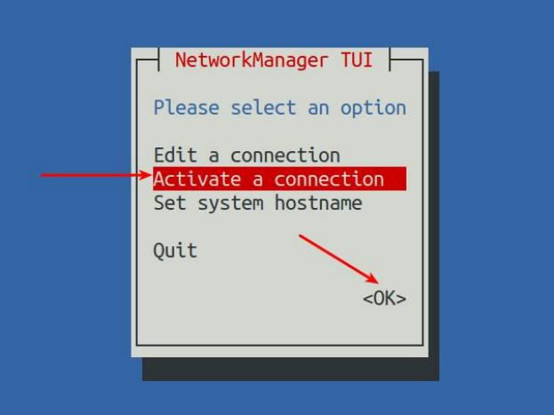
14. 然后选择需要设置的网络接口，比如 **Wired connection 1** ，然后将光标移动到**\<Deactivate\>** ，再按下回车键禁用 **Wired****connection****1**

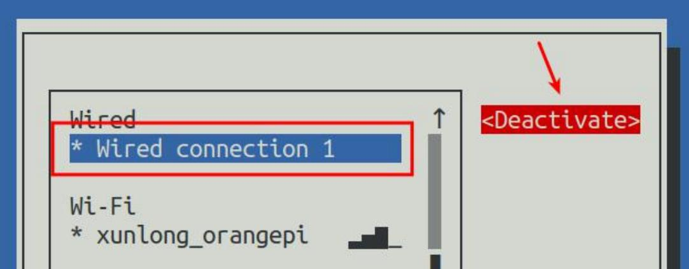
15. 然后请不要移动光标，再按下回车键重新使能 **Wired****connection****1**，这样前面设置的静态 IP 地址就会生效了

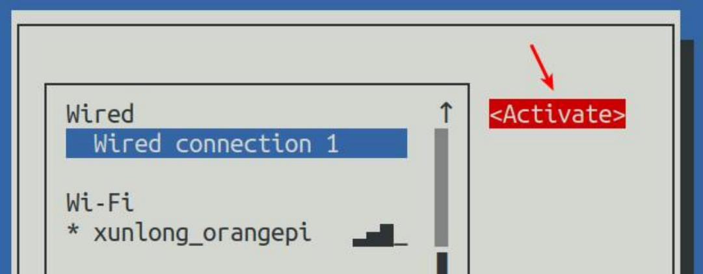
16. 然后通过**\<Back\>**和 **Quit** 按钮就可以退出nmtui
17. 然后通过**ip a s****eth0** 就能看到网口的 IP 地址已经变成前面设置的静态 IP 地址了
| 注意，下面的命令中，Debian12 需要修改 eth0 为 end0。 | orangepi@orangepi:\~\$ ip a s eth0 3: eth0: \<BROADCAST,MULTICAST,UP,LOWER_UP\ mtu 1500 qdisc pfifo_fast state UP group default qlen 1000 link/ether 5e:ac:14:a5:92:b3 brd ff:ff:ff:ff:ff:ff inet 192.168.1.177/24 brd 192.168.1.255 scope global noprefixroute eth0 valid_lft forever preferred_lft forever inet6 241e:3b8:3240:c3a0:e269:8305:dc08: 135e/64 scope global dynamic noprefixroute valid_lft 259149sec preferred_lft 172749sec inet6 fe80::957d:bbbe:4928:3604/64 scope link noprefixroute valid_lft forever preferred_lft forever |  |
| --- | --- | --- |

18. 然后就可以测试网络的连通性来检查 IP 地址是否配置 OK 了，**ping** 命令可以通
过 **Ctrl+C** 快捷键来中断运行
| 注意，下面的命令中，Debian12 需要修改 eth0 为 end0。 | orangepi@orangepi:\~\$ ping 192.168.1.177 -I eth0 PING 192.168.1.47 (192.168.1.47) from 192.168.1.188 eth0: 56(84) bytes of data. 64 bytes from 192.168.1.47: icmp_seq=1 ttl=64 time=0.233 ms 64 bytes from 192.168.1.47: icmp_seq=2 ttl=64 time=0.263 ms 64 bytes from 192.168.1.47: icmp_seq=3 ttl=64 time=0.273 ms 64 bytes from 192.168.1.47: icmp_seq=4 ttl=64 time=0.269 ms |  |
| --- | --- | --- |

64 bytes from 192.168.1.47: icmp_seq=5 ttl=64 time=0.275 ms \^C
\-\-- 192.168.1.47 ping statistics \-\--
5 packets transmitted, 5 received, 0% packet loss, time 4042ms rtt min/avg/max/mdev = 0.233/0.262/0.275/0.015 ms

##### 3.7.4.2. 使用 nmcli 命令来设置静态 IP 地址

1. 如果要设置网口的静态 IP 地址，请先将网线插入开发板，如果需要设置 WIFI的静态 IP 地址，请先连接好 WIFI ，然后再开始设置静态 IP 地址
2. 然后通过 **nmcli****con****show** 命令可以查看网络设备的名字，如下所示
a. **orangepi** 为 WIFI 网络接口的名字（名字不一定相同）
b. **Wired connection 1** 为以太网接口的名字
orangepi@orangepi:\~\$ nmcli con show
NAME UUID TYPE DEVICE
orangepi cfc4f922-ae48-46f1-84e1-2f19e9ec5e2a wifi wlan[0](#0)
Wired connection 1 9db058b7-7701-37b8-9411-efc2ae8bfa30 ethernet eth[0](#0)

3. 然后输入下面的命令，其中
a. **\"Wired connection 1\"** 表示设置以太网口的静态 IP 地址，如果需要设置WIFI 的静态 IP 地址，请修改为 WIFI 网络接口对应的名字（通过 **nmcli****con show** 命令可以获取到）
b. **ipv4.addresses** 后面是要设置的静态 IP 地址，可以修改为自己想要设置的值
c. **ipv4.gateway** 表示网关的地址
orangepi@orangepi:\~\$ sudo nmcli con mod \"Wired connection 1\" \\ ipv4.addresses \"[192.168.1.110](192.168.1.110)\" \\
ipv4.gateway \"[192.168.1.1](192.168.1.1)\" \\
ipv4.dns \"8.8.8.8\" \\
ipv4.method \"manual\"

4. 然后重启 linux 系统
orangepi@orangepi:\~\$ sudo reboot

5. 然后重新进入 linux系统使用**ip****addr****show****eth0** 命令就可以看到 IP 地址已经设置
为想要的值了
orangepi@orangepi:\~\$ ip addr show eth0
3: eth0: \<BROADCAST,MULTICAST,UP,LOWER_UP\> mtu 1500 qdisc pfifo_fast state UP group default qlen 1000
link/ether 5e:ae:14:a5:91:b3 brd ff:ff:ff:ff:ff:ff
inet 192.168.1.110/32 brd 192.168.1. 110 scope global noprefixroute eth0 valid_lft forever preferred_lft forever
inet6 240e:3b7:3240:c3a0:97de:1d01:b290:fe3a/64 scope global dynamic noprefixroute
valid_lft 259183sec preferred_lft 172783sec
inet6 fe80::3312:861a:a589:d3c/64 scope link noprefixroute valid_lft forever preferred_lft forever

#### 3.7.5. 设置 Linux 系统第一次启动自动连接网络的方法

开发板有以太网口，如果想通过以太网口来远程登录开发板的 Linux 系统，只需要给以太网口插上能正常上网的网线，在启动完 Linux 系统后会自动通过 DHCP给以太网口分配一个 IP 地址，然后我们通过 HDMI 屏幕、串口或者查看路由器后台的方式就可以获取以太网口的IP 地址，然后就能远程登录 Linux 系统。
开发板也有无线 WIFI，如果想通过 WIFI 来远程登录开发板的 Linux 系统，则需要通过以太网口的 IP 地址ssh 远程登录 Linux 系统后通过命令来连接 WIFI，或者在 HDMI 屏幕或串口中通过命令来连接 WIFI。
但如果 HDMI 屏幕和串口模块都没有，虽然有网线，但无法通过路由器后台查看到开发板的IP 地址。或者 HDMI 屏幕、串口模块和网线都没有，只有 WIFI 可以连接，则可以使用此小节介绍的方法来自动连接 WIFI 并且还能设置 WIFI 的静态 IP 地址或者自动设置以太网口的静态 IP 地址。

要使用此小节的方法，首先需要准备一台 Linux 系统的机器。比如一台安装有Ubuntu 系统的电脑或者虚拟机。
为什么需要 Linux 系统的机器，因为 TF 卡中烧录的开发板 Linux 系统的根文件系统是ext4 格式的，Linux 系统的机器可以正常的挂载它，然后对其中的配置文件进行修改。

如果想要在 Windows 系统中来修改，可以使用 ParagonExtFSforWindows 这款软件，由于此软件需要付费，而目前又没有比较好用的类似的免费软件，这里就不具体演示了。

另外如果尝试 Paragon ExtFS forWindows 这款软件使用有问题请自行解决，我们不答疑。

1. 首先烧录想使用的开发板的 Linux 镜像到 TF 卡中，然后使用读卡器，将烧录好开发板 Linux镜像的TF 卡插入安装有 Linux 系统的机器中（比如安装有 Ubuntu 系统的电脑，下面都以 Ubuntu 电脑为例来演示）
2. 当 TF 卡插入 Ubuntu 电脑后，Ubuntu 电脑一般会自动挂载 TF 卡中的 Linux 根文件系统的分区，由下面的命令可以知道，**/media/test/opi_root** 即为 TF 卡中的 Linux根文件系统挂载的路径
| +--------------+----------------------------------------------------------------+--------------+--------------+--------------+--------------+--------------+--------------+ +-------------------------------------------------------------------------------------------------------------------------------------------------------------------------+ +-------------------------------------------------------------------------------------------------------------------------------------------------------------------------+ +--------------+----------------------------------------------------------------+--------------+--------------+--------------+--------------+--------------+--------------+ +--------------+----------------------------------------------------------------+--------------+--------------+--------------+--------------+--------------+--------------+ | test@test:\~\$ **df -h \ /dev/sdd1 1.4G 1.2G 167M 88% /media/test/opi_root test@test:\~\$ ls /media/test/opi_root bin sbin | grep \"media\"** boot dev etc home lib lost+found selinux srv sys tmp usr var | media | mnt | opt | proc | root | run |  |
| --- | --- | --- | --- | --- | --- | --- | --- | --- | --- |

3. 然后进入 TF 卡中烧录的 Linux 系统的**/boot** 目录中
test@test:\~\$ cd /media/test/opi_root/boot/

4. 然后将其中的 **orangepi_first_run.txt.template** 复制为 **orangepi_first_run.txt**，通过 orangepi_first_run.txt 配置文件可以设置开发板 Linux 系统第一次启动时自动连接某个 WIFI 热点，也可以设置 WIFI 或者以太网口的静态 IP 地址
test@test:/media/test/opi_root/boot\$ sudo cp orangepi_first_run.txt.template orangepi_first_run.txt

5. 通过下面的命令可以打开 orangepi_first_run.txt 文件，然后就可以查看修改其中的内容
test@test:/media/test/opi_root/boot\$ sudo vim orangepi_first_run.txt

6. orangepi_first_run.txt 文件中的变量使用说明
a. **FR_general_delete_this_file_after_completion** 变量用来设置第一次启动完后是否删除 orangepi_first_run.txt 这个文件，默认为 1，也就是删除，如果设置为 0 ，第一次启动后会将 orangepi_first_run.txt 重命名为
orangepi_first_run.txt.old ，一般保持默认值即可
b. **FR_net_change_defaults** 变量用于设置是否改变默认网络设置，这个必须要设置为 1 ，否则所有的网络设置都不会生效
c. **FR_net_ethernet_enabled** 变量用来控制是否使能以太网口的配置，如果需要设置以太网口的静态 IP 地址，请设置为 1
d. **FR_net_wifi_enabled** 变量用来控制是否使能 WIFI 的配置，如果需要设置开发板自动连接 WIFI 热点，则必须将其设置为 1 ，另外请注意，如果此变量设置为 1 ，则以太网口的设置就会失效。也就是说 WIFI 和以太网口不能同时设置（为什么，因为没必要\...）
e. **FR_net_wifi_ssid** 变量用于设置想要连接的 WIFI 热点的名字
f. **FR_net_wifi_key** 变量用于设置想要连接的 WIFI 热点的密码
g. **FR_net_use_static**变量用于设置是否需要设置WIFI 或者以太网口的静态IP地址
h. **FR_net_static_ip** 变量用于设置静态 IP 的地址，请根据自己的实际情况设置
i. **FR_net_static_gateway** 变量用于设置网关，请根据自己的实际情况设置
7. 下面演示几个具体的设置示例：
a. 比如想要开发板的 Linux 系统第一次启动后自动连接 WIFI 热点，可以这样设置：
a\) 设置 **FR_net_change_defaults** 为 **1**
b\) 设置 **FR_net_wifi_enabled** 为 **1**
c\) 设置 **FR_net_wifi_ssid** 为想要连接的 WIFI 热点的名字
d\) 设置 **FR_net_wifi_key** 为想要连接的 WIFI 热点的密码
b. 比如想要开发板的 Linux 系统第一次启动后自动连接 WIFI 热点，并且设置WIFI 的 IP 地址为特定的静态 IP 地址（这样当 Linux 系统启动后，可以直接使用设置的静态 IP 地址ssh 远程登录开发板，无需通过路由器后台来查看开发板的IP 地址），可以这样设置：
a\) 设置 **FR_net_change_defaults** 为 **1**
b\) 设置 **FR_net_wifi_enabled** 为 **1**
c\) 设置 **FR_net_wifi_ssid** 为想要连接的 WIFI 热点的名字
d\) 设置 **FR_net_wifi_key** 为想要连接的 WIFI 热点的密码
e\) 设置 **FR_net_use_static** 为 **1**
f\) 设置 **FR_net_static_ip** 为想要的 IP 地址
g\) 设置 **FR_net_static_gateway** 为对应的网关地址
c. 比如想要开发板的 Linux 系统第一次启动后自动设置以太网口的 IP 地址为想要的静态 IP 地址，可以这样设置：
a\) 设置 **FR_net_change_defaults** 为 **1**
**b)** 设置 **FR_net_ethernet_enabled** 为 **1**
c\) 设置 **FR_net_use_static** 为 **1**
d\) 设置 **FR_net_static_ip** 为想要的 IP 地址
e\) 设置 **FR_net_static_gateway** 为对应的网关地址
8. 修改完orangepi_first_run.txt 文件后，就可以退出TF 卡中开发板Linux系统的/boot目录，再卸载 TF 卡，然后就可以将 TF 卡插入开发板中启动了
9. 如果没有设置静态 IP 地址，则还是需要通过路由器后台来查看 IP 地址，如果设置了静态 IP 地址，则可以在电脑上 ping 下设置的静态 IP 地址，如果能 ping 说明系统已经正常启动，并且网络也已设置正确，然后就可以使用设置的 IP 地址ssh 远程登录开发板的 Linux 系统了
开发板的 Linux 系统第一次启动完后，orangepi_first_run.txt 会被删除或者重命名为 orangepi_first_run.txt.old，此时就算重新设置 orangepi_first_run.txt 配置文件，然后重新启动开发板的 Linux 系统，orangepi_first_run.txt 中的配置也不会再次生效，因为此配置只在烧录完 Linux 系统后第一次启动才会有作用，这点请特别注意。

### 3.8. SSH 远程登录开发板

Linux 系统默认都开启了 ssh 远程登录，并且允许 root 用户登录系统。ssh 登录前首先需要确保以太网或者 wifi 网络已连接，然后使用 ip addr 命令或者通过查看路由器的方式获取开发板的IP 地址。

#### 3.8.1. Ubuntu 下 SSH 远程登录开发板

1. 获取开发板的IP 地址
2. 然后就可以通过 ssh 命令远程登录 linux 系统
test@test:\~\$ ssh [orangepi@192.168.1.](mailto:root@192.168.1.36)xxx (需要替换为开发板的 IP 地址)
orangepi@192.168.1.xx\'s password: （在这里输入密码，默认密码为 orangepi）

> 注意，输入密码的时候，屏幕上是不会显示输入的密码的具体内容的，请不要以为是有什么故障，输入完后直接回车即可。

如果提示拒绝连接，只要使用的是 Orange Pi 提供的镜像，就请不要怀疑orangepi 这个密码是不是不对，而是要找其他原因。

3. 成功登录系统后的显示如下图所示

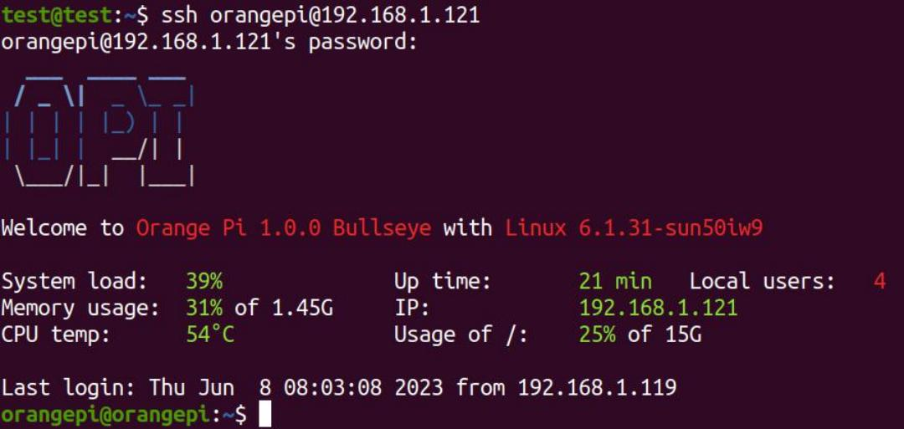
如果ssh 无法正常登陆 linux 系统，首先请检查下开发板的 IP 地址是否能 ping通，如果 ping 通没问题的话，可以通过串口或者 HDMI 显示器登录 linux 系统然后在开发板上输入下面的命令后再尝试是否能连接：
root@orangepi:\~# reset_ssh.sh
如果还不行，请重烧系统试下。

#### 3.8.2. Windows 下 SSH 远程登录开发板

1. 首先获取开发板的IP 地址
2. 在 windows 下可以使用MobaXterm 远程登录开发板，首先新建一个 ssh 会话a. 打开 **Session**
b. 然后在 **Session Setting** 中选择 **SSH**
c. 然后在 **Remote host** 中输入开发板的 IP 地址
d. 然后在 **Specify username** 中输入 linux 系统的用户名 **root** 或 **orangepi**
e. 最后点击 **OK** 即可

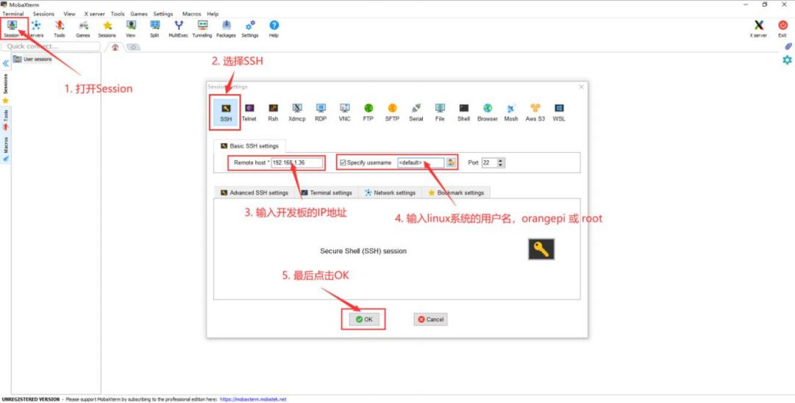
3. 然后会提示输入密码，默认 root 和 orangepi 用户的密码都为 orangepi
> 注意，输入密码的时候，屏幕上是不会显示输入的密码的具体内容的，请不要以为是有什么故障，输入完后直接回车即可。

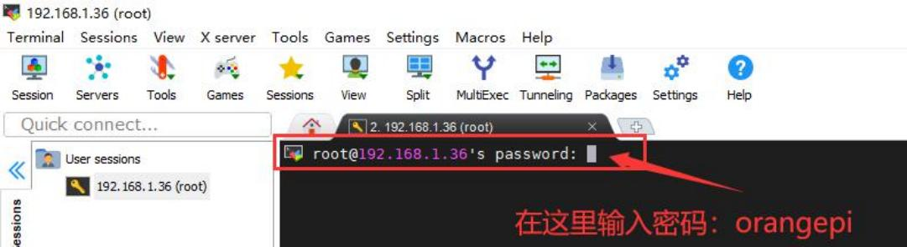
4. 成功登录系统后的显示如下图所示

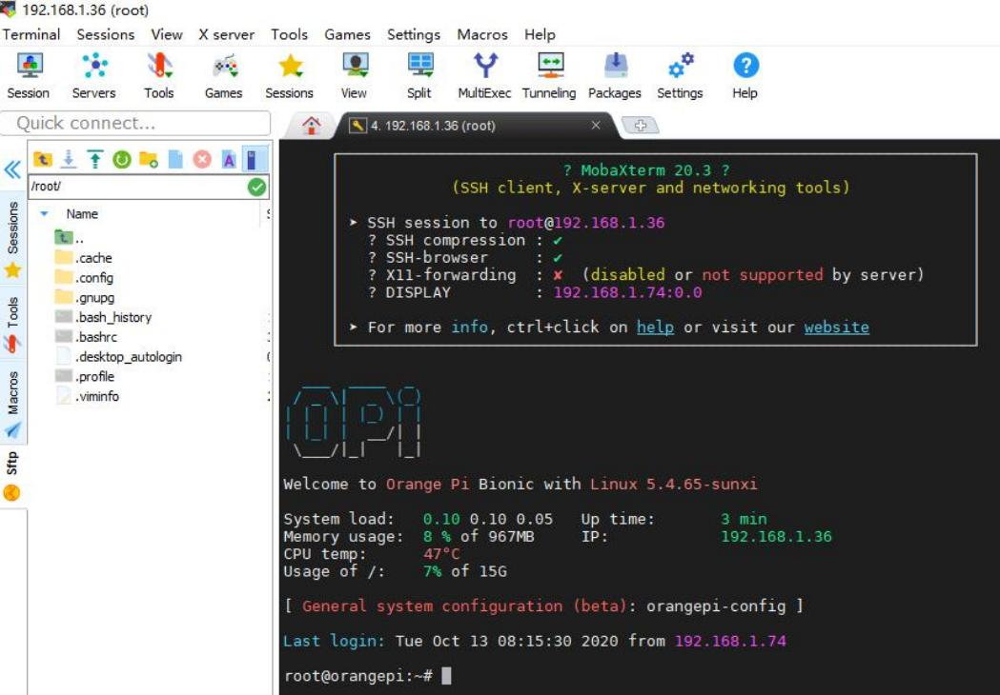

### 3.9. HDMI 测试

#### 3.9.1. HDMI 显示测试

1. 使用 Micro HDMI 转 HDMI 线连接 Orange Pi 开发板和HDMI 显示器

2. 启动 linux 系统后如果 HDMI 显示器有图像输出说明HDMI 接口使用正常
> 注意，很多笔记本电脑虽然带有 HDMI 接口，但是笔记本的 HDMI 接口一般只有输出功能，并没有 HDMI in 的功能，也就是说并不能将其他设备的 HDMI 输出

显示到笔记本的屏幕上。
当想把开发板的 HDMI 接到笔记本电脑 HDMI 接口时，请先确认清楚您的笔记本是支持 HDMI in 的功能。

当 HDMI 没有显示的时候，请先检查下 HDMI 线有没有插紧，确认接线没问题后，可以换一个不同的屏幕试下有没有显示。

#### 3.9.2. HDMI 转 VGA 显示测试

1. 首先需要准备下面的配件
a. HDMI 转 VGA 转换器

b. 一根 VGA 线和一根 Micro HDMI 公转 HDMI 母转接线
c. 一个支持 VGA 接口的显示器或者电视2) HDMI 转 VGA 显示测试如下所示

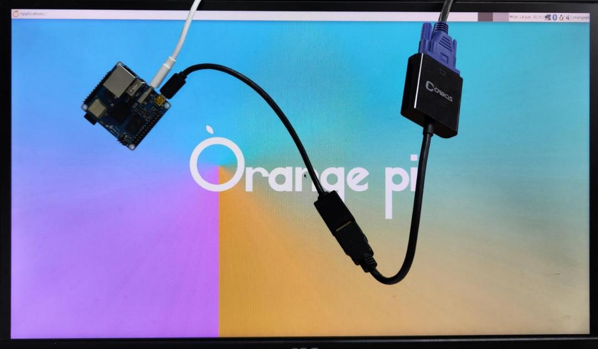
使用HDMI 转 VGA 显示时，开发板以及开发板的 Linux 系统是不需要做任何设置的，只需要开发板 Micro HDMI 接口能正常显示就可以了。所以如果测试有问题，请检查 HDMI 转 VGA 转换器、VGA 线以及显示器是否有问题。

#### 3.9.3. Linux5.4 系统 HDMI 分辨率设置的方法

> 注意： 此方法只适用于 linux5.4 内核的系统。

1. 在 linux 系统的**/boot/orangepiEnv.txt** 中有个 disp_mode 变量，可以通过它来设置HDMI 输出的分辨率，linux 系统默认设置的分辨率为 1080p60
orangepi@orangepi:\~\$ sudo vim /boot/orangepiEnv.txt
verbosity=1
console=both
disp_mode=1080p60
fb0_width=1920 fb0_height=1080

2. disp mode变量支持设置的值如下表所示
| disp_mode 支持的值 | HDMI 分辨率 | HDMI 刷新率 |
| --- | --- | --- |
| 480i | 720x480 | 60 |

| 576i | 720x480 | 50 |
| --- | --- | --- |
| 480p | 720x480 | 60 |
| 576p | 720x576 | 60 |
| 720p50 | 1280x720 | 50 |
| 720p60 | 1280x720 | 60 |
| 1080i50 | 1920x1080 | 50 |
| 1080i60 | 1920x1080 | 60 |
| 1080p24 | 1920x1080 | 24 |
| 1080p50 | 1920x1080 | 50 |
| 1080p60 | 1920x1080 | 60 |

> 注意：Linux 系统目前不支持 4K 分辨率。

3. 将 disp_mode变量的值修改为想要输出的分辨率，然后重启系统，HDMI 就会输出所设置的分辨率了
4. 查看 HDMI 输出分辨率的方法如下所示，如果显示的分辨率和设置的分辨率一样，说明开发板这端的设置正确
orangepi@orangepi:\~\$ sudo cat /sys/class/disp/disp/attr/sys

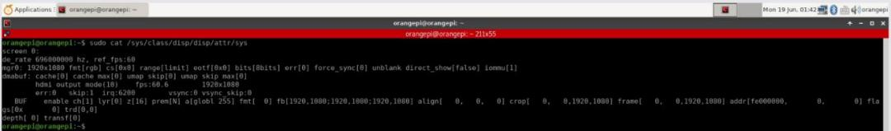

#### 3.9.4. Linux5.4 系统 Framebuffer 宽度和高度的修改方法

> 注意： 此方法只适用于 linux5.4 内核的系统。

fb0 height=1080。
在 linux 系统的**/boot/orangepiEnv.txt** 中有 fb0_width 和 fb0_height 两个变量，可以通过它们来设置 Framebuffer 的宽度和高度，linux 系统默认设置 fb0_width=1920、
orangepi@orangepi:\~\$ sudo vim /boot/orangepiEnv.txt
verbosity=1
console=both
disp_mode=1080p60
fb0_width=1920

fb0_height=1080

fb0_width 和 fb0_height 不同分辨率对应的**参考值**如下所示：
| HDMI 分辨率 | fb0_width | fb0_height |
| --- | --- | --- |
| 480p | 720 | 480 |
| 576p | 720 | 576 |
| 720p | 1280 | 720 |
| 1080p | 1920 | 1080 |

在相同的 HDMI 分辨下，当 fb0_width 和 fb0_height 设置的值越大时，屏幕显示的文字就越小，当 fb0_width 和 fb0_height 设置的值越小时，屏幕显示的文字就越大。

#### 3.9.5. Framebuffer 光标设置

1. Framebuffer 使用的 softcursor ，设置光标闪烁或者不闪烁的方法如下所示
| +------------------------------------------------------------------------+-----------------+ +------------------------------------------------------------------------+-----------------+ +------------------------------------------------------------------------+-----------------+ | root@orangepi:\~# echo 1 \ /sys/class/graphics/fbcon/cursor_blink root@orangepi:\~# echo 0 \ /sys/class/graphics/fbcon/cursor_blink | #光标闪烁 #光标不闪烁 |  |
| --- | --- | --- | --- |

2. 如果需要隐藏光标，可以在**/boot/orangepiEnv.txt** 的 **extraargs** 变量（**extraargs**的 值 会 赋 值 给 **bootargs** 环 境 变 量 最 终 传 递 给 内 核 ） 中 加 入[**vt.global_cursor_default=0**](vt.global_cursor_default=0)（如果 **[vt.global_cursor_default=1](vt.global_cursor_default=1)** 则是显示光标），然后重启系统就能看到光标已经消失
orangepi@orangepi:\~\$ sudo vim /boot/orangepiEnv.txt
verbosity=1
console=both
disp_mode=1080p60
fb0_width=1920 fb0_height=1080
[extraargs=vt.global_cursor_default=0](extraargs=vt.global_cursor_default=0)

### 3.10. 蓝牙使用方法

#### 3.10.1. 桌面版镜像的测试方法

1. 点击桌面右上角的蓝牙图标

2. 然后选择适配器

3. 如果有提示下面的界面，请选择 **Yes**

4. 然后在蓝牙的适配器设置界面中设置 **Visibility Setting** 为 **Always****visible**，然后关闭即可

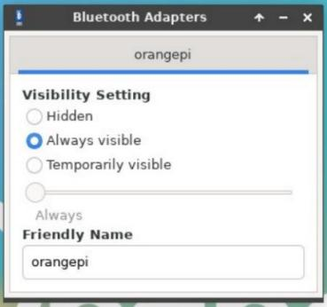
5. 然后打开蓝牙设备的配置界面

6. 点击 **Search** 即可开始扫描周围的蓝牙设备

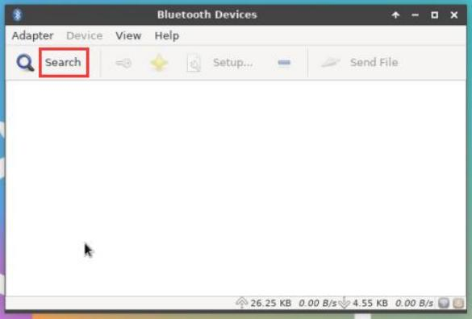
7. 然后选择想要连接的蓝牙设备，再点击鼠标右键就会弹出对此蓝牙设备的操作界面，选择 **Pair** 即可开始配对，这里演示的是和 Android 手机配对

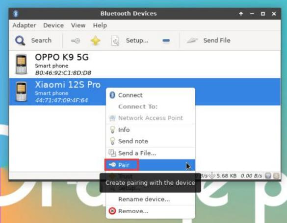
8. 配对时，桌面的右上角会弹出配对确认框，选择 **Confirm**确认即可，此时手机上也同样需要进行确认

9. 和手机配对完后，可以选择已配对的蓝牙设备，然后右键选择 **Send a File** 即可开始给手机发送一张图片

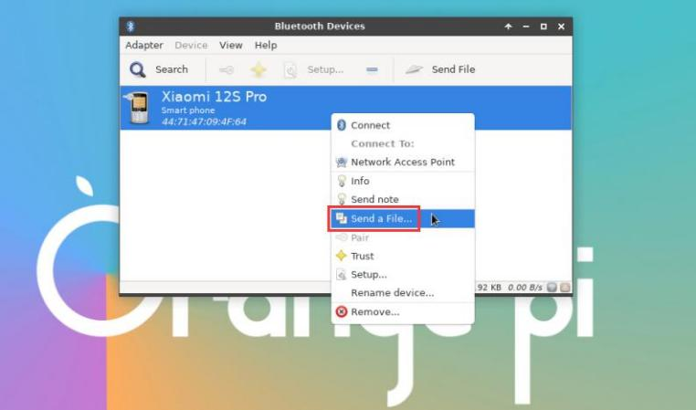
10. 发送图片的界面如下所示

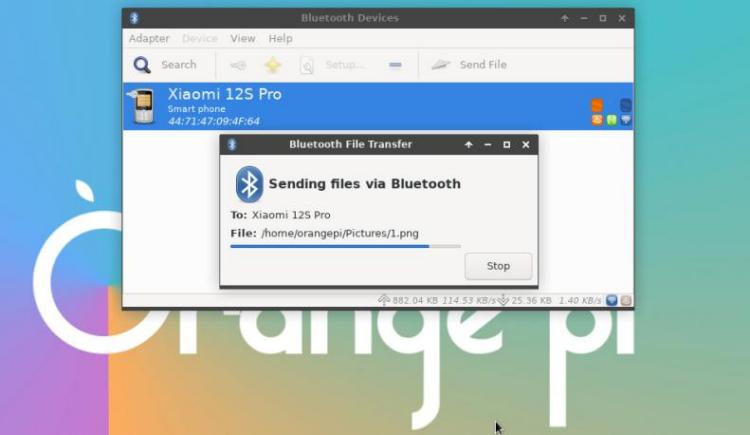

#### 3.10.2. 服务器版镜像的使用方法

1. 进入系统后首先可以通过 **hciconfig** 命令来查看是否存在蓝牙的设备节点，如果存在，说明蓝牙初始化正常
orangepi@orangepi:\~\$ sudo apt update && sudo apt install -y bluez orangepi@orangepi:\~\$ hciconfig -a
hci0: Type: Primary Bus: UART
BD Address: 3E:61:3D:19:0E:52 ACL MTU: 1021:8 SCO MTU: 240:3 UP RUNNING
RX bytes:925 acl:0 sco:0 events:72 errors:0
TX bytes:5498 acl:0 sco:0 commands:72 errors:0
Features: 0xbf 0xff 0x8d 0xfe 0xdb 0x3d 0x7b 0xc7
Packet type: DM1 DM3 DM5 DH1 DH3 DH5 HV1 HV2 HV3
Link policy: RSWITCH SNIFF
Link mode: SLAVE ACCEPT
Name: \'orangepi\'
Class: 0x3c0000
Service Classes: Rendering, Capturing, Object Transfer, Audio
Device Class: Miscellaneous,
HCI Version: 5.0 (0x9) Revision: 0x400
LMP Version: 5.0 (0x9) Subversion: 0x400
Manufacturer: Spreadtrum Communications Shanghai Ltd (492)

2. 使用 **bluetoothctl** 扫描蓝牙设备
orangepi@orangepi:\~\$ sudo bluetoothctl
\[NEW\] Controller 10: 11: 12: 13: 14: 15 orangepizero3 \[default\] Agent registered
\[bluetooth\]# power on #使能控制器
Changing power on succeeded
\[bluetooth\]# discoverable on #设置控制器为可被发现的Changing discoverable on succeeded
\[CHG\] Controller 10: 11: 12: 13: 14: 15 Discoverable: yes \[bluetooth\]# pairable on #设置控制器为可配对的Changing pairable on succeeded
\[bluetooth\]# scan on #开始扫描周围的蓝牙设备Discovery started
\[CHG\] Controller 10: 11: 12: 13: 14: 15 Discovering: yes \[NEW\] Device 76:60:79:29:B9:31 76-60-79-29-B9-31
\[NEW\] Device 9C:2E:A1:42:71: 11 小米手机
\[NEW\] Device DC:72:9B:4C:F4:CF orangepi

\[bluetooth\]# scan off #扫描到想连接的蓝牙设备后就可以关闭扫描了，然后记
下蓝牙设备的 MAC 地址，这里测试的蓝牙设备为 Android 手机，蓝牙的名字为orangepi ，对应的 MAC 地址为 DC:72:9B:4C:F4:CF
Discovery stopped
\[CHG\] Controller 10: 11: 12: 13: 14: 15 Discovering: no \[CHG\] Device DC:72:9B:4C:F4:CF RSSI is nil

3. 扫描到想配对的设备后就可以进行配对了，配对需要使用设备的MAC 地址
\[bluetooth\]# pair DC:72:9B:4C:F4:CF #使用扫描到的蓝牙设备的 MAC 地址进行配对
Attempting to pair with DC:72:9B:4C:F4:CF
\[CHG\] Device DC:72:9B:4C:F4:CF Connected: yes Request confirmation
\[leeb1m\[agent\] Confirm passkey 764475 (yes/no): yes #在这里输入 yes ，在手机上也需要确认
\[CHG\] Device DC:72:9B:4C:F4:CF Modalias: bluetooth:v010Fp107Ed1436
\[CHG\] Device DC:72:9B:4C:F4:CF UUIDs: 0000046a-0000-1000-8000-00805f9b34fb
\[CHG\] Device DC:72:9B:4C:F4:CF ServicesResolved: yes
\[CHG\] Device DC:72:9B:4C:F4:CF Paired: yes
Pairing successful #提示配对成功
\[CHG\] Device DC:72:9B:4C:F4:CF ServicesResolved: no
\[CHG\] Device DC:72:9B:4C:F4:CF Connected: no

4. 配对成功后，手机蓝牙界面的显示如下所示

5. 连接蓝牙设备需要安装 **pulseaudio-module-bluetooth** 软件包 ，然后再启动**pulseaudio** 服务
orangepi@orangepi:\~\$ sudo apt update

orangepi@orangepi:\~\$ sudo apt -y install pulseaudio-module-bluetooth orangepi@orangepi:\~\$ pulseaudio \--start

6. 连接蓝牙设备的方法
orangepi@orangepi:\~\$ sudo bluetoothctl
Agent registered
\[bluetooth\]# paired-devices #查看已配对的蓝牙设备的 MAC 地址Device DC:72:9B:4C:F4:CF orangepi
\[bluetooth\]# connect DC:72:9B:4C:F4:CF #使用 MAC 地址连接蓝牙设备Attempting to connect to DC:72:9B:4C:F4:CF
\[CHG\] Device DC:72:9B:4C:F4:CF Connected: yes
Connection successful
\[CHG\] Device DC:72:9B:4C:F4:CF ServicesResolved: yes
\[CHG\] Controller 10: 11: 12: 13: 14: 15 Discoverable: no
\[orangepi\]# #出现这个提示符说明连接成功

7. 连接完蓝牙设备后，Android 手机的蓝牙配置界面就可以看到**已连接用于通话和媒体的音频**的提示

### 3.11. USB 接口测试

USB 接口是可以接 USB hub 来扩展 USB 接口的数量的。

#### 3.11.1. 连接 USB 鼠标或键盘测试

1. 将 USB 接口的键盘插入 Orange Pi 开发板的 USB 接口中
2. 连接 Orange Pi 开发板到 HDMI 显示器
3. 如果鼠标或键盘能正常操作系统说明 USB 接口使用正常（鼠标只有在桌面版的系统中才能使用）

#### 3.11.2. 连接 USB 存储设备测试

1. 首先将 U 盘或者 USB 移动硬盘插入 Orange Pi 开发板的 USB 接口中
2. 执行下面的命令如果能看到sdX 的输出说明U 盘识别成功
| orangepi@orangepi:\~\$ **cat /proc/partitions \ 8 0 30044160 sda 8 1 30043119 sda1 | grep \"sd\*\"** major minor #blocks name |
| --- | --- |

3. 使用 mount 命令可以将 U 盘挂载到**/mnt** 中，然后就能查看 U 盘中的文件了
orangepi@orangepi:\~\$ sudo mount /dev/sda1 /mnt/ orangepi@orangepi:\~\$ ls /mnt/
test.txt

4. 挂载完后通过 **df****-h** 命令就能查看 U 盘的容量使用情况和挂载点
| orangepi@orangepi:\~\$ **df -h \ /dev/sda1 29G 208K 29G 1% /mnt | grep \"sd\"** |
| --- | --- |

#### 3.11.3. USB 以太网卡测试

1. 目前**测试过**能用的 USB 以太网卡如下所示，其中 RTL8153 USB 千兆网卡插入开发板的 USB2.0 Host 接口中测试可以正常使用，但是速率是达不到千兆的，这点请注意
| 序号 | 型号 |
| --- | --- |
| 1 | RTL8152B USB 百兆网卡 |
| 2 | RTL8153 USB 千兆网卡 |

2. 首先将 USB 网卡插入开发板的 USB 接口中，然后在 USB 网卡中插入网线，确保网线能正常上网，如果通过 **dmesg** 命令可以看到下面的 log 信息，说明 USB 网卡
识别正常
| orangepi@orangepi:\~\$ **dmesg \ \[ 121.985016\] usb 3-1: USB disconnect, device number 2 \[ 126.873772\] sunxi-ehci 5311000.ehci3-controller: ehci_irq: highspeed device connect \[ 127.094054\] usb 3-1: new high-speed USB device number 3 using sunxi-ehci \[ 127.357472\] usb 3-1: reset high-speed USB device number 3 using sunxi-ehci \[ 127.557960\] r8152 3-1: 1.0 eth1: v1.08.9 \[ 127.602642\] r8152 3-1: 1.0 enx00e04c362017: renamed from eth1 \[ 127.731874\] IPv6: ADDRCONF(NETDEV_UP): enx00e04c362017: link is not ready \[ 127.763031\] IPv6: ADDRCONF(NETDEV_UP): enx00e04c362017: link is not ready \[ 129.892465\] r8152 3-1: 1.0 enx00e04c362017: carrier on \[ 129.892583\] IPv6: ADDRCONF(NETDEV_CHANGE): enx00e04c362017: link becomes ready | tail** |
| --- | --- |

3. 然后通过 ifconfig 命令可以看到 USB 网卡的设备节点，以及自动分配的IP 地址
orangepi@orangepi:\~\$ sudo ifconfig
enx00e04c362017: flags=4163\<UP,BROADCAST,RUNNING,MULTICAST\> mtu 1500
inet 192.168.1.177 netmask 255.255.255.0 broadcast 192.168.1.255 inet6 fe80::681f:d293:4bc5:e9fd prefixlen 64 scopeid 0x20\<link\>
ether 00:e0:4c:36:20: 17 txqueuelen 1000 (Ethernet)
RX packets 1849 bytes 134590 (134.5 KB)
RX errors 0 dropped 125 overruns 0 frame 0
TX packets 33 bytes 2834 (2.8 KB)
TX errors 0 dropped 0 overruns 0 carrier 0 collisions 0

4. 测试网络连通性的命令如下
orangepi@orangepi:\~\$ [ping www.baidu.com -I](pingwww.baidu.com-I) enx00e04c362017
[PING www.a.shifen.com](PINGwww.a.shifen.com) ( [14.215.177.38](14.215.177.38)) from [192.168.1.12](192.168.1.12) eth0: 56(84) bytes of data.
64 bytes from 14.215.177.38 (14.215.177.38): icmp_seq=1 ttl=56 time=6.74 ms
64 bytes from 14.215.177.38 (14.215.177.38): icmp_seq=2 ttl=56 time=6.80 ms
64 bytes from 14.215.177.38 (14.215.177.38): icmp_seq=3 ttl=56 time=6.26 ms
64 bytes from 14.215.177.38 (14.215.177.38): icmp_seq=4 ttl=56 time=7.27 ms \^C
\-\-- [www.a.shifen.com ping statistics \-\--](https://www.a.shifen.compingstatistics---)

4 packets transmitted, 4 received, 0% packet loss, time 3002ms rtt min/avg/max/mdev = 6.260/6.770/7.275/0.373 ms

#### 3.11.4. USB 摄像头测试

1. 首先将 USB 摄像头插入到 Orange Pi 开发板的 USB 接口中
2. 然后通过 lsmod 命令可以看到内核自动加载了下面的模块
orangepi@orangepi:\~\$ lsmod
Module Size Used by
uvcvideo 106496 0

3. 通过v4l2-ctl 命令可以看到 USB 摄像头的设备节点信息为/dev/video0
orangepi@orangepi:\~\$ sudo apt update
orangepi@orangepi:\~\$ sudo apt install -y v4l-utils orangepi@orangepi:\~\$ v4l2-ctl \--list-devices
USB 2.0 Camera (usb-sunxi-ehci-1):
/dev/video0

> 注意 v4l2 中的 l 是小写字母 l ，不是数字 1。
另外 video 的序号不一定都是 video0 ，请以实际看到的为准。

4. 使用 fswebcam 测试 USB 摄像头a. 安装 fswebcam
orangepi@orangepi:\~\$ sudo apt update
orangepi@orangepi:\~\$ sudo apt-get install -y fswebcam

b. 安装完 fswebcam后可以使用下面的命令来拍照
a\) -d 选项用于指定 USB 摄像头的设备节点
b\) \--no-banner 用于去除照片的水印
c\) -r 选项用于指定照片的分辨率
d\) -S 选项用设置于跳过前面的帧数
e\) ./image.jpg 用于设置生成的照片的名字和路径
orangepi@orangepi:\~\$ sudo fswebcam -d /dev/video0 \\ \--no-banner -r 1280x720 -S 5 ./image.jpg

c. 在服务器版的 linux 系统中，拍完照后可以使用scp 命令将拍好的图片传到Ubuntu PC 上镜像观看
orangepi@orangepi:\~\$ scp image.jpg <test@192.168.1.55:/home/test>（根据实际情况修改 IP 地址和路径）

d. 在桌面版的 linux 系统中，可以通过 HDMI 显示器直接查看拍摄的图片
5. 使用 mjpg-streamer 测试 USB 摄像头
a. 下载 mjpg-streamer
a\) Github 的下载地址：
orangepi@orangepi:\~\$ git clone <https://github.com/jacksonliam/mjpg-streamer>

b\) Gitee 的镜像下载地址为：
orangepi@orangepi:\~\$ git clone <https://gitee.com/leeboby/mjpg-streamer>

b. 安装依赖的软件包
a\) Ubuntu 系统
orangepi@orangepi:\~\$ sudo apt-get install -y cmake libjpeg8-dev

b\) Debian 系统
orangepi@orangepi:\~\$ sudo apt-get install -y cmake libjpeg62-turbo-dev

c. 编译安装 mjpg-streamer
orangepi@orangepi:\~\$ cd mjpg-streamer/mjpg-streamer-experimental
orangepi@orangepi:\~/mjpg-streamer/mjpg-streamer-experimental\$ make -j4
orangepi@orangepi:\~/mjpg-streamer/mjpg-streamer-experimental\$ sudo make install

d. 然后输入下面的命令启动 mjpg_streamer
| 注意，video 的序号不一定都是 video0 ，请以实际看到的为准。 | orangepi@orangepi:\~/mjpg-streamer/mjpg-streamer-experimental\$ export LD_LIBRARY_PATH=. orangepi@orangepi:\~/mjpg-streamer/mjpg-streamer-experimental\$ sudo ./mjpg_streamer -i \"./[input_uvc.so -d](input_uvc.so-d) \\ /dev/video0 -u -f 30\" -o \"./output\_[http.so -w /www](http.so-w/www)\" |  |
| --- | --- | --- |

e. 然后在和开发板同一局域网的Ubuntu PC 或者 Windows PC 或者手机的浏览器中输入【**开发板的IP 地址:8080**】就能看到摄像头输出的视频了

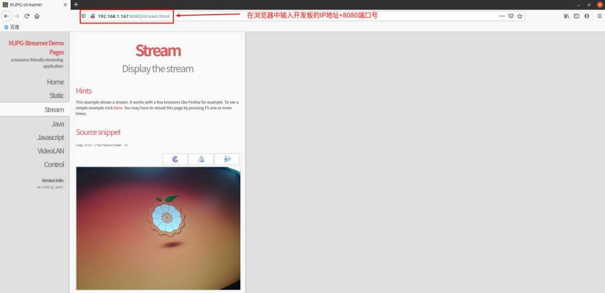

### 3.12. 音频测试

#### 3.12.1. 使用命令行播放音频的方法

##### 3.12.1.1. 耳机接口播放音频测试

1. 首先需要将 13pin 扩展板插入到 Orange Pi 开发板的 13pin 接口中，然后在音频接口中插入耳机

2. 通过 **aplay****-l** 命令可以查看 linux 系统支持的声卡设备
a. linux5.4 系统的输出如下所示，其中 **card 0: audiocodec** 就是耳机播放需要的声卡设备
root@orangepi:\~# aplay -l
\*\*\*\* List of PLAYBACK Hardware Devices \*\*\*\*
card 0: audiocodec \[audiocodec\], device 0: SUNXI-CODEC sun50iw9-codec-0 \[\]

Subdevices: 1/1
Subdevice #0: subdevice #0

b. linux6.1 系统的输出如下所示，其中 **audiocodec** 就是耳机播放需要的声卡设备
root@orangepi:\~# aplay -l
\*\*\*\* List of PLAYBACK Hardware Devices \*\*\*\*
card 0: audiocodec \[audiocodec\], device 0: CDC PCM Codec-0 \[CDC PCM Codec-0\]
Subdevices: 1/1
Subdevice #0: subdevice #0

3. 然后使用**aplay** 命令播放音频，耳机就能听到声音了
root@orangepi:\~# aplay -D hw:0,0 /usr/share/sounds/alsa/audio.wav
Playing WAVE \'audio.wav\' : Signed 16 bit Little Endian, Rate 44100 Hz, Stereo

如果耳机测试有杂音，请将耳机拔出来一些，不要全部插到底。

##### 3.12.1.2. HDMI 音频播放测试

1. 首先使用 Micro HDMI 转 HDMI 线将 Orange Pi 开发板连接到电视机上（其他的HDMI 显示器需要确保可以播放音频）
2. HDMI 音频播放无需其他设置，直接使用**aplay** 命令播放即可
root@orangepi:\~# aplay -D hw:2,0 /usr/share/sounds/alsa/audio.wav

#### 3.12.2. 在桌面系统中测试音频方法

1. 首先打开文件管理器

2. 然后找到下面这个文件（如果系统中没有这个音频文件，可以自己上传一个音频文件到系统中）

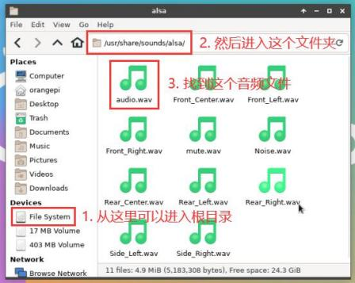
3. 然后选中audio.wav 文件，右键选择使用vlc 打开就可以开始播放

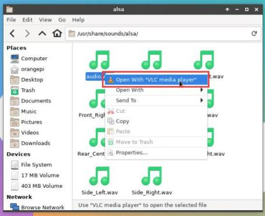
4. 切换 HDMI 播放和耳机播放等不同音频设备的方法a. 首先打开音量控制界面

b. 播放音频的时候，在 **Playback** 中会显示播放软件可以使用的音频设备选项，如下图所示，在这里可以设置需要播放到哪个音频设备

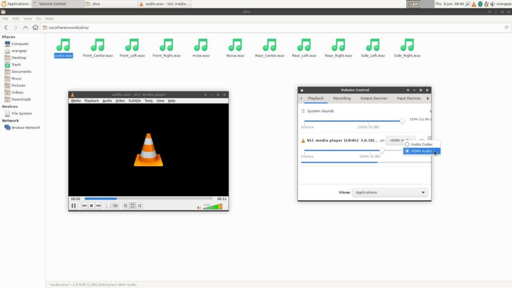

### 3.13. 红外接收测试

1. 首先需要将 13pin扩展板插入到 Orange Pi 开发板的 13pin接口中，插入扩展板后，开发板才能使用红外接收功能

2. 安装 ir-keytable 红外测试软件
orangepi@orangepi:\~\$ sudo apt update
orangepi@orangepi:\~\$ sudo apt-get install -y ir-keytable

3. 然后执行 ir-keytable 可以查看红外设备的信息a. linux5.4 系统输出如下所示
orangepi@orangepi:\~\$ ir-keytable
Found /sys/class/rc/rc0/ (/dev/input/event1) with:
Driver: sunxi-rc-recv, table: rc_map_sunxi

lirc device: /dev/lirc0
Supported protocols: lirc nec
Enabled protocols: lirc nec
Name: sunxi_ir_recv
bus: 25, vendor/product: 0001:0001, version: 0x0100 Repeat delay = 500 ms, repeat period = 125 ms

b. linux6.1 系统的输出如下所示
orangepi@orangepi:\~\$ ir-keytable Found /sys/class/rc/rc0/ with:
Name: sunxi-ir
Driver: sunxi-ir
Default keymap: rc-empty
Input device: /dev/input/event5
LIRC device: /dev/lirc0
Attached BPF protocols: Operation not permitted
Supported kernel protocols: lirc rc-5 rc-5-sz jvc sony nec sanyo mce_kbd rc-6 sharp xmp imon rc-mm
Enabled kernel protocols: lirc
bus: 25, vendor/product: 0001:0001, version: 0x0100
Repeat delay = 500 ms, repeat period = 125 ms

4. 测试红外接收功能前需要准备一个 Orange Pi 专用的红外遥控器，**其他遥控器不支持**

5. 然后在终端中输入 **ir-keytable -t** 命令，再使用红外遥控器对着 Orange Pi 开发板的红外接收头按下按键就能在终端中看到接收到的按键编码了
a. linux5.4 系统输出如下所示
orangepi@orangepi:\~\$ sudo ir-keytable -t
Testing events. Please, press CTRL-C to abort.

1598339152.260376: event type EV_MSC(0x04): scancode = 0xfb0413
1598339152.260376: event type EV_SYN(0x00).
1598339152.914715: event type EV_MSC(0x04): scancode = 0xfb0410

b. linux6.1 系统输出如下所示
orangepi@orangepi:\~\$ sudo ir-keytable -c -p NEC -t Old keytable cleared
Protocols changed to nec
Testing events. Please, press CTRL-C to abort.
202.063219: lirc protocol(nec): scancode = 0x45c
202.063249: event type EV_MSC(0x04): scancode = 0x45c
202.063249: event type EV_SYN(0x00).

### 3.14. 温度传感器

#### 3.14.1. linux5.4 系统查看温度的方法

H618 总共有 4 个温度传感器，查看温度的命令如下所示：
显示的温度值需要除以 1000 ，单位才是摄氏度。

a. sensor0：CPU 的温度传感器，第一条命令用于查看温度传感器的类型，第二条命令用于查看温度传感器的数值
orangepi@orangepi:\~\$ cat /sys/class/thermal/thermal_zone0/type cpu\_thermal_zone
orangepi@orangepi:\~\$ cat /sys/class/thermal/thermal_zone0/temp 57734

b. sensor1：DDR 的温度传感器，第一条命令用于查看温度传感器的类型，第二条命令用于查看温度传感器的数值
orangepi@orangepi:\~\$ cat /sys/class/thermal/thermal_zone1/type ddr\_thermal_zone
orangepi@orangepi:\~\$ cat /sys/class/thermal/thermal_zone1/temp 57410

c. sensor2：GPU 的温度传感器，第一条命令用于查看温度传感器的类型，第二条命令用于查看温度传感器的数值
orangepi@orangepi:\~\$ cat /sys/class/thermal/thermal_zone2/type gpu\_thermal_zone
orangepi@orangepi:\~\$ cat /sys/class/thermal/thermal_zone2/temp

59273

| d\. sensor3：VE 的温度传感器，第一条命令用于查看温度传感器的类型， 条命令用于查看温度传感器的数值 | 第二 |
| --- | --- |

orangepi@orangepi:\~\$ cat /sys/class/thermal/thermal_zone3/type ve\_thermal_zone
orangepi@orangepi:\~\$ cat /sys/class/thermal/thermal_zone3/temp 58949

#### 3.14.2. linux6.1 系统查看温度的方法

orangepi@orangepi:\~\$ sensors cpu_thermal-virtual-0
Adapter: Virtual device
temp1: +47.4°C (crit = + 110.0°C)
gpu_thermal-virtual-0
Adapter: Virtual device
temp1: +48.7°C (crit = + 110.0°C)
ddr_thermal-virtual-0
Adapter: Virtual device
temp1: +47.8°C (crit = + 110.0°C)
ve_thermal-virtual-0
Adapter: Virtual device
temp1: +47.2°C (crit = + 110.0°C)

### 3.15. 13 Pin 扩展板接口引脚说明

1. 开发板 13 pin扩展板接口引脚的顺序请参考下图

2. 开发板 13pin接口的原理图如下所示

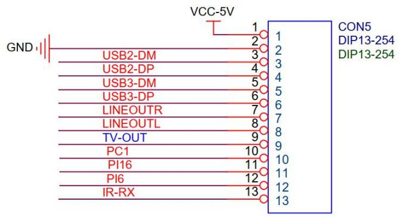
3. 开发板 13 pin扩展板接口引脚的功能说明如下
a. 13pin 引脚接扩展板时，可以额外提供
a\) 2 个 USB 2.0 Host
b\) 耳机左右声道音频输出
c\) TV-OUT 视频输出
d\) 红外接收功能
e\) 接了扩展板后 13pin 接口的 10 、11 和 12 号引脚就无法使用了
f\) 另外需要注意 13pin 扩展板上的 MIC 在 Orange Pi Zero 3 上是无法使用的
b. 13pin 引脚不接扩展板时，10 、11 、12 和 13 号引脚可当作普通 GPIO 口来使用
| GPIO 序号 | 功能 5V GND USB2-DM USB2-DP USB3-DM | 引脚 1 2 3 4 5 |
| --- | --- | --- |

|  | USB3-DP LINEOUTR LINEOUTL TV-OUT | 6 7 8 9 |
| --- | --- | --- |
| 65 | PC1 | 10 |
| 272 | PI16 | 11 |
| 262 | PI6 | 12 |
| 234 | IR-RX/PH10 | 13 |

### 3.16. 26 Pin 接口引脚说明

1. Orange Pi Zero 3 开发板 26 pin 接口引脚的顺序请参开发板上的丝印图

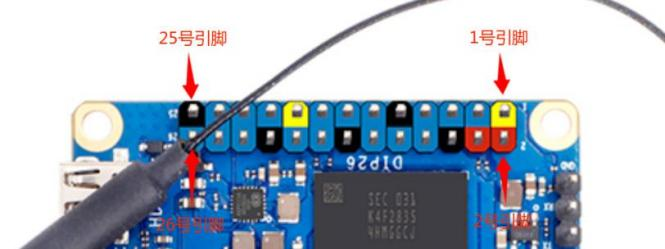
| GPIO序号 | GPIO | 功能 3.3V | 引脚 1 |
| --- | --- | --- | --- |
| 229 | PH5 | TWI3-SDA | 3 |
| 228 | PH4 | TWI3-SCK | 5 |
| 73 | PC9 | PC9 GND | 7 9 |
| 70 | PC6 | PC6 | 11 |
| 69 | PC5 | PC5 | 13 |
| 72 | PC8 | PC8 3.3V | 15 17 |
| 231 | PH7 | SPI1_MOSI | 19 |
| 232 | PH8 | SPI1_MISO | 21 |
| 230 | PH6 | SPI1_CLK GND | 23 25 |

2. 开发板 26 pin接口引脚的功能如下表所示
| 引脚 | 功能 | GPIO | GPIO序号 |
| --- | --- | --- | --- |
| 2 | 5V |  |  |
| 4 | 5V |  |  |
| 6 | GND |  |  |
| 8 | UART5_TX | PH2 | 226 |
| 10 | UART5_RX | PH3 | 227 |
| 12 | PC11 | PC11 | 75 |
| 14 | GND |  |  |
| 16 | PC15 | PC15 | 79 |
| 18 | PC14 | PC14 | 78 |
| 20 | GND |  |  |
| 22 | PC7 | PC7 | 71 |
| 24 | SPI1_CS | PH9 | 233 |
| 26 | PC10 | PC10 | 74 |

3. 26pin 接口中总共有 **17** 个 GPIO 口，所有 GPIO 口的电压都是 **3.3v**

### 3.17. 安装 wiringOP 的方法

------------------------------------------------------------------------------------------------------------------------------------------------------

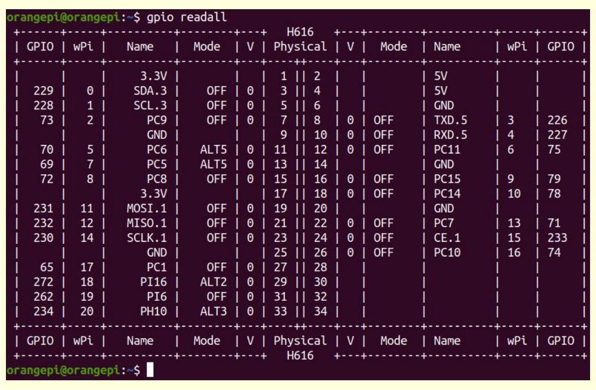
------------------------------------------------------------------------------------------------------------------------------------------------------
1. 下载 wiringOP 的代码
orangepi@orangepi:\~\$ sudo apt update
orangepi@orangepi:\~\$ sudo apt install -y git

orangepi@orangepi:\~\$ git clone [https://github.com/orangepi-xunlong/wiringOP.git -b next](https://github.com/orangepi-xunlong/wiringOP.git-bnext)

> 注意，源码需要下载 wiringOP next 分支的代码，请别漏了-b next 这个参数。
如果从 GitHub 下载代码有问题，可以直接使用 Linux 镜像中自带的wiringOP源码，存放位置为：/usr/src/wiringOP。

2. 编译安装 wiringOP
orangepi@orangepi:\~\$ cd wiringOP
orangepi@orangepi:\~/wiringOP\$ sudo ./build clean
orangepi@orangepi:\~/wiringOP\$ sudo ./build

3. 测试 gpio readall 命令的输出如下
a. 其中 1 到 26 号引脚与开发板上的26 Pin 引脚是一一对应的
b. 27 号引脚对应开发板上 13pin 的 10 号引脚
c. 29 号引脚对应开发板上 13pin 的 11 号引脚
d. 31 号引脚对应开发板上 13pin 的 12 号引脚
e. 33 号引脚对应开发板上 13pin 的 13 号引脚
**f. 28 、30 、32 、34 号引脚为空，请直接忽略**

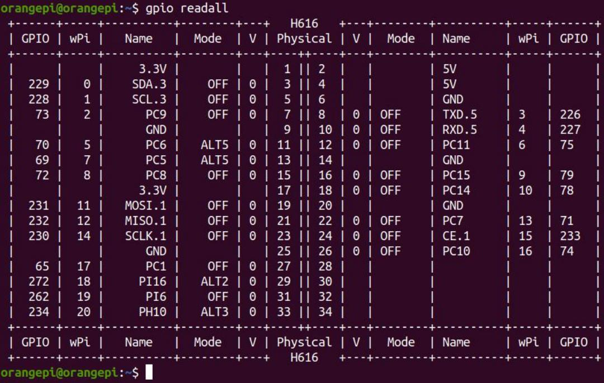

### 3.18. 26pin 接口 GPIO 、I2C 、UART 、SPI 和 PWM 测试

#### 3.18.1. 26pin GPIO 口测试

1. 下面以 7 号引脚------对应 GPIO 为 PC9------对应 wPi 序号为 2------为例演示如何设置 GPIO 口的高低电平

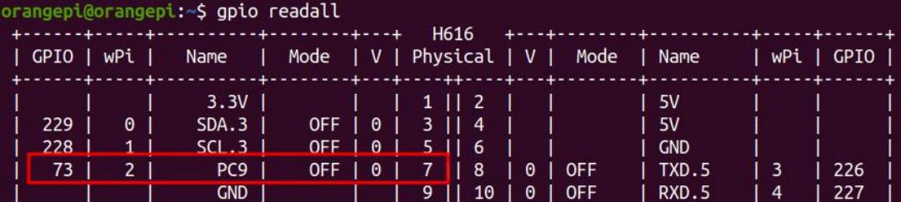
2. 首先设置 GPIO 口为输出模式，其中第三个参数需要输入引脚对应的 wPi 的序号
root@orangepi:\~/wiringOP# gpio mode 2 out

3. 然后设置 GPIO 口输出低电平，设置完后可以使用万用表测量引脚的电压的数值，如果为0v ，说明设置低电平成功
root@orangepi:\~/wiringOP# gpio write 2 0

使用 gpio readall 可以看到 7 号引脚的值(V)变为了 0

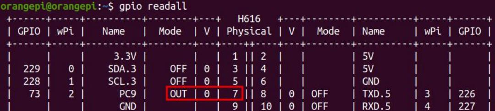
4. 然后设置 GPIO 口输出高电平，设置完后可以使用万用表测量引脚的电压的数值，如果为3.3v ，说明设置高电平成功
root@orangepi:\~/wiringOP# gpio write 2 1

使用 gpio readall 可以看到 7 号引脚的值(V)变为了 1

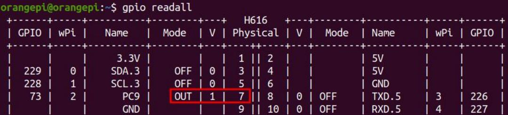
5. 其他引脚的设置方法类似，只需修改 wPi 的序号为引脚对应的序号即可

#### 3.18.2. 26 pin GPIO 口上下拉电阻的设置方法

1. 下面以 7 号引脚------对应 GPIO 为 PC9------对应 wPi 序号为 2------为例演示如何设置 GPIO 口的上下拉电阻

2. 首先需要设置 GPIO 口为输入模式，其中第三个参数需要输入引脚对应的 wPi 的序号
root@orangepi:\~/wiringOP# gpio mode 2 in

3. 设置为输入模式后，执行下面的命令可以设置 GPIO 口为上拉模式
root@orangepi:\~/wiringOP# gpio mode 2 up

4. 然后输入下面的命令读取 GPIO 口的电平，如果电平为 1 ，说明上拉模式设置成功
root@orangepi:\~/wiringOP# gpio read 2 1

5. 然后执行下面的命令可以设置 GPIO 口为下拉模式
root@orangepi:\~/wiringOP# gpio mode 2 down

6. 然后输入下面的命令读取 GPIO 口的电平，如果电平为0 ，说明下拉模式设置成
功
root@orangepi:\~/wiringOP# gpio read 2 0

#### 3.18.3. 26pin SPI 测试

1. 由 26pin 接口的原理图可知，可用的 spi 为 spi1

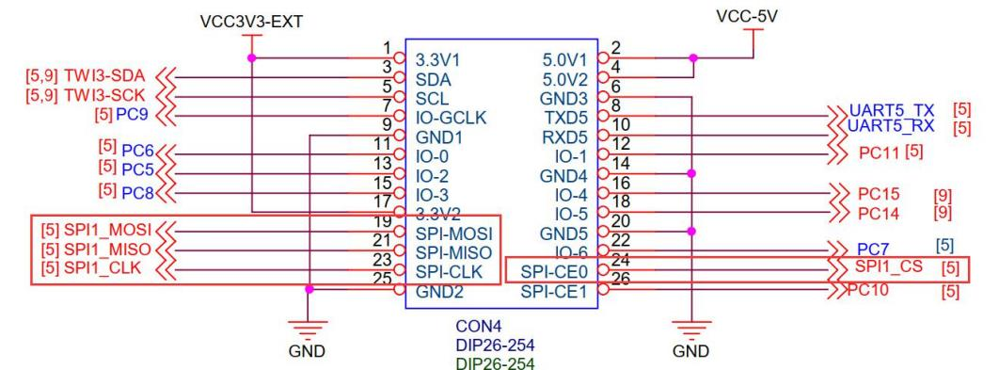
2. Linux 系统中 spi1 默认是关闭的，需要手动打开才能使用。打开步骤如下所示： a. 首先运行下 **orangepi-config** ，普通用户记得加 **sudo** 权限
orangepi@orangepi:\~\$ sudo orangepi-config

b. 然后选择 **System**

c. 然后选择 **Hardware**

d. 然 后 使 用 键 盘 的 方 向 键 定 位 到 下 图所 示 的 位置 ， 再 使 用 空 格 选 中**spi1-cs1-spidev**

e. 然后选择**\<Save\>**保存

f. 然后选择**\<Back\>**

g. 然后选择**\<Reboot\>**重启系统使配置生效

3. 然后查看下 linux 系统中是否存在 **spidev1.1** 的设备节点，如果存在，说明 SPI1的配置已经生效了
orangepi@orangepi:\~\$ ls /dev/spidev1\* /dev/spidev1.1

4. 先不短接 SPI1 的 mosi 和 miso 两个引脚，运行 spidev_test 的输出结果如下所示，可以看到TX 和 RX 的数据不一致
| orangepi@orangepi:\~\$ sudo spidev_test -v -D /dev/spidev1.1 spi mode: 0x0 bits per word: 8 max speed: 500000 Hz (500 KHz)  |  |  |
| --- | --- | --- |
| TX \  | FF FF FF FF FF FF 40 00 00 00 00 95 FF FF FF FF FF FF FF FF FF FF FF FF FF FF FF FF FF FF F0 0D \ | @\....▒ ▒ . |
| RX \ | FF FF FF FF FF FF FF FF FF FF FF FF FF FF FF FF FF FF FF FF FF FF FF FF FF FF FF FF FF FF FF FF \ | \...\...\...\...\...\...\...\...\...\..... |

5. 然后短接 SPI1 的 mosi（26pin 接口中的第 19 号引脚）和 miso（26pin 接口中的第 21 号引脚）两个引脚再运行 spidev_test 的输出如下，可以看到发送和接收的数据一样
| orangepi@orangepi:\~\$ sudo spidev_test -v -D /dev/spidev1.1 spi mode: 0x0 bits per word: 8 max speed: 500000 Hz (500 KHz)  |  |  |
| --- | --- | --- |
| TX \  | FF FF FF FF FF FF 40 00 00 00 00 95 FF FF FF FF FF FF FF FF FF FF FF FF FF FF FF FF FF FF F0 0D \ | @\....▒ ▒ . |
| RX \ | FF FF FF FF FF FF 40 00 00 00 00 95 FF FF FF FF FF FF FF FF FF FF FF FF FF FF FF FF FF FF F0 0D \ | @\....▒ ▒ . |

#### 3.18.4. 26pin I2C 测试

1. 由 26pin 的原理图可知，可用的 i2c 为 i2c3

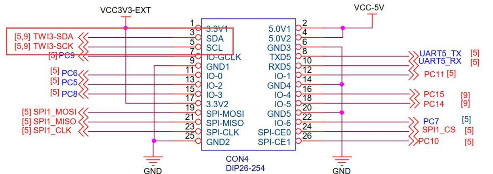
2. Linux 系统中i2c3 默认是关闭的，需要手动打开才能使用。打开步骤如下所示： a. 首先运行下 **orangepi-config** ，普通用户记得加 **sudo** 权限
orangepi@orangepi:\~\$ sudo orangepi-config

b. 然后选择 **System**

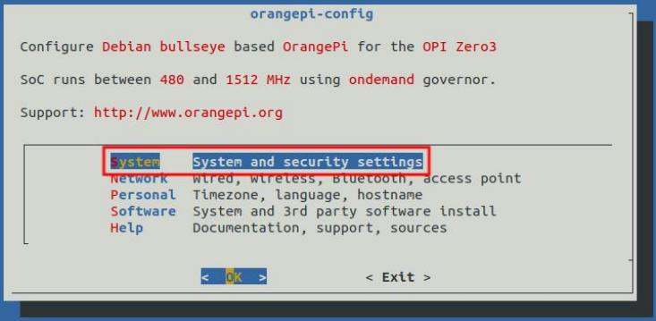
c. 然后选择 **Hardware**

d. 然后使用键盘的方向键定位到下图所示的位置，再使用**空格**选中 **ph-i2c3**

e. 然后选择**\<Save\>**保存

f. 然后选择**\<Back\>**

g. 然后选择**\<Reboot\>**重启系统使配置生效

3. 启动 linux 系统后，先确认下/dev 下存在 i2c3 的设备节点
orangepi@orangepi:\~\$ ls /dev/i2c-3 /dev/i2c-3

4. 然后开始测试 i2c ，首先安装 i2c-tools
orangepi@orangepi:\~\$ sudo apt-get update
orangepi@orangepi:\~\$ sudo apt-get install -y i2c-tools

5. 然后在 26pin 接头的 i2c3 引脚上接一个 i2c 设备
| 5V 和 3.3V 引脚请根据具体的 i2c 设备进行选择，不同的 i2c 设备需要的电压值 可能不同。 +---------------------------+--------------------------------------+ +---------------------------+--------------------------------------+ +---------------------------+--------------------------------------+ | sda 引脚 sck 引脚 5v 引脚 3.3v 引脚 | 对应 26pin 中 3 号引脚 对应 26pin 中 5 号引脚 对应 26pin 中 2 号引脚 对应 26pin 中 1 号引脚 |  |
| --- | --- | --- | --- |

| gnd 引脚 | 对应 26pin 中 6 号引脚 |
| --- | --- |

6. 然后使用 **i2cdetect -y 3** 命令如果能检测到连接的 i2c 设备的地址，就说明 i2c 能正常使用
不同的 i2c 设备地址是不同的，下图0x50 地址只是一个示例。请以实际看到的为准。

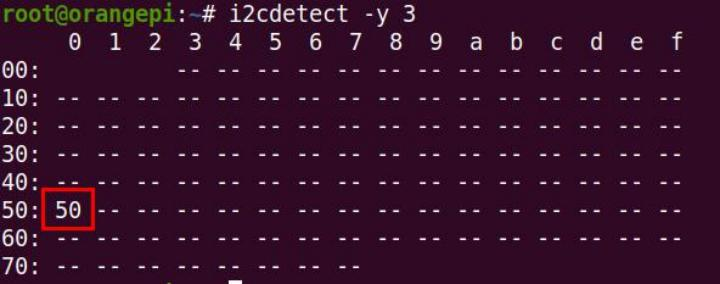

#### 3.18.5. 26pin 的 UART 测试

1. 由 26pin 接口的原理图可知，可用的 uart 为 uart5

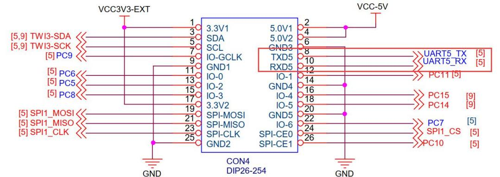
2. Linux 系统中 uart5 默认是关闭的，需要手动打开才能使用。打开步骤如下所示： a. 首先运行下 **orangepi-config** ，普通用户记得加 **sudo** 权限
orangepi@orangepi:\~\$ sudo orangepi-config

b. 然后选择 **System**

c. 然后选择 **Hardware**

d. 然后使用键盘的方向键定位到下图所示的位置，再使用**空格**选中 **ph-uart5**

e. 然后选择**\<Save\>**保存

f. 然后选择**\<Back\>**

g. 然后选择**\<Reboot\>**重启系统使配置生效

3. 进入 linux 系统后，先确认下**/dev** 下是否存在 uart5 的设备节点
| 注意，linux5.4 系统为/dev/ttyAS5。 orangepi@orangepi:\~\$ ls /dev/ttyS5 /dev/ttyS5 |  |
| --- | --- |

4. 然后开始测试uart5 接口，先使用杜邦线短接要测试的uart5 接口的 rx 和 tx
|  | uart5 |
| --- | --- |
| tx 引脚 | 对应 26pin 的 8 号引脚 |
| rx 引脚 | 对应 26pin 的 10 号引脚 |

5. 使用 wiringOP 中的 **gpio**命令测试串口的回环功能如下所示，如果能看到下面的打印，说明串口通信正常
---------------------------------------------------- ---------------------------
orangepi@orangepi:\~\$ gpio serial /dev/ttyS5 \# linux-6.1 测试命令
orangepi@orangepi:\~\$ gpio serial /dev/ttyAS5 \# linux-5.4 测试命令
---------------------------------------------------- ---------------------------
Out: 0: -\> 0
Out: 1: -\> 1
Out: 2: -\> 2
Out: 3: -\> 3\^C

#### 3.18.6. PWM 的测试方法

开发板最多可以使用4 通道 PWM ，它们所在引脚的位置如下图所示:

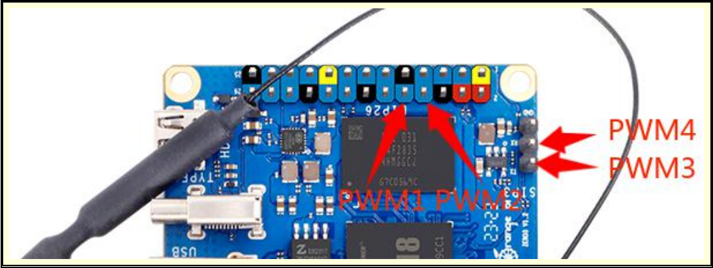
1. Linux系统中 pwm 默认是关闭的，需要手动打开才能使用。打开步骤如下所示： a. 首先运行下 **orangepi-config** ，普通用户记得加 **sudo** 权限
orangepi@orangepi:\~\$ sudo orangepi-config

b. 然后选择 **System**

c. 然后选择 **Hardware**

d. 然后使用键盘的方向键定位到下图所示的位置，再使用**空格**选中 pwm对应的配置
由于 PWM1、PWM2 和 26pin 接口中 UART5 的 RX、TX 引脚是复用的，所以打开 PWM1 和 PWM2（需要选择 ph-pwm12）时请确保没有选择 UART5 的配置（不要勾选 ph-uart5）。
PWM3 、PWM4 和调试串口中的 TX 、RX 引脚是复用的，所以使用 PWM3 和PWM4（需要选择ph-pwm34）时请将 UART0 的配置关掉（需要选择 disable-uart0），关掉 UART0 后调试串口就无法使用了。

e. 然后选择**\<Save\>**保存

f. 然后选择**\<Back\>**

g. 然后选择**\<Reboot\>**重启系统使配置生效

2. 重启后就可以开始 PWM 的测试
下面的命令请在root 用户下执行。

a. 在命令行中输入下面的命令可以让 pwm1 输出一个 50Hz 的方波
root@orangepi:\~# echo 1 \> /sys/class/pwm/pwmchip0/export
root@orangepi:\~# echo 20000000 \> /sys/class/pwm/pwmchip0/pwm1/period
root@orangepi:\~# echo 1000000 \> /sys/class/pwm/pwmchip0/pwm1/duty_cycle root@orangepi:\~# echo 1 \> /sys/class/pwm/pwmchip0/pwm1/enable

b. 在命令行中输入下面的命令可以让 pwm2 输出一个 50Hz 的方波
root@orangepi:\~# echo 2 \> /sys/class/pwm/pwmchip0/export
root@orangepi:\~# echo 20000000 \> /sys/class/pwm/pwmchip0/pwm2/period
root@orangepi:\~# echo 1000000 \> /sys/class/pwm/pwmchip0/pwm2/duty_cycle root@orangepi:\~# echo 1 \> /sys/class/pwm/pwmchip0/pwm2/enable

c. 在命令行中输入下面的命令可以让 pwm3 输出一个 50Hz 的方波
root@orangepi:\~# echo 3 \> /sys/class/pwm/pwmchip0/export
root@orangepi:\~# echo 20000000 \> /sys/class/pwm/pwmchip0/pwm3/period
root@orangepi:\~# echo 1000000 \> /sys/class/pwm/pwmchip0/pwm3/duty_cycle root@orangepi:\~# echo 1 \> /sys/class/pwm/pwmchip0/pwm3/enable

d. 在命令行中输入下面的命令可以让 pwm4 输出一个 50Hz 的方波
root@orangepi:\~# echo 4 \> /sys/class/pwm/pwmchip0/export
root@orangepi:\~# echo 20000000 \> /sys/class/pwm/pwmchip0/pwm4/period
root@orangepi:\~# echo 1000000 \> /sys/class/pwm/pwmchip0/pwm4/duty_cycle root@orangepi:\~# echo 1 \> /sys/class/pwm/pwmchip0/pwm4/enable

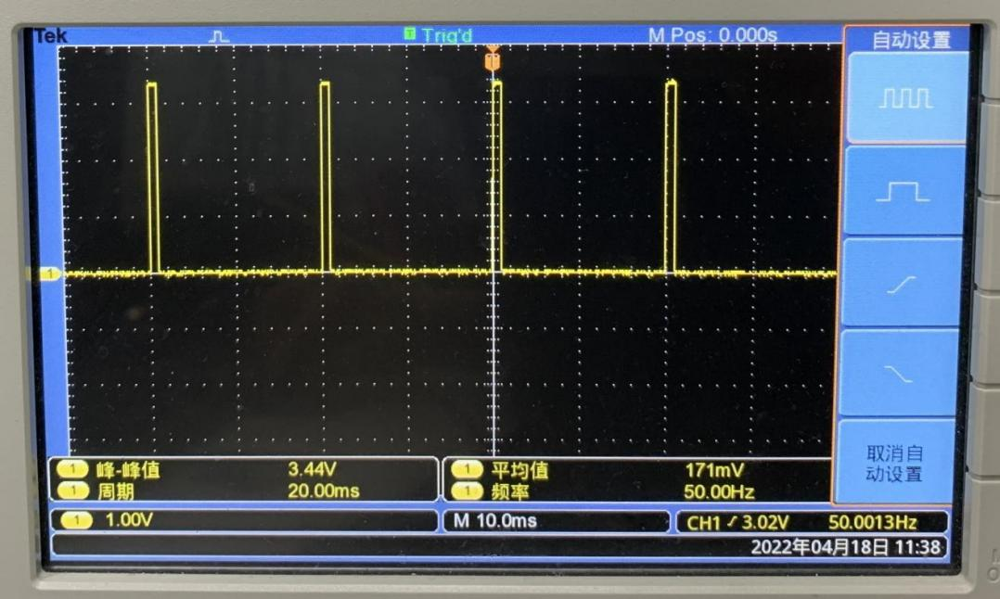

### 3.19. wiringOP-Python 的安装使用方法

wiringOP-Python 是 wiringOP 的 Python 语言版本的库，用于在 Python 程序中操作开发板的 GPIO 、I2C 、SPI 和 UART 等硬件资源。
另外请注意下面所有的命令都是在root 用户下操作的。

#### 3.19.1. wiringOP-Python 的安装方法

1. 首先安装依赖包
root@orangepi:\~# sudo apt-get update
root@orangepi:\~# sudo apt-get -y install git swig python3-dev python3-setuptools

2. 然后使用下面的命令下载 wiringOP-Python 的源码
|  | root@orangepi:\~# git clone \--recursive <https://github.com/orangepi-xunlong/wiringOP-Python -b next root@orangepi:\~# cd wiringOP-Python root@orangepi:\~/wiringOP-Python# git submodule update \--init \--remote |  |
| --- | --- | --- |

3. 然后使用下面的命令编译 wiringOP-Python 并将其安装到开发板的 Linux 系统中
root@orangepi:\~# cd wiringOP-Python
root@orangepi:\~/wiringOP-Python# python3 generate-bindings.py \> bindings.i
root@orangepi:\~/wiringOP-Python# sudo python3 [setup.py](setup.py) install

4. 然后输入下面的命令，如果有帮助信息输出，说明 wiringOP-Python 安装成功，
按下 **q** 键可以退出帮助信息的界面
root@orangepi:\~/wiringOP-Python# python3 -c \"import wiringpi; help(wiringpi)\" Help on module wiringpi:
NAME
wiringpi

DESCRIPTION
\# This file was automatically generated by SWIG (<http://www.swig.org>).
\# Version 4.0.2
\#
\# Do not make changes to this file unless you know what you are doing\--modify
\# the SWIG interface file instead.

5. 在 python 命令行下测试 wiringOP-Python 是否安装成功的步骤如下所示： a. 首先使用 python3 命令进入 python3 的命令行模式
root@orangepi:\~# python3

b. 然后导入 wiringpi 的 python 模块
\>\>\> import wiringpi;

c. 最后输入下面的命令可以查看下 wiringOP-Python 的帮助信息，按下 **q** 键可以退出帮助信息的界面
\>\>\> help(wiringpi)
Help on module wiringpi:
NAME
wiringpi
DESCRIPTION
\# This file was automatically generated by SWIG (<http://www.swig.org>).
\# Version 4.0.2
\#
\# Do not make changes to this file unless you know what you are doing\--modify
\# the SWIG interface file instead.
CLASSES
builtins.object
GPIO
I2C
Serial
nes

| class GPIO(builtins.object) \ \ \ \ \ | GPIO(pinmode=0) |
| --- | --- |

#### 3.19.2. 26pin GPIO 口测试

wiringOP-Python 跟 wiringOP 一样，也是可以通过指定 wPi 号来确定操作哪一个 GPIO 引脚，因为 wiringOP-Python 中没有查看 wPi 号的命令，所以只能通过wiringOP 中的 gpio命令来查看板子wPi 号与物理引脚的对应关系。

1. 下面以 7 号引脚------对应 GPIO 为 PC9 ------对应 wPi 序号为 2------为例演示如何设置 GPIO 口的高低电平

2. 直接用命令测试的步骤如下所示：
a. 首先设置 GPIO 口为输出模式，其中 **pinMode** 函数的第一个参数是引脚对应的 wPi 的序号，第二个参数是 GPIO 的模式
root@orangepi:\~/wiringOP-Python# python3 -c \"import wiringpi; \\ from wiringpi import GPIO; wiringpi.wiringPiSetup() ; \\
wiringpi.pinMode(2, GPIO.OUTPUT) ; \"

b. 然后设置 GPIO 口输出低电平，设置完后可以使用万用表测量引脚的电压的数值，如果为0v ，说明设置低电平成功
root@orangepi:\~/wiringOP-Python# python3 -c \"import wiringpi; \\ from wiringpi import GPIO; wiringpi.wiringPiSetup() ;\\
wiringpi.digitalWrite(2, GPIO.LOW)\"

c. 然后设置 GPIO 口输出高电平，设置完后可以使用万用表测量引脚的电压的数值，如果为3.3v ，说明设置高电平成功
root@orangepi:\~/wiringOP-Python# python3 -c \"import wiringpi; \\ from wiringpi import GPIO; wiringpi.wiringPiSetup() ;\\
wiringpi.digitalWrite(2, GPIO.HIGH)\"

3. 在 python3 的命令行中测试的步骤如下所示：
a. 首先使用 python3 命令进入 python3 的命令行模式
root@orangepi:\~# python3

b. 然后导入 wiringpi 的 python 模块
\>\>\> import wiringpi
\>\>\> from wiringpi import GPIO

c. 然后设置 GPIO 口为输出模式，其中 **pinMode** 函数的第一个参数是引脚对应的 wPi 的序号，第二个参数是 GPIO 的模式
\>\>\> wiringpi.wiringPiSetup()
0
\>\>\> wiringpi.pinMode(2, GPIO.OUTPUT)

d. 然后设置 GPIO 口输出低电平，设置完后可以使用万用表测量引脚的电压的数值，如果为0v ，说明设置低电平成功
\>\>\> wiringpi.digitalWrite(2, GPIO.LOW)

e. 然后设置 GPIO 口输出高电平，设置完后可以使用万用表测量引脚的电压的数值，如果为3.3v ，说明设置高电平成功
\>\>\> wiringpi.digitalWrite(2, GPIO.HIGH)

4. wiringOP-Python在python代码中设置GPIO 高低电平的方法可以参考下examples中的 **[blink.py](blink.py)** 测试程序，**[blink.py](blink.py)** 测试程序会设置开发板 26 pin 中所有的 GPIO 口的电压不断的高低变化
root@orangepi:\~/wiringOP-Python# cd examples
root@orangepi:\~/[wiringOP-Python/examples# ls blink.py](wiringOP-Python/examples#lsblink.py)
[blink.py](blink.py)
root@orangepi:\~/wiringOP-Python/examples\# python3 blink.py

#### 3.19.3. 26pin SPI 测试

1. 由 26pin 接口的原理图可知，可用的 spi 为 spi1

2. Linux 系统中 spi1 默认是关闭的，需要手动打开才能使用。打开步骤如下所示： a. 首先运行下 **orangepi-config** ，普通用户记得加 **sudo** 权限
orangepi@orangepi:\~\$ sudo orangepi-config

b. 然后选择 **System**

c. 然后选择 **Hardware**

d. 然 后 使 用 键 盘 的 方 向 键 定 位 到 下 图所 示 的 位置 ， 再 使 用 空 格 选 中**spi1-cs1-spidev**

e. 然后选择**\<Save\>**保存

f. 然后选择**\<Back\>**

g. 然后选择**\<Reboot\>**重启系统使配置生效

3. 然后查看下 linux 系统中是否存在 **spidev1.1** 的设备节点，如果存在，说明 SPI1的配置已经生效了
orangepi@orangepi:\~\$ ls /dev/spidev1\* /dev/spidev1.1

4. 然后可 以使用 examples 中 的 **[spidev_test.py](spidev_test.py)** 程序测试 下 SPI 的 回环功 能， **[spidev_test.py](spidev_test.py)** 程序需要指定下面的两个参数：
a. **\--channel**：指定 SPI 的通道号
b. **\--port**：指定 SPI 的端口号
5. 先不短接 SPI1 的 mosi 和 miso 两个引脚，运行 [spidev_test.py](spidev_test.py) 的输出结果如下所示，可以看到 TX 和 RX 的数据不一致
| root@orangepi:\~/wiringOP-Python# cd examples root@orangepi:\~/wiringOP-Python/examples# python3 spidev_test.py \\ \--channel 1 \--port 1 spi mode: 0x0 max speed: 500000 Hz (500 KHz) Opening device /dev/spidev1.1  |  |  |  |
| --- | --- | --- | --- |
| TX \  | FF FF FF FF FF FF 40 00 00 00 00 95 FF FF FF FF FF FF FF FF FF FF FF FF FF FF FF FF FF FF F0 0D \ | \...\...@\...\...\....\ |  |
| RX \ | FF FF FF FF FF FF FF FF FF FF FF FF FF FF FF FF FF FF FF FF FF FF FF FF FF FF FF FF FF FF FF FF \ | \...\...\...\...\.....\ |  |

6. 然后使用杜邦线短接 SPI1 的 txd（26pin 接口中的第 19 号引脚）和 rxd（26pin接口中的第 21 号引脚）两个引脚再运行 [spidev_test.py](spidev_test.py) 的输出如下，可以看到发送和接收的数据一样，说明 SPI1 回环测试正常
| root@orangepi:\~/wiringOP-Python# cd examples root@orangepi:\~/wiringOP-Python/examples# python3 spidev_test.py \\ \--channel 1 \--port 1 spi mode: 0x0 max speed: 500000 Hz (500 KHz) Opening device /dev/spidev1.1  |  |  |  |
| --- | --- | --- | --- |
| TX \  | FF FF FF FF FF FF 40 00 00 00 00 95 FF FF FF FF FF FF FF FF FF FF FF FF FF FF FF FF FF FF F0 0D \ | \...\...@\...\...\....\ |  |
| RX \ | FF FF FF FF FF FF 40 00 00 00 00 95 FF FF FF FF FF FF FF FF FF FF FF FF FF FF FF FF FF FF F0 0D \ | \...\...@\...\...\....\ |  |

#### 3.19.4. 26pin I2C 测试

1. 由 26pin 的原理图可知，可用的 i2c 为 i2c3

2. Linux 系统中i2c3 默认是关闭的，需要手动打开才能使用。打开步骤如下所示： a. 首先运行下 **orangepi-config** ，普通用户记得加 **sudo** 权限
orangepi@orangepi:\~\$ sudo orangepi-config

b. 然后选择 **System**

c. 然后选择 **Hardware**

d. 然后使用键盘的方向键定位到下图所示的位置，再使用**空格**选中 **ph-i2c3**

e. 然后选择**\<Save\>**保存

f. 然后选择**\<Back\>**

g. 然后选择**\<Reboot\>**重启系统使配置生效

3. 启动 linux 系统后，先确认下/dev 下存在 i2c3 的设备节点
orangepi@orangepi:\~\$ ls /dev/i2c-3 /dev/i2c-3

4. 然后开始测试 i2c ，首先安装下 i2c-tools
orangepi@orangepi:\~\$ sudo apt-get update
orangepi@orangepi:\~\$ sudo apt-get install -y i2c-tools

5. 然后在 26pin 接头的 i2c3 引脚上接一个 i2c 设备，这里以 DS1307 RTC 模块为例

| RTC 模块的引脚 | 开发板 26pin 对应的引脚 |
| --- | --- |
| 5V | 2 号引脚 |
| GND | 6 号引脚 |
| SDA | 3 号引脚 |
| SCL | 5 号引脚 |

6. 然后使用 **i2cdetect -y 3** 命令如果能检测到连接的 i2c 设备的地址，就说明 i2c 设备连接正确

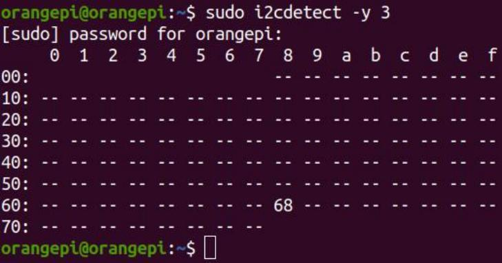
7. 然后可以运行 **examples** 中的 **[ds1307.py](ds1307.py)** 测试程序读取 RTC 的时间
root@orangepi:\~/wiringOP-Python# cd examples
root@orangepi:\~/wiringOP-Python/examples# python3 ds1307.py \--device \\ \"/dev/i2c-3\"
Thu 2022-06-16 04:35:46
Thu 2022-06-16 04:35:47
Thu 2022-06-16 04:35:48 \^C
exit

#### 3.19.5. 26pin 的 UART 测试

1. 由 26pin 接口的原理图可知，可用的 uart 为 uart5

2. Linux 系统中 uart5 默认是关闭的，需要手动打开才能使用。打开步骤如下所示： a. 首先运行下 **orangepi-config** ，普通用户记得加 **sudo** 权限
orangepi@orangepi:\~\$ sudo orangepi-config

b. 然后选择 **System**

c. 然后选择 **Hardware**

d. 然后使用键盘的方向键定位到下图所示的位置，再使用**空格**选中 **ph-uart5**

e. 然后选择**\<Save\>**保存

f. 然后选择**\<Back\>**

g. 然后选择**\<Reboot\>**重启系统使配置生效

3. 进入 linux 系统后，先确认下**/dev** 下是否存在 uart5 的设备节点
| 注意，linux5.4 系统为/dev/ttyAS5。 orangepi@orangepi:\~\$ ls /dev/ttyS5 /dev/ttyS5 |  |
| --- | --- |

4. 然后开始测试uart5 接口，先使用杜邦线短接要测试的uart5 接口的 rx 和 tx
|  | uart5 |
| --- | --- |
| tx 引脚 | 对应 26pin 中的 8 号引脚 |
| rx 引脚 | 对应 26pin 中的 10 号引脚 |

5. 最后可以运行 examples 中的 **[serialTest.py](serialTest.py)** 程序来测试下串口的回环功能，如果能
看到下面的打印，说明串口回环测试正常
| root@orangepi:\~/wiringOP-Python# cd examples | \# linux6.1 使用 |
| --- | --- |
|  |  |
| root@orangepi:\~/wiringOP-Python/examples# python3 serialTest.py \--device \"/dev/ttyS5\" root@orangepi:\~/wiringOP-Python/examples# python3 serialTest.py \--device \"/dev/ttyAS5\" Out: 0: -\ 0 Out: 1: -\ 1 Out: 2: -\ 2 Out: 3: -\ 3 Out: 4:\^C exit | \# linux5.4 使用 |

### 3.20. 硬件看门狗测试

Orange Pi 发布的 linux 系统中预装了 watchdog_test 程序，可以直接测试。
运行watchdog_test 程序的方法如下所示：
a. 第二个参数 10 表示看门狗的计数时间，如果这个时间内没有喂狗，系统会重启
b. 我们可以通过按下键盘上的任意键（ESC 除外）来喂狗，喂狗后，程序会
打印一行 keep alive 表示喂狗成功
orangepi@orangepi:\~\$ sudo watchdog_test 10 open success
options is 33152,identity is sunxi-wdt put_usr return,if 0,success:0
The old reset time is: 16
return ENOTTY,if -1,success:0
return ENOTTY,if -1,success:0
put_user return,if 0,success:0
put_usr return,if 0,success:0 keep alive
keep alive
keep alive

### 3.21. 查看 H618 芯片的 chipid

查看 H618 芯片 chipid 的命令如下所示，每个芯片的 chipid 都是不同的，所以可以使用chipid 来区分多个开发板。
| orangepi@orangepi:\~\$ **cat /sys/class/sunxi_info/sys_info \ | grep \"chipid\"** sunxi_chipid : 338020004c0048080147478824681ed1 |
| --- | --- |

### 3.22. Python 相关说明

#### 3.22.1. Python 源码编译安装的方法

如果使用的 Ubuntu 或者 Debian 系统软件仓库中的 Python 版本不符合开发的要求，想要使用最新版本的 Python ，可以使用下面的方法下载 Python 的源码包来编译安装最新版本的 Python。
下面演示的是编译安装 Python3.9 的最新版本，如果要编译安装其他的版本的Python ，方法也是一样的（需要下载想要安装的 Python 对应的源码）。

1. 首先安装编译 Python 需要的依赖包
orangepi@orangepi:\~\$ sudo apt-get update
orangepi@orangepi:\~\$ sudo apt-get install -y build-essential zlib1g-dev \\ libncurses5-dev libgdbm-dev libnss3-dev libssl-dev libsqlite3-dev \\
libreadline-dev libffi-dev curl libbz2-dev

2. 然后下载最新版本的 Python3.9 源码并解压
orangepi@orangepi:\~\$ wget \\
<https://www.python.org/ftp/python/3.9.10/Python-3.9.10.tgz> orangepi@orangepi:\~\$ tar xvf Python-3.9.10.tgz

3. 然后运行配置命令
orangepi@orangepi:\~\$ cd Python-3.9.10
orangepi@orangepi:\~\$ ./configure \--enable-optimizations

4. 然后编译安装 Python3.9 ，编译时间大概需要半个小时左右
orangepi@orangepi:\~\$ make -j4

orangepi@orangepi:\~\$ sudo make altinstall

5. 安装完后可以使用下面的命令查看下刚安装的 Python 的版本号
orangepi@orangepi:\~\$ python3.9 \--version Python 3.9.10

6. 然后更新下 pip
orangepi@orangepi:\~\$ /usr/local/bin/python3.9 -m pip install \--upgrade pip

#### 3.22.2. Python 更换 pip 源的方法

Linux 系统 pip 默认使用的源为 Python 官方的源，但是国内访问 Python 官方的源速度是很慢的，并且经常会由于网络原因导致 Python 软件包安装失败。所以在使用 pip 安装 Python 库时，请记得更换下 pip 源。

1. 首先安装下 **python3-pip**
orangepi@orangepi:\~\$ sudo apt-get update
orangepi@orangepi:\~\$ sudo apt-get install -y python3-pip

2. Linux 下永久更换 pip 源的方法
a. 先新建**\~/.pip** 目录，然后添加 **pip.conf** 配置文件，并在其中设置 pip 的源为清华源
orangepi@orangepi:\~\$ mkdir -p \~/.pip
orangepi@orangepi:\~\$ cat \<\<EOF \> \~/.pip/pip.conf \[global\]
timeout = 6000
index-url = <https://pypi.tuna.tsinghua.edu.cn/simple> [trusted-host = pypi.tuna.tsinghua.edu.cn](trusted-host=pypi.tuna.tsinghua.edu.cn)
EOF

b. 然后使用 pip3 安装 Python 库速度就会很快了
3. Linux 下临时更换 pip 源的方法，其中的**\<packagename\>**需要替换为具体的包名
orangepi@orangepi:\~\$ pip3 install \<packagename\> -i \\
[https://pypi.tuna.tsinghua.edu.cn/simple \--trusted-host pypi.tuna.tsinghua.edu.cn](https://pypi.tuna.tsinghua.edu.cn/simple--trusted-hostpypi.tuna.tsinghua.edu.cn)

### 3.23. 安装 Docker 的方法

Orange Pi 提供的 linux 镜像已经预装了Docker，只是 Docker服务默认没有打开。使用 **[enable_docker.sh](enable_docker.sh)** 脚本可以使能 docker 服务，然后就可以开始使用 docker 命令了，并且在下次启动系统时也会自动启动 docker服务。
orangepi@orangepi:\~\$ [enable_docker.sh](enable_docker.sh)

可以使用下面的命令测试下 docker，如果能运行 **hello-world** 说明 docker 能正常使用了。
orangepi@orangepi:\~\$ docker run hello-world Unable to find image \'hello-world:latest\' locally latest: Pulling from library/hello-world
256ab8fe8778: Pull complete Digest:
sha256:7f0a9f93b4aa3022c3a4c147a449ef11e0941a1fd0bf4a8e6c9408b2600777c5
Status: Downloaded newer image for hello-world:latest
Hello from Docker!
This message shows that your installation appears to be working correctly.
\.....

使用 docker 命令时，如果提示 **permission****denied** ，请将当前用户加入到 docker用户组，这样不需要 sudo 就能运行 docker 命令了。
orangepi@orangepi:\~\$ sudo usermod -aG docker \$USER

> 注意：需要退出重新登录系统才能生效，重启系统也可以。

### 3.24. Home Assistant 的安装方法

> 注意，这里只会提供在 Ubuntu或者 Debian系统中安装 Home Assistant 的方法， Home Assistant 详细的使用方法请参考官方文档或者相应的书籍。

#### 3.24.1. 通过 docker 安装

1. 首先请安装好 docker，并确保 docker 能正常运行。docker 的安装步骤请参考[**安装**](#安装)
[**Docker 的方法**](#docker-的方法)一节的说明。
2. 然后可以搜索下 Home Assistant 的 docker 镜像
orangepi@orangepi:\~\$ [docker](https://so.csdn.net/so/search?q=docker&spm=1001.2101.3001.7020) search homeassistant

3. 然后使用下面的命令下载Home Assistant 的 docker 镜像到本地，镜像大小大概有1GB 多，下载时间会比较长，请耐心等待下载完成
orangepi@orangepi:\~\$ docker pull homeassistant/home-assistant Using default tag: latest
latest: Pulling from homeassistant/home-assistant
be307f383ecc: Downloading
5fbc4c07ac88: Download complete
\...\... (省略部分输出)
3cc6a1510c9f: Pull complete
7a4e4d5b979f: Pull complete
Digest:
sha256:81d381f5008c082a37da97d8b08dd8b358dae7ecf49e62ce3ef1eeaefc4381bb
Status: Downloaded newer image for homeassistant/home-assistant:latest [docker.io/homeassistant/home-assistant:latest](docker.io/homeassistant/home-assistant:latest)

4. 然后可以使用下面的命令查看下刚下载的Home Assistant 的 docker 镜像
orangepi@orangepi:\~\$ docker images homeassistant/home-assistant
REPOSITORY TAG IMAGE ID CREATED SIZE
homeassistant/home-assistant latest bfa0ab9e1cf5 2 months ago 1.17GB

5. 此时就可以运行 Home Assistant 的 docker 容器了
orangepi@orangepi:\~\$ docker run -d \\ \--name homeassistant \\
\--privileged \\
\--restart=unless-stopped \\
-e TZ=Asia/Shanghai \\
-v /home/orangepi/home-assistant:/config \\ \--network=host \\
homeassistant/home-assistant:latest

6. 然后在浏览器中输入【开发板的 IP 地址:8123】就能看到Home Assistant 的界面
Home Assistant 容器的启动需要一段时间，如果下面的界面没有正常显示，请等待几秒钟再刷新。如果等待一分钟以上还没有正常显示下面的界面说明 Home Assistant 安装有问题，此时需要去检查前面的安装设置过程是否有问题了。

7. 然后输入**姓名、用户名**和**密码**再点击**创建账号**

8. 然后按照界面提示根据自己的喜好设置，再点击下一步

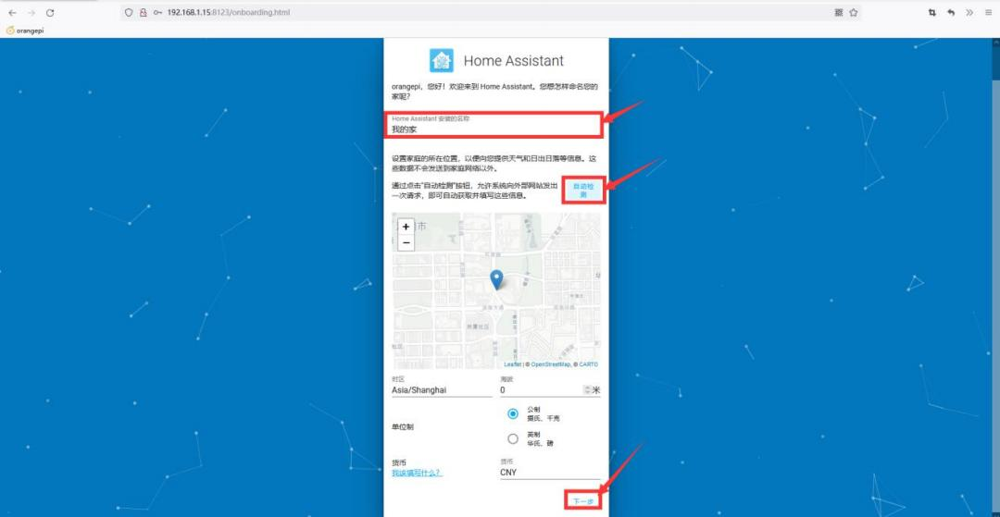
9. 然后点击下一步

10. 然后点击完成

11. Home Assistant 最终显示的主界面如下图所示

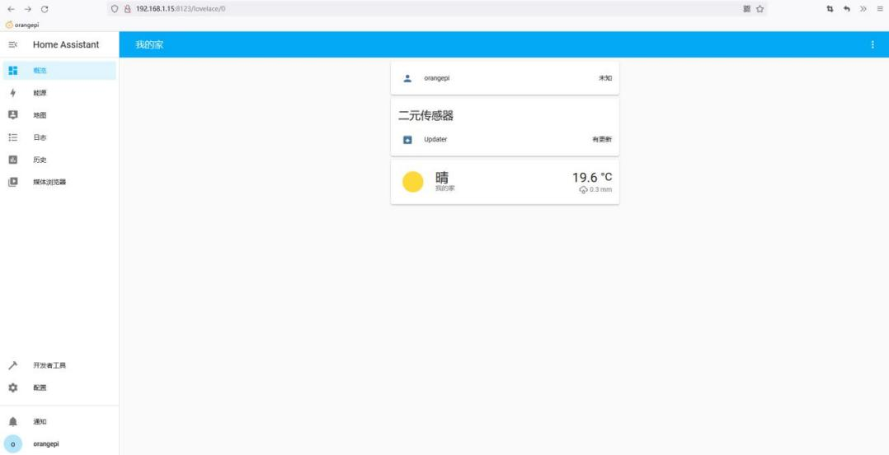
12. 停止 Home Assistant 容器的方法
a. 查看 docker 容器的命令如下所示
orangepi@orangepi:\~\$ docker ps -a

b. 停止 Home Assistant 容器的命令如下所示
orangepi@orangepi:\~\$ docker stop homeassistant

c. 删除 Home Assistant 容器的命令如下所示
orangepi@orangepi:\~\$ docker rm homeassistant

#### 3.24.2. 通过 python 安装

安装前请先更换下 pip 的源为国内源，加快 Python包的安装速度，配置方法见[Python 更换 pip 源的方法](#python-更换-pip-源的方法)一节的说明。

1. 首先安装依赖包
orangepi@orangepi:\~\$ sudo apt-get update
orangepi@orangepi:\~\$ sudo apt-get install -y python3 python3-dev python3-venv \\ python3-pip libffi-dev libssl-dev libjpeg-dev zlib1g-dev autoconf build-essential \\ libopenjp2-7 libtiff5 libturbojpeg0-dev tzdata

如果是 debian12 请使用下面的命令：
orangepi@orangepi:\~\$ sudo apt-get update

orangepi@orangepi:\~\$ sudo apt-get install -y python3 python3-dev python3-venv \\ python3-pip libffi-dev libssl-dev libjpeg-dev zlib1g-dev autoconf build-essential \\ libopenjp2-7 libturbojpeg0-dev tzdata

2. 然后需要编译安装 Python3.9 ，方法请参考[**Python 源码编译安装的方法**](#python-源码编译安装的方法)一节
Debian Bullseye 默认的 Python 版本就是 Python3.9 ，所以无需编译安装。
Ubuntu Jammy 默认的 Python 版本就是 Python3.10 ，所以也无需编译安装。
Debian Bookworm 默认的 Python 版本就是 Python3.11，所以也无需编译安装。

3. 然后创建 Python 虚拟环境
| Debian Bookworm 中是 python3.11 ，请记得替换对应的命令。 | orangepi@orangepi:\~\$ sudo mkdir /srv/homeassistant orangepi@orangepi:\~\$ sudo chown orangepi:orangepi /srv/homeassistant orangepi@orangepi:\~\$ cd /srv/homeassistant orangepi@orangepi:\~\$ python3.9 -m venv . orangepi@orangepi:\~\$ source bin/activate (homeassistant) orangepi@orangepi:/srv/homeassistant\$ |  |
| --- | --- | --- |

4. 然后安装需要的 Python 包
(homeassistant) orangepi@orangepi:/srv/homeassistant\$ python3 -m pip install wheel

5. 然后就可以安装 Home Assistant Core
(homeassistant) orangepi@orangepi:/srv/homeassistant\$ pip3 install homeassistant

6. 然后输入下面的命令就可以运行 Home Assistant Core
(homeassistant) orangepi@orangepi:/srv/homeassistant\$ hass

7. 然后在浏览器中输入【开发板的 IP 地址:8123】就能看到Home Assistant 的界面
第一次运行 hass命令时，会下载安装和缓存一些运行必须的库和依赖包。这个过程可能会花费几分钟的时间。注意，此时在浏览器中是无法看到 Home Assistant的界面的，请等待一段时间后再刷新下。

### 3.25. OpenCV 的安装方法

#### 3.25.1. 使用 apt 来安装 OpenCV

1. 安装命令如下所示
orangepi@orangepi:\~\$ sudo apt-get update
orangepi@orangepi:\~\$ sudo apt-get install -y libopencv-dev python3-opencv

2. 然后使用下面的命令打印 OpenCV 的版本号输出正常，说明 OpenCV 安装成功a. Ubuntu22.04 中 OpenCV 的版本如下所示：
orangepi@orangepi:\~\$ python3 -c \"import cv2; print(cv2.\_\_version\_\_)\" 4.5.4

b. Ubuntu20.04 中 OpenCV 的版本如下所示：
orangepi@orangepi:\~\$ python3 -c \"import cv2; print(cv2.\_\_version\_\_)\" 4.2.0

c. Debian11 中 OpenCV 的版本如下所示：
orangepi@orangepi:\~\$ python3 -c \"import cv2; print(cv2.\_\_version\_\_)\" 4.5.1

d. Debian12 中 OpenCV 的版本如下所示：
orangepi@orangepi:\~\$ python3 -c \"import cv2; print(cv2.\_\_version\_\_)\" 4.6.0

### 3.26. 宝塔 Linux 面板的安装方法

宝塔 Linux 面板是提升运维效率的服务器管理软件，支持一键 LAMP/LNMP/集群/监控/网站/FTP/数据库/JAVA 等 100 多项服务器管理功能（摘抄自[宝塔官网](https://www.bt.cn/)）

1. 首先需要扩展下**/tmp** 空间的大小，设置完后需要重启下开发板的 linux 系统，命令如下所示：
orangepi@orangepi:\~\$ sudo sed -i \'s/nosuid/&,size=2G/\' /etc/fstab
orangepi@orangepi:\~\$ sudo reboot

2. 重启后，可以看到**/tmp** 空间的大小变为2G 了
| orangepi@orangepi:\~\$ **df -h \ tmpfs 2.0G 12K 2.0G 1% /tmp | grep \"/tmp\"** |
| --- | --- |

3. 然后在 linux 系统中输入下面的命令就可以开始宝塔的安装
orangepi@orangepi:\~\$ [sudo install_bt_panel.sh](sudoinstall_bt_panel.sh)

4. 然后宝塔安装程序会提醒是否安装 **Bt-Panel** 到**/www** 文件夹，此时输入 **y** 即可
| \ | Bt-WebPanel FOR CentOS/Ubuntu/Debian |
| --- | --- |
| \ | Copyright © 2015-2099 BT-SOFT(<http://www.bt.cn ) All rights reserved. |
| \ Do you want to install Bt-Panel to the /www directory now?(y/n): y | The WebPanel URL will be [http://SERVER_IP:8888 when installed](http://SERVER_IP:8888wheninstalled). |

5. 然后要做的就是耐心等待，当看到终端输出下面的打印信息时，说明宝塔已经安装完成，整个安装过程大约耗时 34 分钟，根据网络速度的不同可能会有一些差别

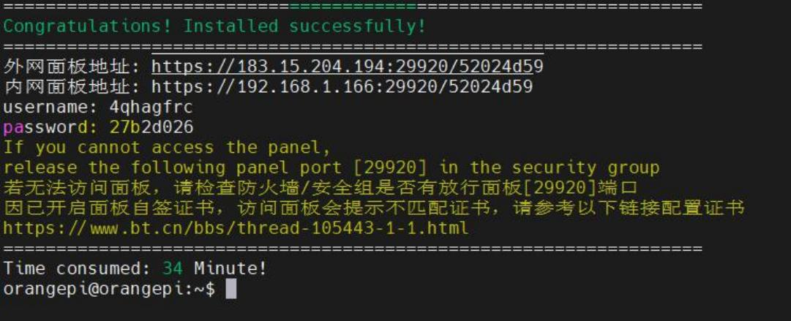
6. 此时在浏览器中输入上面显示的**面板地址**就可以打开宝塔 Linux 面板的登录界面，然后在对应的位置输入上图显示的 **username** 和 **password** 就可以登录进宝塔

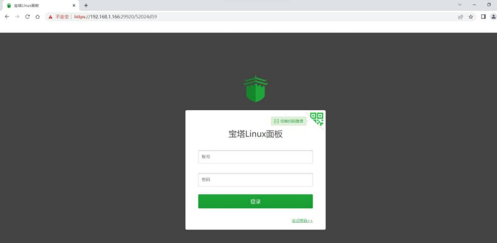
7. 成功登录宝塔后的会弹出下面的欢迎界面，首先请将中间的用户须知阅读完拖到最下面，然后就可以选择"我已同意并阅读《用户协议》" ，接着点击"进入面板"就可以进入宝塔了

8. 进入宝塔后首先会提示需要绑定宝塔官网的账号，如果没有账号可以去宝塔的官网（[**https://www.bt.cn**](https://www.bt.cn)）注册一个

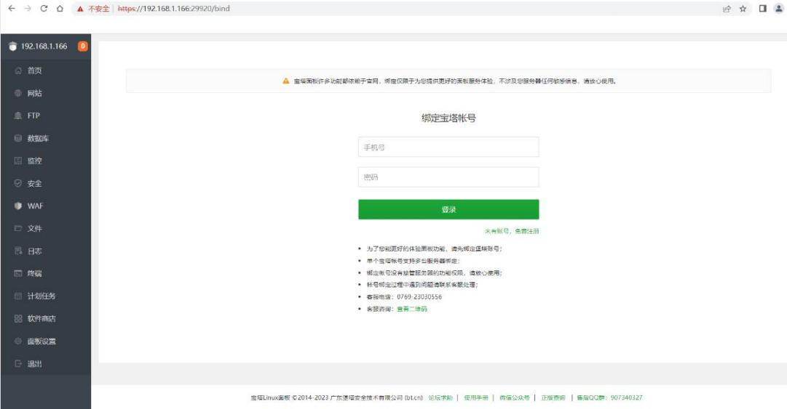
9. 最终显示的界面如下图所示，可以很直观的看到开发板 Linux 系统的一些状态信息，比如负载状态、CPU 的使用率、内存使用率和存储空间的使用情况等

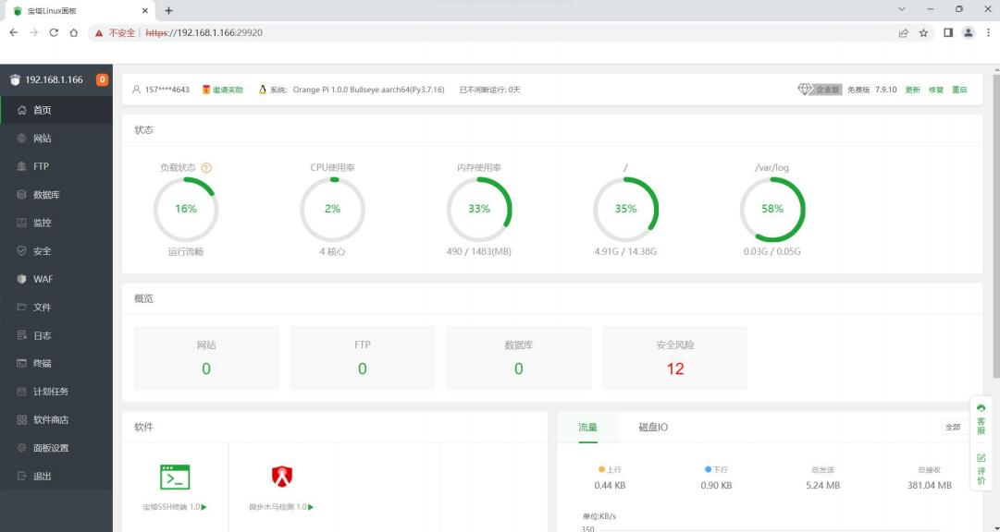
10. 宝塔的更多功能可以参考下面资料自行探索
使用手册：[http://docs.bt.cn](http://docs.bt.cn)
论坛地址：[https://www.bt.cn/bbs](https://www.bt.cn/bbs)
GitHub 链接：[https://github.com/aaPanel/BaoTa](https://github.com/aaPanel/BaoTa)

### 3.27. face_recognition 人脸识别库的安装和测试方法

> 注意，此小节的内容都是在桌面版本的 Linux 系统中测试的，所以请确保开发板使用的系统为桌面版本的系统。
另外下面的安装测试都是在orangepi 用户下进行的，请保持环境一致。
Debian12 目前没有适配。

face_recognition 源码仓库的地址为：
[https://github.com/ageitgey/face_recognition](https://github.com/ageitgey/face_recognition)
face_recognition 中文版本的说明文档为：
<https://github.com/ageitgey/face_recognition/blob/master/README_Simplified_Chi> [nese.md](nese.md)

#### 3.27.1. 使用脚本自动安装 face_recognition 的方法

1. 首先在桌面中打开一个终端，然后下载 [**face_recognition_install.sh**](face_recognition_install.sh)
orangepi@orangepi:\~/Desktop\$ wget \\
[https://gitee.com/leeboby/face_recognition_install/raw/master/face_recognition_install.sh](https://gitee.com/leeboby/face_recognition_install/raw/master/face_recognition_install.sh)

2. 然后执行下面的命令开始安装 **face_recognition**
orangepi@orangepi:\~/Desktop\$ bash face_recognition_install.sh

3. face_recognition 安装完后会自动下载 face_recognition 的源码，然后自动运行
face_recognition 中的一些示例，如果最后能看到桌面上弹出了下面的这些图片就说明 face_recognition 安装测试成功了

#### 3.27.2. 手动安装 face_recognition 的方法

1. 首先新建**\~/.pip** 目录，再添加**pip.conf** 配置文件，并在其中设置 pip 的镜像源为清华源，需要执行的命令如下所示：
orangepi@orangepi:\~\$ mkdir -p \~/.pip
orangepi@orangepi:\~\$ cat \<\<EOF \> \~/.pip/pip.conf \[global\]
timeout = 6000
index-url = <https://pypi.tuna.tsinghua.edu.cn/simple> [trusted-host = pypi.tuna.tsinghua.edu.cn](trusted-host=pypi.tuna.tsinghua.edu.cn)
EOF

2. 然后安装依赖包
orangepi@orangepi:\~\$ sudo apt update
orangepi@orangepi:\~\$ sudo apt install -y python3-pip libopencv-dev \\
python3-opencv imagemagick python3-scipy python3-setuptools python3-wheel \\ python3-dev cmake python3-testresources

3. 然后更新下 pip3
orangepi@orangepi:\~\$ python3 -m pip install -U pip setuptools wheel

4. 安装 **face_recognition** 前首先需要安装下 **dlib** 这个库，由于 dlib 这个库在开发板上编译安装比较慢，所以我在 **gitee** 上保存了一份编译好的 dlib whl 文件，下载后直接安装就可以了。dlib whl 文件下载地址如下所示：
[https://gitee.com/leeboby/python_whl](https://gitee.com/leeboby/python_whl)

a. 首先将 python_whl 仓库下载到开发板的 Linux 系统中
orangepi@orangepi:\~\$ git clone \--depth=1 <https://gitee.com/leeboby/python_whl>

b. 在 python_whl 文件夹中可以看到有多个版本的 dlib 安装包**，**dlib 不同版本对应的 Linux 系统如下所示：
| Ubuntu20.04 | dlib-19.24.0-cp38-cp38-linux_aarch64.whl |
| --- | --- |
| Ubuntu22.04 | dlib-19.24.0-cp310-cp310-linux_aarch64.whl |
| Debian11 | dlib-19.24.0-cp39-cp39-linux_aarch64.whl |

c. 然后就可以开始安装dlib ，命令如下所示
a\) Ubuntu20.04
orangepi@orangepi:\~\$ cd python_whl
orangepi@orangepi:\~/python_whl\$ python3 -m pip install dlib-19.24.0-cp38-cp38-linux_aarch64.whl

b\) Ubuntu22.04
orangepi@orangepi:\~\$ cd python_whl
orangepi@orangepi:\~/python_whl\$ python3 -m pip install dlib-19.24.0-cp310-cp310-linux_aarch64.whl

c\) Debian11
orangepi@orangepi:\~\$ cd python_whl
orangepi@orangepi:\~/python_whl\$ python3 -m pip install dlib-19.24.0-cp39-cp39-linux_aarch64.whl

d. 安装完后如果使用下面的命令能正常打印dlib 的版本号，就说明dlib 安装正确
orangepi@orangepi:\~/python_whl\$ python3 -c \"import dlib; print(dlib.\_\_version\_\_)\" 19.24.0

5. 然后安装下 **face_recognition_models-0.3.0-py2.py3-none-any.whl**
orangepi@orangepi:\~/python_whl\$ python3 -m pip install face_recognition_models-0.3.0-py2.py3-none-any.whl

6. 然后安装 **face_recognition**
orangepi@orangepi:\~\$ python3 -m pip install face_recognition

7. 然后**需要重新打开一个终端**，才能找到并运行 **face_detection** 和 **face_recognition**这两个命令
a. face_recognition 命令用来在单张图片或一个图片文件夹中识别是谁的脸
b. face_detection 命令用来在单张图片或一个图片文件夹中定位人脸的位置
orangepi@orangepi:\~\$ which face_detection /usr/local/bin/face_detection
orangepi@orangepi:\~\$ which face_recognition /usr/local/bin/face_recognition

如果重新打开终端找不到上面的两个命令，请试下手动导入环境变量，然后再测试下。
orangepi@orangepi:\~\$ export PATH=/home/orangepi/.local/bin:\$PATH

#### 3.27.3. face_recognition 的测试方法

> 注意，下面的操作都是在桌面中演示的，所以首先请连接好 HDMI 显示器，或者使用NoMachine/VNC 远程登录 Linux 桌面来测试。

1. 在 **face_recognition** 的源码 中有一些示例代码 ，我们可 以直接用来测试， face_recognition 源码的下载地址如下所示：
a. GitHub 官方的下载地址
orangepi@orangepi:\~\$ git clone <https://github.com/ageitgey/face_recognition>.git

b. Gitee 镜像下载地址
orangepi@orangepi:\~\$ git clone [https://gitee.com/leeboby/face_recognition.git](https://github.com/ageitgey/face_recognition)

2. face_recognition 示例代码的路径如下所示
face_recognition/examples

3. face_recognition 的中文说明文档链接如下所示，使用 face_recognition 前请仔细阅
读下
[https://github.com/ageitgey/face_recognition/blob/master/README_Simplified_Chinese.md](https://github.com/ageitgey/face_recognition/blob/master/README_Simplified_Chinese.md)

4. **[find_faces_in_picture.py](find_faces_in_picture.py)** 用来在图片中定位人脸的位置，测试步骤如下所示
a. 在桌面中打开一个终端，然后进入 **face_recognition/examples** 目录，再执行下面的命令
orangepi@orangepi:\~\$ cd face_recognition/examples
orangepi@orangepi:\~/face_recognition/examples\$ python3 find_faces_in_picture.py I found 1 face(s) in this photograph.
A face is located at pixel location Top: 241, Left: 419, Bottom: 562, Right: 740

b. 等待一段时间会弹出下面的图片，这就是在测试图片中定位到的人脸

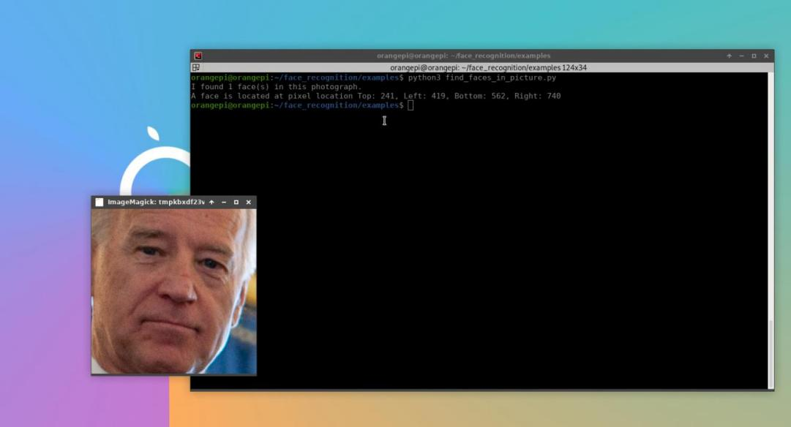
5. **[find_facial_features_in_picture.py](find_facial_features_in_picture.py)** 用来识别单张图片中人脸的关键点，测试步骤如下所示
a. 在桌面中打开一个终端，然后进入 **face_recognition/examples** 目录，再执行下面的命令
orangepi@orangepi:\~\$ cd face_recognition/examples
orangepi@orangepi:\~/face_recognition/examples\$ python3 find_facial_features_in_picture.py

b. 等待一段时间会弹出下面的图片，可以看到将人脸轮廓都标注出来了

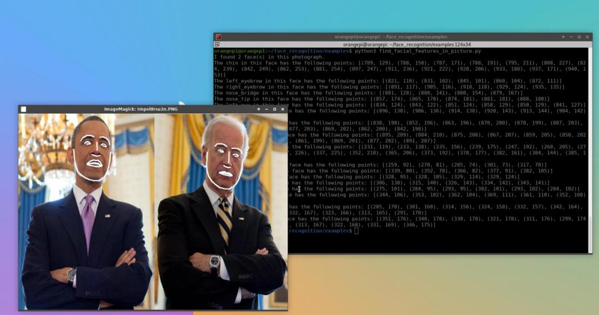
6. **[identify_and_draw_boxes_on_faces.py](identify_and_draw_boxes_on_faces.py)** 用来识别人脸并使用方框标注，测试步骤如下所示
a. 在桌面中打开一个终端，然后进入 **face_recognition/examples** 目录，再执行下面的命令
orangepi@orangepi:\~\$ cd face_recognition/examples
orangepi@orangepi:\~/face_recognition/examples\$ python3 identify_and_draw_boxes_on_faces.py

b. 等待一段时间会弹出下面的图片，可以看到将图片中的人脸都使用方框标注出来了，并且正确显示了人物的名字

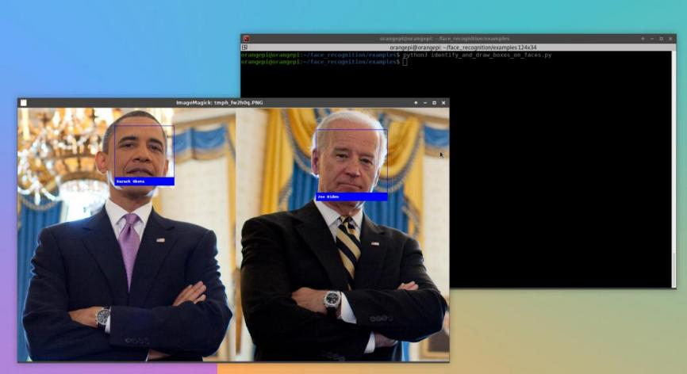
7. **[face_distance.py](face_distance.py)** 用来在不同精度上比较两个人脸是否属于一个人，首先打开一个终端，然后进入 **face_recognition/examples** 目录，再执行下面的命令就可以看到
测试的输出结果
orangepi@orangepi:\~\$ cd face_recognition/examples
orangepi@orangepi:\~/face_recognition/examples\$ python3 face_distance.py
The test image has a distance of 0.35 from known image #0
- With a normal cutoff of 0.6, would the test image match the known image? True
- With a very strict cutoff of 0.5, would the test image match the known image? True
The test image has a distance of 0.82 from known image #1
- With a normal cutoff of 0.6, would the test image match the known image? False
- With a very strict cutoff of 0.5, would the test image match the known image? False

8. **[recognize_faces_in_pictures.py](recognize_faces_in_pictures.py)** 用来识别未知图片中的人脸是谁。首先打开一个终端，然后进入 **face_recognition/examples** 目录，再执行下面的命令，等待一端时间后就能看到测试结果
orangepi@orangepi:\~\$ cd face_recognition/examples
orangepi@orangepi:\~/face_recognition/examples\$ python3 recognize_faces_in_pictures.py Is the unknown face a picture of Biden? False
Is the unknown face a picture of Obama? True
Is the unknown face a new person that we\'ve never seen before? False

9. **[facerec_from_webcam_faster.py](facerec_from_webcam_faster.py)** 用来识别 USB 摄像头中的人脸，测试步骤如下所示：
a. 首先请将 USB 摄像头插入开发板的 USB 接口中，然后通过 **v4l2-ctl**（注意v4l2 中的 l 是小写字母 l ，不是数字 1）命令查看下 USB 摄像头的设备节点的序号
orangepi@orangepi:\~\$ sudo apt update
orangepi@orangepi:\~\$ sudo apt install -y v4l-utils orangepi@orangepi:\~\$ v4l2-ctl \--list-devices
cedrus (platform:cedrus):
/dev/video0
USB2.0 UVC PC Camera: USB2.0 UV (usb-5311000.usb-1):
/dev/video1
/dev/video2

b. 然后在桌面中打开一个终端，进入 **face_recognition/examples** 目录后，首先修改下 **[facerec_from_webcam_faster.py](facerec_from_webcam_faster.py)** 中使用的摄像头的设备序号。比如上面通过 **v4l2-ctl \--list-devices** 命令查看到 USB 摄像头为**/dev/video1** ，那就修改 **cv2.VideoCapture(0)**中的 **0** 为 **1**
orangepi@orangepi:\~\$ cd face_recognition/examples
orangepi@orangepi:\~/[face_recognition/examples\$ vim facerec_from_webcam_faster.py](face_recognition/examples$vimfacerec_from_webcam_faster.pyvideo_capture=cv2.VideoCapture) [video_capture = cv2.VideoCapture](face_recognition/examples$vimfacerec_from_webcam_faster.pyvideo_capture=cv2.VideoCapture)(1)

c. 然后执行下面的命令运行 **facerec [from webcam faster.py](fromwebcamfaster.py)**
---------------------------------------------------------------------
---------------------------------------------------------------------
d. 等待一段时间会弹出摄像头的显示画面

e. 此时可以将摄像头对准自己，当摄像头检测到人脸时，会将检测到的人脸使用方框框起来。**注意，检测人脸时，摄像头显示的画面会比较卡顿，请不要移动过快**
f. 还可以打开一张奥巴马的图片，然后使用摄像头对准打开的图片，可以看到不仅能将人脸标注出来，还能正确显示检测到的人脸的名字。**注意，检测人脸时，摄像头显示的画面会比较卡顿，请不要移动过快**

10. **[web_service_example.py](web_service_example.py)** 是一个非常简单的使用 Web 服务上传图片运行人脸识别的案例，后端服务器会识别这张图片是不是奥巴马，并把识别结果以json键值对输出，测试步骤如下所示：
a. 在桌面中打开一个终端，然后进入 **face_recognition/examples** 目录，再执行下面的命令（如果是使用脚本自动安装的 face_recognition ，那么就不需要安装 **flask 了**）
orangepi@orangepi:\~\$ python3 -m pip install flask orangepi@orangepi:\~\$ cd face_recognition/examples
root@orangepi:\~/face_recognition/examples\$ python3 web_service_example.py
\* Serving Flask app \'web_service_example\' (lazy loading)
\* Environment: production
WARNING: This is a development server. Do not use it in a production deployment. Use a production WSGI server instead.
\* Debug mode: on
\* Running on all addresses (0.0.0.0)
WARNING: This is a development server. Do not use it in a production deployment.
\* Running on <http://127.0.0.1:5001>
\* Running on <http://192.168.1.79:5001> (Press CTRL+C to quit)
\* Restarting with stat
\* Debugger is active!
\* Debugger PIN: 500-161-390

b. 然后另外打开一个终端，再运行下面的命令就可以返回图片识别的结果（注意，下面的命令执行路径为 **face_recognition/examples**）
orangepi@orangepi:\~/face_recognition/examples\$ curl -XPOST -F \\ \"file=@obama2.jpg\" <http://127.0.0.1:5001>
{
\"face_found_in_image\": true,
\"is_picture_of_obama\": true
}

c. 我们也可以将 **face_recognition/examples/obama2.jpg** 这张图片拷贝到其他的 Linux 电脑中，当然也可以自己准备一张名为 **obama2.jpg** 的图片，然后在 Linux 电脑中可以使用下面的命令远程通过开发板运行的服务来识别人脸（注意命令中的 IP 地址需要替换为开发板的IP 地址，file 后的文件名需要替换为想要测试的图片的名字）
test@test:\~\$ curl -XPOST -F \"file=@obama2.jpg\" <http://192.168.1.79:5001> {
\"face_found_in_image\": true,
\"is_picture_of_obama\": true
}

d. 使用浏览器测试的方法如下所示：
a\) 首先打开浏览器，然后在浏览器的地址栏输入**开发板的IP 地址:5001**，然后就能看到下面的页面

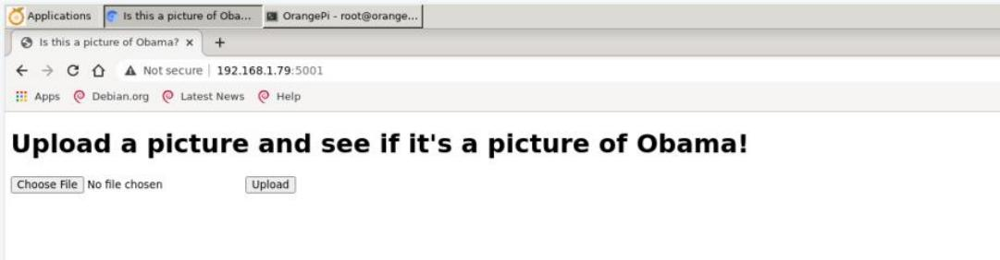
b\) 然后将 obama2.jpg 复制到桌面
orangepi@orangepi:\~/face_recognition/examples\$ cp obama2.jpg /home/orangepi/Desktop/

c\) 然后在浏览器中选择刚才复制的图片

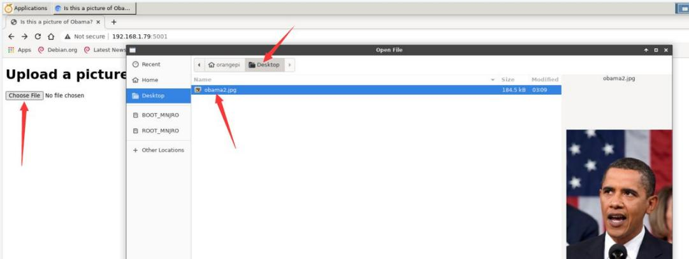
d\) 然后点击 **Upload** 上传刚才选择的图片进行人脸识别

e\) 等待一段时间后就会显示检测的结果

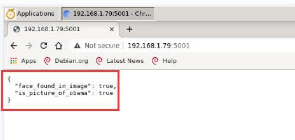
11. **face_detection** 命令测试示例
a. face_detection 命令行工具可以在单张图片或一个图片文件夹中定位人脸位置（输出像素点坐标）。使用 **face_detection \--help** 可以查看下 face_detection命令的帮助信息
orangepi@orangepi:\~\$ face_detection \--help
Usage: face_detection \[OPTIONS\] IMAGE_TO_CHECK
Options:
\--cpus INTEGER number of CPU cores to use in parallel. -1 means \"use all in

system\"
\--model TEXT Which face detection model to use. Options are \"hog\" or
\" \"
cnn .
\--help Show this message and exit.

b. 检测单张图片的示例如下所示：
orangepi@orangepi:\~\$ cd face_recognition/examples
orangepi@orangepi:\~/face_recognition/examples\$ face_detection obama2.jpg
obama2.jpg,302,474,611, 164

c. 使用多核并行检测多张图片的示例如下所示：
a\) 首先进入 **face_recognition/examples** 文件夹
b\) 然后新建一个 test 文件夹
c\) 然后将jpg 图片都拷贝到 test 文件夹中
d\) 然后使用所有的 cpu 并行运行 **face_detection** 来检查 test 文件夹中的图片，其中**\--cpus****-1** 表示使用所有的 cpu
orangepi@orangepi:\~\$ cd face_recognition/examples
orangepi@orangepi:\~/face_recognition/examples\$ mkdir test
orangepi@orangepi:\~/face_recognition/examples\$ **cp \*.jpg test**
orangepi@orangepi:\~/face_recognition/examples\$ face_detection \--cpus -1 test
test/obama-240p.jpg,29,261, 101, 189 test/obama_small.jpg,65,215, 169, 112 test/obama2.jpg,302,474,611, 164
test/two_people.jpg,62,394,211,244 test/two_people.jpg,95,941,244,792 test/obama.jpg, 136,624,394,366
test/obama-480p.jpg,65,507, 189,383
test/obama-720p.jpg,94,751,273,572
test/obama-1080p.jpg, 136, 1140,394,882 test/biden.jpg,233,749,542,439

12. **face_recognition** 命令测试示例
a. **face_recognition** 命令行工具可以在单张图片或者一个图片文件夹中认出是谁的脸。使用 **face_recognition \--help** 可以查看下 face_recognition 命令的帮助信息
orangepi@orangepi:\~\$ face_recognition \--help
Usage: face_recognition \[OPTIONS\] KNOWN_PEOPLE_FOLDER

| IMAGE_TO_CHECK |  |
| --- | --- |
| Options: | number of CPU cores to use in parallel (can speed up processing lots of images). -1 means \"use all in system\" |
|  |  |
| \--cpus INTEGER | Tolerance for face comparisons. Default is 0.6. |
|  |  |
| \--tolerance FLOAT person. \--show-distance BOOLEAN Output face distance. Useful for tweaking tolerance setting. \--help Show this message and exit. | Lower this if you get multiple matches for the same |

b. 首先新建一个已知名字的人脸图片文件夹 **known_people** ，然后复制两张图片到 **known_people** 中，然后将 **obama2.jpg** 复制为 **unkown.jpg** ，也就是我们要识别的图片
orangepi@orangepi:\~\$ cd face_recognition/examples
orangepi@orangepi:\~/face_recognition/examples\$ mkdir known_people
orangepi@orangepi:\~/face_recognition/examples\$ cp biden.jpg obama.jpg known_people
orangepi@orangepi:\~/face_recognition/examples\$ cp obama2.jpg unkown.jpg

c. 然后就可以使用下面的命令识别下 **unkown.jpg** 图片中人物的名字，可以看到识别到 unkown.jpg 图片为 obama
orangepi@orangepi:\~/face_recognition/examples\$ face_recognition known_people \\ unkown.jpg
unkown.jpg,obama

d. 如果我们识别一张不相关的图片，就会显示unknown_person
root@orangepi:\~/face_recognition/examples\$ face_recognition known_people \\ alex-lacamoire.png
alex-lacamoire.png,unknown_person

e. 我们还可以新建一个 test 文件夹，然后在其中放入多张图片，然后就可以使用所有的 CPU 来并行识别所有的图片
orangepi@orangepi:\~/face_recognition/examples\$ mkdir test
orangepi@orangepi:\~/face_recognition/examples\$ **cp \*.jpg \*.png test**
orangepi@orangepi:\~/face_recognition/examples\$ face_recognition \--cpus -1 \\ known_people test
test/obama-240p.jpg,obama

test/alex-lacamoire.png,unknown_person
test/obama_small.jpg,obama test/unkown.jpg,obama
test/obama2.jpg,obama
test/lin-manuel-miranda.png,unknown_person
test/two_people.jpg,biden test/two_people.jpg,obama test/obama-720p.jpg,obama test/obama.jpg,obama
test/obama-480p.jpg,obama test/biden.jpg,biden
test/obama-1080p.jpg,obama

### 3.28. 设置中文环境以及安装中文输入法

> 注意，安装中文输入法前请确保开发板使用的 Linux 系统为桌面版系统。

#### 3.28.1. Debian 系统的安装方法

1. 首先设置默认 **locale** 为中文
a. 输入下面的命令可以开始配置 **locale**
orangepi@orangepi:\~\$ sudo dpkg-reconfigure locales

b. 然后在弹出的界面中选择 **zh_CN.UTF-8 UTF-8**（通过键盘上的上下方向按键来上下移动，通过空格键来选择，最后通过 Tab 键可以将光标移动到**\<OK\>** ，然后回车即可）

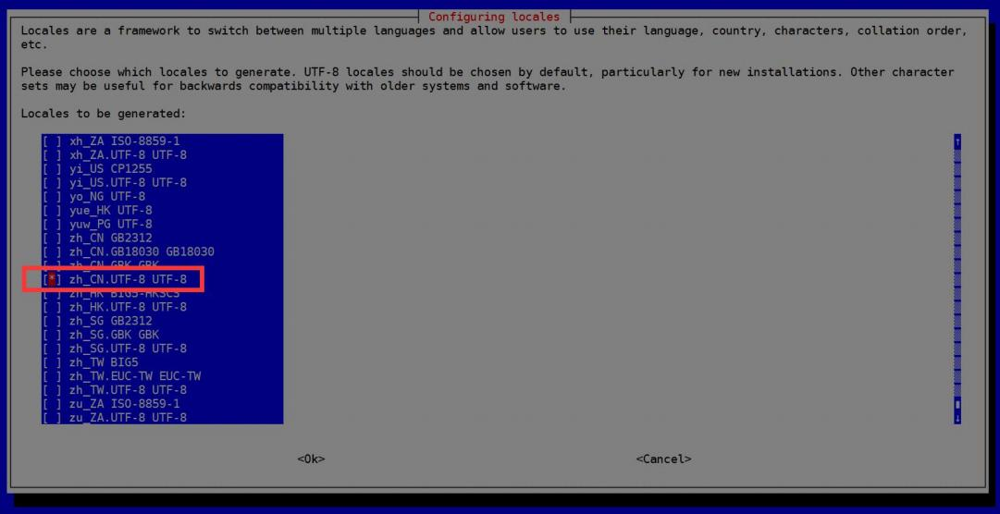
c. 然后设置默认 **locale** 为 **zh_CN.UTF-8**

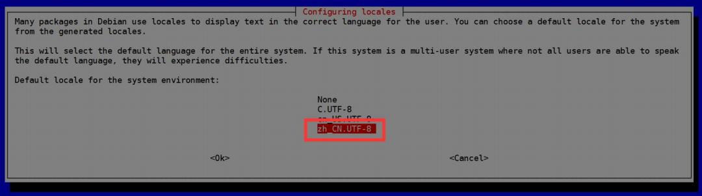
d. 退出界面后就会开始 **locale** 的设置，命令行显示的输出如下所示
orangepi@orangepi:\~\$ sudo dpkg-reconfigure locales Generating locales (this might take a while)\...
en_US.UTF-8\... done
zh_CN.UTF-8\... done Generation complete.

2. 然后打开 **Input****Method**

3. 然后选择 **OK**

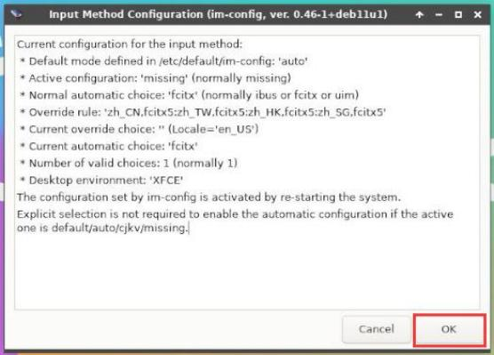
4. 然后选择 **Yes**

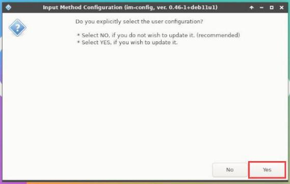
5. 然后选择 **fcitx**

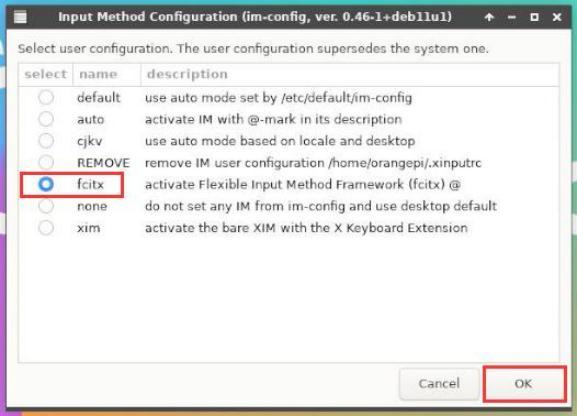
6. 然后选择 **OK**

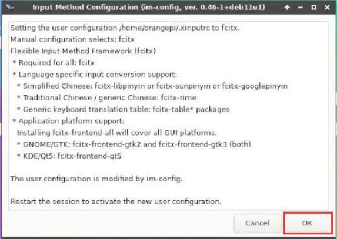
7. 然后重启 Linux 系统才能使配置生效
8. 然后打开 **Fcitx****configuration**

9. 然后点击下图所示位置的**+**号

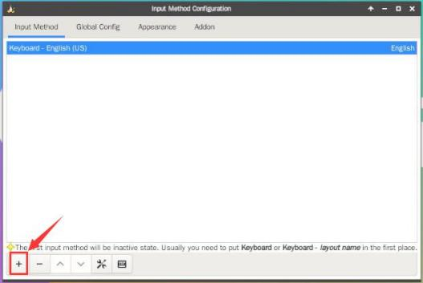
10. 然后搜索 **Google****Pinyin** 再点击 **OK**

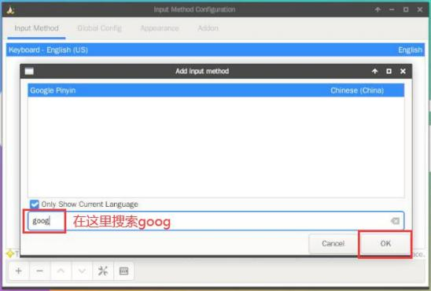
11. 然后将 **Google****Pinyin** 放到最前面

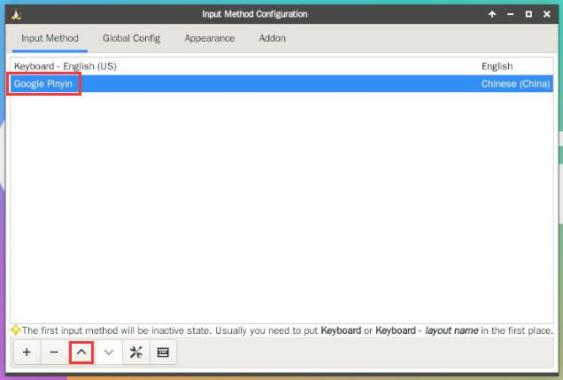

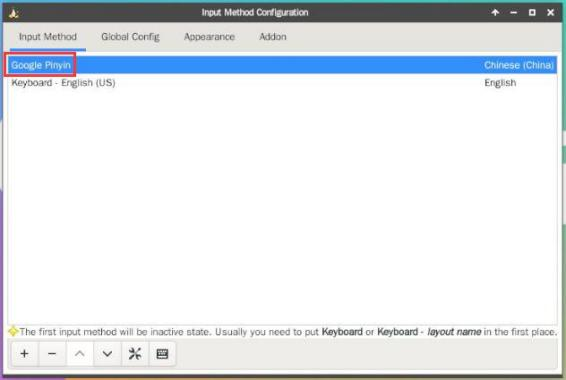
12. 然后打开 **Geany** 这个编辑器测试下中文输入法

13. 中文输入法测试如下所示

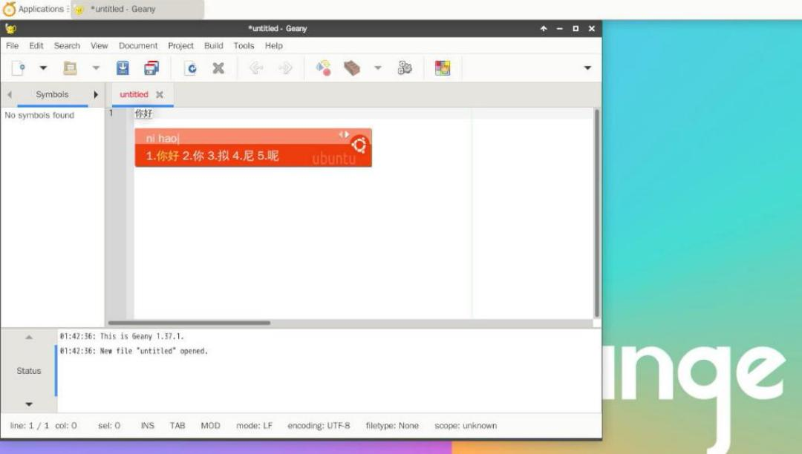
14. 通过 **Ctrl+Space** 快捷键可以切换中英文输入法
15. 如果需要整个系统都显示为中文，可以将**/etc/default/locale** 中的变量都设置为
**zh_CN.UTF-8**
orangepi@orangepi:\~\$ sudo vim /etc/default/locale \# File generated by update-locale
LC_MESSAGES=zh_CN.UTF-8
LANG=zh_CN.UTF-8
LANGUAGE=zh_CN.UTF-8

16. 然后**重启系统**就能看到系统显示为中文了

#### 3.28.2. Ubuntu 20.04 系统的安装方法

1. 首先打开 **Language****Support**

2. 然后找到**汉语（中国）**选项

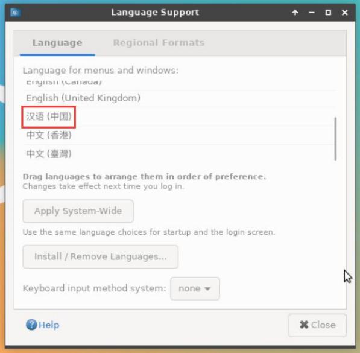
3. 然后请使用鼠标左键选中**汉语（中国）**并按住不动，然后往上将其拖到最开始的位置，拖完后的显示如下图所示：

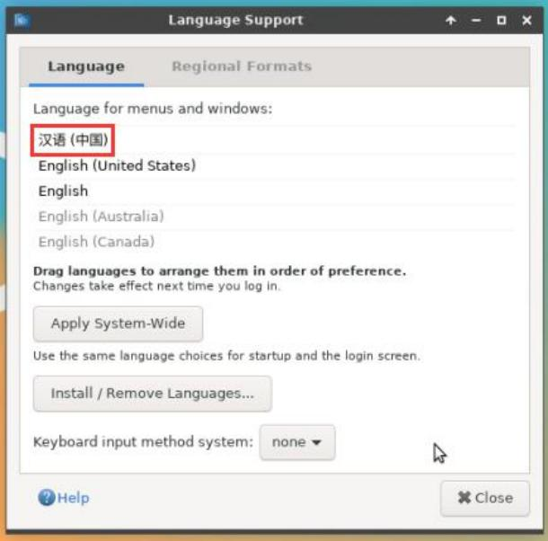
> 注意，这一步不是很好拖动的，请耐心多试几次。

4. 然后选择**Apply****System-Wide** 将中文设置应用到整个系统

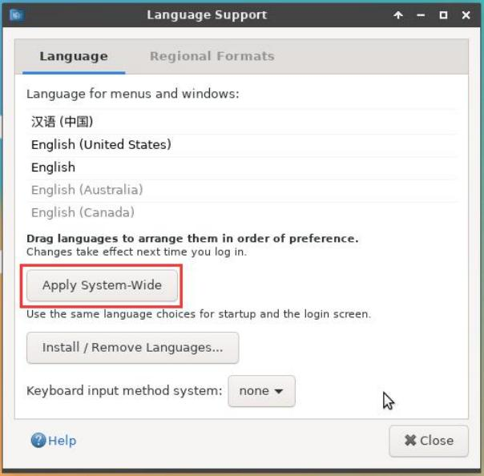
5. 然后设置 **Keyboard****input****method****system** 为 **fcitx**

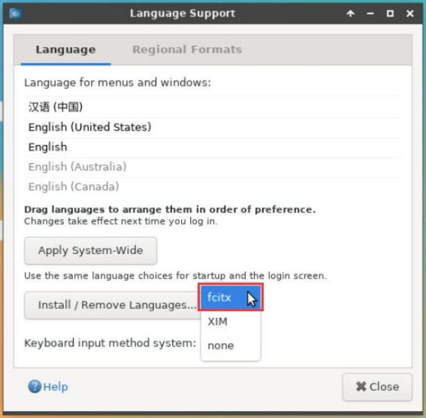
6. 然后重启 Linux 系统使配置生效
7. 重新进入系统后，在下面的界面请选择**不要再次询问我**，然后请根据自己的喜好决定标准文件夹是否也要更新为中文

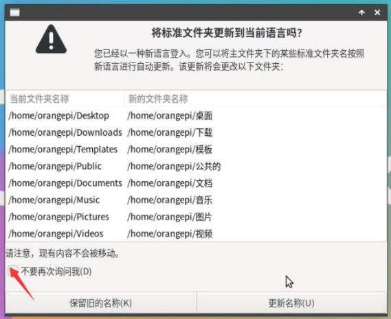
8. 然后可以看到桌面都显示为中文了

9. 然后我们可以打开 **Geany** 测试下中文输入法，打开方式如下图所示

10. 打开 **Geany** 后，默认还是英文输入法，我们可以通过 **Ctrl+Space** 快捷键来切换成中文输入法，然后就能输入中文了

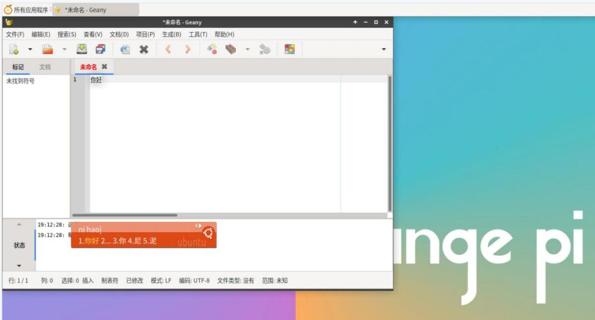

#### 3.28.3. Ubuntu 22.04 系统的安装方法

1. 首先打开 **Language****Support**

2. 然后找到**汉语（中国）**选项

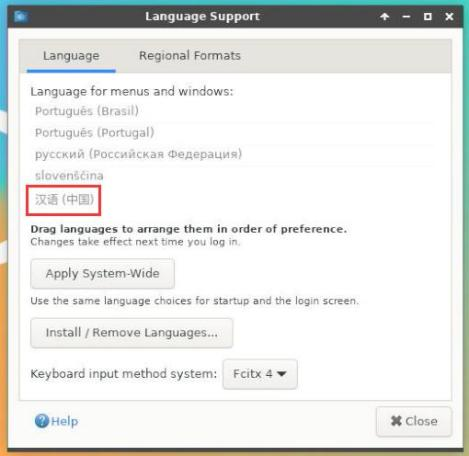
3. 然后请使用鼠标左键选中**汉语（中国）**并按住不动，然后往上将其拖到最开始的位置，拖完后的显示如下图所示：

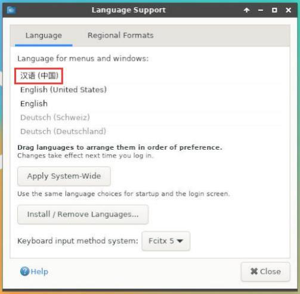
> 注意，这一步不是很好拖动的，请耐心多试几次。

4. 然后选择**Apply****System-Wide** 将中文设置应用到整个系统

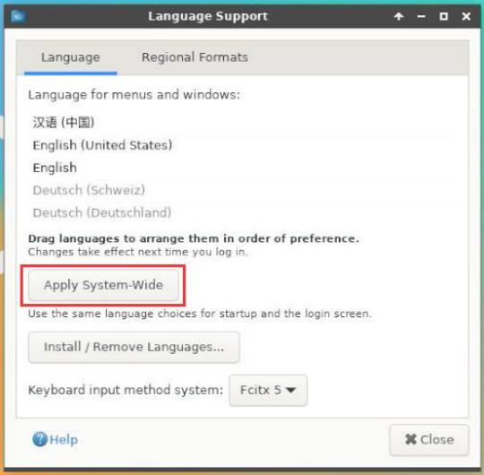
5. 然后重启 Linux 系统使配置生效
6. 重新进入系统后，在下面的界面请选择**不要再次询问我**，然后请根据自己的喜好决定标准文件夹是否也要更新为中文

7. 然后可以看到桌面都显示为中文了

8. 然后打开 Fcitx5 配置程序

9. 然后选择使用拼音输入法

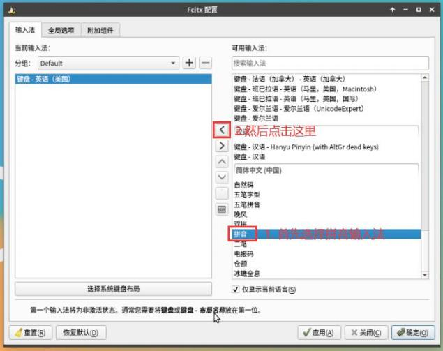
10. 选择后的界面如下所示，再点击确定即可

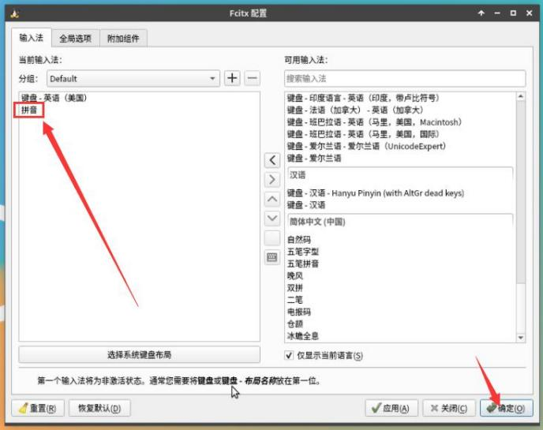
11. 然后我们可以打开 **Geany** 测试下中文输入法，打开方式如下图所示

12. 打开 **Geany** 后，默认还是英文输入法，我们可以通过 **Ctrl+Space** 快捷键来切换成中文输入法，然后就能输入中文了

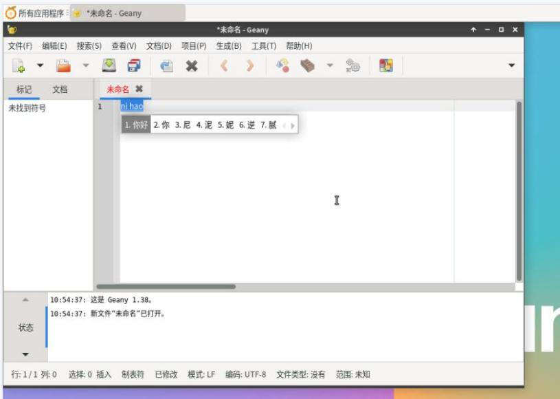

### 3.29. 远程登录 Linux 系统桌面的方法

#### 3.29.1. 使用 NoMachine 远程登录

请确保开发板安装的 Ubuntu 或者 Debian 系统为桌面版本的系统 。另外NoMachine 也提供了详细的使用文档，强烈建议通读此文档来熟悉 NoMachine 的使用，文档链接如下所示：
[https://knowledgebase.nomachine.com/DT10R00166](https://knowledgebase.nomachine.com/DT10R00166)

NoMachine 支持 Windows 、Mac 、Linux 、iOS 和安卓平台，所以我们可以在多种设备上通过 NoMachine 来远程登录控制 Orange Pi 开发板 。下面演示下在Windows 中通过 NoMachine 来远程登录 Orange Pi 开发板的 Linux 系统桌面。其他平台的安装方法请参考下 NoMachine 的官方文档。

操作前请先确保 Windwos 电脑和开发板在同一局域网内，并且能正常ssh 登录开发板的 Ubuntu 或者 Debian 系统。

1. 首先下载 NoMachine 软件 Linux **arm64** deb 版本的安装包，然后安装到开发板的Linux 系统中
a. 由于 H618 是 ARMv8 架构的 SOC，我们使用的系统为 Ubuntu 或者 Debian，
所以这里需要下载 **NoMachine for ARM ARMv8 DEB** 安装包，下载链接如下所示：
| 注意，这个下载链接可能会变，请认准 Armv8/Arm64 版本的 deb 包。 [https://downloads.nomachine.com/download/?id=118&distro=ARM](https://www.nomachine.com/download/download&id=112&s=ARM) |  |
| --- | --- |

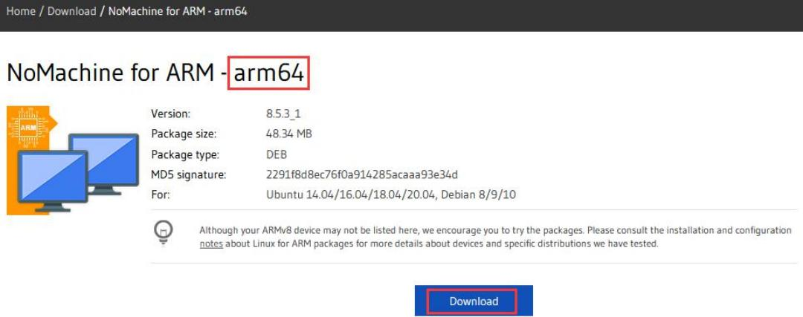
b. 另外在**官方工具**中也可以下载到 **NoMachine** 的安装包

先进入**远程登录软件-NoMachine** 文件夹

然后下载 arm64 版本的 deb 安装包

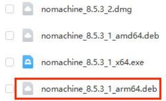
c. 然后将下载的 **nomachine_x.x.x_x_arm64.deb** 上传到开发板的 Linux 系统中
d. 然后使用下面的命令在开发板的 Linux 系统中安装 **NoMachine**
orangepi@orangepi:\~\$ sudo dpkg -i nomachine_x.x.x_x_arm64_arm64.deb

2. 然后下载 NoMachine 软件 Windows 版本的安装包，下载地址如下所示
| 注意，这个下载链接可能会变。 [https://downloads.nomachine.com/download/?id=9](https://downloads.nomachine.com/download/?id=9) |  |
| --- | --- |

3. 然后在 Windows 中安装NoMachine ，**安装完后请重启下电脑**
4. 然后在 Window 中打开 **NoMachine**

5. NoMachine 启动后会自动扫描局域网内其他安装有 NoMachine 的设备，进入NoMachine 的主界面后就可以看到开发板已经在可连接的设备列表里了，然后点击下图红色方框所示的位置即可开始登录开发板的 Linux 系统桌面

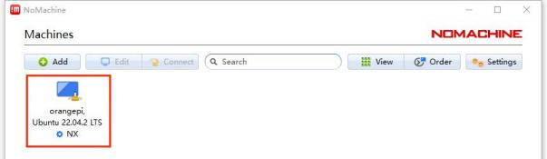
6. 然后点击 **OK**

7. 然后在下图对应的位置输入开发板 Linux 系统的用户名和密码，再点击 **OK** 开始
登陆

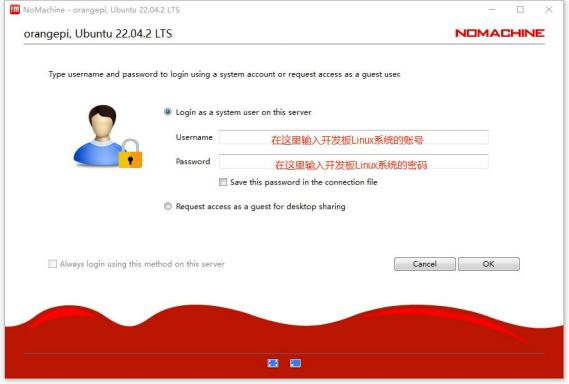
8. 然后在接下来的界面中都点击 OK
9. 最后就能看到开发板 Linux 系统的桌面了

1. 首先运行 **set [vnc.sh](vnc.sh)** 脚本设置下 vnc，记得加 sudo 权限

#### 3.29.2. 使用VNC 远程登录

操作前请先确保 Windwos 电脑和开发板在同一局域网内，并且能正常ssh 登录开发板的 Ubuntu 或者 Debian 系统。
Ubuntu20.04 测试 VNC 很多问题，请不要使用这种方法。

orangepi@orangepi:\~\$ sudo [set_vnc.sh](set_vnc.sh)
You will require a password to access your desktops.

Password: #在这里设置 vnc 的密码，8 位字符
Verify: #在这里设置 vnc 的密码，8 位字符
Would you like to enter a view-only password (y/n)? n xauth: file /root/.Xauthority does not exist
New \'X\' desktop is orangepi: 1
Creating default startup script /root/.vnc/xstartup
Starting applications specified in /root/.vnc/xstartup
Log file is /root/.vnc/orangepi: 1.log Killing Xtightvnc process ID 3047
New \'X\' desktop is orangepi: 1
Starting applications specified in /root/.vnc/xstartup
Log file is /root/.vnc/orangepi: 1.log

2. 使用MobaXterm 软件连接开发板 linux 系统桌面的步骤如下所示：
a. 首先点击 Session ，然后选择 VNC ，再填写开发板的 IP 地址和端口，最后点击 OK 确认

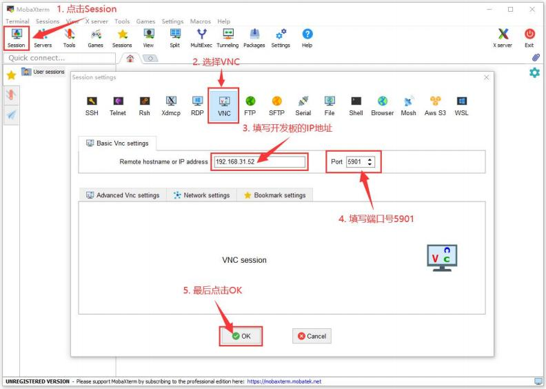
b. 然后输入前面设置的 VNC 的密码

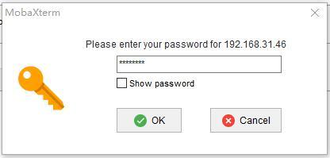
c. 登录成功后的界面显示如下图所示，然后就可以远程操作开发板 linux 系统的桌面了

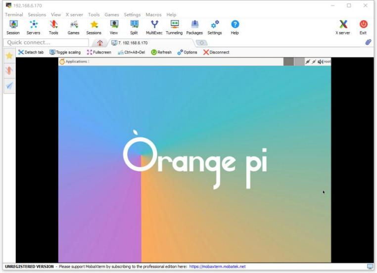

### 3.30. QT 的安装方法

1. 使用下面的脚本可以安装 QT5 和 QT Creator
orangepi@orangepi:\~\$ [install_qt.sh](install_qt.sh)

2. 安装完后会自动打印 QT 的版本号
a. Ubuntu20.04 自带的 qt 版本为 **5.12.8**
orangepi@orangepi:\~\$ [install_qt.sh](install_qt.sh)
\...\...
QMake version 3.1
Using Qt version 5.12.8 in /usr/lib/aarch64-linux-gnu

b. Ubuntu22.04 自带的 QT 版本为 **5.15.3**
orangepi@orangepi:\~\$ [install_qt.sh](install_qt.sh)
\...\...

QMake version 3.1
Using Qt version 5.15.3 in /usr/lib/aarch64-linux-gnu

c. Debian11 自带的 QT 版本为 **5.15.2**
orangepi@orangepi:\~\$ [install_qt.sh](install_qt.sh)
\...\...
QMake version 3.1
Using Qt version 5.15.2 in /usr/lib/aarch64-linux-gnu

d. Debian12 自带的 QT 版本为 **5.15.8**
orangepi@orangepi:\~\$ [install_qt.sh](install_qt.sh)
\...\...
QMake version 3.1
Using Qt version 5.15.8 in /usr/lib/aarch64-linux-gnu

3. 然后在 **Applications** 中就可以看到 QT Creator 的启动图标

也可以使用下面的命令打开 QT Creator
orangepi@orangepi:\~\$ qtcreator

4. QT Creator 打开后的界面如下所示

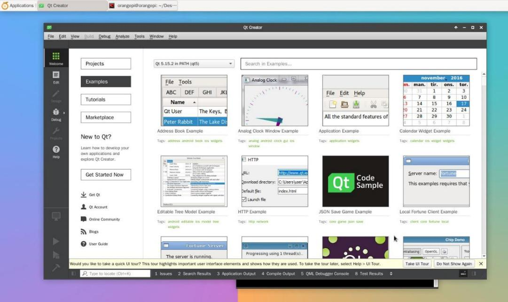
5. QT Creator 的版本如下所示
a. QT Creator 在 **Ubuntu20.04** 中的默认版本如下所示

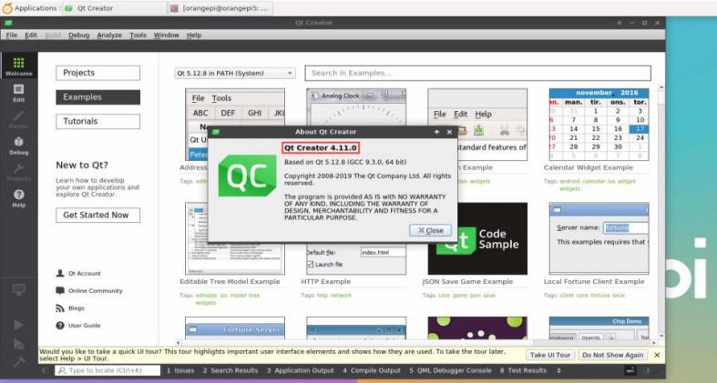
b. QT Creator 在 **Ubuntu22.04** 中的默认版本如下所示

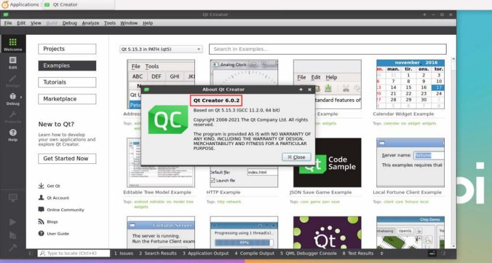
c. QT Creator 在 **Debian11** 中的默认版本如下所示

d. QT Creator 在 **Debian12** 中的默认版本如下所示

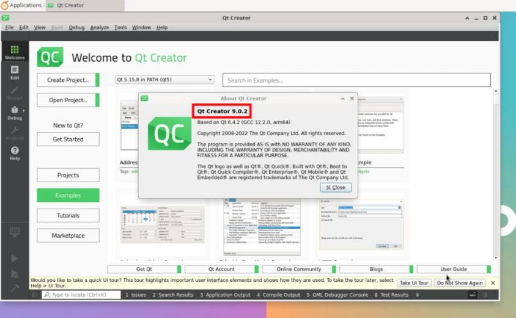
6. 然后设置下 QT
a. 首先打开 **Help**-\>**About****Plugins\...**

b. 然后去掉 **ClangCodeModel** 的那个勾

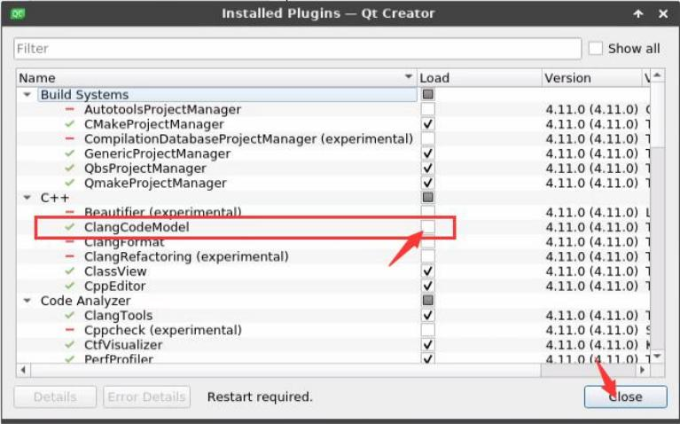
c. 设置完后需要重启下 QT Creator
d. 然后确保 QT Creator 使用的 GCC 编译器，如果默认为 Clang，请修改为 GCC
Debian12 请跳过这步。

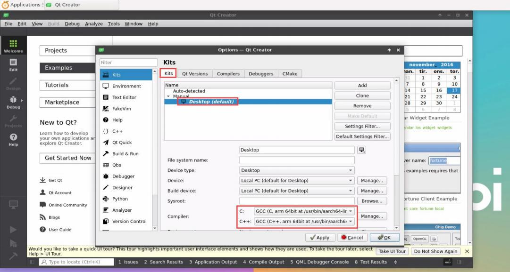
7. 然后就可以打开一个示例代码

8. 点击示例代码后会自动打开对应的说明文档，可以仔细看下其中的使用说明

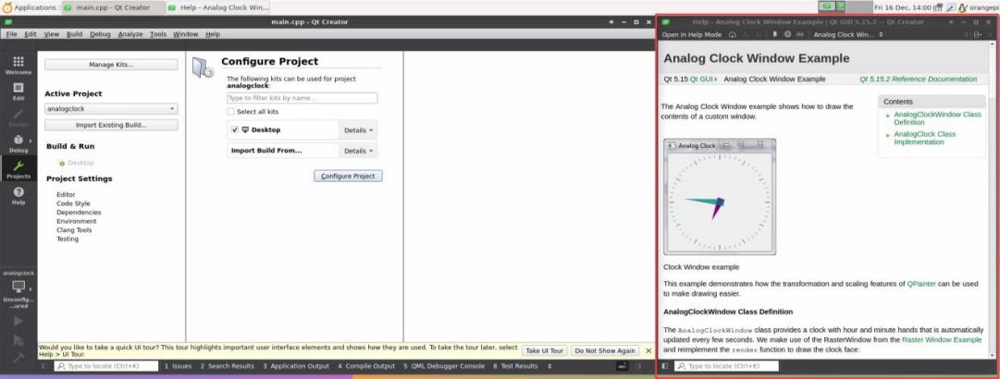
9. 然后点击下 **Configure****Project**

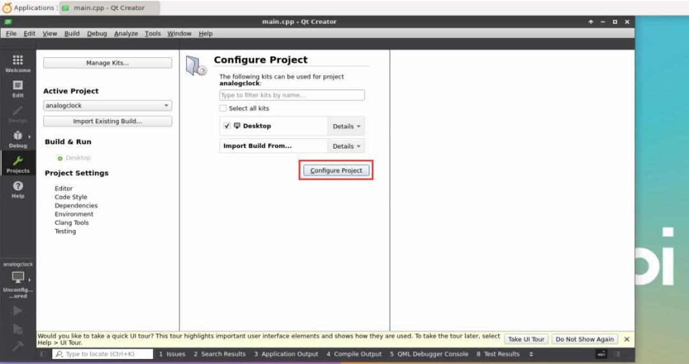
10. 然后点击左下角的绿色三角形编译运行下示例代码

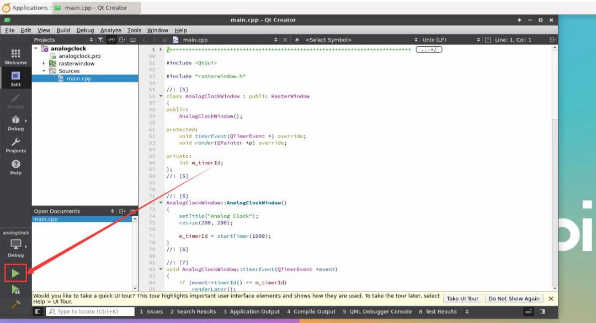
11. 等待一段时间后，会弹出下图所示的界面，此时就说明 QT 能正常编译运行

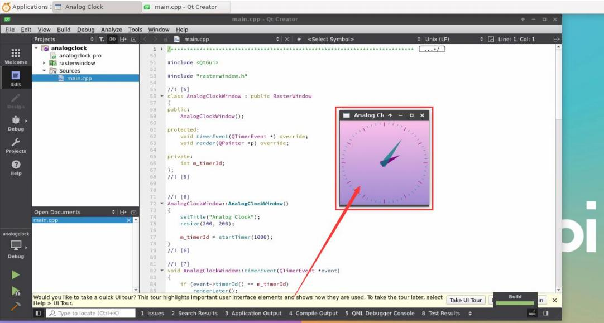
12. 参考资料
[https://wiki.qt.io/Install_Qt_5_on_Ubuntu](https://wiki.qt.io/Install_Qt_5_on_Ubuntu)
[https://download.qt.io/archive/qtcreator](https://download.qt.io/archive/qtcreator)
[https://download.qt.io/archive/qt](https://download.qt.io/archive/qt)

### 3.31. ROS 安装方法

#### 3.31.1. Ubuntu20.04 安装 ROS 1 Noetic 的方法

1. ROS 1 当前活跃的版本如下所示，推荐版本为 **Noetic****Ninjemys**

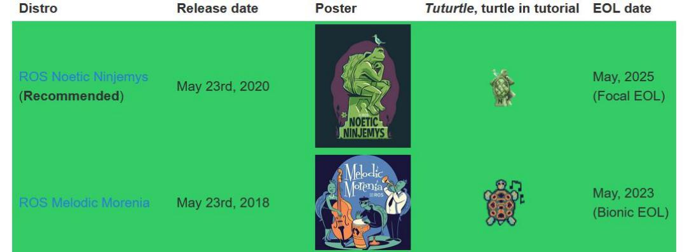
[http://docs.ros.org](http://docs.ros.org/)
[https://wiki.ros.org/Distributions](https://wiki.ros.org/Distributions)

2. ROS 1 **Noetic****Ninjemys** 官方安装文档链接如下所示：
[http://wiki.ros.org/noetic/Installation/Ubuntu](http://wiki.ros.org/noetic/Installation/Ubuntu)

3. ROS **Noetic Ninjemys** 官方安装文档中 Ubuntu 推荐使用 Ubuntu20.04 ，所以请确保开发板使用的系统为 **Ubuntu20.04 桌面版系统**
[http://wiki.ros.org/noetic/Installation](http://wiki.ros.org/noetic/Installation)

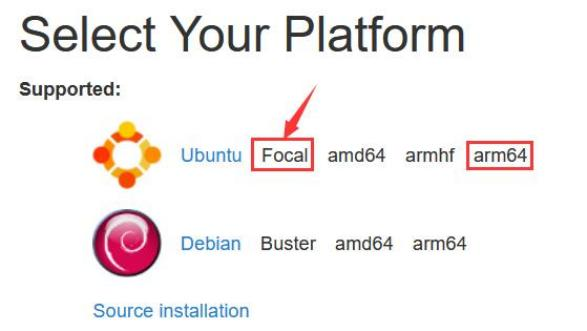
4. 然后使用下面的脚本安装ros1
orangepi@orangepi:\~\$ install_ros.sh ros1

5. 使用 ROS 工具前，首先需要初始化下rosdep ，然后编译源码时就能快速的安装一些系统依赖和一些 ROS 中的核心组件
> 注意，运行下面的命令需要确保开发板能正常访问 github ，否则会由于网络问题而报错。

| [install_ros.sh](install_ros.sh) 脚本会尝试修改/etc/hosts 并自动运行下面的命令。但是这种方法无法保证每次都能正常访问 github，如果 [install_ros.sh](install_ros.sh) 安装完 ros1 后有提示下面的错误，请自己想其它办法让开发板的 linux 系统能正常访问 github ，然后再手动运行下面的命令。 <https://raw.githubusercontent.com/ros/rosdistro/master/rosdep/osx-homebrew.yaml Hit [https://raw.githubusercontent.com/ros/rosdistro/master/rosdep/base.yaml](https://raw.githubusercontent.com/ros/rosdistro/master/index-v4.yamlSkipend-of-lifedistro) [ERROR: error loading sources list:](https://raw.githubusercontent.com/ros/rosdistro/master/index-v4.yamlSkipend-of-lifedistro) The read operation timed out orangepi@orangepi:\~\$ source /opt/ros/noetic/setup.bash orangepi@orangepi:\~\$ sudo rosdep init Wrote /etc/ros/rosdep/sources.list.d/20-default.list Recommended: please run rosdep update orangepi@orangepi:\~\$ rosdep update reading in sources list data from /etc/ros/rosdep/sources.list.d Hit <https://raw.githubusercontent.com/ros/rosdistro/master/rosdep/osx-homebrew.yaml Hit <https://raw.githubusercontent.com/ros/rosdistro/master/rosdep/base.yaml  Hit <https://raw.githubusercontent.com/ros/rosdistro/master/rosdep/python.yaml Hit <https://raw.githubusercontent.com/ros/rosdistro/master/rosdep/ruby.yaml Hit <https://raw.githubusercontent.com/ros/rosdistro/master/releases/fuerte.yaml Query rosdistro index [https://raw.githubusercontent.com/ros/rosdistro/master/index-v4.yaml](https://raw.githubusercontent.com/ros/rosdistro/master/index-v4.yamlSkipend-of-lifedistro) [Skip end-of-life distro](https://raw.githubusercontent.com/ros/rosdistro/master/index-v4.yamlSkipend-of-lifedistro) \"ardent\" Skip end-of-life distro \"bouncy\" Skip end-of-life distro \"crystal\" Skip end-of-life distro \"dashing\" Skip end-of-life distro \"eloquent\" Add distro \"foxy\" Add distro \"galactic\" Skip end-of-life distro \"groovy\" Add distro \"humble\" Skip end-of-life distro \"hydro\" |  |
| --- | --- |

Skip end-of-life distro \"indigo\"
Skip end-of-life distro \"jade\"
Skip end-of-life distro \"kinetic\"
Skip end-of-life distro \"lunar\" Add distro \"melodic\"
Add distro \"noetic\"
Add distro \"rolling\"
updated cache in /home/orangepi/.ros/rosdep/sources.cache

6. 然后在**桌面**中打开一个命令行终端窗口，再使用 **[test_ros.sh](test_ros.sh)** 脚本可以启动一个小海龟的例程来测试下 ROS 是否能正常使用
orangepi@orangepi:\~\$ [test_ros.sh](test_ros.sh)

7. 运行完 **[test_ros.sh](test_ros.sh)** 脚本后，会弹出下图所示的一个小海龟

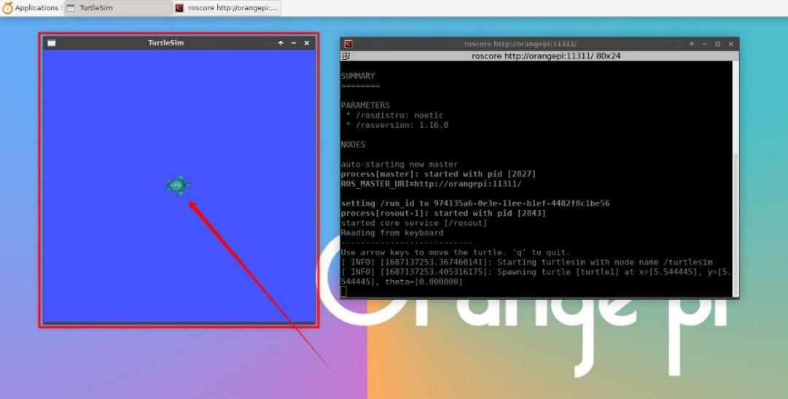
8. 然后请保持刚才打开终端窗口在最上面

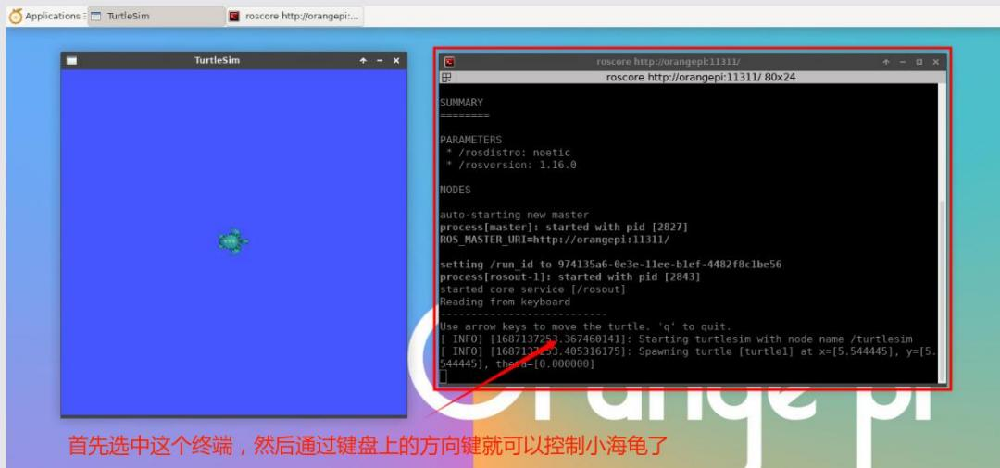
9. 此时按下键盘上的方向按键就可以控制小海龟上下左右移动了

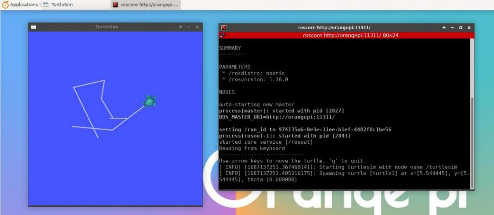

#### 3.31.2. Ubuntu20.04 安装 ROS 2 Galactic 的方法

1. ROS 2 当前活跃的版本如下所示，推荐版本为 **Galactic****Geochelone**

[http://docs.ros.org](http://docs.ros.org/)
[http://docs.ros.org/en/galactic/Releases.html](http://docs.ros.org/en/galactic/Releases.html)

2. ROS 2 **Galactic****Geochelone** 官方安装文档链接如下所示：
[docs.ros.org/en/galactic/Installation.html](docs.ros.org/en/galactic/Installation.html)
[http://docs.ros.org/en/galactic/Installation/Ubuntu-Install-Debians.html](http://docs.ros.org/en/galactic/Installation/Ubuntu-Install-Debians.html)

3. ROS 2 **Galactic****Geochelone** 官方安装文档中Ubuntu Linux推荐使用Ubuntu20.04，所以请确保开发板使用的系统为 **Ubuntu20.04 桌面版系统**。安装 ROS2 有几种方法，下面演示下通过 **Debian****packages** 的方式来安装 ROS 2 **Galactic****Geochelone**
4. 使用 **[install_ros.sh](install_ros.sh)** 脚本可以安装 ros2
orangepi@orangepi:\~\$ install_ros.sh ros2

5. **[install_ros.sh](install_ros.sh)** 脚本安装完 ros2 后会自动运行下 **ros2 -h** 命令，如果能看到下面的打印，说明ros2 安装完成
| usage: ros2 \[-h\] Call \`ros2 \<command\ -h\` for more detailed usage. \... ros2 is an extensible command-line tool for ROS 2. optional arguments: -h, \--help show this help message and exit Commands: action Various action related sub-commands bag Various rosbag related sub-commands component Various component related sub-commands daemon Various daemon related sub-commands doctor Check ROS setup and other potential issues interface Show information about ROS interfaces +-------------+------------------------------------------+ +-------------+------------------------------------------+ +-------------+------------------------------------------+ +-------------+------------------------------------------+ +-------------+------------------------------------------+ +-------------+------------------------------------------+ +-------------+------------------------------------------+ +-------------+------------------------------------------+ +-------------+------------------------------------------+ +-------------+------------------------------------------+ +-------------+------------------------------------------+ +-------------+------------------------------------------+ Call \`ros2 \<command\ -h\` for more detailed usage. | launch lifecycle multicast node param pkg run security service topic wtf | Run a launch file Various lifecycle related sub-commands Various multicast related sub-commands Various node related sub-commands Various param related sub-commands Various package related sub-commands Run a package specific executable Various security related sub-commands Various service related sub-commands Various topic related sub-commands Use \`wtf\` as alias to \`doctor\` |  |
| --- | --- | --- | --- |

6. 然后可以使用 **[test_ros.sh](test_ros.sh)** 脚本测试下 ROS 2 是否安装成功，如果能看到下面的打印，说明 ROS 2 能正常运行
orangepi@orangepi:\~\$ [test_ros.sh](test_ros.sh)
\[INFO\] \[1671174101.200091527\] \[talker\]: Publishing: \'Hello World: 1\' \[INFO\] \[1671174101.235661048\] \[listener\]: I heard: \[Hello World: 1\] \[INFO\] \[1671174102.199572327\] \[talker\]: Publishing: \'Hello World: 2\' \[INFO\] \[1671174102.204196299\] \[listener\]: I heard: \[Hello World: 2\] \[INFO\] \[1671174103.199580322\] \[talker\]: Publishing: \'Hello World: 3\' \[INFO\] \[1671174103.204019965\] \[listener\]: I heard: \[Hello World: 3\]

7. 运行下面的命令可以打开rviz2
orangepi@orangepi:\~\$ source /opt/ros/galactic/setup.bash orangepi@orangepi:\~\$ ros2 run rviz2 rviz2

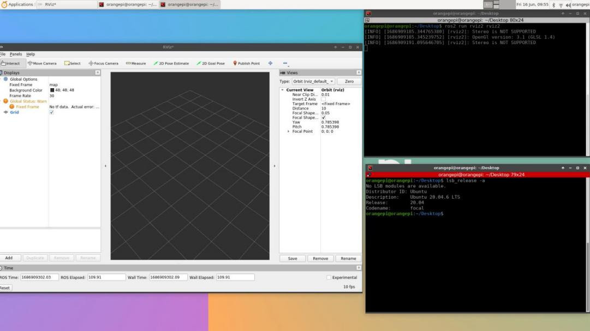
8. ROS 的使用方法请参考下 ROS 2 的文档
[http://docs.ros.org/en/galactic/Tutorials.html](http://docs.ros.org/en/galactic/Tutorials.html)

#### 3.31.3. Ubuntu22.04 安装 ROS 2 Humble 的方法

1. 使用 **[install_ros.sh](install_ros.sh)** 脚本可以安装 ros2
orangepi@orangepi:\~\$ install_ros.sh ros2

2. **[install_ros.sh](install_ros.sh)** 脚本安装完 ros2 后会自动运行下 **ros2 -h** 命令，如果能看到下面的打印，说明ros2 安装完成
| usage: ros2 \[-h\] Call \`ros2 \<command\ -h\` for more detailed usage. \... ros2 is an extensible command-line tool for ROS 2. optional arguments: |  |  |  |
| --- | --- | --- | --- |
| -h, \--help | show this help message and exit |  |  |
|  |  |  |  |
| Commands: | Various action related sub-commands |  |  |
|  |  |  |  |
| action bag component Various component related sub-commands +--------+--------------------------------------------+ +--------+--------------------------------------------+ +--------+--------------------------------------------+ interface Show information about ROS interfaces | Various rosbag related sub-commands daemon doctor | Various daemon related sub-commands Check ROS setup and other potential issues |  |
| launch lifecycle Various lifecycle related sub-commands +-------------+------------------------------------------+ +-------------+------------------------------------------+ +-------------+------------------------------------------+ +-------------+------------------------------------------+ +-------------+------------------------------------------+ +-------------+------------------------------------------+ +-------------+------------------------------------------+ +-------------+------------------------------------------+ +-------------+------------------------------------------+ +-------------+------------------------------------------+ Call \`ros2 \<command\ -h\` for more detailed usage. | Run a launch file multicast node param pkg run security service topic wtf | Various multicast related sub-commands Various node related sub-commands Various param related sub-commands Various package related sub-commands Run a package specific executable Various security related sub-commands Various service related sub-commands Various topic related sub-commands Use \`wtf\` as alias to \`doctor\` |  |

3. 然后可以使用 **[test_ros.sh](test_ros.sh)** 脚本测试下 ROS 2 是否安装成功，如果能看到下面的打印，说明 ROS 2 能正常运行
orangepi@orangepi:\~\$ [test_ros.sh](test_ros.sh)
\[INFO\] \[1671174101.200091527\] \[talker\]: Publishing: \'Hello World: 1\' \[INFO\] \[1671174101.235661048\] \[listener\]: I heard: \[Hello World: 1\] \[INFO\] \[1671174102.199572327\] \[talker\]: Publishing: \'Hello World: 2\' \[INFO\] \[1671174102.204196299\] \[listener\]: I heard: \[Hello World: 2\] \[INFO\] \[1671174103.199580322\] \[talker\]: Publishing: \'Hello World: 3\'

\[INFO\] \[1671174103.204019965\] \[listener\]: I heard: \[Hello World: 3\]

4. 运行下面的命令可以打开rviz2
orangepi@orangepi:\~\$ source /opt/ros/humble/setup.bash orangepi@orangepi:\~\$ ros2 run rviz2 rviz2

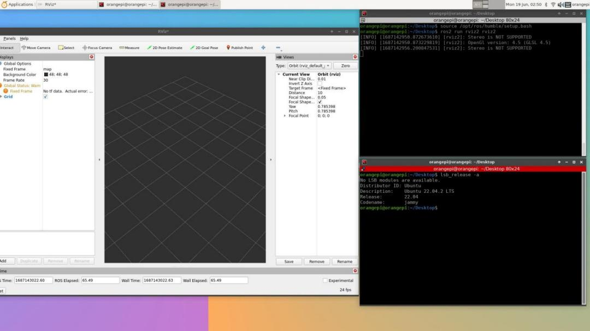
5. 参考文档
[http://docs.ros.org/en/humble/index.html](http://docs.ros.org/en/humble/index.html)
[http://docs.ros.org/en/humble/Installation/Ubuntu-Install-Debians.html](http://docs.ros.org/en/galactic/Tutorials.html)

### 3.32. 安装内核头文件的方法

Linux6.1 内核的 Debian11 系统编译内核模块时会报 GCC 的错误。所以如果要编译内核模块请使用 Debian12 或者 Ubuntu22.04。

1. OPi 发布的 Linux 镜像默认自带了内核头文件的 deb 包，存放的位置为**/opt/**
orangepi@orangepi:\~\$ ls /opt/linux-headers\*
/opt/linux-headers-xxx-sun50iw9_x.x.x_arm64.deb

2. 使用下面的命令可以安装内核头文件的deb 包
orangepi@orangepi:\~\$ **sudo dpkg -i /opt/linux-headers\*.deb**

3. 安装完后在**/usr/src** 下就能看到内核头文件所在的文件夹
orangepi@orangepi:\~\$ ls /usr/src linux-headers-x.x.x

4. 然后可以编译下 Linux 镜像中自带的hello 内核模块的源码，hello 模块的源码在**/usr/src/hello** 中，进入此目录后，然后使用 make 命令编译即可。
orangepi@orangepi:\~\$ cd /usr/src/hello/
orangepi@orangepi:/usr/src/hello\$ sudo make
make -C /lib/modules/5.4.125/build M=/usr/src/hello modules make\[ [1](#1)\]: Entering directory \'/usr/src/linux-headers-5.4.125\'
CC \[M\] /usr/src/hello/hello.o Building modules, stage 2.
MODPOST 1 modules
CC \[M\] /usr/src/hello/hello.mod.o LD \[M\] /usr/src/hello/hello.ko
make\[ [1](#1)\]: Leaving directory \'/usr/src/linux-headers-5.4.125\'

5. 编译完后会生成 **hello.ko** 内核模块
orangepi@orangepi:/usr/src/hello\$ **ls \*.ko** hello.ko

6. 使用 **insmod** 命令可以将 **hello.ko** 内核模块插入内核中
orangepi@orangepi:/usr/src/hello\$ sudo insmod hello.ko

7. 然后使用**demsg** 命令可以查看下 **hello.ko** 内核模块的输出，如果能看到下面的输出说明 **hello.ko** 内核模块加载正确
| orangepi@orangepi:/usr/src/hello\$ **dmesg \ | grep \"Hello\" \[ 2871.893988\] Hello Orange Pi \-- init** |
| --- | --- |

8. 使用 **rmmod** 命令可以卸载 **hello.ko** 内核模块
| orangepi@orangepi:/usr/src/hello\$ sudo rmmod hello  |  |
| --- | --- |
| orangepi@orangepi:/usr/src/hello\$ **dmesg \ \[ 3173.800892\] Hello Orange Pi \-- exit | grep \"Hello\"** \[ 2871.893988\] Hello Orange Pi \-- init |

### 3.33. Linux 系统支持的部分编程语言测试

#### 3.33.1. Debian Bullseye 系统

1. Debian Bullseye 默认安装有 gcc 编译工具链，可以直接在开发板的 Linux 系统中编译 C 语言的程序
a. gcc 的版本如下所示
orangepi@orangepi:\~\$ gcc \--version
gcc (Debian 10.2. 1-6) 10.2.1 20210110
Copyright (C) 2020 Free Software Foundation, Inc.
This is free software; see the source for copying conditions. There is NO
warranty; not even for MERCHANTABILITY or FITNESS FOR A PARTICULAR PURPOSE.

b. 编写 C 语言的 **hello_world.c** 程序
orangepi@orangepi:\~\$ vim hello_world.c #include \<stdio.h\>
int main(void) {
printf(\"Hello World!\\n\");
return 0; }

c. 然后编译运行 **hello_world.c**
orangepi@orangepi:\~\$ gcc -o hello_world hello_world.c orangepi@orangepi:\~\$ ./hello_world
Hello World!

2. Debian Bullseye 默认安装有 Python3
a. Python 具体版本如下所示
orangepi@orangepi:\~\$ python3
Python 3.9.2 (default, Feb 28 2021, 17:03:44) \[GCC 10.2.1 20210110\] on linux
Type \"help\", \"copyright\", \"credits\" or \"license\" for more information. \>\>\>

使用 Ctrl+D 快捷键可退出 python 的交互模式。

b. 编写 Python 语言的 **[hello_world.py](hello_world.py)** 程序
orangepi@orangepi:\~\$ [vim hello_world.py](vimhello_world.py) print(\'Hello World!\')

c. 运行 **[hello_world.py](hello_world.py)** 的结果如下所示
orangepi@orangepi:\~\$ python3 hello_world.py Hello World!

3. Debian Bullseye 默认没有安装 Java 的编译工具和运行环境
a. 可以使用下面的命令安装openjdk，Debian Bullseye 中最新版本为openjdk-17
orangepi@orangepi:\~\$ sudo apt install -y openjdk-17-jdk

b. 安装完后可以查看下 Java 的版本
orangepi@orangepi:\~\$ java \--version

d. 然后编译运行 **hello [world.java](world.java)**
c. 编写 Java 版本的 [**hello_world.java**](hello_world.java)
orangepi@orangepi:\~\$ [vim hello_world.java](vimhello_world.javapublicclasshello_world{) [public class hello_world](vimhello_world.javapublicclasshello_world{)
[{](vimhello_world.javapublicclasshello_world{)
public static void main(String\[\] args) {
System.out.println(\"Hello World!\"); }
}

orangepi@orangepi:\~\$ javac hello_world.java
orangepi@orangepi:\~\$ java hello_world Hello World!

#### 3.33.2. Debian Bookworm 系统

1. Debian Bookworm 默认安装有 gcc 编译工具链，可以直接在开发板的 Linux 系统中编译 C 语言的程序
a. gcc 的版本如下所示
orangepi@orangepi:\~\$ gcc \--version
gcc (Debian 12.2.0-14) 12.2.0
Copyright (C) 2022 Free Software Foundation, Inc.
This is free software; see the source for copying conditions. There is NO

warranty; not even for MERCHANTABILITY or FITNESS FOR A PARTICULAR PURPOSE.

b. 编写 C 语言的 **hello_world.c** 程序
orangepi@orangepi:\~\$ vim hello_world.c #include \<stdio.h\>
int main(void) {
printf(\"Hello World!\\n\");
return 0; }

c. 然后编译运行 **hello_world.c**
orangepi@orangepi:\~\$ gcc -o hello_world hello_world.c orangepi@orangepi:\~\$ ./hello_world
Hello World!

2. Debian Bookworm 默认安装有 Python3 a. Python 具体版本如下所示
| orangepi@orangepi:\~\$ python3 Python 3.11.2 (main, Mar 13 2023, 12: 18:29) \[GCC 12.2.0\] on linux Type \"help\", \"copyright\", \"credits\" or \"license\" for more information. \ \ \  使用 Ctrl+D 快捷键可退出 python 的交互模式。 |  |
| --- | --- |

b. 编写 Python 语言的 **[hello_world.py](hello_world.py)** 程序
orangepi@orangepi:\~\$ [vim hello_world.py](vimhello_world.py) print(\'Hello World!\')

c. 运行 **[hello_world.py](hello_world.py)** 的结果如下所示
orangepi@orangepi:\~\$ python3 hello_world.py Hello World!

3. Debian Bookworm 默认没有安装 Java 的编译工具和运行环境
a. 可 以 使用 下 面 的命 令 安装 openjdk ，Debian Bookworm 中 最 新版 本 为openjdk-17
orangepi@orangepi:\~\$ sudo apt install -y openjdk-17-jdk

b. 安装完后可以查看下 Java 的版本
orangepi@orangepi:\~\$ java \--version

c. 编写 Java 版本的 [**hello_world.java**](hello_world.java)
orangepi@orangepi:\~\$ [vim hello_world.java](vimhello_world.javapublicclasshello_world{) [public class hello_world](vimhello_world.javapublicclasshello_world{)
[{](vimhello_world.javapublicclasshello_world{)
public static void main(String\[\] args) {
System.out.println(\"Hello World!\"); }
}

d. 然后编译运行 [**hello_world.java**](hello_world.java)
orangepi@orangepi:\~\$ javac hello_world.java
orangepi@orangepi:\~\$ java hello_world Hello World!

#### 3.33.3. Ubuntu Focal 系统

1. Ubuntu Focal 默认安装有 gcc 编译工具链，可以直接在开发板的 Linux 系统中编译 C 语言的程序
b. 编写 C 语言的 **hello world.c** 程序
a. gcc 的版本如下所示
orangepi@orangepi:\~\$ gcc \--version
gcc (Ubuntu 9.4.0-1ubuntu1\~20.04. 1) 9.4.0
Copyright (C) 2019 Free Software Foundation, Inc.
This is free software; see the source for copying conditions. There is NO
warranty; not even for MERCHANTABILITY or FITNESS FOR A PARTICULAR PURPOSE.

orangepi@orangepi:\~\$ vim hello_world.c #include \<stdio.h\>
int main(void) {
printf(\"Hello World!\\n\");
return 0;

}

c. 然后编译运行 **hello_world.c**
orangepi@orangepi:\~\$ gcc -o hello_world hello_world.c orangepi@orangepi:\~\$ ./hello_world
Hello World!

2. Ubuntu Focal 默认安装有 Python3 a. Python3 具体版本如下所示
| orangepi@orangepi:\~\$ python3 Python 3.8.10 (default, Nov 14 2022, 12:59:47) \[GCC 9.4.0\] on linux Type \"help\", \"copyright\", \"credits\" or \"license\" for more information. \ \ \  使用 Ctrl+D 快捷键可退出 python 的交互模式。 |  |
| --- | --- |

b. 编写 Python 语言的 **[hello_world.py](hello_world.py)** 程序
orangepi@orangepi:\~\$ [vim hello_world.py](vimhello_world.py) print(\'Hello World!\')

c. 运行 **[hello_world.py](hello_world.py)** 的结果如下所示
orangepi@orangepi:\~\$ python3 hello_world.py Hello World!

3. Ubuntu Focal 默认没有安装 Java 的编译工具和运行环境a. 可以使用下面的命令安装 openjdk-17
orangepi@orangepi:\~\$ sudo apt install -y openjdk-17-jdk

c. 编写 Java 版本的 **hello [world.java](world.java)**
b. 安装完后可以查看下 Java 的版本
orangepi@orangepi:\~\$ java \--version openjdk 17.0.2 2022-01-18
OpenJDK Runtime Environment (build 17.0.2+8-Ubuntu-120.04)
OpenJDK 64-Bit Server VM (build 17.0.2+8-Ubuntu-120.04, mixed mode, sharing)

orangepi@orangepi:\~\$ [vim hello_world.java](vimhello_world.javapublicclasshello_world{) [public class hello_world](vimhello_world.javapublicclasshello_world{)
[{](vimhello_world.javapublicclasshello_world{)
public static void main(String\[\] args) {

System.out.println(\"Hello World!\"); }
}

d. 然后编译运行 [**hello_world.java**](hello_world.java)
orangepi@orangepi:\~\$ javac hello_world.java
orangepi@orangepi:\~\$ java hello_world Hello World!

#### 3.33.4. Ubuntu Jammy 系统

1. Ubuntu Jammy 默认安装有 gcc 编译工具链，可以直接在开发板的 Linux 系统中编译 C 语言的程序
a. gcc 的版本如下所示
orangepi@orangepi:\~\$ gcc \--version
gcc (Ubuntu 11.3.0-1ubuntu1\~22.04. 1) 11.3.0
Copyright (C) 2021 Free Software Foundation, Inc.
This is free software; see the source for copying conditions. There is NO
warranty; not even for MERCHANTABILITY or FITNESS FOR A PARTICULAR PURPOSE.

c. 然后编译运行 **hello world.c**
b. 编写 C 语言的 **hello_world.c** 程序
orangepi@orangepi:\~\$ vim hello_world.c #include \<stdio.h\>
int main(void) {
printf(\"Hello World!\\n\");
return 0; }

orangepi@orangepi:\~\$ gcc -o hello_world hello_world.c orangepi@orangepi:\~\$ ./hello_world
Hello World!

2. Ubuntu Jammy 默认安装有 Python3 a. Python3 具体版本如下所示
| orangepi@orangepi:\~\$ python3 Python 3.10.6 (main, May 29 2023, 11: 10:38) \[GCC 11.3.0\] on linux Type \"help\", \"copyright\", \"credits\" or \"license\" for more information. \ \ \  使用 Ctrl+D 快捷键可退出 python 的交互模式。 |  |
| --- | --- |

b. 编写 Python 语言的 **[hello_world.py](hello_world.py)** 程序
orangepi@orangepi:\~\$ [vim hello_world.py](vimhello_world.py) print(\'Hello World!\')

c. 运行 **[hello_world.py](hello_world.py)** 的结果如下所示
orangepi@orangepi:\~\$ python3 hello_world.py Hello World!

3. Ubuntu Jammy 默认没有安装 Java 的编译工具和运行环境a. 可以使用下面的命令安装 openjdk-18
orangepi@orangepi:\~\$ sudo apt install -y openjdk-18-jdk

b. 安装完后可以查看下 Java 的版本
orangepi@orangepi:\~\$ java \--version openjdk 18.0.2-ea 2022-07-19
OpenJDK Runtime Environment (build 18.0.2-ea+9-Ubuntu-222.04)
OpenJDK 64-Bit Server VM (build 18.0.2-ea+9-Ubuntu-222.04, mixed mode, sharing)

d. 然后编译运行 **hello [world.java](world.java)**
c. 编写 Java 版本的 [**hello_world.java**](hello_world.java)
orangepi@orangepi:\~\$ [vim hello_world.java](vimhello_world.javapublicclasshello_world{) [public class hello_world](vimhello_world.javapublicclasshello_world{)
[{](vimhello_world.javapublicclasshello_world{)
public static void main(String\[\] args) {
System.out.println(\"Hello World!\"); }
}

orangepi@orangepi:\~\$ javac hello_world.java
orangepi@orangepi:\~\$ java hello_world Hello World!

### 3.34. 上传文件到开发板 Linux 系统中的方法

#### 3.34.1. 在 Ubuntu PC 中上传文件到开发板 Linux 系统中的方法

##### 3.34.1.1. 使用scp 命令上传文件的方法

1. 使用 scp 命令可以在 Ubuntu PC 中上传文件到开发板的 Linux 系统中，具体命令如下所示
a. **file_path：**需要替换为要上传文件的路径
b. **orangepi：**为开发板 linux 系统的用户名，也可以替换成其它的，比如 root
c. **192.168.xx.xx:** 为开发板的 IP 地址，请根据实际情况进行修改
d. **/home/orangepi:** 开发板 linux 系统中的路径，也可以修改为其它的路径
test@test:\~\$ scp file_path orangepi@192.168.xx.xx:/home/orangepi/

2. 如果要上传文件夹，需要加上-r参数
test@test:\~\$ scp -r dir_path orangepi@192.168.xx.xx:/home/orangepi/

3. scp 还有更多的用法，请使用下面的命令查看 man 手册
test@test:\~\$ man scp

##### 3.34.1.2. 使用 filezilla 上传文件的方法

1. 首先在 Ubuntu PC 中安装 filezilla
test@test:\~\$ sudo apt install -y filezilla

2. 然后使用下面的命令打开 filezilla
test@test:\~\$ filezilla

3. filezilla 打开后的界面如下所示，此时右边远程站点下面显示的是空的

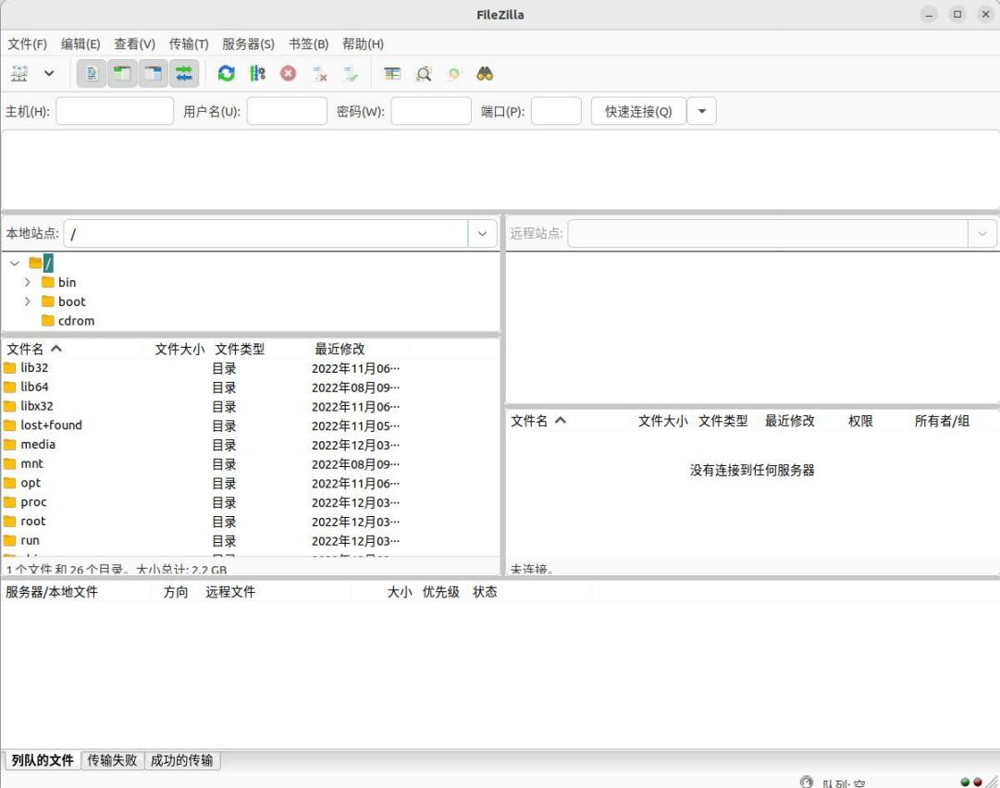
4. 连接开发板的方法如下图所示

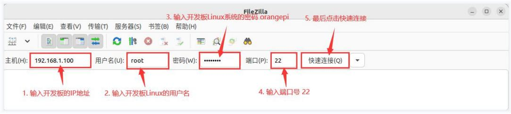
5. 然后选择**保存密码**，再点击**确定**

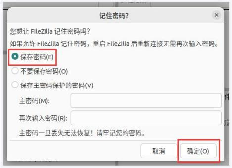
6. 然后选择**总是信任该主机**，再点击**确定**

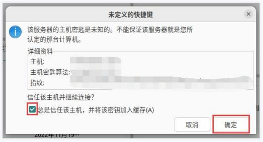
7. 连接成功后在filezilla软件的右边就可以看到开发板linux文件系统的目录结构了

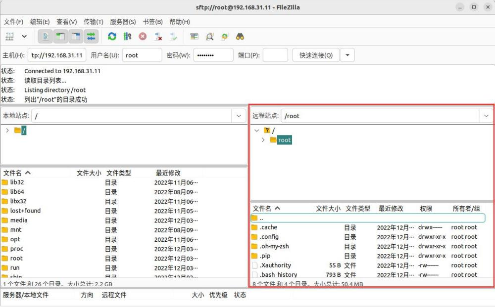
8. 然后在 filezilla 软件的右边选择要上传到开发板中的路径，再在 filezilla 软件的左边选中 Ubuntu PC 中要上传的文件，再点击鼠标右键，再点击上传选项就会开始上
传文件到开发板中了。

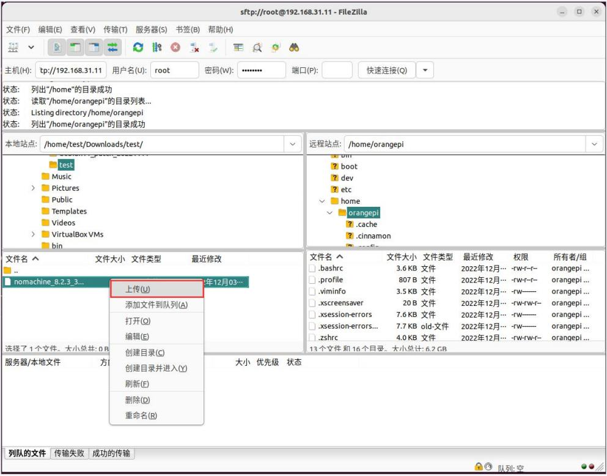
9. 上传完成后就可以去开发板 linux 系统中的对应路径中查看上传的文件了
10. 上传文件夹的方法和上传文件的方法是一样的，这里就不再赘述了

#### 3.34.2. 在 Windows PC 中上传文件到开发板 Linux 系统中的方法

##### 3.34.2.1. 使用 filezilla 上传文件的方法

1. 首先下载 filezilla 软件 Windows 版本的安装文件，下载链接如下所示
[https://filezilla-project.org/download.php?type=client](https://filezilla-project.org/download.php?type=client)

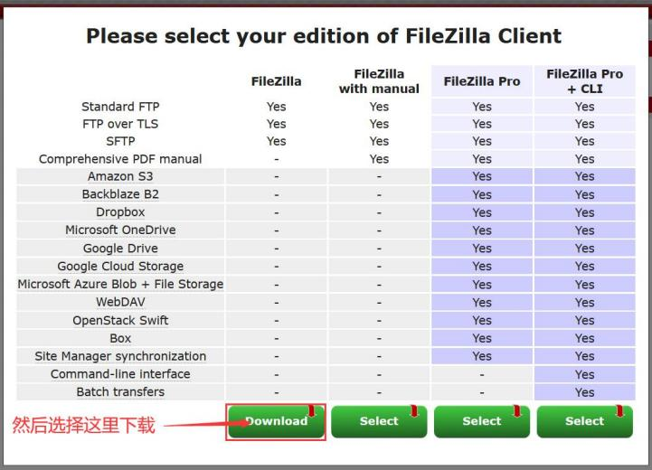
2. 下载的安装包如下所示，然后双击直接安装即可
FileZilla_Server_1.5.1_win64-setup.exe

安装过程中，下面的安装界面请选择**Decline**，然后再选择**Next\>**

3. filezilla 打开后的界面如下所示，此时右边远程站点下面显示的是空的

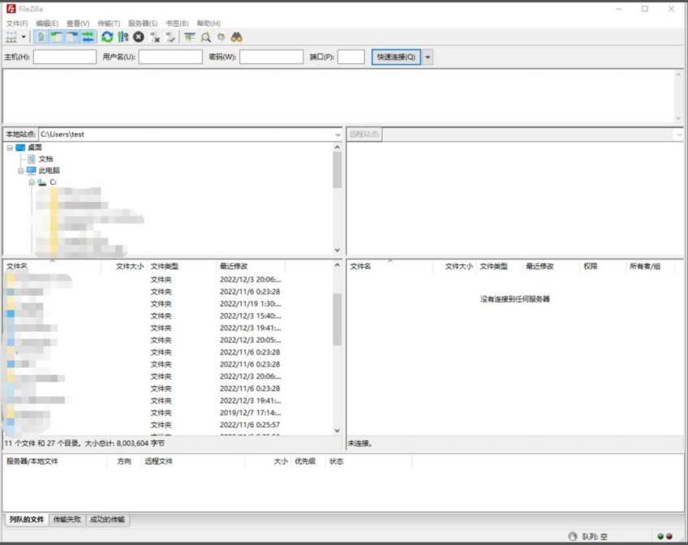
4. 连接开发板的方法如下图所示：

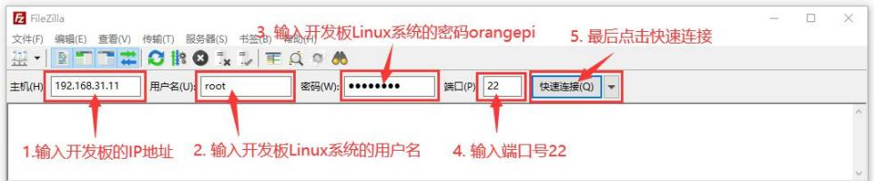
5. 然后选择**保存密码**，再点击**确定**

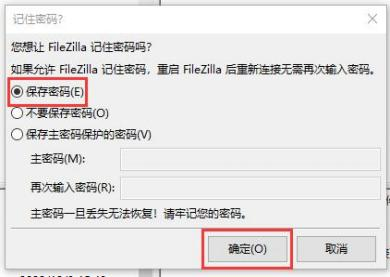
6. 然后选择**总是信任该主机**，再点击**确定**

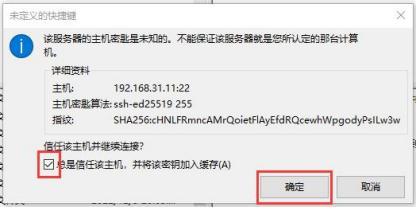
7. 连接成功后在filezilla软件的右边就可以看到开发板linux文件系统的目录结构了

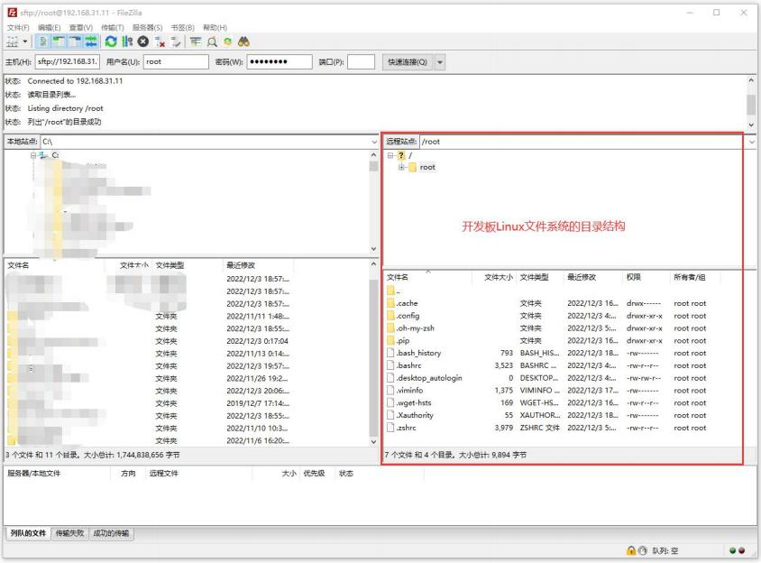
8. 然后在 filezilla 软件的右边选择要上传到开发板中的路径，再在 filezilla 软件的左边选中 Windows PC 中要上传的文件，再点击鼠标右键，再点击上传选项就会开始上传文件到开发板中了

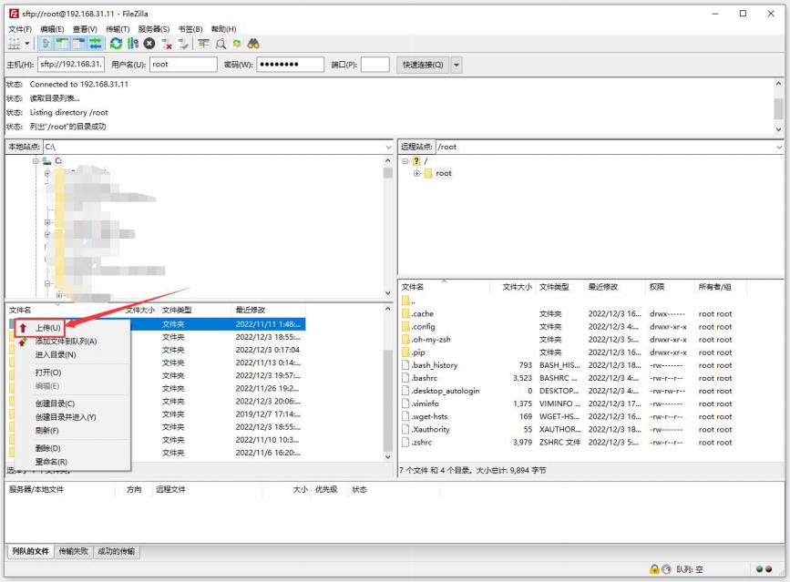
9. 上传完成后就可以去开发板 linux 系统中的对应路径中查看上传的文件了
10. 上传文件夹的方法和上传文件的方法是一样的，这里就不再赘述了

### 3.35. 开关机 logo 使用说明

1. 开关机 logo 默认只在桌面版的系统中才会显示
2. 在**/boot/orangepiEnv.txt** 中设置 **bootlogo** 变量为 **false** 可以关闭开关机 logo
orangepi@orangepi:\~\$ sudo vim /boot/orangepiEnv.txt verbosity=1
bootlogo=false

3. 在**/boot/orangepiEnv.txt** 中设置 **bootlogo** 变量为 **true** 可以开启开关机 logo
orangepi@orangepi:\~\$ sudo vim /boot/orangepiEnv.txt verbosity=1
bootlogo=true

4. 开机 logo 图片在 linux 系统中的位置为
/usr/share/plymouth/themes/orangepi/watermark.png

5. 替换开机 logo 图片后需要运行下命令才能生效
orangepi@orangepi:\~\$ sudo update-initramfs -u

### 3.36. 关机和重启开发板的方法

1. 在 Linux 系统运行的过程中，如果直接拔掉电源断电，可能会导致文件系统丢失某些数据，建议断电前先使用**poweroff**命令关闭开发板的 Linux 系统，然后再拔掉电源
orangepi@orangepi:\~\$ sudo poweroff

> 注意，关闭开发板后需要重新拔插电源才能开机。

2. 使用 **reboot** 命令即可重启开发板中的 Linux 系统
orangepi@orangepi:\~\$ sudo reboot

## 4. Linux SDK------orangepi-build 使用说明

### 4.1. 编译系统需求

Linux SDK ，即 **orangepi-build** ，只支持在安装有 **Ubuntu 22.04** 的 X64 电脑上运行，所以下载 orangepi-build 前，请首先确保自己电脑已安装的 Ubuntu 版本是 Ubuntu 22.04 。查看电脑已安装的 Ubuntu 版本的命令如下所示，如果 Release 字段显示的不是 **22.04** ，说明当前使用的 Ubuntu 版本不符合要求，请更换系统后再进行下面的操作。
test@test:\~\$ lsb_release -a
No LSB modules are available. Distributor ID: Ubuntu
Description: Ubuntu 22.04 LTS
Release: 22.04
Codename: jammy

如果电脑安装的是 Windows 系统，没有安装有 Ubuntu22.04 的电脑，可以考虑使用 **VirtualBox** 或者 **VMware** 来在 Windows 系统中安装一个 Ubuntu 22.04 虚拟机。但是请注意，不要在 WSL 虚拟机上编译 orangepi-build ，因为 orangepi-build 没有在WSL 虚拟机中测试过，所以无法确保能正常在 WSL 中使用 orangepi-build ，另外请不要在**开发板**的 Linux 系统中使用 orangepi-build 。Ubuntu 22.04 **amd64** 版本的安装镜像下载地址为：
[https://mirrors.tuna.tsinghua.edu.cn/ubuntu-releases/22.04/ubuntu-22.04-desktop-amd64.iso](https://repo.huaweicloud.com/ubuntu-releases/21.04/ubuntu-21.04-desktop-amd64.iso)

在电脑中或者虚拟机中安装完 Ubuntu 22.04 后，请先设置 Ubuntu 22.04 的软件源为清华源（或者其它你觉得速度快的国内源），不然后面安装软件的时候很容易由于网络原因而出错。替换清华源的步骤如下所示：
a. 替换清华源的方法参考这个网页的说明即可。
[https://mirrors.tuna.tsinghua.edu.cn/help/ubuntu/](https://mirrors.tuna.tsinghua.edu.cn/help/ubuntu/)

b. 注意 Ubuntu 版本需要切换到 22.04。

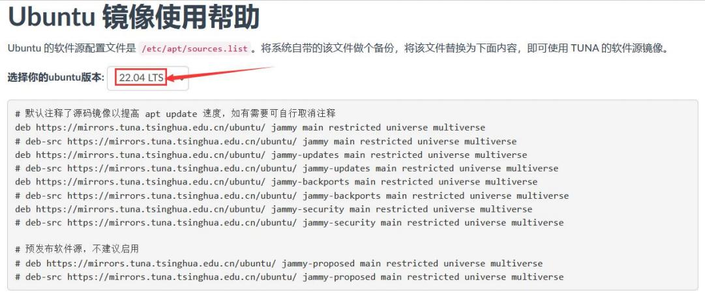
c. 需要替换的**/etc/apt/sources.list** 文件的内容为：
test@test:\~\$ sudo mv /etc/apt/sources.list cat /etc/apt/sources.list.bak
test@test:\~\$ sudo vim /etc/apt/sources.list
\# 默认注释了源码镜像以提高 apt update 速度，如有需要可自行取消注释
deb [https://mirrors.tuna.tsinghua.edu.cn/ubuntu/ jammy main restricted universe multiverse](https://mirrors.tuna.tsinghua.edu.cn/ubuntu/jammymainrestricteduniversemultiverse)
\# deb-src [https://mirrors.tuna.tsinghua.edu.cn/ubuntu/ jammy main restricted universe multiverse](https://mirrors.tuna.tsinghua.edu.cn/ubuntu/jammymainrestricteduniversemultiverse) deb [https://mirrors.tuna.tsinghua.edu.cn/ubuntu/ jammy-updates main restricted universe multiverse](https://mirrors.tuna.tsinghua.edu.cn/ubuntu/jammy-updatesmainrestricteduniversemultiverse)
\# deb-src [https://mirrors.tuna.tsinghua.edu.cn/ubuntu/ jammy-updates main restricted universe multiverse](https://mirrors.tuna.tsinghua.edu.cn/ubuntu/jammy-updatesmainrestricteduniversemultiverse) deb [https://mirrors.tuna.tsinghua.edu.cn/ubuntu/ jammy-backports main restricted universe multiverse](https://mirrors.tuna.tsinghua.edu.cn/ubuntu/jammy-backportsmainrestricteduniversemultiverse)
\# deb-src [https://mirrors.tuna.tsinghua.edu.cn/ubuntu/ jammy-backports main restricted universe multiverse](https://mirrors.tuna.tsinghua.edu.cn/ubuntu/jammy-backportsmainrestricteduniversemultiverse) deb [https://mirrors.tuna.tsinghua.edu.cn/ubuntu/ jammy-security main restricted universe multiverse](https://mirrors.tuna.tsinghua.edu.cn/ubuntu/jammy-securitymainrestricteduniversemultiverse)
\# deb-src [https://mirrors.tuna.tsinghua.edu.cn/ubuntu/ jammy-security main restricted universe multiverse](https://mirrors.tuna.tsinghua.edu.cn/ubuntu/jammy-securitymainrestricteduniversemultiverse#)
[\#](https://mirrors.tuna.tsinghua.edu.cn/ubuntu/jammy-securitymainrestricteduniversemultiverse#) 预发布软件源，不建议启用
\# deb [https://mirrors.tuna.tsinghua.edu.cn/ubuntu/ jammy-proposed main restricted universe multiverse](https://mirrors.tuna.tsinghua.edu.cn/ubuntu/jammy-proposedmainrestricteduniversemultiverse)
\# deb-src [https://mirrors.tuna.tsinghua.edu.cn/ubuntu/ jammy-proposed main restricted universe multiverse](https://mirrors.tuna.tsinghua.edu.cn/ubuntu/jammy-proposedmainrestricteduniversemultiverse)

d. 替换完后需要更新下包信息，并确保没有报错。
test@test:\~\$ sudo apt-get update

e. 另外，由于内核和 U-boot 等源码都是存放在 **GitHub 上的，所以编译镜像**
的时候请确保电脑能正常从 GitHub 下载代码，这点是非常重要的。

### 4.2. 获取 linux sdk 的源码

#### 4.2.1. 从 git hub 下载 orangepi-build

linux sdk 指的是 orangepi-build 这套代码，orangepi-build 是基于 armbian build 编译系统修改而来的，使用 orangepi-build 可以编译出多个版本的 linux 镜像。使用下面的命令可以下载 orangepi-build 的代码：
test@test:\~\$ sudo apt-get update
test@test:\~\$ sudo apt-get install -y git
test@test:\~\$ git clone <https://github.com/orangepi-xunlong/orangepi-build.git> -b next

通过 git clone 命令下载 orangepi-build 的代码是不需要输入 github 账号的用户名和密码的（下载本手册中的其他代码也是一样的），如果如输入 git clone 命令后Ubuntu PC 提示需要输入 github 账号的用户名和密码，一般都是 git clone 后面的orangepi-build 仓库的地址输入错误了，请仔细检查命令拼写是否有错误，而不是以为我们这里忘了提供 github 账号的用户名和密码。

H618 系列开发板当前使用的u-boot 和 linux 内核版本如下所示：
| 分支 | u-boot 版本 | linux 内核版本 |
| --- | --- | --- |
| current | u-boot v2018.05 | linux5.4 |
| next | u-boot v2021.07 | linux6.1 |

这里所说的分支和 orangepi-build 源代码的分支不是同一个东西，请不要搞混了。此分支主要是用来区分不同内核源码版本的。
目前全志提供的linux5.4 bsp 内核我们定义为current 分支。最新的linux6.1 LTS内核定义为next 分支。

orangepi-build 下载完后会包含下面的文件和文件夹：
[a. **build.sh**:](a.build.sh:) 编译启动脚本
b. **external**: 包含编译镜像需要用的配置文件、特定的脚本以及部分程序的源码等
c. **LICENSE**: GPL 2 许可证文件
d. [**README.md**](https://github.com/orangepi-xunlong/orangepi-build/blob/main/README.md): orangepi-build 说明文件
e. **scripts**: 编译 linux 镜像的通用脚本
test@test:\~/orangepi-build\$ ls
[build.sh](build.sh) external LICENSE [README.md](https://github.com/orangepi-xunlong/orangepi-build/blob/main/README.md) scripts

如果 是从 github 下载 的 orangepi-build 的代码 ， 下载完后你可 能会 发现orangepi-build 中并没有包含u-boot 和linux 内核的源码，也没有编译u-boot 和linux内核需要用到交叉编译工具链，这是正常的，因为这些东西都存放在其它单独的github 仓库或者某些服务器上了（下文会详述其地址）。orangepi-build 在脚本和配置文件中会指定 u-boot、linux 内核和交叉编译工具链的地址，运行orangepi-build时，当其发现本地没有这些东西，会自动去相应的地方下载的。

#### 4.2.2. 下载交叉编译工具链

orangepi-build 第一次运行的时候会自动下载交叉编译工具链放在 **toolchains** 文件夹中，每次运行 orangepi-build 的 [build.sh](build.sh) 脚本后，都会检查 **toolchains** 中的交叉编译工具链是否都存在，如果不存在则会重新开始下载，如果存在则直接使用，不会重复下载。

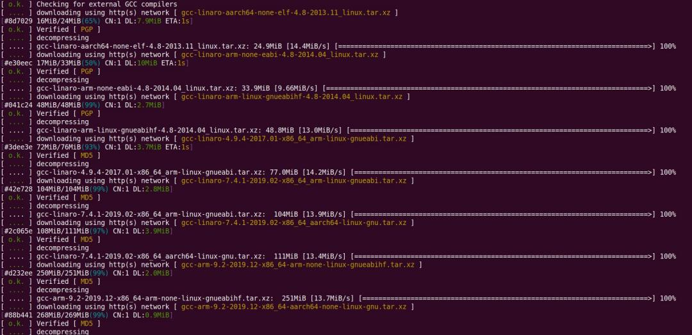
交叉编译工具链在中国境内的镜像网址为清华大学的开源软件镜像站：
[https://mirrors.tuna.tsinghua.edu.cn/armbian-releases/\_toolchain/](https://mirrors.tuna.tsinghua.edu.cn/armbian-releases/_toolchain/)

**toolchains** 下载完后会包含多个版本的交叉编译工具链：
test@test:\~/orangepi-build\$ ls toolchains/
gcc-arm-11.2-2022.02-x86_64-aarch64-none-linux-gnu gcc-linaro-4.9.4-2017.01-x86_64_aarch64-linux-gnu
gcc-linaro-7.4.1-2019.02-x86_64_arm-linux-gnueabi
gcc-arm-11.2-2022.02-x86_64-arm-none-linux-gnueabihf gcc-linaro-4.9.4-2017.01-x86_64_arm-linux-gnueabi
gcc-linaro-aarch64-none-elf-4.8-2013.11_linux
gcc-arm-9.2-2019. 12-x86_64-aarch64-none-linux-gnu gcc-linaro-5.5.0-2017. 10-x86_64_arm-linux-gnueabihf gcc-linaro-arm-linux-gnueabihf-4.8-2014.04_linux
gcc-arm-9.2-2019. 12-x86_64-arm-none-linux-gnueabihf gcc-linaro-7.4.1-2019.02-x86_64_aarch64-linux-gnu
gcc-linaro-arm-none-eabi-4.8-2014.04_linux

编译 H618 Linux 内核源码使用的交叉编译工具链为：
a. linux5.4
gcc-arm-11.2-2022.02-x86_64-aarch64-none-linux-gnu

b. linux6.1
gcc-arm-11.2-2022.02-x86_64-aarch64-none-linux-gnu

编译 H618 u-boot源码使用的交叉编译工具链为：
a. v2018.05
gcc-linaro-7.4.1-2019.02-x86_64_arm-linux-gnueabi

b. v2021.07
gcc-arm-11.2-2022.02-x86_64-aarch64-none-linux-gnu

#### 4.2.3. orangepi-build 完整目录结构说明

1. orangepi-build 仓库下载完后并不包含 linux 内核、u-boot 的源码以及交叉编译工具链，linux 内核和u-boot 的源码存放在独立的 git 仓库中
a. linux 内核源码存放的 git 仓库如下，注意切换 linux-orangepi 仓库的分支为
a\) Linux5.4
[https://github.com/orangepi-xunlong/linux-orangepi/tree/orange-pi-5.4-sun50iw9](https://github.com/orangepi-xunlong/linux-orangepi/tree/orange-pi-5.4-sun50iw9)

b\) Linux6.1
[https://github.com/orangepi-xunlong/linux-orangepi/tree/orange-pi-6.1-sun50iw9](https://github.com/orangepi-xunlong/linux-orangepi/tree/orange-pi-6.1-sun50iw9)

b. u-boot 源码存放的 git 仓库如下，注意切换 u-boot-orangepi 仓库的分支为
a\) v2018.05
[https://github.com/orangepi-xunlong/u-boot-orangepi/tree/v2018.05-h618](https://github.com/orangepi-xunlong/u-boot-orangepi/tree/v2018.05-h618)

b\) v2021.07
[https://github.com/orangepi-xunlong/u-boot-orangepi/tree/v2021.07-sunxi](https://github.com/orangepi-xunlong/u-boot-orangepi/tree/v2021.07-sunxi)

2. orangepi-build 第一次运行的时候会去下载交叉编译工具链、u-boot 和 linux 内核源码，成功编译完一次 linux 镜像后在 orangepi-build 中可以看到的文件和文件夹有
[a. **build.sh**:](a.build.sh:) 编译启动脚本
b. **external**: 包含编译镜像需要用的配置文件、特定功能的脚本以及部分程序的源码，编译镜像过程中缓存的 rootfs 压缩包也存放在 external 中
c. **kernel**: 存放 linux 内核的源码
d. **LICENSE**: GPL 2 许可证文件
e. [**README.md**](https://github.com/orangepi-xunlong/orangepi-build/blob/main/README.md): orangepi-build 说明文件
f. **output**: 存放编译生成的u-boot、linux 等 deb 包、编译日志以及编译生成的镜像等文件
g. **scripts**: 编译 linux 镜像的通用脚本
h. **toolchains**: 存放交叉编译工具链
i. **u-boot**: 存放 u-boot 的源码
j. **userpatches**: 存放编译脚本需要用到的配置文件
test@test:\~/orangepi-build\$ ls
[build.sh](build.sh) external kernel LICENSE output [README.md](https://github.com/orangepi-xunlong/orangepi-build/blob/main/README.md) scripts toolchains u-boot userpatches

### 4.3. 编译 u-boot

1. 运行 [build.sh](build.sh) 脚本，记得加 sudo 权限
test@test:\~/orangepi-build\$ [sudo ./build.sh](sudo./build.sh)

2. 选择 **U-boot****package** ，然后回车

3. 接着选择开发板的型号

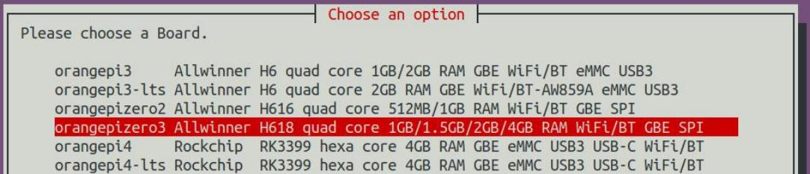
4. 然后选择u-boot 的分支类型
a. current 分支会编译 linux5.4 镜像需要使用的 u-boot v2018.05 版本的代码
[b. next](b.next) 分支会编译 linux6. 1 镜像需要使用的 u-boot v2021.07 版本的代码

5. 如果选择的 next 分支还会提示需要选择内存的大小，current 分支不需要选择
a. 如果购买的开发板为 1.5GB 内存大小的，请选择第一项
b. 如果购买的开发板为 1GB 或 2GB 或 4GB 内存大小的，请选择第二项

6. 然后就会开始编译u-boot ，编译 next 分支时提示的部分信息说明如下所示： a. u-boot 源码的版本
\[ o.k. \] Compiling u-boot \[ v2021.07 \]

b. 交叉编译工具链的版本
\[ o.k. \] Compiler version \[ aarch64-linux-gnu-gcc 11 \]

c. 编译生成的u-boot deb 包的路径
\[ o.k. \] Target directory \[ orangepi-build/output/debs/u-boot \]

d. 编译生成的u-boot deb 包的包名
\[ o.k. \] File name \[ linux-u-boot-next-orangepizero3_x.x.x_arm64.deb \]

e. 编译使用的时间
\[ o.k. \] Runtime \[ 1 min \]

f. 重复编译u-boot 的命令，使用下面的命令无需通过图形界面选择，可以直接开始编译u-boot
\[ o.k. \] Repeat Build Options \[ sudo ./build.sh BOARD=orangepizero3 BRANCH=next BUILD_OPT=u-boot \]

7. 查看编译生成的u-boot deb 包
test@test:\~/orangepi-build\$ ls output/debs/u-boot/ linux-u-boot-next-orangepizero3_x.x.x_arm64.deb

8. orangepi-bulid 编译系统编译 u-boot 源码时首先会将 u-boot 的源码和 github 服务器的u-boot源码进行同步，所以如果想修改u-boot 的源码，首先需要关闭源码的下载更新功能（需要完整编译过一次 u-boot 后才能关闭这个功能，否则会提示找不到u-boot 的源码），否则所作的修改都会被还原，方法如下：
设置 **userpatches/config-default.conf** 中的 IGNORE_UPDATES 变量为"yes "
test@test:\~/orangepi-build\$ vim userpatches/config-default.conf
\...\...
IGNORE_UPDATES=\"yes\"

\...\...

9. 调试u-boot 代码时，可以使用下面的方法来更新 linux 镜像中的u-boot 进行测试a. 首先将编译好的u-boot 的 deb 包上传到开发板的 linux 系统中
test@test:\~/orangepi-build\$ cd output/debs/u-boot
test@test:\~/orangepi_build/output/debs/u-boot\$ scp \\
linux-u-boot-next-orangepizero3_x.x.x_arm64.deb <root@192.168.1.xxx:/root>

b. 再安装刚才上传的新的u-boot 的 deb 包
orangepi@orangepi:\~\$ sudo dpkg -i linux-u-boot-next-orangepizero3_x.x.x_arm64.deb

c. 然后运行 nand-sata-install 脚本
orangepi@orangepi:\~\$ sudo nand-sata-install

d. 然后选择 **5****Install/Update****the****bootloader****on****SD/eMMC**

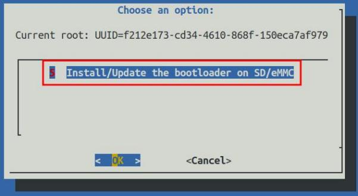
e. 按下回车键后首先会弹出一个 Warning

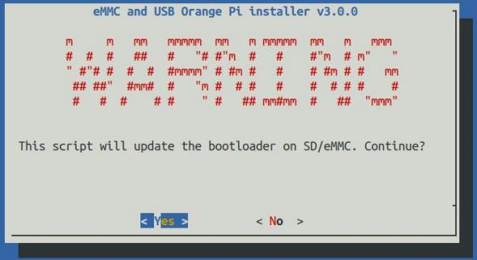
f. 再按下回车键就会开始更新u-boot ，更新完后会显示下面的信息

g. 然后就可以重启开发板来测试u-boot 的修改是否生效了

### 4.4. 编译 linux 内核

1. 运行 **[build.sh](build.sh)** 脚本，记得加 sudo 权限
test@test:\~/orangepi-build\$ [sudo ./build.sh](sudo./build.sh)

2. 选择 **Kernel****package** ，然后回车

3. 然后会提示是否需要显示内核配置界面，如果不需要修改内核配置，则选择第一个即可，如果需要修改内核配置，则选择第二个

4. 接着选择开发板的型号

5. 然后选择内核源码的分支类型
a. current 分支会编译 linux5.4 内核源码
[b. next](b.next) 分支会编译 linux6. 1 内核源码

6. 如果第 3)步选择了需要显示内核配置菜单（第二个选项），则会弹出通过 **make menuconfig** 打开的内核配置的界面，此时可以直接修改内核的配置，修改完后再保存退出即可，退出后会开始编译内核源码。

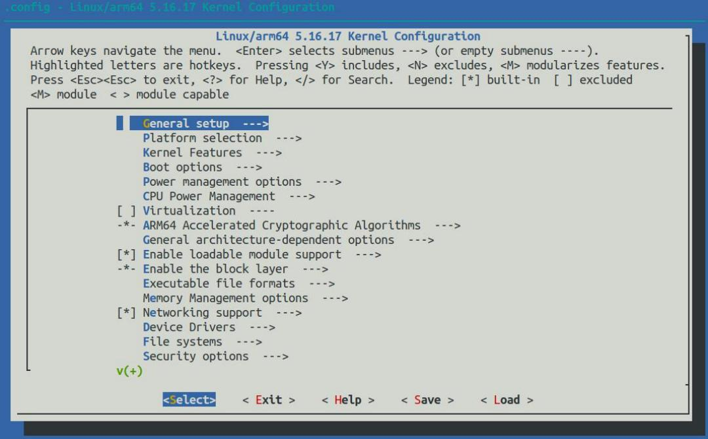
a. 如果不需要修改内核的配置选项，在运行[build.sh](build.sh)脚本时，传入**KERNEL_CONFIGURE=no** 就可临时屏蔽弹出内核的配置界面了
test@test:\~/orangepi-build\$ sudo ./build.sh KERNEL_CONFIGURE=no

b. 也可以设置 orangepi-build/userpatches/config-default.conf配置文件中的**KERNEL_CONFIGURE=no** ，这样可以永久禁用这个功能
c. 编译内核的时候如果提示下面的错误，这是由于 Ubuntu PC 的终端界面太小，导致makemenuconfig 的界面无法显示，请把 Ubuntu PC 的终端调到最大，然后重新运行[build.sh](build.sh) 脚本

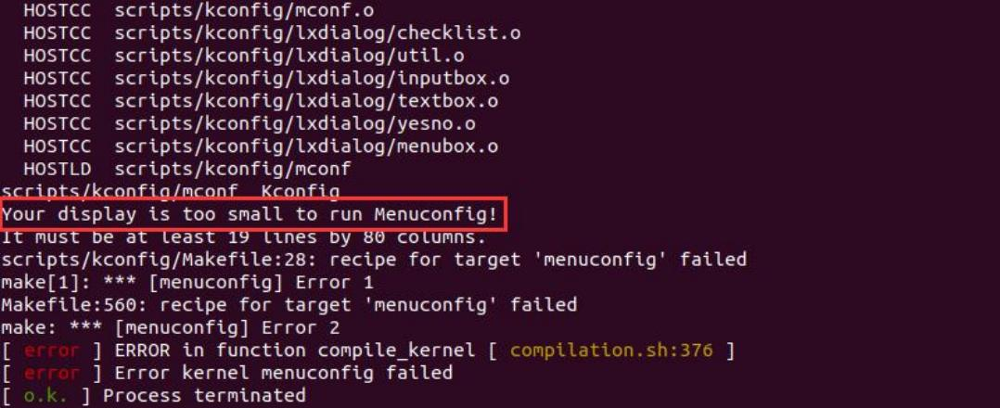
7. 编译 next 分支内核源码时提示的部分信息说明如下： a. linux 内核源码的版本
\[ o.k. \] Compiling current kernel \[ 6.1.31 \]

b. 使用的交叉编译工具链的版本
\[ o.k. \] Compiler version \[ aarch64-linux-gnu-gcc 11 \]

c. 内核默认使用的配置文件以及它存放的路径如下所示
\[ o.k. \] Using kernel config file
\[ orangepi-build/external/config/kernel/linux-6.1-sun50iw9-next.config \]

d. 编译生成的内核相关的 deb 包的路径
\[ o.k. \] Target directory \[ output/debs/ \]

e. 编译生成的内核镜像 deb 包的包名
\[ o.k. \] File name \[ linux-image-next-sun50iw9_x.x.x_arm64.deb \]

f. 编译使用的时间
\[ o.k. \] Runtime \[ 10 min \]

g. 最后会显示重复编译上一次选择的内核的编译命令，使用下面的命令无需通过图形界面选择，可以直接开始编译内核源码
\[ o.k. \] Repeat Build Options \[ sudo ./build.sh BOARD=orangepizero3 BRANCH=next BUILD_OPT=kernel KERNEL_CONFIGURE=no \]

8. 查看编译生成的内核相关的deb 包
a. **linux-dtb-next-sun50iw9_x.x.x_arm64.deb** 包含有内核使用的 dtb 文件
b. **linux-headers-next-sun50iw9_x.x.x_arm64.deb** 包含内核头文件
c. **linux-image-next-sun50iw9_x.x.x_arm64.deb** 包含内核镜像和内核模块
test@test:\~/orangepi-build\$ ls output/debs/linux-\*

output/debs/linux-dtb-next-sun50iw9_x.x.x_arm64.deb
output/debs/linux-headers-next-sun50iw9_x.x.x_arm64.deb output/debs/linux-image-next-sun50iw9_x.x.x_arm64.deb

9. orangepi-bulid 编译系统编译 linux 内核源码时首先会将 linux 内核源码和 github服务器的linux 内核源码进行同步，所以如果想修改linux 内核的源码，首先需要关闭源码的更新功能（需要完整编译过一次 linux 内核源码后才能关闭这个功能，否则会提示找不到 **linux 内核的源码**），否则所作的修改都会被还原，方法如下：
设置 **userpatches/config-default.conf** 中的 IGNORE_UPDATES 变量为"yes "
test@test:\~/orangepi-build\$ vim userpatches/config-default.conf IGNORE_UPDATES=\"yes\"

10. 如果对内核做了修改，可以使用下面的方法来更新开发板 linux 系统的内核和内核模块
a. 将编译好的 linux 内核的 deb 包上传到开发板的 linux 系统中
test@test:\~/orangepi-build\$ cd output/debs
test@test:\~/orangepi-build/output/debs\$ scp \\
[linux-image-next-sun50iw9_x.x.x_arm64.deb root@192.168.1.xxx:/root](linux-image-next-sun50iw9_x.x.x_arm64.debroot@192.168.1.xxx:/root)

b. 再安装刚才上传的新的linux 内核的deb 包
orangepi@orangepi:\~\$ sudo dpkg -i linux-image-next-sun50iw9_x.x.x_arm64.deb

c. 然后重启开发板，再查看内核相关的修改是否已生效
orangepi@orangepi:\~\$ sudo reboot

### 4.5. 编译 rootfs

1. 运行 [build.sh](build.sh) 脚本，记得加 sudo 权限
test@test:\~/orangepi-build\$ [sudo ./build.sh](sudo./build.sh)

2. 选择 **Rootfs****and****all****deb****packages** ，然后回车

3. 接着选择开发板的型号

4. 然后选择内核源码的分支类型，不同版本的内核源码维护的 rootfs类型有区别a. current 分支可以看到 debian11 、ubuntu20.04 、ubuntu22.04 三个选项
[b. next](b.next) 分支可以看到 debian11、debian12、ubuntu22.04 三个选项

5. 然后选择 rootfs 的类型

6. 然后选择镜像的类型
a. **Image****with****console****interface****(server)**表示服务器版的镜像，体积比较小
b. **Image****with****desktop****environment** 表示带桌面的镜像，体积比较大

7. 如果是编译服务器版的镜像，还可以选择编译 Standard 版本或者 Minimal 版本， Minimal 版本预装的软件会比 Standard 版本少很多（没特殊需求请不要选择 Minimal版本，因为很多东西默认没有预装，部分功能可能用不了）

8. 如果是编译桌面版本的镜像还需要选择桌面环境的类型，目前只维护 XFCE ，所以请选择 XFCE 类型的桌面

然后可以选择需要安装的额外的软件包。这里请按下回车键直接跳过。

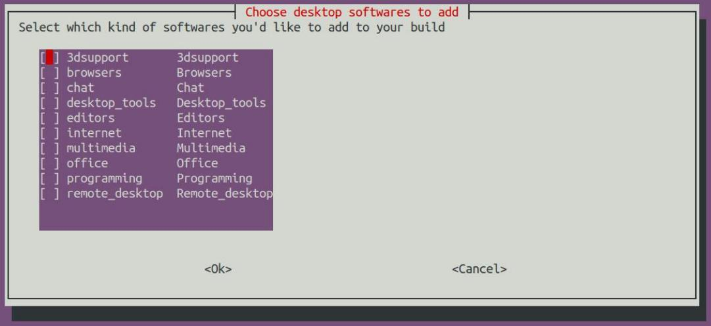
9. 然后就会开始编译 rootfs ，编译时提示的部分信息说明如下a. rootfs 的类型
\[ o.k. \] local not found \[ Creating new rootfs cache for bullseye \]

b. 编译生成的 rootfs 压缩包的存放路径
\[ o.k. \] Target directory \[ orangepi-build/external/cache/rootfs \]

c. 编译生成的 rootfs 压缩包的名字
\[ o.k. \] File name \[ bullseye-xfce-arm64.5250ec7002de9e81a41de169f1f89721.tar.lz4 \]

10. 查看编译生成的 rootfs 压缩包
a. **bullseye-xfce-arm64.5250ec7002de9e81a41de169f1f89721.tar.lz4** 是 rootfs 的压缩包，名字各字段的含义为
a\) **bullseye** 表示 rootfs 的 linux 发行版的类型
b\) **xfce** 表示 rootfs 为桌面版的类型，如果为 **cli** 则表示服务器版类型
c\) **arm64** 表示 rootfs 的架构类型
d\) **25250ec7002de9e81a41de169f1f89721** 是由rootfs安装的所有软件包的包名生成的 MD5 哈希值，只要没有修改 rootfs 安装的软件包的列表，那么这个值就不会变，编译脚本会通过这个 MD5 哈希值来判断是否需要重新编译 rootfs
b. **bullseye-xfce-arm64.5250ec7002de9e81a41de169f1f89721.tar.lz4.list** 列 出 了rootfs 安装的所有软件包的包名
test@test:\~/orangepi-build\$ ls external/cache/rootfs/
bullseye-xfce-arm64.5250ec7002de9e81a41de169f1f89721.tar.lz4
bullseye-xfce-arm64.5250ec7002de9e81a41de169f1f89721.tar.lz4.current bullseye-xfce-arm64.5250ec7002de9e81a41de169f1f89721.tar.lz4.list

11. 如果需要的 rootfs 在 **external/cache/rootfs** 下已经存在，那么再次编译 rootfs 就会直接跳过编译过程 ， 不会重新开始编译 ， 编译镜像的时候也会去**external/cache/rootfs** 下查找是否已经有缓存可用的 rootfs ，如果有就直接使用，这样可以节省大量的下载编译时间

### 4.6. 编译 linux 镜像

1. 运行 **[build.sh](build.sh)** 脚本，记得加 sudo 权限
test@test:\~/orangepi-build\$ [sudo ./build.sh](sudo./build.sh)

2. 选择 **Full****OS****image****for****flashing** ，然后回车

3. 然后选择开发板的型号

4. 然后选择内核源码的分支类型，不同版本的内核源码维护的 rootfs类型有区别a. current 分支可以看到 debian11 、ubuntu20.04 、ubuntu22.04 三个选项
[b. next](b.next) 分支可以看到 debian11、debian12、ubuntu22.04 三个选项

5. 如果选择的 next 分支还会提示需要选择内存的大小，current 分支不需要选择a. 如果购买的开发板为 1.5GB 内存大小的，请选择第一项
b. 如果购买的开发板为 1GB 或 2GB 或 4GB 内存大小的，请选择第二项

6. 然后选择 rootfs 的类型

7. 然后选择镜像的类型
c. **Image****with****console****interface****(server)**表示服务器版的镜像，体积比较小
d. **Image****with****desktop****environment** 表示带桌面的镜像，体积比较大

8. 如果是编译服务器版的镜像，还可以选择编译 Standard 版本或者 Minimal 版本， Minimal 版本预装的软件会比 Standard 版本少很多（没特殊需求请不要选择 Minimal版本，因为很多东西默认没有预装，部分功能可能用不了）

9. 如果是编译桌面版本的镜像还需要选择桌面环境的类型，目前只维护 XFCE ，所以请选择 XFCE 类型的桌面

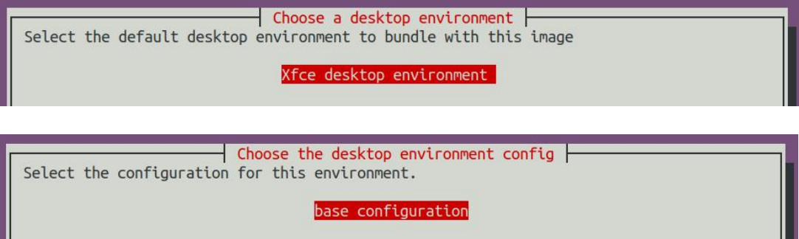
然后可以选择需要安装的额外的软件包。这里请按下回车键直接跳过。

10. 然后就会开始编译 linux镜像，编译的大致流程如下
a. 初始化 Ubuntu PC 的编译环境，安装编译过程需要的软件包
b. 下载u-boot 和 linux 内核的源码（如果已经缓存，则只更新代码）
c. 编译 u-boot 源码，生成 u-boot 的 deb 包
d. 编译 linux 源码，生成 linux 相关的 deb 包
e. 制作 linux firmware 的 deb 包
f. 制作 orangepi-config 工具的 deb 包
g. 制作板级支持的deb 包
h. 如果是编译 desktop 版镜像，还会制作 desktop 相关的 deb 包
i. 检查 rootfs 是否已经缓存，如果没有缓存，则重新制作 rootfs ，如果已经缓存，则直接解压使用
j. 安装前面生成的 deb 包到 rootfs 中
k. 对不同的开发板和不同类型镜像做一些特定的设置，如预装额外的软件包，修改系统配置等
l. 然后制作镜像文件，并格式化分区，默认类型为 ext4
m. 再将配置好的 rootfs拷贝到镜像的分区中
n. 然后更新 initramfs
o. 最后将u-boot 的 bin 文件通过 dd 命令写入到镜像中
11. 编译完镜像后会提示下面的信息
a. 编译生成的镜像的存放路径
\[ o.k. \] Done building
\[ output/images/orangepizero3_x.x.x_debian_bullseye_linux6.1.xx_xfce_desktop/ora

[**ngepizero3_x.x.x_debian_bullseye_linux6.1.xx_xfce_desktop.img** \]]{.underline}
b. 编译使用的时间
\[ o.k. \] Runtime \[ 19 min \]

c. 重复编译镜像的命令，使用下面的命令无需通过图形界面选择，可以直接开始编译镜像
\[ o.k. \] Repeat Build Options \[ sudo ./build.sh BOARD=orangepizero3
BRANCH=next BUILD_OPT=image RELEASE=bullseye BUILD_MINIMAL=no BUILD_DESKTOP=no KERNEL_CONFIGURE=yes \]

## 5. Android 12 TV 系统使用说明

### 5.1. 已支持的 Android 版本

| Android 版本 | 内核版本 |
| --- | --- |
| Android 12 TV 版 | linux5.4 |

### 5.2. Android 12 TV 功能适配情况

| 功能 | Android12 |
| --- | --- |
| HDMI 视频 | OK |
| HDMI 音频 | OK |
| USB2.0 x 3 | OK |
| TF 卡启动 | OK |
| 网卡 | OK |
| 红外 | OK |
| WIFI | OK |
| WIFI hotsport | OK |
| 蓝牙 | OK |
| BLE 蓝牙 | OK |
| 耳机音频 | OK |
| TV-OUT | OK |
| USB 摄像头 | OK |
| LED 灯 | OK |
| 温度传感器 | OK |
| Mali GPU | OK |
| 视频编解码 | OK |

### 5.3. 板载 LED 灯显示说明

|  | 绿灯 | 红灯 |
| --- | --- | --- |
| u-boot 启动阶段 | 灭 | 亮 |

| 内核启动到进入系统 | 亮 | 灭 |
| --- | --- | --- |

### 5.4. Android 返回上一级界面的方法

1. 我们一般都是使用鼠标和键盘来控制开发板的安卓系统，当进入某些界面，需要返回上一级界面或者桌面时，只能通过**鼠标右键**来返回，键盘是无法返回的
2. 如果有购买开发板配套的红外遥控（其他遥控不行）和扩展板，将扩展板插入开发板后，还可以通过遥控中的返回键来返回上一级菜单，返回键的位置如下图所示

### 5.5. ADB 的使用方法

#### 5.5.1. 使用网络连接 adb 调试

使用网络 adb 无需 USB Typc C 接口的数据线来连接电脑和开发板，而是通过网络来通信，所以首先请确保开发板的有线或者无线网络已经连接好了，然后获取开发板的IP 地址，后面要用到。

1. 确保 Android 系统的 **service.adb.tcp.port** 设置为 5555 端口号
| apollo-p2:/ \# **getprop \ | grep \"adb.tcp\"** \[service.adb.tcp.port\]: \[[5555](#5555)\] |
| --- | --- |

2. 如果 **service.adb.tcp.port** 没有设置，可以在串口中使用下面的命令设置网络 adb的端口号
apollo-p2:/ \# **setprop service.adb.tcp.port 5555**
apollo-p2:/ \# stop adbd
apollo-p2:/ \# start adbd

3. 在 Ubuntu PC 上安装 adb 工具
test@test:\~\$ sudo apt-get update
test@test:\~\$ sudo apt-get install -y adb

4. 然后在 Ubuntu PC 上连接网络 adb
test@test:\~\$ adb connect [192.168.1.xxx:5555](192.168.1.xxx:5555) (需要修改为开发板的 IP 地址)
\* daemon not running; starting now at tcp:5037
\* daemon started successfully
connected to [192.168.1.xxx:5555](192.168.1.xxx:5555test@test:)
[test@test:](192.168.1.xxx:5555test@test:)\~\$ adb devices
List of devices attached
[192.168.1.xxx:5555](192.168.1.xxx:5555) device

5. 然后在 Ubuntu PC 上通过 adb shell 就可以登录 android 系统
test@test:\~\$ adb shell apollo-p2:/ \#

#### 5.5.2. 使用数据线连接adb 调试

1. 准备一根 USB Typc C 接口的数据线， USB 接口一端插入电脑的 USB 接口中， USB Type C 接口一端插入开发板的电源接口中。在这种情况下是由电脑的 USB 接口给开发板供电，所以请确保电脑的 USB 接口能提供最够的功率驱动开发板

2. 在 Ubuntu PC 上安装 adb 工具
test@test:\~\$ sudo apt-get update
test@test:\~\$ sudo apt-get install -y adb

3. 查看识别到 ADB 设备
test@test:\~\$ adb devices
List of devices attached
4c00146473c28651dd0 device

4. 然后在 Ubuntu PC 上通过 adb shell 就可以登录 android 系统
test@test:\~\$ adb shell apollo-p2:/ \$

### 5.6. 查看设置 HDMI 显示分辨率的方法

1. 首先进入 **Settings**

2. 然后选择 **Device****Preferences**

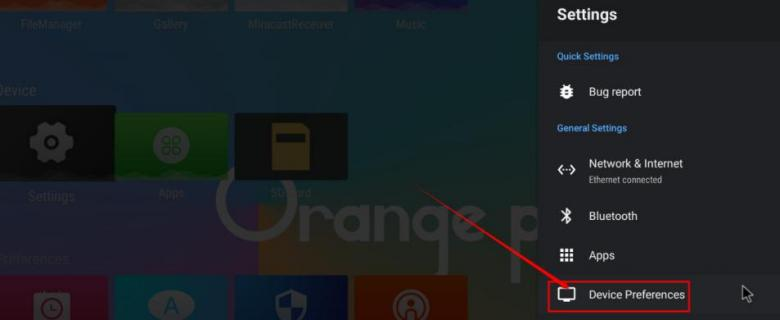
3. 然后选择 **Display****&****Sound**

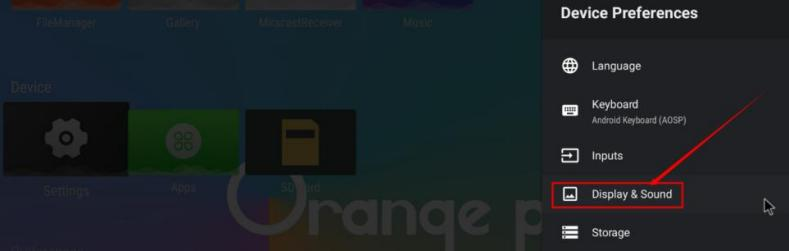
4. 然后选择 **Advanced****display****settings**

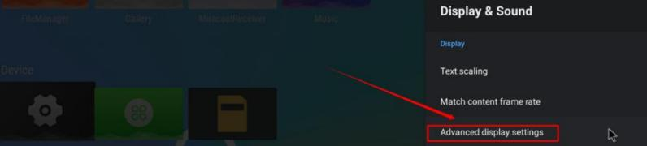
5. 然后选择 **HDMI****output****mode**

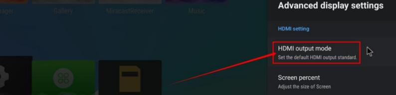
6. 然后就能看到显示器支持的分辨率列表了。此时点击对应的选项就会切换到对应的分辨率。请注意，不同显示器支持的分辨率可能是不同的，如果接到电视上，一般会看到比下图更多的分辨率选项。

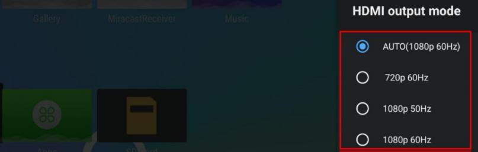
7. 开发板的 HDMI 输出是支持 4K 显示的，当接到4K 电视时就可以看到 4K 分辨率的选项

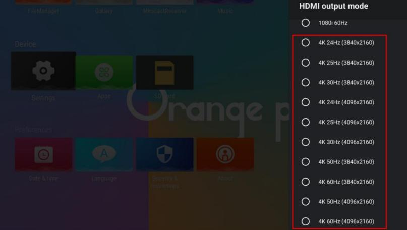

### 5.7. HDMI 转 VGA 显示测试

1. 首先需要准备下面的配件
a. HDMI 转 VGA 转换器

b. 一根 VGA 线和一根 Micro HDMI 公转 HDMI 母转接线
c. 一个支持 VGA 接口的显示器或者电视2) HDMI 转 VGA 显示测试如下所示

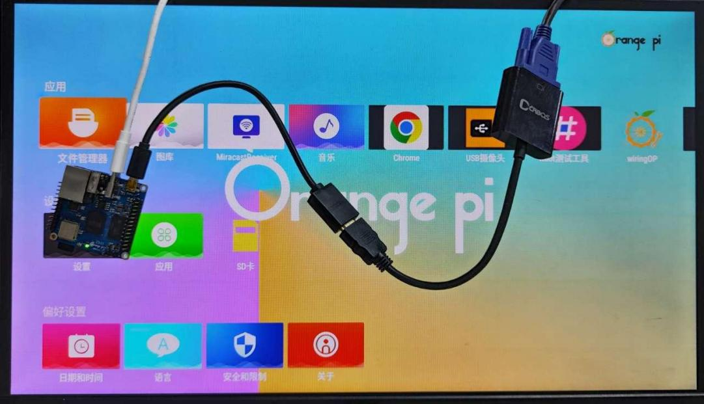
使用HDMI 转 VGA 显示时，开发板以及开发板的 Android 系统是不需要做任何设置的，只需要开发板 Micro HDMI 接口能正常显示就可以了。所以如果测试有问题，请检查 HDMI 转 VGA 转换器、VGA 线以及显示器是否有问题。

### 5.8. WI-FI 的连接方法

1. 首先选择 **Settings**

2. 然后选择 **Network****&****Internet**

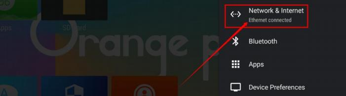
3. 然后打开 WI-FI

4. 打开 WI-FI 后在 **Available****networks** 下面就可以看到搜索到的信号

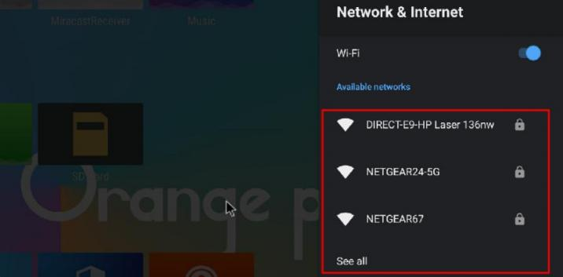
5. 选择想连接的 WI-FI 后会弹出下图所示的密码输入界面

6. 然后使用键盘输入 WI-FI 对应的密码，再使用**鼠标**点击虚拟键盘中的回车按钮就会开始连接 WI-FI 了

7. WI-FI 连接成功后的显示如下图所示

### 5.9. WI-FI hotspot 的使用方法

1. 首先请确保以太网口已连接网线，并且能正常上网
2. 然后选择 **Settings**

3. 然后选择 **Network****&****Internet**

4. 然后选择 **WIFI****hotspot**

5. 然后打开 **Hotspot****Enable** ，下图中还可以看到生成的热点的名字和密码，记住它们，在连接热点的时候要用到（如果需要修改热点的名字和密码，需要先关闭**Hotspot Enable** ，然后才能修改）

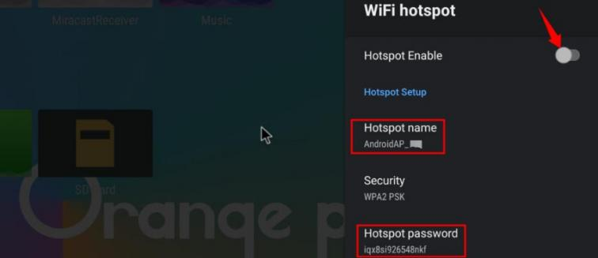
6. 此时可以拿出你的手机，如果一切正常，在手机搜索到的 WI-FI 列表中就能找到上图 **Hotspot name** 下面显示的同名（这里为 AndroidAP_7132）的 WIFI 热点了。然后可以点击 **AndroidAP_7132** 连接热点，密码在上图的 **Hotspot****password** 下面可以看到

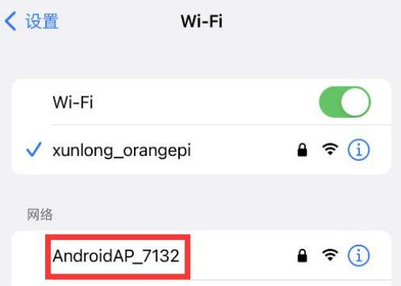
7. 连接成功后显示如下图所示（不同手机界面会有区别，具体界面以你手机显示的为准）。此时就可以在手机上打开一个网页看下能否上网了，如果能正常打开网页，说明开发板的 **WI-FI****Hotspot** 能正常使用

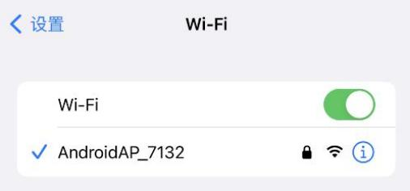

### 5.10. 查看以太网口 IP 地址的方法

1. 首先请确保开发板的千兆网口连接到了路由器或者交换机
2. 然后打开 **Settings**

3. 然后选择 **Network****&****Internet**

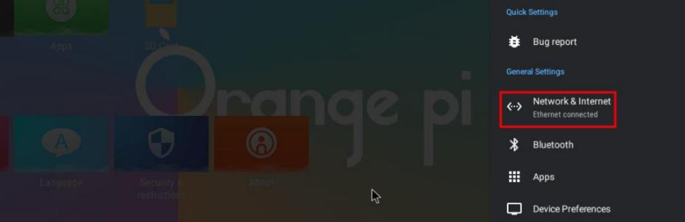
4. 然后在下图所示的位置就能看到开发板有线网口的 IP 地址了

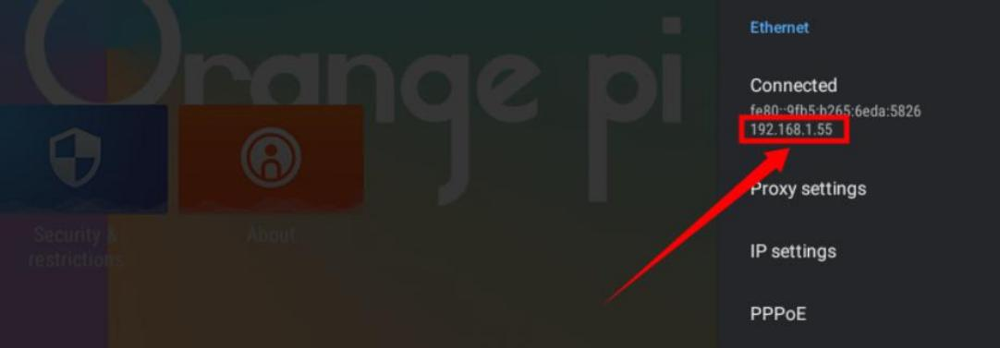

### 5.11. 蓝牙的连接方法

1. 首先选择 **Settings**

2. 然后选择 **Bluetooth**

**3)** 然后打开 **Bluetooth****Enable**

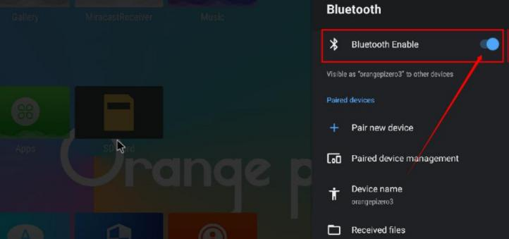
4. 然后点击 **Pair****new****device** 开始扫描周围的蓝牙设备

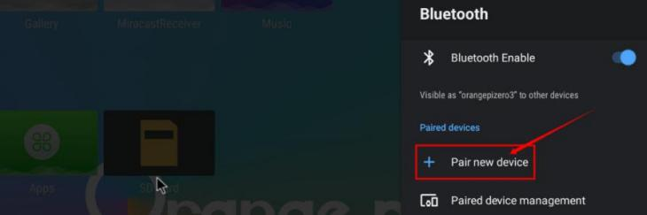
5. 搜索到的蓝牙设备会在 **Available****devices** 下面显示出来

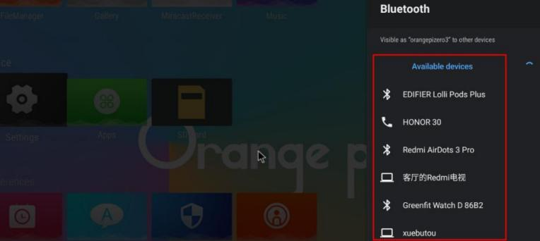
6. 然后点击想要连接的蓝牙设备就可以开始配对了，当弹出下面的界面时，请使用鼠标选择 **Pair** 选项

7. 这里测试的是开发板和**安卓手机**蓝牙的配置过程，此时在手机上会弹出下面的确认界面，在手机上也点击配对按钮后就会开始配对过程

8. 配对完成后，再打开 **Paired****devices** 下面就可以看到已配对的蓝牙设备

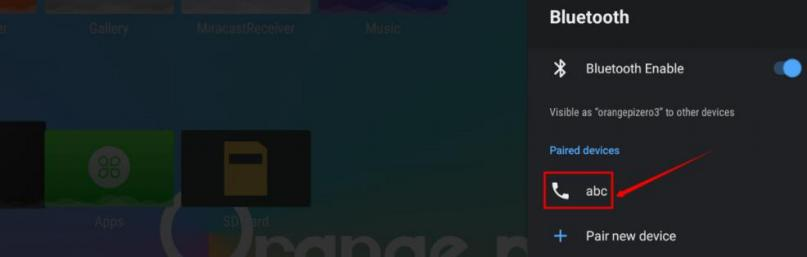
9. 此时可以使用手机蓝牙给开发板发送一张图片，发送后，在开发板的安卓系统中可以看到下面的确认界面，然后点击**Accept** 就可以开始接收手机发过来的图片了

10. 开发板 Android 系统蓝牙接收到的图片可以打开 **Received****files** 中查看

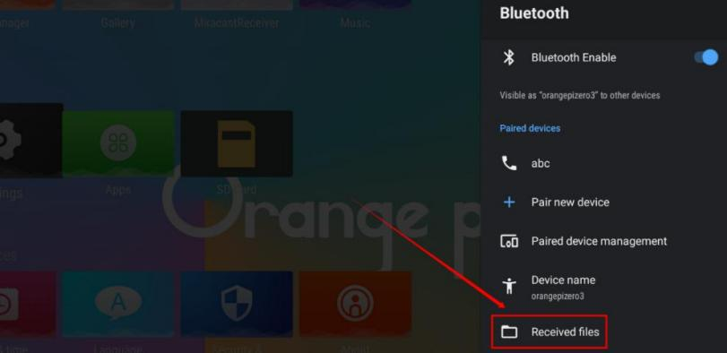

### 5.12. USB 摄像头使用方法

1. 首先在开发板的 USB 接口中插入 USB（UVC 协议）摄像头
2. USB 摄像头如果识别正常，在/dev 下会生成相应的video 设备节点
console:/ \# ls /dev/video0 /dev/video0

3. 然后确保 Ubuntu PC 和开发板的 adb 连接正常，adb 的使用方法请参考**[ADB 的](#adb-的)使用方法**一小节的说明
4. 在开发板资料下载页面的**官方工具**中下载 USB 摄像头测试 APP

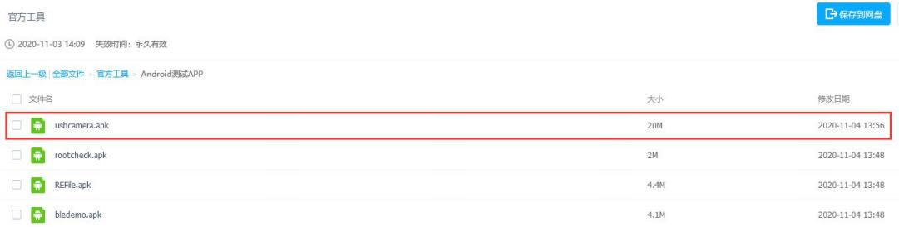
5. 然后使用adb 命令安装 USB 摄像头测试 APP 到 Android 系统中，当然也可以使用 U 盘拷贝的方式进行安装
test@test:\~\$ adb install usbcamera.apk

6. 安装完后在Android 的桌面可以看到 USB 摄像头的启动图标

7. 然后双击打开 USB 摄像头 APP 就可以看到 USB 摄像头的输出视频了

### 5.13. Android 系统 ROOT 说明

Orange Pi 发布的 Android 系统已经 ROOT ，可以使用下面的方法来测试。

1. 在开发板资料下载页面的**官方工具**中下载 **rootcheck.apk**

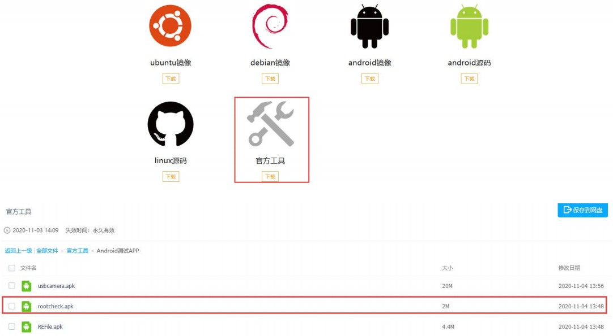
2. 然后确保 Ubuntu PC 和开发板的 adb 连接正常，adb 的使用方法请参考**[ADB 的](#adb-的)使用方法**一小节的说明
3. 然后使用 adb 命令安装rootcheck.apk 到 Android 系统中，当然也可以使用U 盘拷贝的方式进行安装
test@test:\~\$ adb install rootcheck.apk

4. 安装完后在Android 的桌面可以看到 ROOT 测试工具的启动图标

5. 第一次打开 **ROOT 测试工具**后的显示界面如下图所示

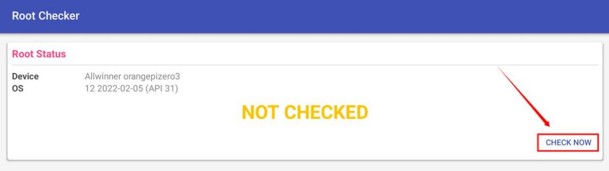
6. 然后就可以点击 **CHECK****NOW** 开始 Android 系统的 ROOT 状态的检查，检查完后的显示如下所示，可以看到 Android 系统已取得 ROOT 权限

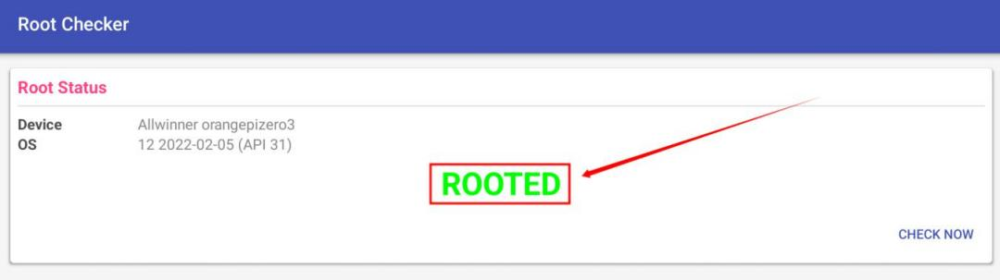

### 5.14. 使用 MiracastReceiver 将手机屏幕投屏到开发板的方法

1. 首先请确保开发板和手机都连接了同一个 WIFI 热点，开发板连接 WIFI 的方法请参考[**WI-FI 的连接方法**](#wi-fi-的连接方法)一小节的说明
2. 然后打开开发板安卓系统中的 **MiracastReceiver** 应用

3. **MiracastReceiver** 打开后的界面如下所示

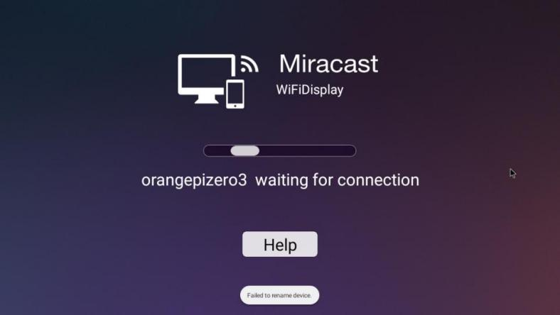
4. 然后在手机设置中找到投屏功能，这里以小米 12S Pro手机为例，其他品牌的手机请自行研究下，如下图所示，点击红色方框位置的按钮即可打开手机的投屏功能

5. 等待一段时间后在手机上就能看到搜索到的可连接的设备，然后我们选择开发板对应的设备连接即可

6. 然后在开发板的 **MiracastReceiver** 应用界面会弹出下图所示的选择框，这里我们选择 **Accept** 即可

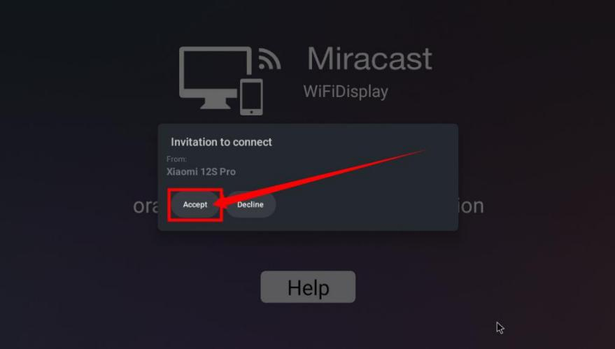
7. 然后就能在开发板连接的 HDMI 屏幕上看到手机屏幕的内容了

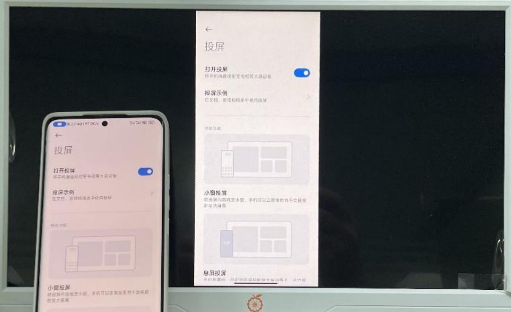

### 5.15. 26pin 接口 GPIO 、UART 、SPI 测试

#### 5.15.1. 26pin 的 GPIO 口测试方法

1. 首先在桌面中打开 wiringOP APP

2. 然后点击 **GPIO_TEST** 按钮打开 GPIO 测试界面

3. GPIO 测试界面如下图所示，左边的两排 **CheckBox** 按钮跟 26pin 引脚（**左下角**
的 PC1/PI16/PI6/PH10 是 13pin 引脚中的 GPIO 口）是一一对应的关系。当勾选**CheckBox** 按钮时，对应的 GPIO 引脚会被设置为 **OUT** 模式，引脚电平设置为高电平；当取消勾选时，GPIO 引脚电平设置为低电平；当点击右边的 **GPIO****READALL**按钮时，可以获取到 wPi 号、GPIO 模式、引脚电平等信息。

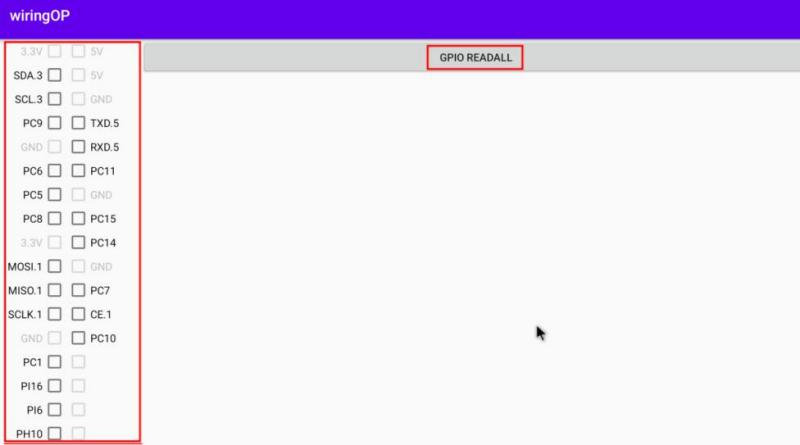
4. 然后点击 **GPIO****READALL** 按钮，输出信息如下图所示：

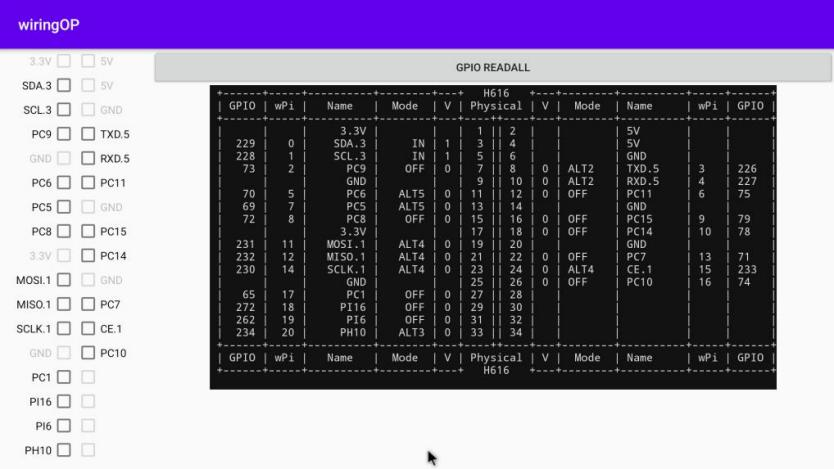
5. 开发板 26pin 中总共有 17 个 GPIO 口可以使用（如果加上 13pin 中的 4 个 GPIO口，那么总共就是有 **21 个**），下面以7 号引脚------对应 GPIO 为 PC9 ------对应 wPi序号为 2------为例演示如何设置 GPIO 口的高低电平。首先点击 7 号引脚对应的**CheckBox** 按钮，当按钮为选中状态时，7 号引脚会设置为高电平，设置完后可以使用万用表测量引脚的电压的数值，如果为 **3.3v** ，说明设置高电平成功

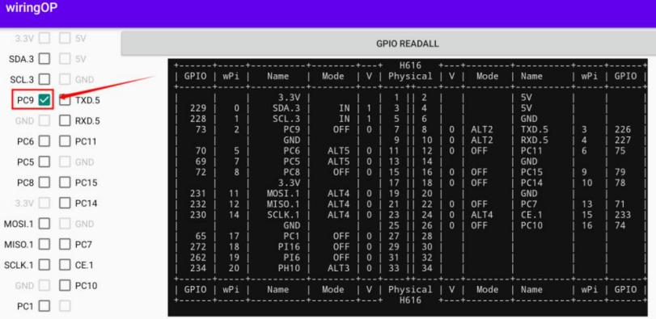
6. 然后点击 **GPIO READALL** 按钮，可以看到当前的 7 号引脚模式为 **OUT** ，引脚电平为高电平

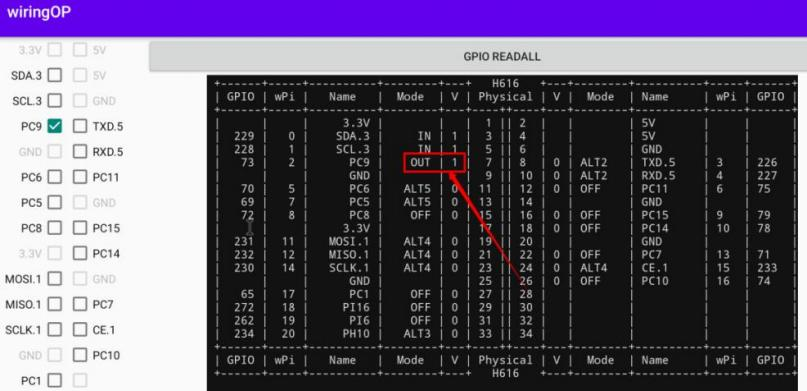
7. 再次点击下图的 **CheckBox** 按钮取消勾选状态，7 号引脚会设置为低电平，设置完后可以使用万用表测量引脚的电压的数值，如果为 **0v** ，说明设置低电平成功

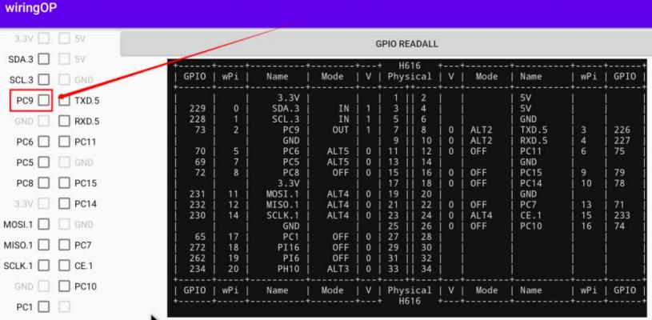
8. 然后点击 **GPIO READALL** 按钮，可以看到当前的 7 号引脚模式为 OUT ，引脚电平为低电平

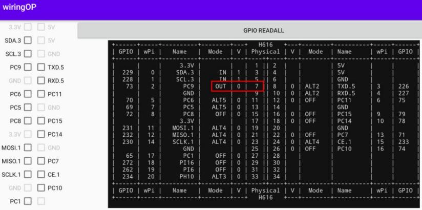

#### 5.15.2. 26pin 的 UART 测试方法

1. Android 中默认打开了 **UART5** ，对应的设备节点为**/dev/ttyAS5**
apollo-p2:/ \# ls /dev/ttyAS5 /dev/ttyAS5

2. 首先在桌面中打开 wiringOP APP

3. 然后点击 **UART_TEST** 按钮打开 UART 测试界面

4. wiringOP 的串口测试界面如下图所示

5. 然后在选择框中选择**/dev/ttyAS5** 节点

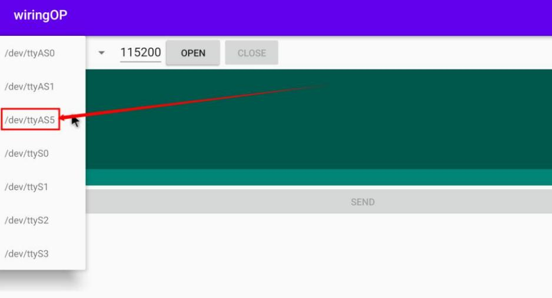
6. 再在编辑框中输入想要设置的波特率，然后点击 **OPEN** 按钮打开**/dev/ttyAS5** 节点，打开成功后，**OPEN** 按钮变为不可选中状态，**CLOSE** 按钮和 **SEND** 按钮变为可选中状态

7. 然后使用杜邦线短接 uart5 的 rx 和 tx 引脚
|  | uart5 |
| --- | --- |
| tx 引脚 | 对应 26pin 的 8 号引脚 |
| rx 引脚 | 对应 26pin 的 10 号引脚 |

8. 然后可以在下面的发送编辑框中输入一段字符，点击 **SEND** 按钮开始发送

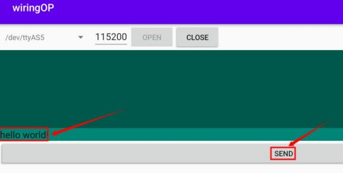
9. 如果一切正常，接收框内会显示已接收到的字符串

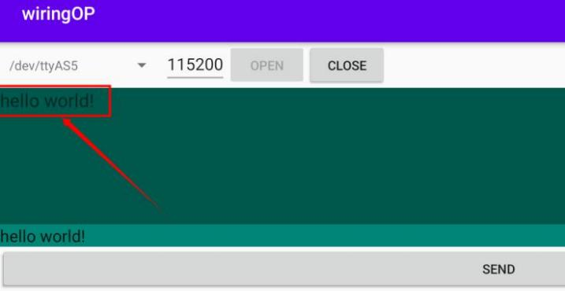

#### 5.15.3. 26pin 的 SPI 测试方法

1. 26pin 中可以用的 SPI 为 SPI1 ，对应的设备节点为**/dev/spidev1.1**

2. 这里演示下通过**w25q64** 模块来测试 SPI1 接口，首先在 SPI1 接口接入 w25q64模块
如果没有w25q64 模块也没关系，因为开发板上有一个 SPIFlash 接在了 SPI0上，在安卓中 SPI0 的配置默认也打开了，所以我们也可以直接使用板载的 SPIFlash测试。

3. 然后在桌面中打开 wiringOP APP
4. 然后点击 **SPI_TEST** 按钮打开 SPI 的测试界面

5. 然后在左上角选择 spi 的设备节点，如果直接测试板载的 SPIFlash ，那么保持默认的**/dev/spidev0.0** 即可，如果在 26pin 的 spi1 上接了 **w25q64** 模块，那么就请选择**/dev/spidev1.1**

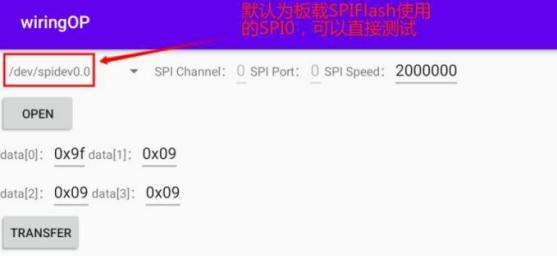
6. 然后点击 **OPEN** 按钮初始化 SPI

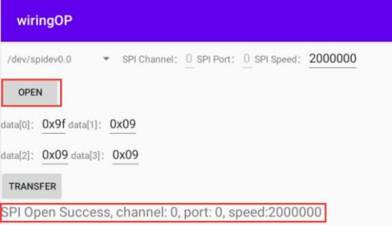
7. 然后填充需要发送的字节，比如读取板载 SPIFlash 的 ID 信息，在 data\[[0](#0)\] 中填入
地址 0x9f，然后点击 **TRANSFER** 按钮

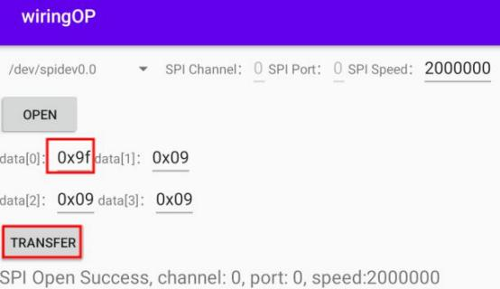
8. 最后 APP 会显示读取到的板载 SPI Flash 的 ID 信息

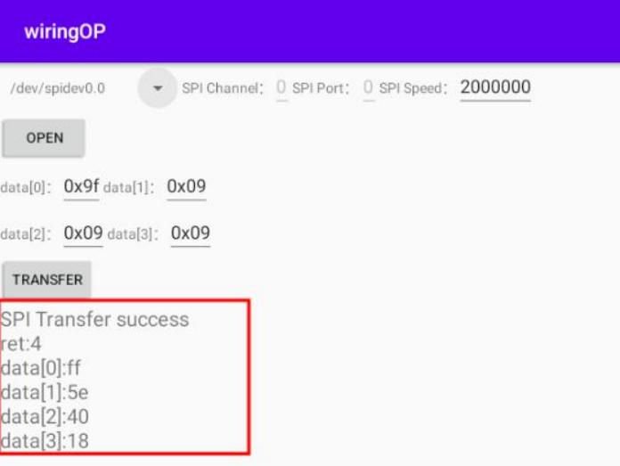
9. 如果是读取接在 26pin SPI1 上的 w25q64 模块，那么读取到的 ID 信息如下图所示

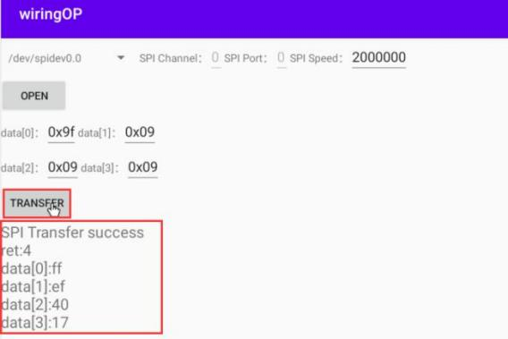
10. w25q64 模块的 MANUFACTURER ID 为 EFh，Device ID 为 4017h，跟上面读取
到的值是对应的（h 代表是 16 进制）

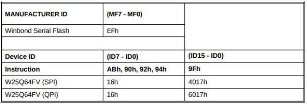

#### 5.15.4. 26pin 的 I2C 测试方法

1. Android 中默认打开了 26pin 中的 i2c3 ，对应的设备节点为**/dev/i2c-3**
apollo-p2:/ \# ls /dev/i2c-3 /dev/i2c-3

2. 首先在桌面中打开 wiringOP APP

3. 然后点击 **I2C_TEST** 按钮打开i2c 的测试界面

4. wiringOP 的 i2c 测试界面如下图所示，可以看到默认使用的 i2c 为**/dev/i2c-3** ，所以我们无需重新选择了

5. 然后在 26pin 的 i2c3 引脚上接一个 i2c 设备，这里以 ds1307 rtc 模块为例

| RTC 模块的引脚 | 开发板 26pin 对应的引脚 |
| --- | --- |
| 5V | 2 号引脚 |
| GND | 6 号引脚 |
| SDA | 3 号引脚 |
| SCL | 5 号引脚 |

6. ds1307 rtc 模块的 i2c 地址为 0x68 ，接好线后，我们可以在串口命令行中使用**i2cdetect****-y****3** 命令查看下是否能扫描到 ds1307 rtc 模块的 i2c 地址。如下图所示，如果能看到 0x68 这个地址，说明 ds1307 rtc 模块接线正确。
apollo-p2:/ \# i2cdetect -y 3

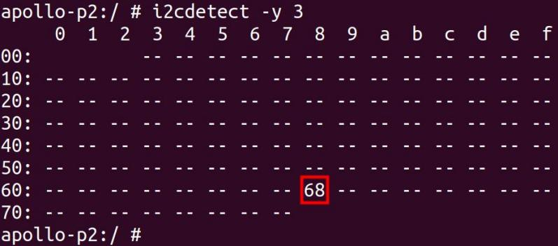
7. 然后在 wiringOP 中设置 i2c 的地址为 0x68 ，再点击 **OPEN** 按钮打开 i2c3

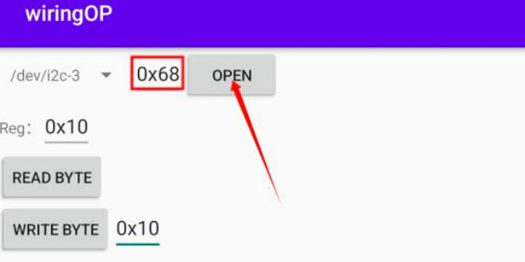
8. 点击 **OPEN** 按钮打开i2c3 后的显示如下所示：

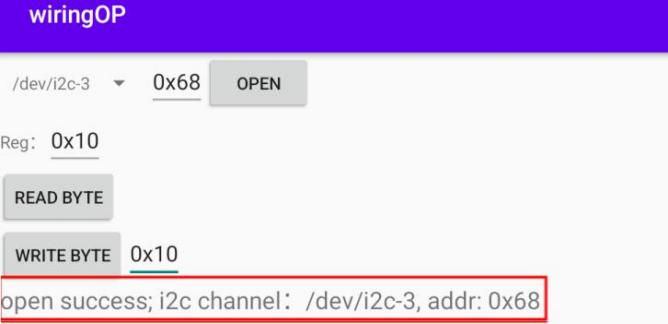
9. 然后我们测试下往 rtc 模块的寄存器中写入一个值，比如往 0x1c地址写入0x55 a. 我们首先设置需要写入的寄存器的地址为0x1c

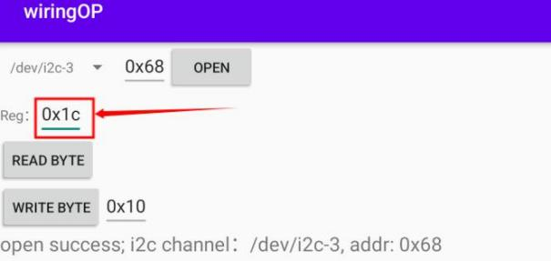
b. 然后设置需要写入的值为0x55

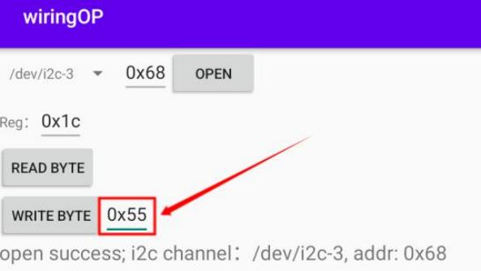
c. 然后点击 **WRITE****BYTE** 按钮执行写入的动作

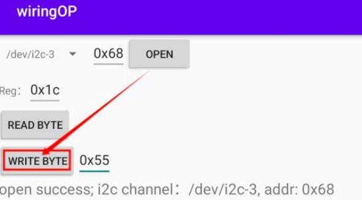
10. 然后点击 **READ BYTE** 按钮读取下 0x1c 寄存器的值，如果显示为 0x55 ，就说明 i2c读写测试通过

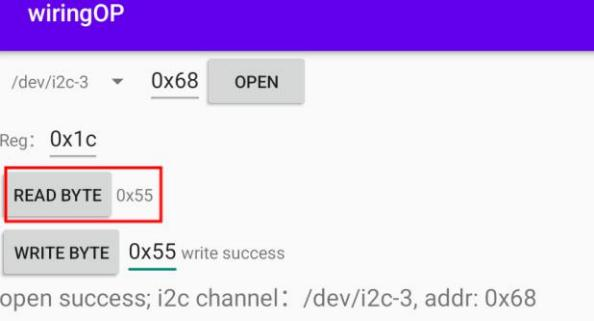

## 6. Android 12 源码的编译方法

### 6.1. 下载 Android 12 的源码

1. 首先从百度或者谷歌网盘下载Android 12 源码的分卷压缩包
a. 百度网盘
b. 谷歌网盘

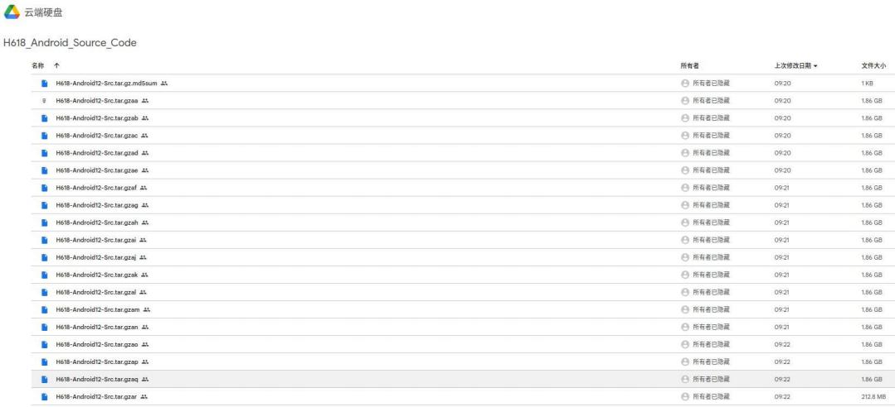
2. Android 12 源码的分卷压缩包下载完后，请先检查下 MD5 校验和是否正确，如果不正确，请重新下载源码。检查 MD5 校验和的方法如下所示：
test@test:\~\$ md5sum -c H618-Android12-Src.tar.gz.md5sum H618-Android12-Src.tar.gzaa: OK
H618-Android12-Src.tar.gzab: OK
\...\...

3. 然后需要将多个压缩文件合并成一个，再解压出安卓源码。命令如下所示：
test@test:\~\$ **cat H618-Android12-Src.tar.gza\* \> H618-Android12-Src.tar.gz test@test:\~\$ tar -xvf H618-Android12-Src.tar.gz**

### 6.2. 编译 Android 12 的源码

Android12 的编译是在安装有 Ubuntu 22.04 的 x86_64 电脑上进行的，其它版本的 Ubuntu 系统包依赖可能会有一些区别，Ubuntu 22.04 amd64 版本的镜像下载地址如下所示：
[https://repo.huaweicloud.com/ubuntu-releases/22.04/ubuntu-22.04.2-desktop-amd64.](https://repo.huaweicloud.com/ubuntu-releases/22.04/ubuntu-22.04.2-desktop-amd64.iso) iso
编译 Android12 源码的 x86_64 电脑硬件配置建议内存为 16GB 或 16GB 以上，硬盘空间建议预留200GB 或以上，CPU 核心数越多越好。

1. 首先安装编译 Android12 源码需要的软件包
test@test:\~\$ sudo apt-get update
test@test:\~\$ sudo apt-get install -y git gnupg flex bison gperf build-essential \\ zip curl zlib1g-dev gcc-multilib g++-multilib libc6-dev-i386 \\
lib32ncurses5-dev x11proto-core-dev libx11-dev lib32z1-dev ccache \\
libgl1-mesa-dev libxml2-utils xsltproc unzip u-boot-tools python-is-python3 \\ libssl-dev libncurses5 clang gawk

2. 然后编译 **longan** 文件夹中的代码，里面主要包含u-boot 和 linux 内核
a. 首先运行 **./build.sh config** 设置编译选项
test@test:\~\$ cd H618-Android12-Src/longan
test@test:\~/H618-Android12-Src/longan\$ ./build.sh config
Welcome to mkscript setup progress All available platform:

[0. android](0.android1.linux)
[1. linux](0.android1.linux)
Choice \[android\]: 0 All available ic:
0\. h618
Choice \[h618\]: 0 All available board:
0\. ft
1\. p1
2\. p2
3\. p7
4\. p7l
5\. perf1
6\. perf2
7\. perf3 [8. qa](8.qa)
Choice \[p2\]: 2
All available flash:
0\. default
1\. nor
Choice \[default\]: 0
All available kern_ver:
0\. linux-5.4
Choice \[linux-5.4\]: 0 All available arch:
0\. arm
1\. arm64
Choice \[arm64\]: 1
\...\...
\*\*\* Default configuration is based on \'sun50iw9p 1smp_h618_android_defconfig\' \#
\# configuration written to .config \#
make\[ [1](#1)\]: Leaving directory \'/home/test/H618-Android12-Src/longan/out/kernel/build\' make: Leaving directory \'/home/test/H618-Android12-Src/longan/kernel/linux-5.4\'
INFO: clean buildserver

INFO: prepare_buildserver

b. 然后运行**./[build.sh](build.sh)** 脚本就可以开始编译了
test@test:\~/[H618-Android12-Src/longan\$ ./build.sh](H618-Android12-Src/longan$./build.sh)

c. 编译完成后会看到下面的输出
sun50iw9p 1 compile Kernel successful INFO: Prepare toolchain \...
\...\...
INFO: build kernel OK.
INFO: build rootfs \...
INFO: skip make rootfs for android
INFO: \-\-\-\-\-\-\-\-\-\-\-\-\-\-\-\-\-\-\-\-\-\-\-\-\-\-\-\-\-\-\-\-\-\-\-\-\-\-\--
INFO: build lichee OK.
INFO: \-\-\-\-\-\-\-\-\-\-\-\-\-\-\-\-\-\-\-\-\-\-\-\-\-\-\-\-\-\-\-\-\-\-\-\-\-\-\--

3. 然后使用下面的命令编译安卓源码并生成最终的安卓镜像
test@test:\~\$ cd H618-Android12-Src
test@test:\~/H618-Android12-Src\$ [source build/envsetup.sh](sourcebuild/envsetup.shtest@test:) [test@test:](sourcebuild/envsetup.shtest@test:)\~/H618-Android12-Src\$ lunch apollo_p2-userdebug test@test:\~/H618-Android12-Src\$ make -j8
test@test:\~/H618-Android12-Src\$ pack

4. 编译生成的安卓镜像存放路径为：
longan/out/h618_android12_p2_uart0.img

## 7. 附录

### 7.1. 用户手册更新历史

| 版本 | 日期 | 更新说明 |
| --- | --- | --- |
| v1.0 | 2023-07-10 | 初始版本 |
| v1.1 | 2023-07-14 | 添加Android 12 源码的编译方法 |

### 7.2. 镜像更新历史

| 日期 | 更新说明 |
| --- | --- |
| 2023-07-10 | Orangepizero3\_ 1.0.0_ubuntu_jammy_server_linux5.4.125.7z Orangepizero3\_ 1.0.0_debian_bullseye_server_linux5.4.125.7z Orangepizero3\_ 1.0.0_ubuntu_focal_desktop_xfce_linux5.4.125.7z Orangepizero3\_ 1.0.0_ubuntu_jammy_desktop_xfce_linux5.4.125.7z Orangepizero3\_ 1.0.0_debian_bullseye_desktop_xfce_linux5.4.125.7z Orangepizero3\_ 1.0.0_ubuntu_jammy_server_linux6.1.31.7z Orangepizero3\_ 1.0.0_debian_bookworm_server_linux6.1.31.7z Orangepizero3\_ 1.0.0_debian_bullseye_server_linux6.1.31.7z Orangepizero3\_ 1.0.0_ubuntu_jammy_desktop_xfce_linux6.1.31.7z Orangepizero3\_ 1.0.0_debian_bookworm_desktop_xfce_linux6.1.31.7z Orangepizero3\_ 1.0.0_debian_bullseye_desktop_xfce_linux6.1.31.7z OrangePi_Zero3_Android12_v1.0.tar.gz \* 初始版本 |
| 2023-07-13 | Opios-arch-aarch64-xfce-opizero3-23.07-linux6.1.31.img.xz \* 初始版本 |
