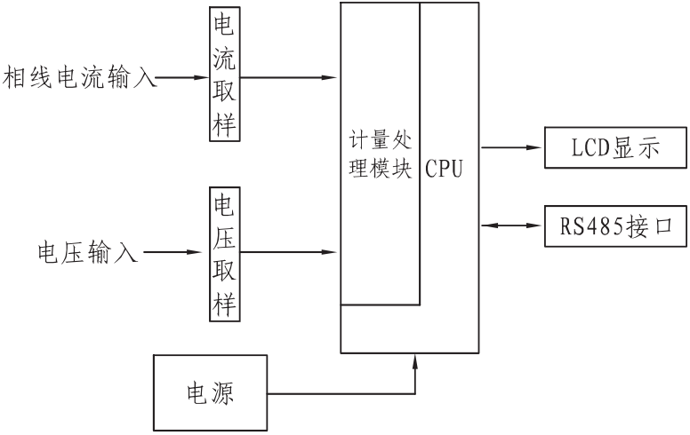
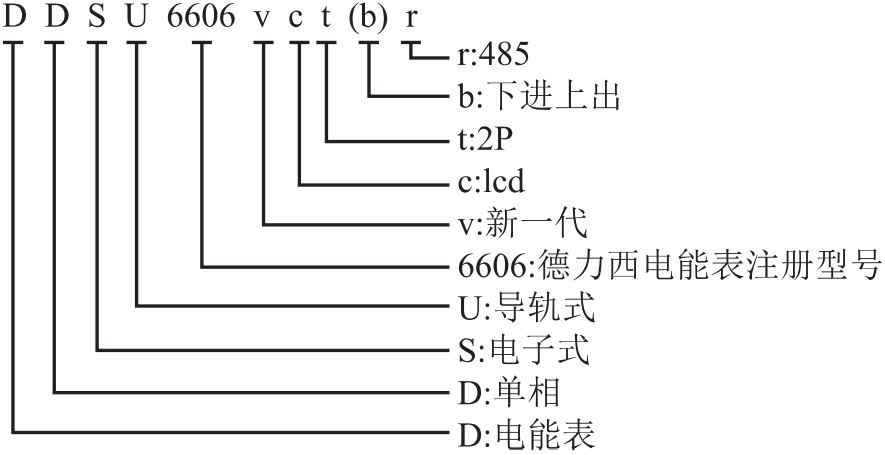
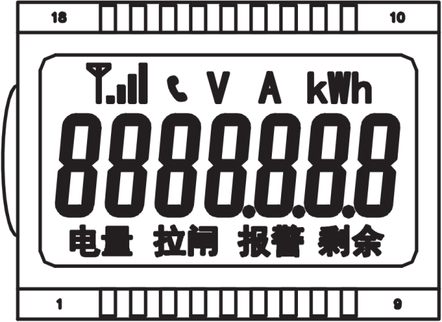
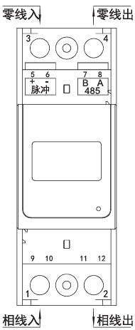
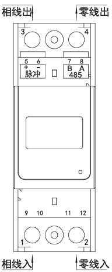
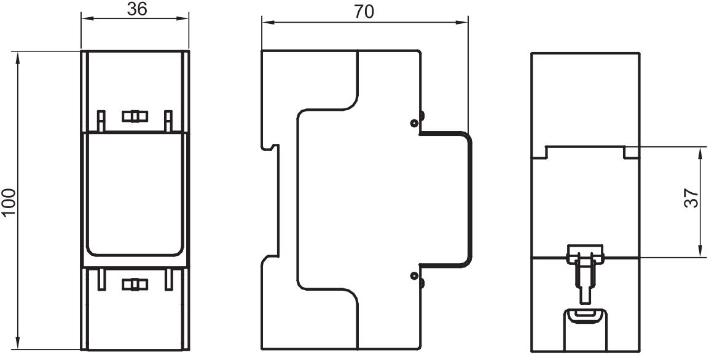

# DDSU6606vctr / DDSU6606vctbr 单相电子式电能表(导轨)

使用说明书

DDSU6606vctr\
DDSU6606vctbr

单相电子式电能表(导轨)

使用说明书

DDSU6606vctr：\
 2022E839-33 DDSU6606vctbr：

 2022E839-33 符合标准：GB/T 17215.321-2021

安装、使用产品前，请仔细阅读

使用说明书并妥善保管、备用

## 1 概述

DDSU6606vctr、DDSU6606vctbr 型单相电子式电能表(导轨)(以下简称"仪表"），可供计量额定频率为50Hz的电网中的单相交流有功电能。它具有较高的准确度，可靠性和稳定性。
本仪表采用国际先进的超低功耗大规模集成电路技术及SMT 工艺制造的高新技术产品，关健器件选用国际品牌、长寿命器件，提高了产品的可靠性和使用寿命。本仪表设计符合标准GB/T 17215.321-2021《交流电测量设备特珠要求 第21 部分：静止式有功电能表(A 级、B 级、C 级、D 级和E 级)》，DL/T645-2007《多功能电能表通信协议》兼容MODBUS 通讯协议，对单相静止式电能表的技术要求。
## 2 工作原理

仪表由两个主要功能组成：一是电能采样部分，二是单片机数据处理控制部分。本仪表的电能计量部分使用大规模专用集成电路，通过对电流电压的信号采样，送至单片机的计量处理模块，然后通过单片机进行电能计量，实现对电能的精确计量，同时通过单片机的各种接口传递数据，实现各种控制功能，如图1 所示。

图1 工作原理框图
## 3 型号和规格，如表1 所示。

#### 表1 电能表规格

| 型号 | 标称电压(v) | 电流规格 | 准确度等级 |
| --- | --- | --- | --- |
| DDSU6606vctr DDSU6606vctbr | 220 | 0.25-0.5(80)A/5(80)A | B 级(1 级) |

备注：有特殊要求用户可以订制\
3.1 型号说明：

### 3.2 电流说明：如0.25-0.5(80)A，0.25 为最小电流Imin，0.5 为转折电流Itr，80 为最大电流Imax。

## 4 主要技术参数

### 4.1 基本误差：最大允许误差如表2 所示。

#### 表2 最大允许误差

| 电流值 | 功率因数COS 中 +-----------------------+ | 误 差(%) B 级 |
| --- | --- | --- |
| 0.5Itr≤I＜Itr | 1.0 | ±1.5 |
| Itr≤I≤Imax | 1.0 | ±1.0 |
| Itr≤I≤Imax | 0.5L | ±1.0 |

|                       +-----------------------+-----------------------+

### 4.2 起动

电能表在标称电压、标称频率及功率因数为1.0 的条件下，当负载电流为直接式≥0.04Itr(B 级)，电能表应能起动并连续计量电能。

### 4.3 潜动

当电压线路为110%标称电压，电流线路无电流时，电表输出脉冲不应多于1 个。

### 4.4 通信波特率：RS485通信接口缺省波特率为2400bit/s。通讯波特率可设置成1200bit/s、2400bit/s、4800bit/或9600bit/s。

### 4.5 电气参数：

规定工作电压范围：（0.9\~1.1)标称电压， 扩展工作电压范围：（0.8\~1.15)标称电压， 极限工作电压范图：（0.0\~1.15）标称电压。
功率消耗：电压线路功耗≤2W/10VA，电流线路功耗≤4VA。

### 4.6 工作环境

规定工作温度范围H1:-10℃\~+55℃，

极限工作温度范图H1:-25℃+55℃。
湿度范围：年平均相对湿度\<75%。
大气压力为63.0kPa\~106.0kPa(海拔4000m 及以下)。

### 4.7 安全性能：产品符合GB/T 17215.321-2021 规定的关于安全指标的要求。

## 5 主要功能

### 5.1 正向有功、反向有功和总有功电能计量功能。

### 5.2 液晶显示6 位整数加1 位小数用电量。

### 5.3 电参量测量功能：能进行电流、电压、功率和功率因素等电参量的测量。

### 5.4 RS485 通信功能

RS485 通信接口抄读表内数据，通信遵循DL/T 645-2007 协议及其备案文件和MODBUS 通讯协议。

## 6 MODBUS 通讯协议

### 6.1 传输模式

使用MODBUS-RTU 传输棋式，MODBUS-RTU 通讯地址信息表详见附录。

### 6.2 传输方式

信息传输为异步方式，并以字节为单位，主机与从机之间通讯格式为，包含1个起始位、8 个数据位(最小的有效位先发送)，偶校验位、1 个停止位。

### 6.3 数据帧格式如表3

#### 表3 数据帧格式

| 地址码 | 功能码 | 数据区 | CRC 校验码 |
| --- | --- | --- | --- |
| 1 个字节 | 1 个字节 | n 个字节 | 2 个字节 |

-----------------------------------------------------------------------
地址码：地址码在帧的开始部分，由一个字节(8 位二进制码)组成，十进制为0-255，在电能表中只使用1\~247，其它地址保留，默认MODBUS 通讯地址为15。
## 7 显示说明

液晶面板示意图：

## 8 安装及接线方法

### 8.1 为满足防护要求，电能表必需安装在达到或高于IP51 防护等级的配电箱中。

### 8.2 电能表在制造企业出厂前经检验合格后并加铅封。安装使用前请仔细阅读说明书，铅封若有损坏可直接与厂家联系，接线务必按接线图正确接线，否则会给电能表造成永久损坏。 8.3 电能表应固定安装在室内，选择干燥通风的地方，安装电能表的底板应放置在坚固、耐火、不易振动的墙上，安装后电能表应垂直于地面。

### 8.4 电能表应按规定的相序（正相序）接入线路，并按照表盖上的接线图进行接线。必须用铜线或铜接头引入，如是多股铜线应将多股铜线头部进行绞绕缠紧后，再进行挂锡处理后接入电能表端钮盒内，端钮盒内的所有螺钉必须全部拧紧，避免端钮盒中的接头因接触不良而使电能表烧毁。同时电能表安装结束，通电前必须用万用表测试线路是否正确，否则应查找原因，排除故障。

### 8.5 在雷雨较多的地方使用的电能表，应在安装处采取避雷措施，避免因雷击而使电能表损坏。

### 8.6 在有污秽及有损坏机械性能的场所，电能表应放在保护柜内。

### 8.7 只有经权威机构授权的人员方可对电能表进行安装、拆除、检查及铅封，接入电能表的电压应符合标称电压规定值，电流不超过额定最大电流值。

### 8.8 电能表的负截能力在Itr\~Imax 之间，超过这一范围，会造成计量不准。

### 8.9 直接接入式电能表的液晶屏可直接读出实际的用电量。

### 8.10 接入电能表前，必须先接入有保护功能与电能表负载匹配的保护开关。

### 8.11 安装电能表之前，请先将电能表整体进行轻微摇晃，如听到表内有异响，请立即与厂家联系。

### 8.12 电能表不适用于铁路机车、车辆、飞机、船舶等特殊场合。

### 8.13 接线图如图2、图3 所示。

图2 DDSU6606vctr 安装示意图

图3 DDSU6606vctbr 安装示意图
注意：电能表在安装接线时请断开电源，以免发生意外。零线进出线交换不影响计量。 8. 14 外形及安装尺寸图如图4 所示。

图4 外形及安装尺寸图
## 9 常见故障的诊断、分析、排除方法

### 9.1 显示

电能表在正常工作时(有负载状态) 正面脉冲指示灯应闪烁，如果出现长时间无闪烁或灯不亮，请检查电能表接线是否正确。

### 9.2 计量

如果出现电能表不计量或计量不准，请确认接线方法是否正确，电能表是否在通电状态，如果接线正确，请联系售后人员。

## 10 运输与贮存

### 10.1 电能表运输与拆封时不应受到剧烈冲击，并应根据GB/T 25480-2010《仪器仪表运输、贮存基本环境条件及试验方法》规范运输和贮存，并按包装箱上的"向上"要求放置，贮存环境为-25℃+55℃，年平均相对湿度不超过75%，环境中不应有腐蚀性气体，应防潮。 10.2 电能表在仓库里保存，应放在台架上，叠放高度不超过5 箱。

### 10.3 在搬运、取用、安装过程中受到剧烈撞击或高空跌落造成外壳有明显损毁痕迹时，请不要对该电能表加电，并尽快联络供应商。

## 11 公司承诺

自产品出厂日期起36 个月内，在客户正常的储运、保养、使用，公司封印完整未拆动情况下，因产品的制造问题而不能正常使用时，提供"三包"服务。
## 附录

#### 附表1 MODBUS-RTU 通讯地址信息

**电能量类**

| 地址 | 数据格式 | 单位 | 读/写 | 数据长度 | 说明 |
| --- | --- | --- | --- | --- | --- |
| 0000H | long |  | R | 2 | 当前组合有功总电能 |
| 000AH | long |  | R | 2 | 当前正向有功总电能 |
| 0014H 电参数类 | long |  | R | 2 | 当前反向有功总电能 |
| 0300H | int | 0 1V | R | 1 | A 相电压 |
| 0303H | int | 0.01A | R | 1 | A 相电流 |
| 0306H | int | 0.01kW | R | 1 | 瞬时A 相有功功率 |
| 0312H | int | 0.001 | R | 1 | A 相功率因素 |
| 0316H 参变量类 | int | 0.01Hz | R | 1 | 频率 |
| 0404H | int |  | R/W | 1 | 通信波特率(0-1200;1-2400;2-4800；3-9600) |
| 0406H | int |  | R/W | 1 | 通讯地址（1-247 可设） |
| 0407H 特殊命令类 | int |  | R | 1 | 电表常数 |
| FE0OH | int |  | W | 1 | 数据等于5555H 时，开启编程状态，0000H 时，退 出编程状态。 |

1.读写属性："R"只读，读参量用03H 号命令；"R/W"可读可写，写参量用10H 号命令。禁止向未列出的或不具可写属性的地址写入。
2.电能表的MODBUS 通讯地址出厂时默认为15，亦可通过本公司提供的软件读出当通讯地址为0 时为广播模式。
3.电能表中所测电压值固定为1 位小数，数据格式为XXX.X，单位为V，若通讯读 出，电压值为0897H(2199)，则电压的实际值为219.9V；所测电流值固定为2 位小数数据格式为XXX.XX，单位A，若通讯读出电流值为0096H(150)， 则电流的实际值为1.50A。
4.电能表的有功率值固定为2 位小数，数据格式为XXX.XX，单位为kW， 若通讯读出有功功率值为0020H(32)，则有功率的实际值为0.32kW。
5.电能表所测电能值占4 个字节，单位kWh。高位在前，低位在后，若读出值为0012D687H(1234567)，则电能计量值为1234567×0.01=12345.67kWh。
6.错误帧如表4所示，表示通讯地址为1的电能表在读电能表数据的时候发送了非法的格式。

#### 附表2 错误帧格式

| 结结构 | 地址码 | 功能码+80H | 错误码 | CRC 校验码 |
| --- | --- | --- | --- | --- |
| 举例 | 01H | 83H | 03H(01:非法指令码；02:非法寄存器 地址：03:非法格式；04:未授权) | 01H 31H |

#### 附表3 接线螺钉扭矩要求

| 说明书紧固扭矩 | N·m | 1.2 | 2.0 | 2.5 |
| --- | --- | --- | --- | --- |
| 接线螺钉大小 | 规格 | M4 | M5 | M6 |

----------------------------------------------------------------------------

生产厂：德力西集团仪器仪表有限公司
地址：浙江省乐清市柳市镇德力西工业园
电话：(86-577) 6177 8228 传真：(86-577) 6177 8218 客服热线：400-826-8008 www.delixi-yqyb.com A0463106200 V1.3
邮编：325604
本使用说明书自2024 年11 月第一版
