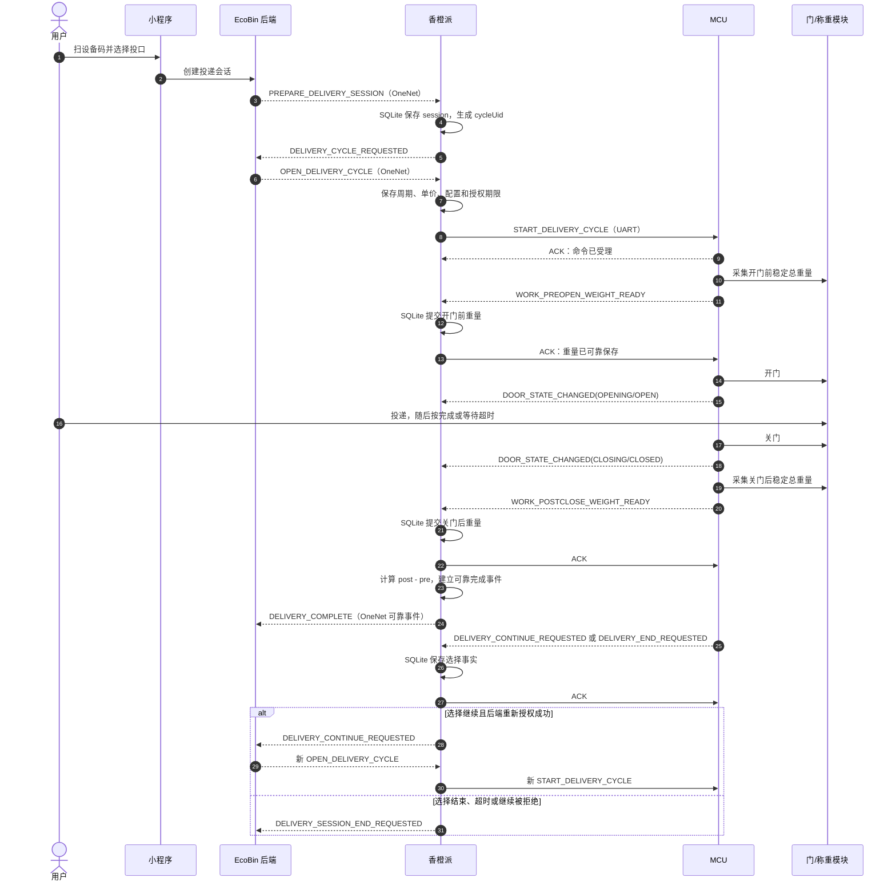
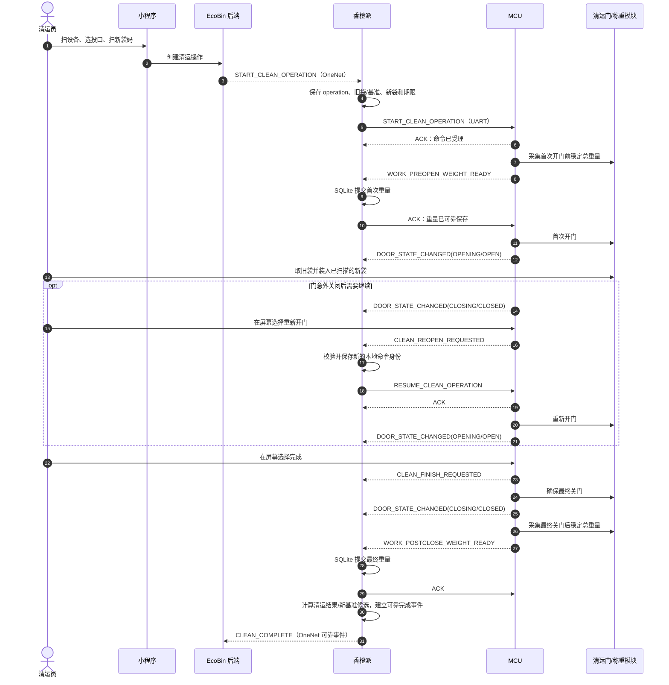

# 投递与清运：MCU—香橙派目标交互流程

> 状态：目标设计说明，供业务、香橙派和 MCU 固件共同评审
>
> 整理日期：2026-07-23
>
> 适用范围：EcoBin P0 投递、清运以及两者完成后的满溢采样
>
> 重要说明：本文描述的是**准备实施的 UART 1.0 目标流程**，不是当前
> `AA/BB/CC/DD` 或旧 `D1` 协议的现状说明。当前临时协议不得被当成本文流程的
> 实现依据。

## 1. 文档结论

当前目标设计的核心分工是：

| 参与方 | 负责 | 不负责 |
|---|---|---|
| MCU | 屏幕状态机、按钮、门控、门磁、称重采样/滤波/稳定判断、红外、烟雾、超时关门、命令去重、关键事件重发 | 用户、租户、机构、订单、钱包、审核、返现金额、袋业务关系 |
| 香橙派 | SQLite 持久化、作业身份、授权期限、MCU 编排、拍照/COS、重量差计算、旧袋基准、OneNet 上下行、断电恢复 | 直接替代 MCU 判断门是否真的开关、用最近重量猜测本次重量 |
| 后端 | 用户和权限、设备占用、投递/清运授权、订单、审核、钱包、袋关系、容量与满溢业务结论 | 直接控制电机、把 OneNet 调用成功当作门已动作 |

每一次投递开关门是一个独立 `cycleUid`；一次清运从首次开门到最终换袋完成始终使用
同一个 `operationUid`。

最重要的安全闸是：

```text
MCU 测得开门前重量
  → MCU 发给香橙派
  → 香橙派先写入 SQLite
  → 香橙派 ACK
  → MCU 才允许开门
```

因此，UART ACK 的一般含义只是“消息已经可靠接收/登记”，并不表示门已打开或作业已
完成；但对 `WORK_PREOPEN_WEIGHT_READY` 的 ACK，它还承担“开门前重量已安全落盘，
可以继续判断是否开门”的专用安全闸语义。

## 2. 协议共同约束

### 2.1 UART 1.0 基线

- 串口：`115200 8N1`，无流控。
- 二进制帧，魔数 `EC 42`，协议版本 `1.0`，大端编码。
- 单帧最长 256 字节，payload 最长 242 字节。
- 每帧使用 `CRC16/CCITT-FALSE`。
- 重量使用带符号整数克，不能使用浮点数。
- 单价使用整数万分之一元/千克，例如 `4500 = 0.4500 元/kg`。
- 消息采用固定强类型 payload，不传 JSON、逗号文本或任意 Map。
- 正式 `messageType` 数值、字段偏移和黄金字节样本仍须由统一 UART Registry 生成。

### 2.2 每条命令的共同逻辑字段

香橙派发给 MCU 的状态变更命令至少要能表达：

```text
mcuCommandUid          本次 MCU 命令的稳定唯一身份
commandDigestSha256    命令稳定语义摘要
workType               DELIVERY_CYCLE / CLEAN_OPERATION / DETECTION / ...
workUid                cycleUid / operationUid / detectionUid / ...
portNo                 1..设备投口数；0 仅表示整机
authorizationRemainingMs 或等价相对期限
configurationVersion / configurationDigest
命令专属强类型字段
```

重复收到相同 `mcuCommandUid + commandDigestSha256` 时，MCU 返回
`DUPLICATE_ACCEPTED`，不得再次驱动电机。相同 `mcuCommandUid` 携带不同摘要时返回
`IDEMPOTENCY_CONFLICT` 并拒绝执行。

### 2.3 每条 MCU 关键事件的共同逻辑字段

MCU 发给香橙派的关键事件至少要能表达：

```text
mcuBootId              MCU 本次启动代际
mcuEventSequence       本启动/持久事件序列
uptimeMs               MCU 单调运行时间
eventType
portNo
workType + workUid     有作业时必填
mcuCommandUid          由某条命令产生时必填
事件专属强类型字段
```

MCU 不能只发送“按钮按下”“门开了”这类没有作业身份的裸事件。香橙派必须先把事件原文、
身份和摘要写入 SQLite，事务提交后才能回复 ACK。MCU 在收到 ACK 前保留并重发该事件。

### 2.4 停等、重试与未知结果

每个方向同一时刻只发送一条待确认帧：

1. 发送后等待 ACK/NACK，默认 500ms。
2. 未收到确认时，原帧、原 `txSequence` 最多共发送 3 次。
3. 仍超时时，结果是“未知”，不能推断为“对方没有执行”。
4. 香橙派随后使用 `QUERY_STATE` 对账；存在门安全风险时优先发送新的
   `SAFE_CLOSE`，不能盲目重发旧开门命令。

## 3. 消息总表

本节列出已确定的**逻辑消息**。字段名代表业务语义，不代表最终字节布局。

### 3.1 香橙派 → MCU

| 消息 | 发送时机 | 主要数据 | MCU 的后续动作 |
|---|---|---|---|
| `HELLO` | 香橙派启动或 UART 重连 | 支持的协议版本、能力询问、链路身份 | 返回 `HELLO_ACK`，不驱动门 |
| `APPLY_CONFIG` | 新配置已在香橙派可靠保存 | 配置应用身份、版本、完整摘要、MCU 子集摘要、设备/投口参数 | staging、校验并原子应用，随后发 `CONFIG_APPLY_RESULT` |
| `START_DELIVERY_CYCLE` | 新 `cycleUid` 已获后端授权并写入 SQLite | `sessionUid`、`cycleUid`、投口、授权剩余时间、配置摘要、展示单价 | 先测开门前重量；未获重量事件 ACK 前不开门 |
| `START_CLEAN_OPERATION` | 清运上下文和首次授权已写入 SQLite | `operationUid`、投口、首次开门授权剩余时间、操作时限、配置摘要 | 先测开门前重量；未获重量事件 ACK 前不开门 |
| `RESUME_CLEAN_OPERATION` | 同一操作内重开，或后端授权恢复原操作 | 原 `operationUid`、投口、新命令身份、恢复/重开代际、剩余执行窗口、配置摘要 | 继续原操作，不覆盖首次开门前重量 |
| `END_CLEAN_BEFORE_OPEN` | 清运员在首次实际开门前请求结束 | 原 `operationUid`、投口、命令身份和期限 | 仅在确认从未开门且门安全关闭时结束 |
| `SAMPLE_FULLNESS` | 后端已创建 `detectionUid`，需要一次真实采样 | `detectionUid`、`sampleRole`、投口、等待时间、采集参数、配置摘要 | 等待后同次采集红外和稳定总重量 |
| `MEASURE_BASELINE` | 工作人员已确认当前袋为空并获后端授权 | `measurementUid`、投口、采集参数、配置摘要 | 只测稳定总重量，不自行写业务皮重 |
| `QUERY_STATE` | 启动、重连、ACK 超时或状态不一致 | `snapshotUid`/命令身份 | 冻结并返回一致状态快照，不驱动电机 |
| `SAFE_CLOSE` | 门打开、未知或恢复时需要安全收口 | 命令身份、整机或投口范围 | 尽最大可能关门，逐门返回真实结果 |
| `ACK` / `NACK` | 收到 MCU 帧并完成相应校验/持久化后 | 被确认帧、结果码、可选错误码 | MCU 删除或保留待确认事件，并按状态机继续 |

`PREPARE_DELIVERY_SESSION` 是后端到香橙派的命令，只用于香橙派保存会话并申请
`cycleUid`，**不会发送给 MCU**。

### 3.2 MCU → 香橙派

| 消息 | 发送时机 | 主要数据 | 香橙派收到后的动作 |
|---|---|---|---|
| `HELLO_ACK` | 收到 `HELLO` | MCU boot、固件/协议版本、能力位、投口数、配置摘要、复位原因 | 校验兼容性并继续状态查询 |
| `ACK` / `NACK` | 命令已可靠登记、重复、拒绝或字段错误 | 原帧身份、受理结果、错误码 | ACK 只推进“已受理”，不推断物理完成 |
| `WORK_PREOPEN_WEIGHT_READY` | 投递或清运开门前测量结束，门仍关闭 | 作业/命令身份、完整测量结果 | 先写 SQLite，再 ACK；失败则不允许开门 |
| `DOOR_STATE_CHANGED` | 门进入新阶段或真实状态变化 | 作业/命令身份、`OPENING/OPEN/CLOSING/CLOSED/JAMMED/UNKNOWN`、门健康、原因 | 保存真实门事实并 ACK |
| `WORK_POSTCLOSE_WEIGHT_READY` | 投递关门后，或清运最终确认关门后测量结束 | 作业/命令身份、完整测量结果 | 保存并 ACK；随后计算投递净重或清运结果 |
| `DELIVERY_CONTINUE_REQUESTED` | 用户在设备屏幕选择继续 | `sessionUid`、当前 `cycleUid`、投口、点击代际/本地窗口证据 | 保存并 ACK，再向后端申请下一周期 |
| `DELIVERY_END_REQUESTED` | 用户选择结束或选择窗口届满 | `sessionUid`、当前 `cycleUid`、投口、结束原因 | 保存并 ACK，再向后端结束会话 |
| `CLEAN_REOPEN_REQUESTED` | 清运门意外关闭后，清运员在屏幕请求重开 | 原 `operationUid`、投口、本操作动作代际 | 校验原操作后发新的 `RESUME_CLEAN_OPERATION` |
| `CLEAN_FINISH_REQUESTED` | 清运员在屏幕选择完成 | 原 `operationUid`、投口、本操作动作代际 | 保存完成意图；等待最终关门和最终重量 |
| `FULLNESS_SAMPLE_RESULT` | 满溢采样完成 | `detectionUid`、`sampleRole`、红外值/健康、重量测量结果 | 保存并 ACK，再按业务模式组合结论 |
| `BASELINE_MEASUREMENT_RESULT` | 空袋基准测量完成 | `measurementUid`、重量测量结果 | 保存并 ACK；香橙派/后端决定是否建立基准 |
| `CONFIG_APPLY_RESULT` | 配置应用成功或失败 | 应用身份、版本、完整摘要、MCU 子集摘要、结果/故障 | 只有摘要完全一致才报告配置已应用 |
| `FAULT_OBSERVED` | 门、称重、红外或 MCU 出现故障/恶化 | 作用域、组件、健康、故障码、可空当前作业 | 保存、ACK、上报并按严重度阻断 |
| `SAFETY_SENSOR_EVENT` | 烟雾报警、恢复或来源故障 | 投口/整机、烟雾状态、健康、可空当前作业 | 可靠保存；必要时立即停止新动作 |
| `SAFE_CLOSE_RESULT` | `SAFE_CLOSE` 执行结束 | 每个目标门的最终状态、健康、失败码 | 根据真实结果恢复或锁存安全故障 |
| `STATE_SNAPSHOT_*` | 收到 `QUERY_STATE` | MCU boot、当前作业、全部门、传感器、配置、待确认事件 | 全部分段落盘并校验摘要后才应用快照 |

### 3.3 重量结果结构

所有重量事件使用同一强类型结果：

```text
measurementStatus:
  STABLE | UNSTABLE | TIMEOUT | SENSOR_FAULT | OVERLOAD

stableWeightGrams       仅 STABLE 时有效，int32 有符号克
lastObservedWeightGrams 可选诊断值，不能参与业务计算
measurementElapsedMs
sampleCount
calibrationVersion
sensorHealth
faultCode
```

`0g` 是合法的稳定重量，不能被用来表示故障。负稳定读数也是需要保留的测量事实；是否
越过量程由 MCU 返回明确状态，香橙派不能自行把负数改成 0。

## 4. 投递流程

### 4.1 端到端时序



### 4.2 分步说明

#### 步骤 1：建立会话，但不通知 MCU

用户扫码、选择投口并通过后端资格检查后，后端建立 `sessionUid` 和整机占用，并向
香橙派下发 `PREPARE_DELIVERY_SESSION`。

香橙派先在 SQLite 保存：

```text
sessionUid
deploymentCode
portNo
会话授权摘要
准备期限
后端命令身份和摘要
```

随后生成稳定 `cycleUid` 并请求后端授权。本阶段不向 MCU 发消息，也不允许开门。

#### 步骤 2：保存周期授权后发送开始命令

后端重新检查用户、钱包、设备、投口、袋、价格和满溢条件，授权本周期。香橙派先保存：

```text
sessionUid + cycleUid
portNo
锁定单价
配置/投递规则摘要
当前袋快照
首次开门授权期限（默认后端提交后 60 秒）
本地单调时钟截止点
```

提交成功后才发送 `START_DELIVERY_CYCLE`。MCU 对命令 ACK 只表示已经登记本周期，不
表示已经开门。

#### 步骤 3：开门前称重是开门安全闸

MCU 保持门关闭，按配置完成稳定称重并发送 `WORK_PREOPEN_WEIGHT_READY`。

- `STABLE`：携带本周期真实总重量。
- `UNSTABLE/TIMEOUT/SENSOR_FAULT/OVERLOAD`：携带失败状态，不携带伪造的
  `stableWeightGrams=0`。

香橙派写入 SQLite 后 ACK。只有 MCU 收到这条 ACK，并再次确认授权未过期、门和传感器
安全，才可以开门。等待 ACK 期间授权过期或安全条件失效时，MCU保持门关闭并发送明确
失败事实。

#### 步骤 4：MCU 独立完成开关门

MCU 驱动门并分别发送：

```text
DOOR_STATE_CHANGED(OPENING)
DOOR_STATE_CHANGED(OPEN)
DOOR_STATE_CHANGED(CLOSING)
DOOR_STATE_CHANGED(CLOSED)
```

用户在设备屏幕选择完成，或投递门超时后，均由 MCU 自行关门。即使此时香橙派失联，
MCU 也必须独立执行超时关门，不能依赖香橙派再发一条普通关门命令。

香橙派在开门前后尽力拍摄：

```text
BEFORE_INNER
BEFORE_OUTER
AFTER_INNER
AFTER_OUTER
```

拍照或上传失败会形成设备/网络问题，但不阻断门控、订单或返现。

#### 步骤 5：关门后称重和建单事件

门可靠关闭后，MCU 采集关门后稳定总重量并发送
`WORK_POSTCLOSE_WEIGHT_READY`。香橙派落盘并 ACK，然后计算：

```text
deliveryNetWeightGrams =
    postCloseTotalWeightGrams - preOpenTotalWeightGrams
```

正、零、负结果都原样保留。香橙派生成一次可靠 `DELIVERY_COMPLETE` 边缘事件；后端
仍会按前后总重量重新计算并创建待审核订单。MCU 不创建订单，也不修改钱包。

负净重只标记“等待人工审核”。审核前不进入用户钱包；审核人员确认后才可能扣减余额。

#### 步骤 6：继续或结束

本周期结果已在香橙派可靠保存后，MCU 进入设备屏幕选择状态：

- 用户选择继续：发送 `DELIVERY_CONTINUE_REQUESTED`。
- 用户选择结束，或选择窗口届满：发送 `DELIVERY_END_REQUESTED`，并携带原因。

MCU 负责屏幕和按钮状态，香橙派保存同一窗口的单调期限及业务上下文。按钮事件本身
不能开门。

如果用户选择继续，香橙派向后端提交意图。后端要等待前一周期建单、投递后满溢检测
完成，并重新检查全部开门条件。只有得到一个新的 `cycleUid` 授权后，香橙派才发送
新的 `START_DELIVERY_CYCLE`。用户不需要重新扫码，但每次开关门都会形成独立周期和
独立订单。

### 4.3 投递 MCU 状态机

```text
IDLE
  → DELIVERY_PREOPEN_MEASURING
  → DELIVERY_PREOPEN_WAIT_ACK
  → DELIVERY_OPENING
  → DELIVERY_OPEN
  → DELIVERY_CLOSING
  → DELIVERY_POSTCLOSE_MEASURING
  → DELIVERY_WAIT_SELECTION
  → IDLE 或等待新的 START_DELIVERY_CYCLE
```

其他用户扫码时只能看到“设备使用中”，不能覆盖当前 `sessionUid/cycleUid`。

## 5. 清运流程

### 5.1 端到端时序



### 5.2 分步说明

#### 步骤 1：后端先建立可恢复清运操作

清运员扫描设备、选择投口并扫描准备换入的新袋。后端在一个事务中：

- 创建 `operationUid`；
- 冻结旧袋绑定和可空旧袋基准；
- 预留新袋；
- 取得整机清运占用；
- 创建开始命令。

旧袋缺失不阻止普通清运，但必须记录，不得推导一个虚构旧袋。香橙派收到开始命令后先
可靠保存：

```text
operationUid
portNo
旧袋绑定状态和可空旧袋码
可空旧袋基准
新袋预留摘要
配置摘要
首次开门授权截止点
整个操作的单调执行截止点（默认 30 分钟）
```

这些业务数据主要保留在香橙派；MCU 只接收执行门控所需的操作身份、投口、配置和期限。

#### 步骤 2：首次开门前称重

香橙派发送 `START_CLEAN_OPERATION` 后，MCU 先称重并发送
`WORK_PREOPEN_WEIGHT_READY`。香橙派写入原操作 SQLite 后才 ACK。

MCU 收到 ACK 并复核期限、安全条件后才开门。第一次
`DOOR_STATE_CHANGED(OPEN)` 是不可逆边界：

- 此前可以请求 `END_CLEAN_BEFORE_OPEN`；
- 此后不能普通取消或恢复旧袋；
- 只能完成原操作，或进入原清运员恢复流程。

#### 步骤 3：换袋与操作内重开

清运员取走旧袋并装入已经在小程序扫描的新袋。香橙派在第一次开门附近尽力拍摄：

```text
FIRST_OPEN_INNER
FIRST_OPEN_OUTER
```

如果清运门意外关闭，MCU 上报真实门状态，并在屏幕提供“重新开门”。点击后 MCU 发送
`CLEAN_REOPEN_REQUESTED`，不能自行直接开门。

香橙派仅在以下条件都成立时发送新的 `RESUME_CLEAN_OPERATION`：

- 仍是原 `operationUid`；
- 门已可靠关闭；
- 本地操作期限未到；
- MCU 和门安全；
- 后端尚未把操作推进到 `RECOVERY_REQUIRED`。

每次重开使用新的 `mcuCommandUid`，但仍属于原操作。不重新扫码、不创建第二个清运
操作、不覆盖首次开门前重量。

#### 步骤 4：最终完成

清运员在 MCU 屏幕选择完成后，MCU 发送 `CLEAN_FINISH_REQUESTED`。这只表示完成意图，
不表示清运已经完成。

MCU 随后：

1. 确保门可靠关闭；
2. 上报最终门状态；
3. 取得最终稳定总重量；
4. 发送 `WORK_POSTCLOSE_WEIGHT_READY`。

香橙派写入 SQLite 并 ACK，随后计算：

```text
removedNetWeightGrams =
    firstPreOpenTotalWeightGrams - oldBaselineWeightGrams

newBaselineWeightGrams =
    finalPostCloseTotalWeightGrams
```

旧基准缺失或任一必要重量不可靠时，不能用 0 或旧值补齐；清运仍可形成带系统异常的
记录，但新基准保持无效并阻断后续依赖重量的投递。

香橙派在最终关门附近尽力拍摄：

```text
FINAL_CLOSE_INNER
FINAL_CLOSE_OUTER
```

然后形成唯一 `CLEAN_COMPLETE` 可靠事件。后端收到后，在同一事务创建清运记录、完成
旧袋移除和新袋安装、处理新基准、建立四个照片槽和清运后满溢检测 gate。审核不会
回滚真实换袋。

### 5.3 清运前结束

首次开门前，香橙派可以发送 `END_CLEAN_BEFORE_OPEN`。MCU 只有在同时证明：

```text
本 operationUid 从未出现 DOOR_OPEN
门当前可靠关闭
没有仍可能执行的旧开门动作
```

时才能接受结束。普通 ACK 不能单独作为“从未开门”的最终业务证明；最终证明需要由
明确结果事件或一致状态快照闭合。该结果事件的最终名称仍需在 UART Registry 中冻结，
见第 9 节。

### 5.4 超时与恢复

清运操作默认执行 30 分钟：

- 到期时门可靠关闭、旧命令不会再动作：后端操作进入 `RECOVERY_REQUIRED`，释放整机
  占用但保留该投口操作和新袋预留。
- 门打开、关门失败或状态未知：保留整机占用并锁存严重安全故障。

P0 只允许原清运员恢复原操作。后端重新授权后，香橙派恢复 SQLite 中原上下文并向 MCU
发送新的 `RESUME_CLEAN_OPERATION`。它仍使用原 `operationUid`、原首次开门前重量和
原新袋预留，不创建新操作。

已经在边缘可靠授权的原操作即使 OneNet 中途断网，也可以在本地继续操作内重开、安全
关门并把结果写入 outbox；但一旦中心已将其置为 `RECOVERY_REQUIRED`，本地按钮不得
绕过新的中心恢复授权。

## 6. 投递/清运后的满溢采样

业务满溢不是 MCU 空闲时持续上报的数据。只在以下时机执行：

```text
投递完成后
清运完成后
工作人员发起人工重检
```

后端先创建稳定 `detectionUid`，再通过 OneNet 指示香橙派采样。香橙派发送：

```text
SAMPLE_FULLNESS
  detectionUid
  sampleRole = INITIAL | CONFIRMATION | MANUAL_RECHECK
  portNo
  waitMs
  sampling parameters
  configuration digest
```

默认投递后首次等待 5 秒；疑似满溢后的确认复检间隔默认 10 秒，最终使用已应用的
版本化配置。

MCU 在同一次采样中返回：

```text
infraredState = CLEAR | BLOCKED | UNKNOWN
infraredHealth = OK | TIMEOUT | SENSOR_FAULT | DISCONNECTED
weight measurement result
```

MCU 不直接返回“业务上已满”。香橙派按冻结模式组合：

| 模式 | 判满 | 判不满 | 停止投递/来源失败 |
|---|---|---|---|
| `INFRARED_ONLY` | 红外可靠且遮挡 | 红外可靠且未遮挡 | 红外失败 |
| `WEIGHT_ONLY` | 可靠重量结合有效基准达到阈值 | 同条件下低于阈值 | 重量或基准失败 |
| `INFRARED_OR_WEIGHT` | 任一可靠来源判满 | 两个来源都可靠且不满 | 一个来源不满、另一个失败，或无法可靠判断 |

重量满溢度由香橙派/后端计算：

```text
contentNetWeight = stableTotalWeight - currentBaselineWeight
fullnessPercent = max(contentNetWeight, 0) / configuredFullWeight × 100%
```

满溢度允许超过 100%。原始净重为负时只把展示值置为 0%，原总重量、基准和负净重仍
完整保存。采样失败不影响已经形成的订单、清运记录或返现审核，但会阻断下一次投递。

烟雾传感器不受上述“作业后采样”限制。MCU 应持续监测烟雾，并通过
`SAFETY_SENSOR_EVENT` 可靠上报报警、恢复和来源故障。

## 7. 启动、重连和断电恢复

香橙派启动或 UART 重连时必须按固定顺序执行：

```text
校验 SQLite、部署身份和持久目录
  → 打开 UART
  → HELLO / HELLO_ACK
  → QUERY_STATE
  → 收取并落盘 MCU 待确认事件，再逐条 ACK
  → 对照 SQLite 作业、mcuBootId、门和阶段
  → 必要时发送新的 SAFE_CLOSE
  → 收敛原作业或锁存故障
  → READY
```

在进入 `READY` 前不得发送新的 `START_DELIVERY_CYCLE` 或
`START_CLEAN_OPERATION`。

| 场景 | 处理 |
|---|---|
| MCU boot 未变且作业身份一致 | 先补收事件；不重发已经导致开门的 START |
| MCU boot 改变 | 逐门证明关闭；投递结果待核查，清运进入恢复 |
| SQLite 与 MCU 作业不一致 | 整机安全锁；不能按时间猜“较新的一方” |
| 门打开或未知 | 保留作业/占位，等待 MCU 独立关门或发送新 `SAFE_CLOSE` |
| 香橙派重启 | 从 SQLite 恢复，不根据内存、屏幕或最近重量重建作业 |
| 双端断电 | MCU 新 boot 先保证安全关门；香橙派从原 SQLite 恢复，绝不自动开门 |
| SQLite 损坏或丢失 | 停止新作业，不创建空库后沿原部署身份继续运营 |

`QUERY_STATE` 的目标快照同时覆盖整机和全部投口。由于单帧长度有限，详细设计暂定：

```text
STATE_SNAPSHOT_BEGIN
STATE_SNAPSHOT_PORT × portCount
STATE_SNAPSHOT_END
```

每段独立 CRC 和 ACK；香橙派只有在全部段齐全、身份一致且总摘要匹配后才能应用快照，
不能用部分投口数据解除安全锁。

## 8. 明确禁止的做法

- 香橙派收到后端命令后直接发送无身份的“开 1 号门”。
- MCU 收到 `START_*` 后不等开门前重量事件 ACK 就开门。
- UART ACK 被解释为门已打开、作业已完成或订单已创建。
- ACK 超时后换一个命令 ID重新发送同一开门动作。
- MCU 按“继续投递”按钮后直接再次开门。
- 清运意外关门后创建新操作、重新扫袋或由小程序直接远程开门。
- 使用最近一次重量代替本作业的开门前/关门后重量。
- 用 `0g` 代表称重失败，或把负重量截断成 0。
- MCU 保存旧袋业务基准或决定清运统计重量。
- MCU 上报租户、机构、用户、钱包、订单、审核结果或最终返现金额。
- 相机/网络故障阻止门安全收口，或把缺图标成用户投递异常。
- 重启后自动重放旧 `START_*` 开门命令。
- 继续使用旧 D1 与临时 AA/BB/CC/DD 作为正式协议回退。

## 9. 尚需 UART Registry 冻结的细节

流程语义已经确定，但下列内容还不能直接交给固件按字节编码：

1. 每个 `messageType` 的最终数值、payload 精确长度、字段偏移和范围。
2. UUID、SHA-256、相对期限、故障码、能力位的最终二进制表示。
3. `STATE_SNAPSHOT_BEGIN/PORT/END` 的精确字段、摘要范围和重放规则，需 MCU
   负责人确认其持久化和缓冲能力。
4. 清运中间意外关门时，是否发送非最终候选重量；如发送，必须增加明确的动作代际和
   `candidate/final` 语义，不能与最终 `WORK_POSTCLOSE_WEIGHT_READY` 混淆。
5. `END_CLEAN_BEFORE_OPEN` 成功后用于证明“从未开门且无在途动作”的专用结果事件
   名称和字段；不能只依赖普通 ACK。
6. MCU 屏幕选择窗口届满时，`DELIVERY_END_REQUESTED` 的最终原因码以及 MCU 计时与
   香橙派单调监督期限的对账字段。
7. MCU 非易失存储中需要保存的命令去重墓碑、关键事件队列、当前作业/门阶段和
   `mcuEventSequence` 的容量及擦写寿命。

这些细节应由同一份机器可读 Registry 生成或校验 C 与 Python 编解码器，不能由两端
分别手写常量。

## 10. 设计来源

- [UART 目标接口设计 I-046～I-050](../../docs/planning/interface-design/10-uart-protocol-i046-i050.md)
- [OneNet、COS、边缘持久化与业务确认 I-041～I-045](../../docs/planning/interface-design/09-onenet-cos-edge-confirmation-i041-i045.md)
- [投递、审核与钱包 I-021～I-025](../../docs/planning/interface-design/05-delivery-review-wallet-i021-i025.md)
- [清运、袋、满溢与恢复 I-026～I-030](../../docs/planning/interface-design/06-cleaning-bags-fullness-recovery-i026-i030.md)
- [详细设计 03：可靠边缘契约](../../docs/planning/detailed-design/03-reliable-edge-contracts.md)
- [详细设计 04：投递闭环](../../docs/planning/detailed-design/04-delivery-review-wallet.md)
- [详细设计 05：清运与满溢](../../docs/planning/detailed-design/05-cleaning-fullness-recovery.md)
